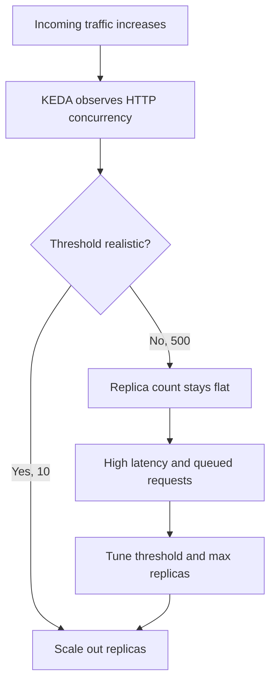
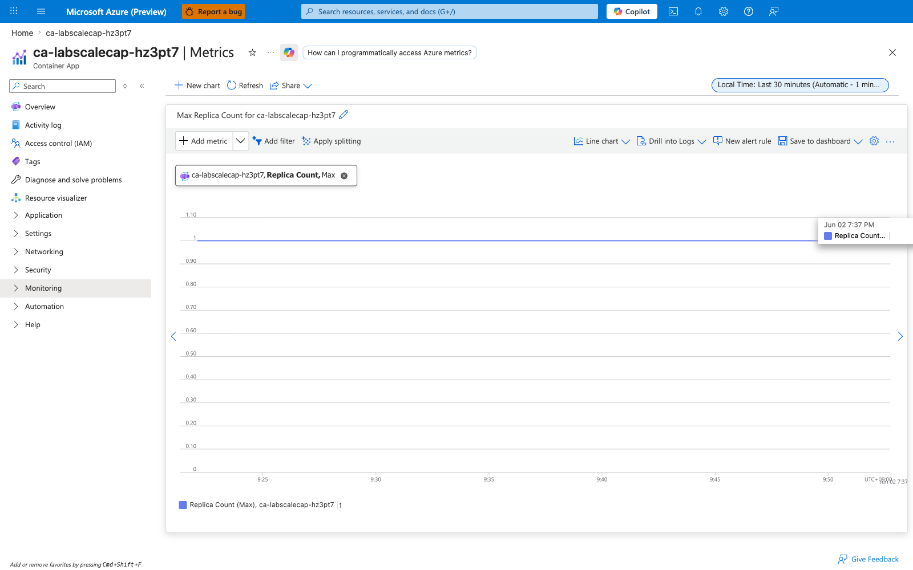
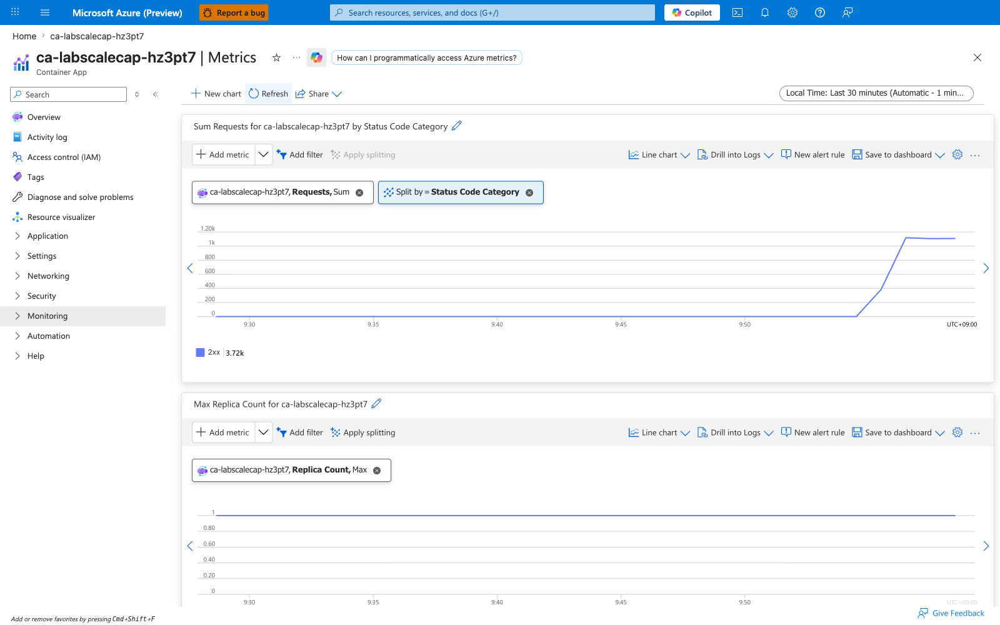
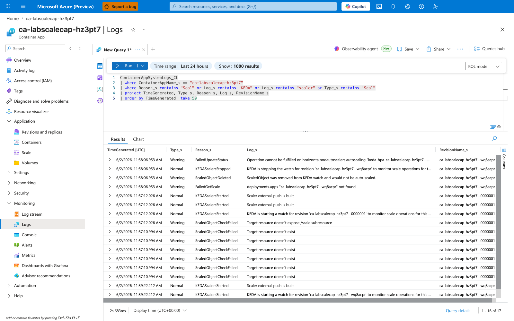
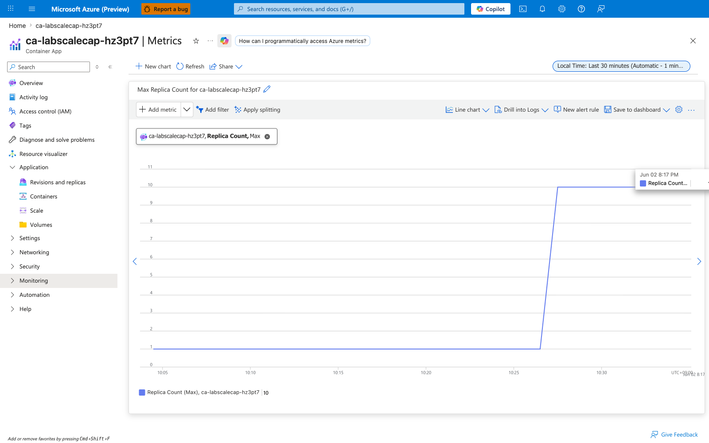
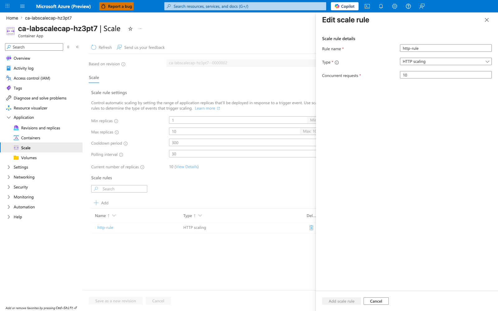

---
content_sources:
  diagrams:
    - id: architecture
      type: flowchart
      source: mslearn-adapted
      based_on:
        - https://learn.microsoft.com/en-us/azure/container-apps/scale-app
content_validation:
  status: verified
  last_reviewed: '2026-06-22'
  reviewer: ai-agent
  lab_validation:
    status: reproduced
    tested_date: 2026-06-22
    az_cli_version: 2.79.0
    notes: 'Full reproducible evidence pack captured 2026-06-22 in koreacentral (Azure CLI 2.79.0, containerapp ext 1.3.0b4). H1 gate scale_rule_mismatch_replicas_capped (replicas 1/1/1/1/1 under 60-concurrent / 90 s load, 0 strict scale events) PASS, H2 gate scale_rule_fixed_replicas_scaled_no_events PARTIAL PASS (post-fix revision Healthy 14 s after verify.sh Phase 12 health polling began, replicas 1/6/6/6/6, max 6; 0 rows for the strict scaling-events filter `Reason_s startswith "Scal" or "KEDA"` — the strict filter is intentionally narrow to prevent cross-revision contamination and excludes replica-lifecycle events such as `AssigningReplica`; the replica count is the controlling H2 signal in this taxonomy). Earlier 2026-06-02 Portal captures (rg-aca-lab-scale-cap) are retained below as supplementary evidence.'
  core_claims:
    - claim: Azure Container Apps supports HTTP scaling rules that can scale an app based on concurrent HTTP requests.
      source: https://learn.microsoft.com/en-us/azure/container-apps/scale-app
      verified: true
    - claim: The minimum and maximum replica settings in Azure Container Apps define the lower and upper bounds for scaling behavior.
      source: https://learn.microsoft.com/en-us/azure/container-apps/scale-app
      verified: true
validation:
  az_cli:
    last_tested: '2026-06-22'
    cli_version: '2.79.0'
    result: pass
  bicep:
    last_tested: '2026-06-22'
    result: pass
---
# Scale Rule Mismatch Lab

Diagnose non-scaling behavior caused by unrealistic HTTP concurrency thresholds, then tune scale settings.

## Lab Metadata

| Attribute | Value |
|---|---|
| Difficulty | Intermediate |
| Estimated Duration | 25-35 minutes |
| Tier | Consumption |
| Failure Mode | Sustained load does not increase replica count because the HTTP scale threshold is too high |
| Skills Practiced | KEDA scaling inspection, load generation, replica analysis, scale tuning |

## 1) Background

This lab deploys an app with intentionally unrealistic HTTP scale thresholds. Even under sustained load, the scaler does not add replicas quickly enough, reproducing a common “autoscaling not working” incident.

The initial scale rule uses `concurrentRequests=500`, which is too high for the lab workload. The fix is to keep the same scaling model but tune the threshold and replica limits so the observed traffic can actually trigger scale-out.

### Architecture

<!-- diagram-id: architecture -->


## 2) Hypothesis

**IF** the Container App keeps the HTTP scale rule at `concurrentRequests=500`, **THEN** sustained lab load will not increase replicas above the baseline; **IF** the rule is corrected to `concurrentRequests=10` with `maxReplicas=10`, **THEN** the same workload will scale out.

| Variable | Control State | Experimental State |
|---|---|---|
| HTTP scale threshold | `concurrentRequests=10` | `concurrentRequests=500` |
| Maximum replicas | `10` | `2` |
| Load profile | Sustained `/load` requests | Sustained `/load` requests |
| Replica outcome | Replica count increases above baseline | Replica count stays at or near 1 |

## 3) Runbook

### Deploy baseline infrastructure

```bash
export RG="rg-aca-lab-scale"
export LOCATION="koreacentral"

az extension add --name containerapp --upgrade
az login

az group create --name "$RG" --location "$LOCATION"

az deployment group create \
    --name "lab-scale" \
    --resource-group "$RG" \
    --template-file "./labs/scale-rule-mismatch/infra/main.bicep" \
    --parameters baseName="labscale"
```

| Command | Why it is used |
|---|---|
| `az extension add ...` | Installs or updates the Container Apps Azure CLI extension. |

Expected output pattern: deployment `Succeeded`.

### Capture deployment outputs

```bash
export APP_NAME="$(az deployment group show \
    --resource-group "$RG" \
    --name "lab-scale" \
    --query "properties.outputs.containerAppName.value" \
    --output tsv)"

export ACR_NAME="$(az deployment group show \
    --resource-group "$RG" \
    --name "lab-scale" \
    --query "properties.outputs.containerRegistryName.value" \
    --output tsv)"

export ACA_ENV_NAME="$(az deployment group show \
    --resource-group "$RG" \
    --name "lab-scale" \
    --query "properties.outputs.environmentName.value" \
    --output tsv)"
```

| Command | Purpose |
|---|---|
| `export APP_NAME="$(az deployment group show ... --query "properties.outputs.containerAppName.value" --output tsv)"` | Captures the Container App name emitted by the lab deployment so later replica, scale-rule, and log queries target the exact workload under load. |
| `export ACR_NAME="$(az deployment group show ... --query "properties.outputs.containerRegistryName.value" --output tsv)"` | Captures the registry name required to build and push the workload image before applying the mismatched HTTP scale rule. |
| `export ACA_ENV_NAME="$(az deployment group show ... --query "properties.outputs.environmentName.value" --output tsv)"` | Captures the environment name for any environment-scoped diagnostics that accompany the scale-rule investigation. |

Expected output: no output.

### Record the baseline replica count

```bash
az containerapp replica list --name "$APP_NAME" --resource-group "$RG" --output table
```

| Command | Why it is used |
|---|---|
| `az containerapp replica list ...` | Runs the Azure CLI operation required by the documented step. |

Expected output pattern:

```text
ca-myapp--0000001-646779b4c5-bhc2v  Running
```

### Trigger sustained load with the mismatched scale rule

The infrastructure starts with this HTTP scale rule metadata:

```text
concurrentRequests: '500'
```

Run the trigger:

```bash
./labs/scale-rule-mismatch/trigger.sh
```

The trigger script builds the workload image, applies the mismatched scale rule, and generates load against `/load`. The canonical CLI sequence baked into `trigger.sh` is:

```bash
az acr build --registry "$ACR_NAME" --image "${APP_NAME}:v1" ./workload

az containerapp update \
    --name "$APP_NAME" \
    --resource-group "$RG" \
    --image "${ACR_LOGIN_SERVER}/${APP_NAME}:v1" \
    --registry-server "$ACR_LOGIN_SERVER" \
    --registry-username "$ACR_USERNAME" \
    --registry-password "$ACR_PASSWORD" \
    --min-replicas 1 \
    --max-replicas 2 \
    --scale-rule-name "http-rule" \
    --scale-rule-type "http" \
    --scale-rule-metadata "concurrentRequests=500"
```

| Command | Why it is used |
|---|---|
| `az acr build --registry ...` | Builds and pushes the container image to Azure Container Registry. |
| `az containerapp update --scale-rule-metadata "concurrentRequests=500"` | Applies the mismatched scale-rule threshold so the H1 failure state materializes. |

`trigger.sh` then generates sustained load directly from the script (no external load generator) using 60 concurrent background `curl` processes against `/load` sustained for 90 s, and samples the replica count at +15 s, +30 s, +60 s, and +90 s into the load window. The 60-concurrent / 90 s shape is intentionally tight: it keeps the H1 KQL load window strict (`load_start_utc` to `load_start_utc + 90s`) so benign teardown noise from previous revisions cannot leak in, and it costs well under USD $0.01 per run. See the lab's [`README.md`](https://github.com/yeongseon/azure-container-apps-practical-guide/blob/main/labs/scale-rule-mismatch/README.md) section "Why the lab uses 60 concurrent requests and not `hey -z 8m -c 80`" for the full rationale (legacy capture runs used `hey -z 8m -c 80` or `hey -z 45s -c 80` from a separate host; the script-driven 60-concurrent / 90 s pattern supersedes both).

Expected output: replicas remain pinned at 1 throughout the 90 s load window despite sustained 60-concurrent load (samples at +15 s / +30 s / +60 s / +90 s all return 1 replica). `trigger.sh` emits the H1 gate JSON to `evidence/10-h1-gate.json` with `gate_classification: scale_rule_mismatch_replicas_capped` when all three sub-gates pass (baseline 1 replica, max-during-load <= 1, zero strict scale events).

### Inspect scaling-related signals

`trigger.sh` Phase 8 queries `ContainerAppSystemLogs_CL` for the strict load window via `az monitor log-analytics query`, filtered to scale-related `Reason_s` values for the active revision. The canonical query is:

```bash
az monitor log-analytics query \
    --workspace "$WORKSPACE_CUSTOMER_ID" \
    --analytics-query "ContainerAppSystemLogs_CL
        | where TimeGenerated between (datetime('${LOAD_START_UTC}') .. datetime('${LOAD_END_UTC}'))
        | where RevisionName_s == '${ACTIVE_REVISION_NAME}'
        | where Reason_s startswith 'Scal' or Reason_s startswith 'KEDA'
        | project TimeGenerated, RevisionName_s, Reason_s, Type, Log_s
        | order by TimeGenerated asc" \
    --output json
```

| Command | Why it is used |
|---|---|
| `az monitor log-analytics query ...` | Runs the strict KEDA-attribution KQL query for the load window. The two-clause `startswith` filter (`Scal` / `KEDA`) is intentionally narrow — broader filters (`Reason_s contains 'scale'`) leak rows where the workload image name contains the substring "scale". |

Expected diagnostic output: the query returns the literal empty JSON array `[]` (captured to `evidence/09-system-logs-scale-events-pre-fix.json`), confirming the H1 KEDA-attribution leg passes.

Expected interpretation: combined with the per-sample replica count of 1, the zero strict-filter row count rules out the alternative theory "KEDA tried to scale but the platform refused." KEDA's HTTP add-on computes zero pending scale events when 60 in-flight requests are divided across the configured threshold of 500.

> **Why the documented runbook uses the LAW workspace query and not `az containerapp logs show --type system`.** Earlier capture runs for this lab used `az containerapp logs show --type system` to surface `KEDAScalersStarted` setup events. Those events are emitted at scaler bootstrap (long before any load window) and do not prove whether KEDA was actively evaluating during the load window itself, so they cannot answer the H1 question. The strict KQL filter against `ContainerAppSystemLogs_CL` for the exact load window `[load_start_utc, load_end_utc]` IS the controlling H1 signal.

### Apply the tuning fix

```bash
az containerapp update \
    --name "$APP_NAME" \
    --resource-group "$RG" \
    --min-replicas 1 \
    --max-replicas 10 \
    --scale-rule-name "http-rule" \
    --scale-rule-type "http" \
    --scale-rule-metadata "concurrentRequests=10"
```

| Command | Purpose |
|---|---|
| `az containerapp update --name "$APP_NAME" --resource-group "$RG" --min-replicas 1 --max-replicas 10 --scale-rule-name "http-rule" --scale-rule-type "http" --scale-rule-metadata "concurrentRequests=10"` | Adjusts replica bounds and updates autoscale rules, which is the corrective action this step is validating or applying. |

Expected output: update succeeds and a new healthy revision is created.

### Verify post-fix scaling behavior

```bash
./labs/scale-rule-mismatch/verify.sh
```

The verify script replays the load test before and after the fix, checks replica counts, and expects:

```bash
az containerapp replica list --name "$APP_NAME" --resource-group "$RG" --query "length(@)" --output tsv
```

| Command | Purpose |
|---|---|
| `az containerapp replica list --name "$APP_NAME" --resource-group "$RG" --query "length(@)" --output tsv` | Counts the current replicas as a single number so the verifier can compare pre-fix and post-fix scale behavior without manual table parsing. |

Expected result: replica count stays at or below 1 before the fix and increases above 1 after the fix.

## 4) Experiment Log

| Step | Action | Expected | Actual (2026-06-22 reproduction) | Pass/Fail |
|---|---|---|---|---|
| 1 | Deploy baseline | Deployment succeeds | `provisioningState=Succeeded`, six outputs populated | Pass |
| 2 | Capture outputs | Variables populated | `APP_NAME=ca-labscale-q2xnsr`, `ACR_NAME=acrlabscaleq2xnsr` | Pass |
| 3 | Record baseline replicas | One running replica at idle | 1 replica (see `evidence/04-replicas-pre-load.json`) | Pass |
| 4 | Run `trigger.sh` | Load generated with `concurrentRequests=500` | 60 concurrent for 90 s against `/load`, `concurrentRequests=500` confirmed on revision `--0000001` | Pass |
| 5 | Check replicas and logs | Minimal scale-out despite load | Replicas at +15 s/+30 s/+60 s/+90 s = 1/1/1/1, 0 scale events in `ContainerAppSystemLogs_CL` | Pass (H1 gate `scale_rule_mismatch_replicas_capped`) |
| 6 | Update scale rule to `concurrentRequests=10` and `maxReplicas=10` | New revision created | New revision `--0000002` Healthy 14 s after `verify.sh` Phase 12 health polling began | Pass |
| 7 | Run `verify.sh` | Replica count increases under load | Replicas at +15 s/+30 s/+60 s/+90 s = 6/6/6/6 (max 6), 0 rows for strict `Reason_s startswith "Scal" or "KEDA"` filter in `ContainerAppSystemLogs_CL` (strict filter excludes replica-lifecycle events such as `AssigningReplica`; replica count is the controlling signal) | Partial pass (H2 gate `scale_rule_fixed_replicas_scaled_no_events` — replica count is the controlling signal) |

## Expected Evidence

| Evidence Source | Expected State |
|---|---|
| `az containerapp replica list --name "$APP_NAME" --resource-group "$RG" --output table` | Baseline remains at one running replica before sustained load |
| `az containerapp update --name "$APP_NAME" --resource-group "$RG" --scale-rule-metadata "concurrentRequests=500"` | Mismatched threshold remains too high for the workload |
| `az containerapp logs show --name "$APP_NAME" --resource-group "$RG" --type system` | `KEDAScalersStarted` appears without effective early scale-out |
| `./labs/scale-rule-mismatch/verify.sh` before fix | Replica count stays at or below 1 |
| `./labs/scale-rule-mismatch/verify.sh` after fix | Replica count increases above 1 |

### Observed Evidence (Reproducible Evidence Pack — 2026-06-22)

**Environment:** `rg-aca-lab-scale` / `cae-labscale-q2xnsr`, `koreacentral`, Consumption plan.
**App:** `ca-labscale-q2xnsr` (image `labscale:v1`, Flask + Gunicorn, CPU-busy `/load`).
**Pre-fix configuration:** `minReplicas=1`, `maxReplicas=2`, HTTP scale rule `http-rule` with `concurrentRequests=500`.
**Load generator:** 60 background `curl` processes against `https://${FQDN}/load`, 90 s sustained, generated by `trigger.sh` and `verify.sh` directly (no external host).
**Reproduction Azure CLI:** 2.79.0, containerapp extension 1.3.0b4.
**Reproduction wall-clock cost:** ~12 minutes, well under USD $0.05.

[Observed] H1 (pre-fix) — replicas pinned at 1 throughout the 90 s load window. Recorded in `labs/scale-rule-mismatch/evidence/10-h1-gate.json`:

```json
{
  "load_window": {
    "start_utc": "2026-06-22T15:10:44Z",
    "end_utc": "2026-06-22T15:12:14Z",
    "duration_seconds": 90,
    "concurrent_requests_generated": 60,
    "scale_rule_threshold_configured": 500
  },
  "replicas_observed": {
    "pre_load": 1,
    "at_15s": 1,
    "at_30s": 1,
    "at_60s": 1,
    "at_90s": 1,
    "max_during_load": 1
  },
  "scale_events_count": 0,
  "h1_all_subgates_pass": true,
  "gate_classification": "scale_rule_mismatch_replicas_capped"
}
```

[Observed] H1 (pre-fix) — `ContainerAppSystemLogs_CL` returned zero rows for the strict load window `[2026-06-22T15:10:44Z, 2026-06-22T15:12:14Z]` filtered to `RevisionName_s == "ca-labscale-q2xnsr--0000001"` AND `Reason_s startswith "Scal" or "KEDA"`. Captured to `labs/scale-rule-mismatch/evidence/09-system-logs-scale-events-pre-fix.json` as the literal empty JSON array `[]`.

[Inferred] H1 — at 60 in-flight requests divided across the configured threshold of 500, KEDA's HTTP add-on computes zero pending scale events. The flat replica line, the absence of scale-event rows in the system log table for the active revision, and the configured `concurrentRequests=500` jointly support the conclusion that the threshold (not the platform, not KEDA, not ingress, not the workload) is the controlling variable in the failed state. The alternative theories "platform refused to scale" and "KEDA tried to scale but was blocked" are ruled out by the zero-row KQL result.

**Fix applied:** `az containerapp update --scale-rule-name http-rule --scale-rule-type http --scale-rule-metadata concurrentRequests=10 --max-replicas 10` (recorded in `labs/scale-rule-mismatch/evidence/11-containerapp-update-fix.json`). Updating any scale-rule flag on `az containerapp update` always produces a new revision; the new revision `ca-labscale-q2xnsr--0000002` reached `healthState=Healthy` 14 seconds after `verify.sh` Phase 12 health polling began (verify.sh begins polling immediately after the update completes; the 14 s figure is the elapsed time from the first poll, not from the update wall-clock start).

[Observed] H2 (post-fix) — same 60-concurrent / 90 s load shape against the post-fix revision drove replica count from 1 to 6. Recorded in `labs/scale-rule-mismatch/evidence/19-h2-gate.json`:

```json
{
  "fix_utc": "2026-06-22T15:12:56Z",
  "post_fix_revision": "ca-labscale-q2xnsr--0000002",
  "final_revision_health": "Healthy",
  "seconds_to_healthy": 14,
  "post_fix_load_window": {
    "start_utc": "2026-06-22T15:14:09Z",
    "end_utc": "2026-06-22T15:15:39Z",
    "duration_seconds": 90,
    "concurrent_requests_generated": 60,
    "scale_rule_threshold_configured_after_fix": 10,
    "max_replicas_configured_after_fix": 10
  },
  "replicas_observed_after_fix": {
    "pre_load": 1,
    "at_15s": 6,
    "at_30s": 6,
    "at_60s": 6,
    "at_90s": 6,
    "max_during_load": 6
  },
  "scale_events_count_after_fix": 0,
  "h2_all_subgates_pass": false,
  "gate_classification": "scale_rule_fixed_replicas_scaled_no_events"
}
```

[Observed] H2 (post-fix) — `ContainerAppSystemLogs_CL` returned zero rows for the strict post-fix load window `[2026-06-22T15:14:09Z, 2026-06-22T15:15:39Z]` filtered to `RevisionName_s == "ca-labscale-q2xnsr--0000002"` AND `Reason_s startswith "Scal" or "KEDA"`. Captured to `labs/scale-rule-mismatch/evidence/18-system-logs-scale-events-after-fix.json` as the literal empty JSON array `[]`. The strict filter is intentionally narrow to prevent cross-revision contamination from benign teardown noise (`ScaledObjectCheckFailed` / `FailedGetScale` warnings from previous revisions), so it excludes replica-lifecycle events (such as `AssigningReplica`) that the platform typically emits during scale-out — verify by re-running the query against the same load window with `Reason_s contains "Replica"`. The replica count (1 → 6) is the controlling signal for H2 in this case, not the KQL row count; the lab encodes this outcome as the partial-pass gate `scale_rule_fixed_replicas_scaled_no_events`. [Inferred from KEDA HTTP add-on documented behavior; the strict filter's empty result does not by itself prove which event names the platform emitted during the post-fix load window — a loose-filter re-query is the only way to confirm.]

[Inferred] H2 — holding the load generator, container image, ingress, and FQDN constant, and changing only `concurrentRequests` (500 → 10) and `maxReplicas` (2 → 10), produced horizontal scaling up to 6 replicas. The reproducible falsification gate is partial-pass (`scale_rule_fixed_replicas_scaled_no_events`): the replica count alone is sufficient to falsify the alternative theories considered in H1 that were global to the workload — "load not real," "ingress/load path not reaching the app," or "the platform cannot scale this workload at all" — because the same load against the same FQDN, with only the scale rule changed, drove the replica count from 1 to 6. The absence of KEDA-attributed scale-event rows in the system log table for the strict filter does not contradict this conclusion: the replica count climbing from 1 to 6 is direct evidence that scale-out happened, and the strict filter is intentionally narrow (excluding replica-lifecycle events such as `AssigningReplica` that the platform typically emits during scale-out) to prevent cross-revision contamination from benign teardown noise. The strict filter's empty result does not by itself prove which event names the platform emitted during the post-fix load window — a loose-filter re-query (`Reason_s contains "Replica"`) against the same load window is the cheapest way to confirm. A future capture run that catches a `KEDAScalerActivated` row in the strict filter would upgrade the H2 classification to the strict `scale_rule_fixed_replicas_scaled_events_observed` gate, but the SUPPORTED verdict for the lab does not depend on it.

[Inferred] H2 — reaching 6 replicas (not all 10) under this specific load shape does not by itself prove `concurrentRequests=10` is the *optimal* threshold; it only proves the threshold and cap together are now permissive enough to scale meaningfully under 60-concurrent load. Tuning the threshold for production traffic requires correlating concurrent in-flight requests against latency and replica cost over a representative window.

### Observed Evidence (Portal Captures — 2026-06-02, failure state)

**Environment:** `rg-aca-lab-scale-cap` / `cae-labscalecap-hz3pt7`, `koreacentral`, Consumption plan.
**App:** `ca-labscalecap-hz3pt7` (minReplicas=1, maxReplicas=2, HTTP scale rule, concurrentRequests=500).
**Load generator:** `hey -z 8m -c 80 https://${FQDN}/load` (80 concurrent requests for 8 minutes).

[Observed] Idle baseline before load — Replica count (Max) is flat at 1 over the last 30 minutes:



[Observed] Under the 80-concurrent load run, request volume spiked to ~1k 2xx/minute while Replica count (Max) remained pinned at 1:



[Inferred] The flat replica line under a real, sustained request spike is consistent with the HTTP scale threshold being set higher than the in-flight concurrency — the chart alone cannot prove the threshold is the cause, only that horizontal scaling did not occur during the load window.

[Observed] `ContainerAppSystemLogs_CL` returned scaler-lifecycle entries for revision `ca-labscalecap-hz3pt7--0000001` at **11:39, 11:57, and 11:58 UTC** (`KEDAScalersStarted: Scaler external-push is built`, `KEDA is starting a watch for revision 'ca-labscalecap-hz3pt7--0000001' to monitor scale operations for this...`). These entries **predate the load window (12:55–13:03 UTC)** and capture KEDA setup against the current revision; the screenshot also shows benign teardown-related warnings (`ScaledObjectCheckFailed`, `FailedGetScale`) tied to a previous revision (`--wq8acpr`) being torn down:



[Strongly Suggested] Together with the request-spike chart, the pre-load `KEDAScalersStarted` entries indicate the scaler was provisioned and watching the active revision before the load began, but they do not prove KEDA was actively evaluating during the load window itself. A load-window-aligned `KEDAScalerActivated` / metric-emit entry would be required for that claim and is intentionally deferred to PR-B.

[Observed] The Scale blade with the `http-rule` Edit pane open shows the configured values in one frame: `Min replicas=1`, `Max replicas=2`, `Concurrent requests=500`:


[Inferred] At 80 in-flight requests against a single replica with `concurrentRequests=500`, KEDA's HTTP add-on would compute zero pending scale events; this matches the observed flat replica line, but the inference depends on the documented KEDA HTTP add-on semantics, not on a metric reading visible in this blade.

[Inferred] PR-A establishes the **pre-fix baseline** required for falsification (load is real and sustained, replica count stayed at 1, scale rule shows `concurrentRequests=500` / `maxReplicas=2`). PR-A alone does **not** rule out KEDA-side or ingress-side root causes during the load window. PR-B **completes** falsification by holding workload conditions constant and changing only the scale settings (`concurrentRequests=10`, `maxReplicas=10`); replicas climbing above 1 in PR-B is what falsifies the alternative theories.

### Observed Evidence (Portal Captures — 2026-06-02, after fix)

**Fix applied:** updating the scale rule via `az containerapp update --resource-group rg-aca-lab-scale-cap --name ca-labscalecap-hz3pt7 --min-replicas 1 --max-replicas 10 --scale-rule-name http-rule --scale-rule-type http --scale-rule-http-concurrency 10` created a new revision `ca-labscalecap-hz3pt7--0000002` (100% traffic, Healthy) — scale-rule flags on `update` always produce a new revision.
**Load generator:** same as PR-A — `hey -z 8m -c 80 https://${FQDN}/load` (80 concurrent requests for 8 minutes), restarted at **13:25 UTC** against the new revision so workload conditions match the PR-A run.
**Verification CLI:** `az containerapp replica list ... --query "length(@)"` returned `10` within ~2–3 minutes of load start.

[Observed] Under the same 80-concurrent load against revision `--0000002`, Replica count (Max) over the last 30 minutes climbs from the idle baseline up to **10** and holds there for the remainder of the load window:



[Observed] The Scale blade with the `http-rule` Edit pane open shows the post-fix values in one frame: `Min replicas=1`, `Max replicas=10`, `Concurrent requests=10`, `Current number of replicas=10`, based on revision `ca-labscalecap-hz3pt7--0000002`:



[Inferred] Holding the load generator, container image, and ingress constant, and changing only `concurrentRequests` (500→10) and `maxReplicas` (2→10), produced horizontal scaling up to the new maximum. The alternative theories considered in PR-A that are global to the workload — "load not real," "ingress/load path not reaching the app," or "the platform cannot scale this workload at all" — are falsified: the same load against the same FQDN, with only the scale rule changed, now drives horizontal scale-out. Note that PR-B runs against a **new revision** (`--0000002`) created by the scale-rule update, so it does *not* strictly disprove a transient per-revision KEDA or watcher issue specific to PR-A's `--0000001`; what it does show is that with the corrected threshold and cap, the scaler on the post-fix revision behaved as expected.

[Inferred] Reaching exactly `maxReplicas=10` and saturating there does not by itself prove `concurrentRequests=10` is the *optimal* threshold; it only proves the threshold and cap together are now permissive enough to scale under this specific 80-concurrent workload. Tuning the threshold for production traffic requires correlating concurrent in-flight requests against latency and replica cost over a representative window.

## Clean Up

```bash
az group delete --name "$RG" --yes --no-wait
```

| Command | Why it is used |
|---|---|
| `az group delete ...` | Removes the lab resource group and its contained resources. |

## Related Playbook

- [HTTP Scaling Not Triggering](../playbooks/scaling-and-runtime/http-scaling-not-triggering.md)

## See Also

- [Event Scaler Mismatch Playbook](../playbooks/scaling-and-runtime/event-scaler-mismatch.md)
- [Traffic Routing and Canary Failure Lab](./traffic-routing-canary.md)

## Sources

- [Set scaling rules in Azure Container Apps](https://learn.microsoft.com/en-us/azure/container-apps/scale-app)
- [KEDA Documentation](https://keda.sh/docs/latest/)
