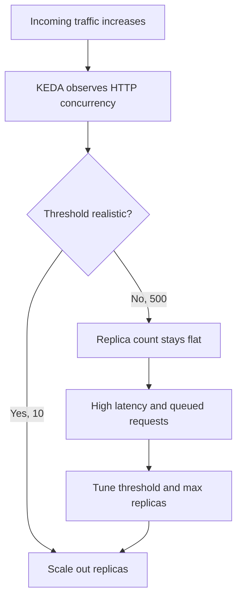

---
content_sources:
  diagrams:
    - id: architecture
      type: flowchart
      source: mslearn-adapted
      based_on:
        - https://learn.microsoft.com/azure/container-apps/scale-app
content_validation:
  status: verified
  last_reviewed: "2026-04-12"
  reviewer: ai-agent
  core_claims:
    - claim: "Azure Container Apps supports HTTP scaling rules that can scale an app based on concurrent HTTP requests."
      source: "https://learn.microsoft.com/azure/container-apps/scale-app"
      verified: true
    - claim: "The minimum and maximum replica settings in Azure Container Apps define the lower and upper bounds for scaling behavior."
      source: "https://learn.microsoft.com/azure/container-apps/scale-app"
      verified: true
---

# Scale Rule Mismatch Lab

Diagnose non-scaling behavior caused by unrealistic HTTP concurrency thresholds, then tune scale settings.

## Lab Metadata

| Attribute | Value |
|---|---|
| Difficulty | Intermediate |
| Estimated Duration | 25-35 minutes |
| Tier | Consumption |
| Failure Mode | Sustained load does not increase replica count because the HTTP scale threshold is too high |
| Skills Practiced | KEDA scaling inspection, load generation, replica analysis, scale tuning |

## 1) Background

This lab deploys an app with intentionally unrealistic HTTP scale thresholds. Even under sustained load, the scaler does not add replicas quickly enough, reproducing a common “autoscaling not working” incident.

The initial scale rule uses `concurrentRequests=500`, which is too high for the lab workload. The fix is to keep the same scaling model but tune the threshold and replica limits so the observed traffic can actually trigger scale-out.

### Architecture

<!-- diagram-id: architecture -->


## 2) Hypothesis

**IF** the Container App keeps the HTTP scale rule at `concurrentRequests=500`, **THEN** sustained lab load will not increase replicas above the baseline; **IF** the rule is corrected to `concurrentRequests=10` with `maxReplicas=10`, **THEN** the same workload will scale out.

| Variable | Control State | Experimental State |
|---|---|---|
| HTTP scale threshold | `concurrentRequests=10` | `concurrentRequests=500` |
| Maximum replicas | `10` | `2` |
| Load profile | Sustained `/load` requests | Sustained `/load` requests |
| Replica outcome | Replica count increases above baseline | Replica count stays at or near 1 |

## 3) Runbook

### Deploy baseline infrastructure

```bash
export RG="rg-aca-lab-scale"
export LOCATION="koreacentral"

az extension add --name containerapp --upgrade
az login

az group create --name "$RG" --location "$LOCATION"

az deployment group create \
    --name "lab-scale" \
    --resource-group "$RG" \
    --template-file "./labs/scale-rule-mismatch/infra/main.bicep" \
    --parameters baseName="labscale"
```

Expected output pattern: deployment `Succeeded`.

### Capture deployment outputs

```bash
export APP_NAME="$(az deployment group show \
    --resource-group "$RG" \
    --name "lab-scale" \
    --query "properties.outputs.containerAppName.value" \
    --output tsv)"

export ACR_NAME="$(az deployment group show \
    --resource-group "$RG" \
    --name "lab-scale" \
    --query "properties.outputs.containerRegistryName.value" \
    --output tsv)"

export ENVIRONMENT_NAME="$(az deployment group show \
    --resource-group "$RG" \
    --name "lab-scale" \
    --query "properties.outputs.environmentName.value" \
    --output tsv)"
```

Expected output: no output.

### Record the baseline replica count

```bash
az containerapp replica list --name "$APP_NAME" --resource-group "$RG" --output table
```

Expected output pattern:

```text
ca-myapp--0000001-646779b4c5-bhc2v  Running
```

### Trigger sustained load with the mismatched scale rule

The infrastructure starts with this HTTP scale rule metadata:

```text
concurrentRequests: '500'
```

Run the trigger:

```bash
./labs/scale-rule-mismatch/trigger.sh
```

The trigger script builds the workload, configures the scale rule, and generates load against `/load`:

```bash
az acr build --registry "$ACR_NAME" --image "${APP_NAME}:v1" ./workload

az containerapp update \
    --name "$APP_NAME" \
    --resource-group "$RG" \
    --image "${ACR_LOGIN_SERVER}/${APP_NAME}:v1" \
    --registry-server "$ACR_LOGIN_SERVER" \
    --registry-username "$ACR_USERNAME" \
    --registry-password "$ACR_PASSWORD" \
    --min-replicas 1 \
    --max-replicas 2 \
    --scale-rule-name "http-rule" \
    --scale-rule-type "http" \
    --scale-rule-metadata "concurrentRequests=500"
```

It then sends sustained traffic with either:

```bash
hey -z 45s -c 80 "https://${FQDN}/load"
```

or the fallback loop:

```bash
for _ in $(seq 1 300); do
    curl --silent "$URL" > /dev/null &
done
wait
```

Expected output: replicas remain lower than expected despite load.

### Inspect scaling-related signals

```bash
az containerapp logs show \
    --name "$APP_NAME" \
    --resource-group "$RG" \
    --type system
```

Expected diagnostic output pattern:

```text
Reason_s             Type_s
-------------------  --------
KEDAScalersStarted   Normal
```

Expected interpretation: the scaler starts, but the threshold mismatch prevents meaningful scale-out under this workload.

### Apply the tuning fix

```bash
az containerapp update \
    --name "$APP_NAME" \
    --resource-group "$RG" \
    --min-replicas 1 \
    --max-replicas 10 \
    --scale-rule-name "http-rule" \
    --scale-rule-type "http" \
    --scale-rule-metadata "concurrentRequests=10"
```

Expected output: update succeeds and a new healthy revision is created.

### Verify post-fix scaling behavior

```bash
./labs/scale-rule-mismatch/verify.sh
```

The verify script replays the load test before and after the fix, checks replica counts, and expects:

```bash
az containerapp replica list --name "$APP_NAME" --resource-group "$RG" --query "length(@)" --output tsv
```

Expected result: replica count stays at or below 1 before the fix and increases above 1 after the fix.

## 4) Experiment Log

| Step | Action | Expected | Actual | Pass/Fail |
|---|---|---|---|---|
| 1 | Deploy baseline | Deployment succeeds | | |
| 2 | Capture outputs | Variables populated | | |
| 3 | Record baseline replicas | One running replica at idle | | |
| 4 | Run `trigger.sh` | Load generated with `concurrentRequests=500` | | |
| 5 | Check replicas and logs | Minimal scale-out despite load | | |
| 6 | Update scale rule to `concurrentRequests=10` and `maxReplicas=10` | New revision created | | |
| 7 | Run `verify.sh` | Replica count increases under load | | |

## Expected Evidence

| Evidence Source | Expected State |
|---|---|
| `az containerapp replica list --name "$APP_NAME" --resource-group "$RG" --output table` | Baseline remains at one running replica before sustained load |
| `az containerapp update --name "$APP_NAME" --resource-group "$RG" --scale-rule-metadata "concurrentRequests=500"` | Mismatched threshold remains too high for the workload |
| `az containerapp logs show --name "$APP_NAME" --resource-group "$RG" --type system` | `KEDAScalersStarted` appears without effective early scale-out |
| `./labs/scale-rule-mismatch/verify.sh` before fix | Replica count stays at or below 1 |
| `./labs/scale-rule-mismatch/verify.sh` after fix | Replica count increases above 1 |

## Clean Up

```bash
az group delete --name "$RG" --yes --no-wait
```

## Related Playbook

- [HTTP Scaling Not Triggering](../playbooks/scaling-and-runtime/http-scaling-not-triggering.md)

## See Also

- [Event Scaler Mismatch Playbook](../playbooks/scaling-and-runtime/event-scaler-mismatch.md)
- [Traffic Routing and Canary Failure Lab](./traffic-routing-canary.md)

## Sources

- [Set scaling rules in Azure Container Apps](https://learn.microsoft.com/azure/container-apps/scale-app)
- [KEDA Documentation](https://keda.sh/docs/latest/)
