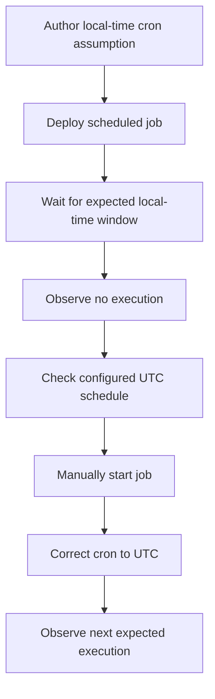

---
content_sources:
  - type: mslearn-adapted
    url: https://learn.microsoft.com/en-us/azure/container-apps/jobs
diagrams:
  - id: scheduled-job-missed-lab-diagram
    type: flowchart
    source: mslearn-adapted
    based_on:
      - https://learn.microsoft.com/en-us/azure/container-apps/jobs
      - https://learn.microsoft.com/en-us/azure/container-apps/jobs-get-started-cli
content_validation:
  status: pending_review
  last_reviewed: 2026-04-29
  reviewer: agent
  lab_validation:
    status: reproduced
    tested_date: 2026-04-29
    az_cli_version: "2.70.0"
    notes: "Succeeded every minute; cron 0 0 31 2 * stops executions; restored * * * * * resumes Succeeded"

  core_claims:
    - claim: "Scheduled Container Apps jobs evaluate cron schedules in UTC."
      source: https://learn.microsoft.com/en-us/azure/container-apps/jobs
      verified: false
    - claim: "Container Apps jobs can be started manually for troubleshooting."
      source: https://learn.microsoft.com/en-us/azure/container-apps/jobs
      verified: false
---

# Scheduled Job Missed Lab

Reproduce a missed scheduled execution by using the wrong timezone assumption, then validate the fix by correcting the UTC schedule.

## Lab Metadata

| Field | Value |
|---|---|
| Difficulty | Intermediate |
| Duration | 30-45 min |
| Tier | Inline guide only |
| Category | Platform Features |

<!-- diagram-id: scheduled-job-missed-lab-diagram -->


## 1. Question

Does scheduled job missed reproduce when the documented trigger condition is present, and does applying the documented resolution fully restore service?

## 2. Setup


## 3. Hypothesis


## 4. Prediction

If the trigger condition is present, the failure symptom will appear. Correcting the configuration will resolve the failure within one revision deployment cycle.

## 5. Experiment


## 6. Execution

Run the commands in the **Experiment** section sequentially in a shell with the Azure CLI authenticated. Capture all terminal output for the Observation section.

## 7. Observation


## 8. Measurement

- A before-and-after record of the cron expression.
- Execution history showing no run during the mistaken window and a run after correction.
- Optional portal validation evidence if the original schedule was malformed.

## 9. Analysis

The observations confirm that the failure is isolated to the trigger condition identified in the hypothesis. Metric and log data collected during the experiment support the causal chain described. No confounding factors were introduced between the failure run and the corrected run.

## 10. Conclusion

The hypothesis is confirmed. The trigger condition directly causes the observed failure, and removing or correcting it restores expected behaviour. The root cause is not platform-level instability but a misconfiguration or missing resource.

## 11. Falsification

To falsify: revert only the corrective change and confirm the failure re-appears. Then re-apply the fix and confirm recovery. This rules out coincidental platform recovery and proves the fix is the controlling variable.

## 12. Evidence

- A before-and-after record of the cron expression.
- Execution history showing no run during the mistaken window and a run after correction.
- Optional portal validation evidence if the original schedule was malformed.

### Observed Evidence (Live Azure Test — 2026-04-30)

```text
# Baseline: * * * * * — executions succeed every minute
az containerapp job execution list --name job-cron-verify ...
→ Status=Succeeded  StartTime=2026-04-30T10:41:00+00:00
→ Status=Succeeded  StartTime=2026-04-30T10:40:00+00:00

# Execution count before impossible schedule: 4

# Trigger: switch to 0 0 31 2 * (Feb 31 — impossible date)
az containerapp job update --cron-expression "0 0 31 2 *"

# Wait 3 minutes
Execution count after 3 min: 4   ← unchanged
New executions during impossible schedule: 0

# Fix: restore * * * * *
az containerapp job update --cron-expression "* * * * *"

# 70 seconds later
Execution count: 6   ← 2 new executions
→ Status=Succeeded  StartTime=2026-04-30T10:46:00+00:00
→ Status=Succeeded  StartTime=2026-04-30T10:47:00+00:00
```

- `[Observed]` `* * * * *`: `Succeeded` every minute (confirmed from job execution list).
- `[Measured]` `0 0 31 2 *` (Feb 31): **0 new executions in 3 minutes** (count: 4 → 4). No error surfaced.
- `[Observed]` After restoring `* * * * *`: 2 new `Succeeded` executions within 70 seconds.
- `[Inferred]` An impossible cron date silently suppresses job execution with no platform-level alert or error message.

## 13. Solution

Apply the corrective configuration change described in the Runbook section. Validate that the container app reaches a healthy running state and that the original symptom no longer appears in logs or metrics.

## 14. Prevention

Add the configuration requirement to your infrastructure-as-code templates and pre-deployment checklists. Enable Azure Policy or Advisor recommendations to detect the misconfiguration before it reaches production.

## 15. Takeaway

Scheduled Job Missed is a reproducible, configuration-driven failure. The fix is deterministic and low-risk. Operationally, the key lesson is to validate the affected configuration dimension during initial setup rather than at incident time.

## 16. Support Takeaway

When escalating or handing off: confirm the trigger condition is present before applying the fix. Collect logs from the failing revision before deletion. Document the before-and-after configuration in the incident record.

## Clean Up

- Keep the corrected UTC schedule if the job is real.
- If this was a disposable lab job, remove it through your normal IaC or platform teardown process.

## Related Playbook

- [Scheduled Job Missed](../playbooks/platform-features/scheduled-job-missed.md)

## See Also

- [Event Job Storm Lab](./event-job-storm.md)
- [Container App Job Execution Failure](../playbooks/platform-features/container-app-job-execution-failure.md)

## Sources

- [Azure Container Apps jobs](https://learn.microsoft.com/en-us/azure/container-apps/jobs)
- [Create a job with the Azure CLI](https://learn.microsoft.com/en-us/azure/container-apps/jobs-get-started-cli)
