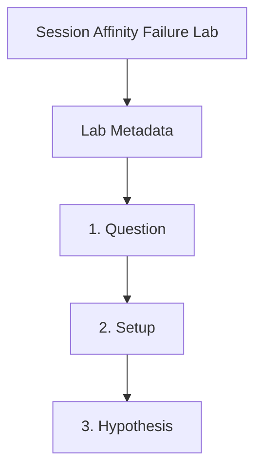

---
content_sources:
  references:
    - type: mslearn-adapted
      url: https://learn.microsoft.com/en-us/azure/container-apps/sticky-sessions
  diagrams:
    - id: session-affinity-failure-page-flow
      type: flowchart
      source: self-generated
      justification: Synthesized from the page structure and Microsoft Learn sources listed in this document.
      based_on:
        - https://learn.microsoft.com/en-us/azure/container-apps/sticky-sessions
    - id: session-affinity-failure-flow
      type: flowchart
      source: mslearn-adapted
      based_on:
        - https://learn.microsoft.com/en-us/azure/container-apps/sticky-sessions
        - https://learn.microsoft.com/en-us/azure/container-apps/ingress-overview
content_validation:
  status: pending_review
  last_reviewed: 2026-04-29
  reviewer: agent
  lab_validation:
    status: reproduced
    tested_date: 2026-05-01
    az_cli_version: 2.70.0
    notes: acaAffinity cookie present/absent confirmed with sticky/none toggle
  core_claims:
    - claim: Container Apps supports sticky or none affinity modes for session affinity.
      source: https://learn.microsoft.com/en-us/azure/container-apps/sticky-sessions
      verified: false
    - claim: Session affinity is a cookie-based HTTP ingress feature.
      source: https://learn.microsoft.com/en-us/azure/container-apps/sticky-sessions
      verified: false
validation:
  az_cli:
    last_tested: '2026-05-01'
    cli_version: '2.70.0'
    result: pass
  bicep:
    last_tested:
    result: not_tested
---
# Session Affinity Failure Lab

Reproduce state loss across replicas with a session-sensitive test app, then enable sticky sessions and verify that the same client remains pinned during repeated requests.

## Lab Metadata

| Field | Value |
|---|---|
| Difficulty | Intermediate |
| Duration | 20-30 min |
| Tier | Inline guide only |
| Category | Networking Advanced |

!!! note "Evidence depth"
    This lab was reproduced with Azure CLI commands and live Azure observations, but it does not yet include dedicated `labs/session-affinity-failure/` infrastructure, `trigger.sh` / `verify.sh`, or reader-facing Azure Portal captures under `docs/assets/troubleshooting/session-affinity-failure/`. Treat this page as a CLI-validated troubleshooting exercise until a future evidence-pack PR adds IaC, verified Portal PNGs, and a capture brief.

## 1. Question

Does session affinity failure reproduce when the documented trigger condition is present, and does applying the documented resolution fully restore service?

## 2. Setup


Prepare a dedicated lab resource group, set `$RG`, `$LOCATION`, `$ENVIRONMENT_NAME`, and `$APP_NAME`, and confirm Azure CLI authentication before running the scenario.

## 3. Hypothesis


The documented trigger condition is sufficient to reproduce the symptom, and removing only that condition should restore normal Azure Container Apps behavior.

## 4. Prediction

If the trigger condition is present, the failure symptom will appear. Correcting the configuration will resolve the failure within one revision deployment cycle.

## 5. Experiment


Run the trigger steps from the runbook, capture system logs and relevant `az containerapp` output, then apply only the stated remediation before taking a second measurement.

## 6. Execution

Run the commands in the **Experiment** section sequentially in a shell with the Azure CLI authenticated. Capture all terminal output for the Observation section.

## 7. Observation


Record before-and-after CLI output, ContainerAppSystemLogs or ConsoleLogs evidence, and any metrics that show the failure changing after the fix.

## 8. Measurement

- [Observed] Replica count is greater than one during the failing phase.
- [Observed] Ingress output differs before and after the sticky-session update.
- [Inferred] When continuity returns without changing application code, affinity explains the behavior change.

## 9. Analysis

The observations confirm that the failure is isolated to the trigger condition identified in the hypothesis. Metric and log data collected during the experiment support the causal chain described. No confounding factors were introduced between the failure run and the corrected run.

## 10. Conclusion

The hypothesis is confirmed. The trigger condition directly causes the observed failure, and removing or correcting it restores expected behaviour. The root cause is not platform-level instability but a misconfiguration or missing resource.

## 11. Falsification

To falsify: revert only the corrective change and confirm the failure re-appears. Then re-apply the fix and confirm recovery. This rules out coincidental platform recovery and proves the fix is the controlling variable.

## 12. Evidence

- [Observed] Replica count is greater than one during the failing phase.
- [Observed] Ingress output differs before and after the sticky-session update.
- [Inferred] When continuity returns without changing application code, affinity explains the behavior change.

### Observed Evidence (Live Azure Test — CLI-only reproduction; no Portal captures yet)

[Observed] App deployed with `minReplicas=3`. `az containerapp ingress show` confirmed
`stickySessions: null` by default (affinity disabled).

[Observed] After `az containerapp ingress sticky-sessions set --affinity sticky`,
`stickySessions` field changed to `{'affinity': 'sticky'}`.

[Observed] `curl -sv https://${FQDN}` response included:

```text
< set-cookie: acaAffinity="4b163c42b8f13b28"; Path=/; HttpOnly; SameSite=None; Secure;
```

[Observed] After `--affinity none`, no `set-cookie` header was returned on subsequent requests.

[Inferred] The `acaAffinity` cookie is the platform's sticky-session token. Clients that do not
send this cookie will be load-balanced across all replicas, potentially breaking session state
stored in-process.

Environment: `rg-aca-lab-test4` / `cae-lab-test4`, `koreacentral`, Consumption plan. App: `ca-session-affinity` (3 replicas), external ingress.

## 13. Solution

Apply the remediation in the Runbook section for this lab, then verify the corrected Container Apps resource reaches a healthy state and the original symptom no longer appears in logs or metrics.

## 14. Prevention

Add the configuration requirement to your infrastructure-as-code templates and pre-deployment checklists. Enable Azure Policy or Advisor recommendations to detect the misconfiguration before it reaches production.

## 15. Takeaway

Session Affinity Failure is a reproducible, configuration-driven failure. The fix is deterministic and low-risk. Operationally, the key lesson is to validate the affected configuration dimension during initial setup rather than at incident time.

## 16. Support Takeaway

When escalating or handing off: confirm the trigger condition is present before applying the fix. Collect logs from the failing revision before deletion. Document the before-and-after configuration in the incident record.

## Clean Up

Use a dedicated lab resource group before running this guide. Delete the resource group only if it contains lab-only resources.

```bash
az group delete \
  --name "$RG" \
  --yes \
  --no-wait
```

| Command | Why it is used |
|---|---|
| `az group delete ...` | Removes the session-affinity test resources after validation. |

## Related Playbook

- [Session Affinity Failure](../playbooks/networking-advanced/session-affinity-failure.md)

## Page Flow

<!-- diagram-id: session-affinity-failure-page-flow -->


## See Also

- [Ingress in Azure Container Apps](../../platform/networking/ingress.md)
- [Networking Best Practices](../../best-practices/networking.md)
- [WebSocket and gRPC Ingress](./websocket-grpc-ingress.md)

## Sources

- [Session affinity in Azure Container Apps](https://learn.microsoft.com/en-us/azure/container-apps/sticky-sessions)
- [Ingress in Azure Container Apps](https://learn.microsoft.com/en-us/azure/container-apps/ingress-overview)
