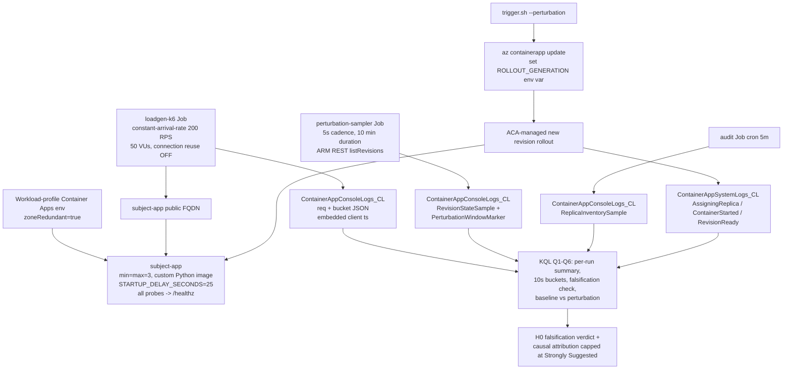
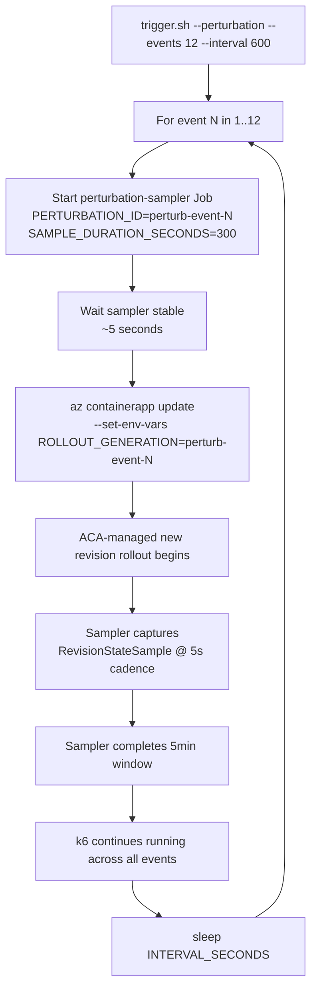

---
content_sources:
  references:
    - type: mslearn-adapted
      url: https://learn.microsoft.com/en-us/azure/container-apps/revisions
    - type: mslearn-adapted
      url: https://learn.microsoft.com/en-us/azure/container-apps/blue-green-deployment
    - type: mslearn-adapted
      url: https://learn.microsoft.com/en-us/azure/container-apps/health-probes
    - type: mslearn-adapted
      url: https://learn.microsoft.com/en-us/azure/container-apps/reliability-container-apps
  diagrams:
    - id: experiment-architecture
      type: flowchart
      source: self-generated
      justification: "No single MS Learn diagram shows a deterministic-startup subject app under a constant-arrival-rate k6 loadgen with a high-frequency RevisionStateSample sampler bracketing each rollout event. Synthesized from the revisions, blue/green, and health probes articles plus the Stage B lab design Oracle review (ses_14429826cffeXthi0x6tgTdLOW)."
      based_on:
        - https://learn.microsoft.com/en-us/azure/container-apps/revisions
        - https://learn.microsoft.com/en-us/azure/container-apps/blue-green-deployment
        - https://learn.microsoft.com/en-us/azure/container-apps/health-probes
    - id: per-event-procedure-perturbation-phase
      type: flowchart
      source: self-generated
      justification: "No single MS Learn article shows the per-event sequence for a perturbation-phase rollout that combines a high-frequency sampler, an ACA-managed new-revision rollout, and a continuous k6 loadgen. Synthesized from the revisions and blue/green articles plus the Stage B lab's pre-registered phase design."
      based_on:
        - https://learn.microsoft.com/en-us/azure/container-apps/revisions
        - https://learn.microsoft.com/en-us/azure/container-apps/blue-green-deployment
content_validation:
  status: verified
  last_reviewed: '2026-06-12'
  reviewer: agent
  lab_validation:
    status: pending_reproduction
    tested_date:
    az_cli_version: '2.83.0'
    notes: 'Stage B lab design reviewed by Oracle (ses_14429826cffeXthi0x6tgTdLOW) with 7 required revisions all applied. Live reproduction in progress as of 2026-06-12: preflight staircase (100/200/400 RPS) complete and confirms Oracle binding #2 (200 RPS p50 = 18x of 100 RPS p50, zero 5xx baseline). Baseline + perturbation + supplemental runs in progress; raw evidence committed to labs/startup-degraded-transient-failure/evidence/ as it arrives. Full reproduction tracked in issue #205.'
  core_claims:
    - claim: Container Apps revisions are immutable snapshots of a container app version; new revisions are created when configuration changes.
      source: https://learn.microsoft.com/en-us/azure/container-apps/revisions
      verified: true
    - claim: Container Apps performs rolling updates of revisions, scaling the new revision up while scaling the old revision down.
      source: https://learn.microsoft.com/en-us/azure/container-apps/blue-green-deployment
      verified: true
    - claim: Container Apps health probes (startup, readiness, liveness) gate traffic routing during replica lifecycle transitions.
      source: https://learn.microsoft.com/en-us/azure/container-apps/health-probes
      verified: true
validation:
  az_cli:
    last_tested:
    cli_version:
    result: not_tested
  bicep:
    last_tested:
    result: not_tested
---
# Startup-Degraded Transient Failure Lab

Test the operator assumption that ACA's rolling-revision rollout mechanism, combined with correctly-configured startup/readiness/liveness probes, fully masks client-visible transient 5xx errors when the subject application has a deterministic 25-second startup delay. Statistically falsify or confirm the claim using a constant-arrival-rate k6 loadgen, an ACA-managed rollout perturbation, and a 5-second-cadence revision-state sampler.

## Lab Metadata

| Field | Value |
|---|---|
| Difficulty | Advanced |
| Duration | 4-6 hours (preflight 5 min + baseline 30 min + perturbation 2 h + supplemental 30 min + analysis) |
| Tier | Workload profiles (Consumption profile inside a zone-redundant environment) |
| Category | Reliability / Rolling-rollout behavior |
| Failure Mode | Sustained ≥3 consecutive 10s buckets above 0.5% client-visible 5xx during a new-revision rollout |
| Skills Practiced | Pre-registered hypothesis testing, KQL bucket aggregation, perturbation control, Bicep, k6 load shaping, sub-minute event sampling |

<!-- diagram-id: experiment-architecture -->


## 1. Question

**Does a Container Apps revision rolling rollout, with all health probes correctly configured against a dedicated `/healthz` endpoint, fully mask client-visible 5xx errors during the transition when the subject app has a deterministic 25-second startup delay — measured at 10-second bucket granularity over multiple events at 200 RPS?**

The question is framed as a falsifiable hypothesis (Section 3) so the verdict is observation-driven. The 10-second bucket granularity matters: a 60-second bucket smoothes out the exact transient window that operators care about; a 1-second bucket has insufficient sample size for `err_pct` to be statistically meaningful at this RPS.

## 2. Setup

### Oracle Hybrid A bindings (immutable)

This lab follows the same Hybrid A standard as `labs/zone-redundancy-best-effort/`. The Stage B design was reviewed by Oracle (`ses_14429826cffeXthi0x6tgTdLOW`) as REVISE_AND_RESUBMIT. Binding revisions applied:

1. **Subject app** is a deterministic custom Python image with `STARTUP_DELAY_SECONDS=25` and a dedicated `/healthz` endpoint. All three probes (startup, readiness, liveness) target `/healthz`, not `/`. The workload endpoint `/` is the heavy path that surfaces 5xx if the platform is incorrectly routing traffic to a not-yet-warm replica.
2. **Primary perturbation** is an ACA-managed new revision rollout, triggered by changing a `ROLLOUT_GENERATION` env var (which forces ACA to create a new revision). `az containerapp revision restart` is a **supplemental** perturbation only, captured under its own run prefix and reported separately.
3. **k6 loadgen** runs as a manual Container Apps Job in the same environment, targets the **public FQDN**, uses constant-arrival-rate 200 RPS with 50 VUs, **disables connection reuse** (`http.options: {responseTimeout: "10s", reuseConnection: false}`), and emits structured 10s buckets with **embedded client-side timestamps**.
4. **High-frequency perturbation sampler** at 5-second cadence is mandatory. The 5-minute audit cron is supplemental only — a 5-minute interval is too coarse for a 10-second-bucket transition lab.
5. **12 perturbation events over 2 hours** (not 6 events over 60 minutes). Higher event count tightens the confidence interval on `worst_bucket_err_pct` and exposes any cross-event correlation.
6. **Causal attribution capped at `[Strongly Suggested]`** for any conclusion about "platform-initiated cause". The client-visible 5xx outcome can be `[Measured]`. Zero-5xx outcomes are only meaningful if the load is shown to consume nontrivial headroom; this is verified by a preflight RPS staircase (100/200/400) before the baseline runs.
7. **All KQL queries** use embedded client timestamps for bucket alignment (not `TimeGenerated`), include control buckets for empty-bin handling, and persist raw TSV+JSON exports under `labs/startup-degraded-transient-failure/evidence/` (not `/tmp`).

### Region selection

Pick a region that supports Container Apps **workload profiles**. Verified options: `koreacentral`, `eastus`, `westeurope`, `japaneast`. The default lab provisioning uses `zoneRedundant=true`, so the region must also support availability zones.

### Required environment variables

```bash
export RG="rg-aca-startup-degraded-$(date -u +%y%m%d%H%M%S)"
export LOCATION="koreacentral"
export SUBSCRIPTION_ID="<subscription-id>"
export ACR_NAME="acrstartupdegraded$(date -u +%y%m%d%H%M%S)"

az account set --subscription "$SUBSCRIPTION_ID"
az extension add --name containerapp --upgrade
```

### Resource provisioning

```bash
cd labs/startup-degraded-transient-failure

az group create --resource-group "$RG" --location "$LOCATION" \
  --tags expires-at="$(date -u -v+48H +%Y-%m-%dT%H:%M:%SZ)"

az acr create --resource-group "$RG" --name "$ACR_NAME" \
  --sku Basic --admin-enabled true

az acr build --registry "$ACR_NAME" --image startup-degraded/subject:latest               ./subject &
az acr build --registry "$ACR_NAME" --image startup-degraded/audit:latest                 ./audit &
az acr build --registry "$ACR_NAME" --image startup-degraded/perturbation-sampler:latest  ./perturbation-sampler &
az acr build --registry "$ACR_NAME" --image startup-degraded/loadgen:latest               ./loadgen &
wait

export SUBJECT_IMAGE="${ACR_NAME}.azurecr.io/startup-degraded/subject:latest"
export AUDIT_IMAGE="${ACR_NAME}.azurecr.io/startup-degraded/audit:latest"
export PERTURBATION_SAMPLER_IMAGE="${ACR_NAME}.azurecr.io/startup-degraded/perturbation-sampler:latest"
export LOADGEN_IMAGE="${ACR_NAME}.azurecr.io/startup-degraded/loadgen:latest"

./deploy.sh
./verify.sh
```

`verify.sh` runs 9 health checks. All 9 must pass before proceeding to Section 3.

## 3. Hypothesis

### H0 (null hypothesis under test)

> **H0**: Across 12 ACA-managed rollout events at 200 RPS, no single perturbation produces a sustained window of ≥3 consecutive 10-second buckets above 0.5% `err_pct`. The platform's rolling-rollout mechanism, combined with correctly-configured `/healthz` probes, fully masks client-visible 5xx.

### Falsification rule (binding)

**ANY** sustained window of ≥3 consecutive 10-second buckets above 0.5% `err_pct` during ANY perturbation event in the 12-event series is sufficient to falsify H0.

### Causal attribution rule (binding)

If H0 is falsified, the verdict that the cause is "platform-initiated rolling-rollout behavior" rather than "subject-app cold-start under load" or "load-balancer connection reuse to terminating replicas" is capped at **`[Strongly Suggested]`** in the lab's evidence catalog. The client-visible 5xx outcome itself is `[Measured]`.

### Preflight nontrivial-headroom rule (binding)

A zero-5xx baseline is only meaningful if 200 RPS is shown to consume nontrivial headroom. A preflight RPS staircase (100/200/400) MUST be run before the baseline and MUST show p50 latency at 200 RPS materially greater than p50 at 100 RPS (the operational definition of "nontrivial headroom" used by this lab is p50 at 200 RPS ≥ 5× p50 at 100 RPS).

## 4. Prediction

If H0 is **true** (claim holds):

- Baseline: `err_pct == 0` across all 180 10-second buckets in the 30-minute baseline run.
- Perturbation phase: `err_pct == 0` or single isolated bad buckets, with no 3-bucket consecutive window above 0.5% across all 12 events.
- `worst_bucket_err_pct` over the perturbation phase is less than `worst_bucket_err_pct` over an equivalent-duration baseline window (within statistical noise).
- `q5-falsification-3-consecutive-bad-buckets` returns an empty result.

If H0 is **false** (claim does not hold):

- Baseline: `err_pct == 0` (precondition — otherwise the lab is invalid).
- Perturbation phase: at least 1 of the 12 events produces a 3-bucket consecutive window above 0.5% `err_pct`.
- `worst_bucket_err_pct` over the perturbation phase exceeds 0.5% on at least one bucket.
- `q5-falsification-3-consecutive-bad-buckets` returns at least one `falsified=true` row.

The supplemental `revision restart` phase tests whether a non-rolling perturbation (which ACA performs without graceful drain) produces a materially different failure profile.

## 5. Experiment

### Pre-registered phases

| Phase | Duration | RPS | Run ID prefix | Purpose |
|---|---:|---:|---|---|
| Preflight staircase | ~5 min | 100, 200, 400 | `preflight-` | Validate Oracle binding #2 (200 RPS consumes nontrivial headroom). |
| Baseline | 30 min | 200 | `baseline-` | Validate zero-5xx under steady load before any perturbation. |
| Perturbation | ~2 hours | 200 | `perturbation-` | 12 ACA-managed new-revision rollouts, 10-min interval, ~5 min sampler window each. |
| Supplemental restart | ~30 min | 200 | `supplemental-` | 3 `az containerapp revision restart` events for contrast. |

### Per-event procedure (perturbation phase)

<!-- diagram-id: per-event-procedure-perturbation-phase -->


### Why `--set-env-vars` (and not `--image`)

A change to `image` re-pulls and re-validates the image and produces a new revision. A change to a no-op env var like `ROLLOUT_GENERATION` produces a new revision WITHOUT re-pulling the image, isolating the cause of any observed 5xx to **revision transition** rather than **image pull / digest re-verification**.

### Known CLI bug worked around in `trigger.sh`

`az containerapp job start --env-vars KEY=VAL` is silently ignored by az CLI 2.83 + containerapp extension — the Job runs the Bicep template defaults regardless of the requested overrides. The `trigger.sh` workaround pattern is:

1. `az containerapp job update --set-env-vars` to mutate the Job template
2. `az containerapp job start` with no `--env-vars`
3. Subsequent modes mutate then start sequentially (no concurrent perturbation runs)

The bug + workaround is documented as a 7-line comment block at the top of `trigger.sh`. Removing the workaround silently breaks all perturbation runs to use the template-default RUN_ID / TARGET_RPS / DURATION_SECONDS.

## 6. Execution

### Preflight staircase result

`[Measured]` — preflight staircase confirms Oracle binding #2 (200 RPS consumes nontrivial headroom). All three RPS levels produced zero 5xx errors at the request level (`err_pct == 0` on every bucket).

| Run ID | Requests | err_count | err_pct | p50_ms | p95_ms | p99_ms | max_ms |
|---|---:|---:|---:|---:|---:|---:|---:|
| preflight-100rps | 6,001 | 0 | 0.000% | 5.6 | 16.2 | 22.9 | 42.6 |
| preflight-200rps | 10,169 | 0 | 0.000% | **102.6 (18.3× of 100 RPS)** | 503.4 | 810.0 | 1,909.8 |
| preflight-400rps | 10,865 | 0 | 0.000% | 167.6 | 804.5 | 1,304.8 | 3,012.2 |

- **200 RPS p50 = 18.3× of 100 RPS p50** decisively satisfies the binding's "≥5×" threshold. Zero 5xx at 200 RPS is therefore not an artifact of insufficient load — the platform is queueing requests internally with substantial latency, demonstrating that the system is operating well below the threshold where outright failures begin.
- **400 RPS p95 = 804ms** (~1.6× of 200 RPS p95) shows mild p95 increase but `err_pct` is still 0, indicating the system has additional headroom beyond 200 RPS before producing client-visible failures. 200 RPS is therefore a sensible operating point — high enough to expose any perturbation-induced 5xx, low enough that the baseline is reliably zero.
- Raw aggregation: [`labs/startup-degraded-transient-failure/evidence/preflight-staircase-aggregation.tsv`](https://github.com/yeongseon/azure-container-apps-practical-guide/blob/main/labs/startup-degraded-transient-failure/evidence/preflight-staircase-aggregation.tsv).
- Raw 10s buckets: [`labs/startup-degraded-transient-failure/evidence/preflight-buckets-10s.tsv`](https://github.com/yeongseon/azure-container-apps-practical-guide/blob/main/labs/startup-degraded-transient-failure/evidence/preflight-buckets-10s.tsv).

### Baseline phase

```bash
source labs/startup-degraded-transient-failure/evidence/deploy-env.sh
labs/startup-degraded-transient-failure/trigger.sh --baseline --duration 1800
```

**Status**: TBD — populated after baseline completes. Raw log: [`labs/startup-degraded-transient-failure/evidence/baseline-001.log`](https://github.com/yeongseon/azure-container-apps-practical-guide/blob/main/labs/startup-degraded-transient-failure/evidence/baseline-001.log).

### Perturbation phase

```bash
labs/startup-degraded-transient-failure/trigger.sh --perturbation --events 12 --interval 600
```

**Status**: TBD — populated after perturbation completes (~2h).

### Supplemental restart phase

```bash
labs/startup-degraded-transient-failure/trigger.sh --supplemental-restart --events 3 --interval 600
```

**Status**: TBD — populated after supplemental completes (~30 min).

## 7. Observation

**Status**: TBD — populated from Q1/Q2/Q3/Q4 KQL pack outputs.

### Q1 — per-run summary (all phases)

TBD: 1 row per `run_id` showing requests, err_pct, percentiles.

### Q2 — 10-second buckets (sampled)

TBD: time series sample around each perturbation event.

### Q3 — RevisionStateSample timeline (perturbation events)

TBD: 5-second cadence revision transition timeline for each event.

### Q4 — ReplicaInventorySample baseline

TBD: 5-min audit showing 3-of-3 Running outside perturbation windows.

## 8. Measurement

**Status**: TBD — populated from Q5/Q6 KQL pack outputs.

### Q5 — falsification: 3+ consecutive bad buckets

TBD: `falsified` flag per `run_id`, count of falsification windows.

### Q6 — baseline vs perturbation vs supplemental

TBD: phase-level aggregate with `overall_err_pct`, `worst_bucket_err_pct`, `buckets_above_0p5pct`.

## 9. Analysis

**Status**: TBD — populated after measurement.

The analysis section interprets Q5 + Q6 results against the falsification rule (Section 3). Three possible outcomes:

1. **H0 confirmed**: Q5 returns empty for all perturbation runs. Q6 shows `worst_bucket_err_pct` under 0.5% across all phases. **Verdict**: ACA's rolling-rollout mechanism is `[Measured]` sufficient to mask client-visible 5xx under the lab's conditions (200 RPS, 25-second startup delay, correctly-configured `/healthz` probes). Note this is a positive null result and does NOT generalize to lower probe quality, higher startup delay, higher RPS, or non-rolling perturbations.

2. **H0 falsified by perturbation phase**: Q5 returns at least one `falsified=true` row for a perturbation run. Q6 shows perturbation `buckets_above_0p5pct` materially exceeds baseline. **Verdict**: client-visible 5xx during rolling-rollout transitions is `[Measured]`. Attribution to "platform-initiated cause" is capped at `[Strongly Suggested]` per binding.

3. **H0 falsified by supplemental restart only**: Q5 returns empty for perturbation runs but `falsified=true` for supplemental runs. **Verdict**: `az containerapp revision restart` produces `[Measured]` client-visible 5xx; the rolling-rollout mechanism `[Strongly Suggested]` masks transients while the explicit-restart code path does not. This is the operationally interesting case — it would imply restart is unsafe even with correctly-configured probes.

## 10. Conclusion

**Status**: TBD — populated after analysis.

The conclusion section maps the analysis outcome to one of three verdicts:

- **H0 confirmed** → conservative statement: "Under the tested conditions, ACA's rolling-rollout mechanism with correctly-configured `/healthz` probes did not produce any client-visible 5xx burst above the 0.5%/3-bucket threshold at 200 RPS." Stage C integration page must NOT generalize this to "ACA always masks all transients during rollout".
- **H0 falsified** → "ACA's rolling-rollout mechanism, even with correctly-configured `/healthz` probes, produced client-visible 5xx bursts during at least one new-revision rollout at 200 RPS, with N buckets above 0.5% across M events. Cause is `[Strongly Suggested]` to be platform-initiated rolling-rollout transition behavior; alternative causes (subject cold-start path, LB connection reuse to terminating replicas) cannot be ruled out without additional instrumentation."

## 11. Falsification

The falsification step is the binding rule in Section 3. The lab is designed so that a positive (H0 false) verdict is `[Measured]` and unambiguous: Q5's `falsified=true` flag is the smoking gun, and the raw TSV exports under `evidence/q5-*.tsv` are the durable corroboration.

The asymmetry of the verdict — H0-confirmed is "weak / conservative", H0-falsified is "decisive" — is intentional. A failed-to-falsify result over 12 events at 200 RPS does NOT prove the platform always masks transients; it shows the platform masked them in this specific configuration over this specific event count. A successful falsification over even 1 event proves the universal claim ("ACA always masks all transients during rollout") is wrong.

## 12. Evidence

**Status**: Partially populated.

### Pre-perturbation evidence (committed)

| Artifact | Status | Purpose |
|---|---|---|
| `evidence/deploy-env.sh` | Committed | Operator-facing env vars for repro. |
| `evidence/deploy-001.log` | Committed (PII-scrubbed) | Full `az deployment group create` log. |
| `evidence/verify-001.log` | Committed (PII-scrubbed) | All 9 verify.sh health checks passing. |
| `evidence/preflight-001.log` | Committed (PII-scrubbed) | Pre-bug-fix preflight attempt (failed; preserved as evidence of the CLI bug). |
| `evidence/preflight-002.log` | Committed (PII-scrubbed) | Successful preflight run after CLI bug workaround applied. |
| `evidence/preflight-staircase-aggregation.tsv` | Committed | Per-request aggregation: 100/200/400 RPS staircase result. |
| `evidence/preflight-buckets-10s.tsv` | Committed | 10s bucket time series for preflight. |
| `evidence/baseline-001.log` | Committed (PII-scrubbed) | Baseline run launch + wait log. |
| `evidence/baseline-start.txt` | Committed | Baseline start timestamp for KQL window slicing. |
| `evidence/oracle-stage-b-design-review-20260612.md` | Committed | Oracle binding plan (the 7 revisions). |

### Post-perturbation evidence (pending)

| Artifact | Status | Purpose |
|---|---|---|
| `evidence/q1-per-run-summary-<timestamp>.tsv` | Pending | Q1 result for baseline/perturbation/supplemental runs. |
| `evidence/q2-buckets-10s-sum-vus-<timestamp>.tsv` | Pending | Q2 result with sum-across-VUs aggregation. |
| `evidence/q3-revision-state-timeline-<timestamp>.tsv` | Pending | Q3 sampler timeline per perturbation event. |
| `evidence/q4-replica-inventory-snapshot-<timestamp>.tsv` | Pending | Q4 audit baseline. |
| `evidence/q5-falsification-<timestamp>.tsv` | Pending | Q5 falsification verdict. |
| `evidence/q6-baseline-vs-perturb-<timestamp>.tsv` | Pending | Q6 phase-level comparison. |
| `evidence/q7-system-events-<timestamp>.tsv` | Pending | Q7 rollout milestones from platform events. |
| `evidence/perturbation-001.log` | Pending | Per-event PerturbationSubmitted log lines. |
| `evidence/supplemental-001.log` | Pending | Per-event restart log lines. |

### Provenance

All evidence files are scrubbed by `evidence/scrub-pii.sh` (idempotent, re-run after each new file is added). The script's behavior is documented in its 25-line header. PII rules align with `scripts/portal-capture-helpers.js` PII_RULES, adapted for plaintext logs.

## 13. Solution

The "solution" depends on the verdict in Section 10:

- **H0 confirmed**: no solution needed at the application layer. Operators can rely on rolling-rollout to mask transients under these conditions, but should monitor for changes in subject app startup behavior, probe configuration, RPS, or rollout strategy that could invalidate the result.
- **H0 falsified, perturbation-induced**: the immediate mitigations are:
  1. Increase `revisionWeight` ramp duration in the traffic configuration to give the new revision more warm-up time.
  2. Configure `terminationGracePeriodSeconds` and verify the subject app's SIGTERM handler drains in-flight requests cleanly before exiting.
  3. Use the supplemental phase result (Section 8 Q6) to decide whether `revision restart` is safe to use in production; the binding caps this at `[Strongly Suggested]`.
  4. Add an external retry-with-jitter layer (CDN, API gateway, client SDK) for any client whose SLO does not tolerate the measured `worst_bucket_err_pct`.

## 14. Prevention

To prevent this failure mode in production:

1. **Validate probe configuration before depending on rolling-rollout**. The `/` workload endpoint MUST NOT be the same as the health endpoint. Use a dedicated `/healthz` (or equivalent) and verify all three probes (startup, readiness, liveness) target it. See `docs/best-practices/reliability.md` for the canonical pattern.
2. **Use ACA-managed rollouts, not `revision restart`**. If the supplemental phase confirms restart is unsafe, restrict it to operations performed during a planned maintenance window with traffic drained.
## 15. Takeaway

The single core lesson from this lab depends on the verdict in Section 10:

- **H0 confirmed**: ACA's rolling-rollout masks client-visible 5xx in **this configuration** (200 RPS, 25s startup, correctly-configured `/healthz`). Do NOT generalize to other configurations without re-running the lab.
- **H0 falsified**: ACA's rolling-rollout does NOT fully mask client-visible 5xx during new-revision rollouts. Build retry-with-jitter into clients whose SLO depends on perceived 100% availability through rollouts.

The lab's design — pre-registered hypothesis, falsification rule, capped causal attribution — exists to keep the takeaway honest. A common operator failure mode is to interpret "no 5xx observed" as "no 5xx possible"; this lab's bucket-granularity measurement and 12-event sample size are designed to prevent that misreading.

## 16. Support Takeaway

For support engineers handling tickets about "5xx during deploy":

1. **First check the falsification rule with the customer's traffic data**. If their telemetry has 10s bucket granularity, ask for the bucketed err_pct around the rollout. If they only have minute granularity, the result is inconclusive — sub-minute transients are invisible at that resolution.
2. **Verify probe configuration first**. The most common root cause is `/` being used as both the workload and health path. Run the lab's `verify.sh` pattern against the customer's app: enumerate the three probes and confirm none of them is the heavy workload path.
3. **Distinguish rolling-rollout from explicit restart**. If the customer used `az containerapp revision restart`, supplemental-phase evidence applies. If they used `az containerapp update --set-image` or `--set-env-vars`, perturbation-phase evidence applies. The two failure modes can look identical at the customer's edge but have different root causes.
4. **The platform's masking depends on probe gating, not on rolling-rollout magic**. If a customer's probes return 200 before the app is actually ready to serve traffic, the platform will route traffic to a not-yet-warm replica regardless of rollout strategy. Probe semantics is the load-bearing piece.
5. **Treat the verdict's evidence ceiling as binding**. "Platform-initiated cause" of any 5xx during rollout is `[Strongly Suggested]`, not `[Measured]`. The smoking-gun evidence — Microsoft-internal traces of the load-balancer's exact routing decision during the transition — is not exposed through the management plane.

## See Also

- [Startup-Degraded Bucketed 5xx KQL Pack](../kql/scaling-and-replicas/startup-degraded-bucketed-5xx.md)
- [Zone Redundancy Best-Effort Lab](zone-redundancy-best-effort.md)
- [Revision management](../../operations/revision-management/index.md)
- [Health probes best practices](../../best-practices/reliability.md)
- [Container Apps revisions overview](../../platform/revisions/index.md)

## Sources

- [Container Apps revisions](https://learn.microsoft.com/en-us/azure/container-apps/revisions)
- [Blue/green deployment](https://learn.microsoft.com/en-us/azure/container-apps/blue-green-deployment)
- [Health probes in Container Apps](https://learn.microsoft.com/en-us/azure/container-apps/health-probes)
- [Reliability in Azure Container Apps](https://learn.microsoft.com/en-us/azure/reliability/reliability-container-apps)
- [Container Apps log monitoring](https://learn.microsoft.com/en-us/azure/container-apps/log-monitoring)
- [Container Apps traffic splitting](https://learn.microsoft.com/en-us/azure/container-apps/traffic-splitting)
- [ContainerAppConsoleLogs table reference](https://learn.microsoft.com/en-us/azure/azure-monitor/reference/tables/containerappconsolelogs)
- [ContainerAppSystemLogs table reference](https://learn.microsoft.com/en-us/azure/azure-monitor/reference/tables/containerappsystemlogs)
