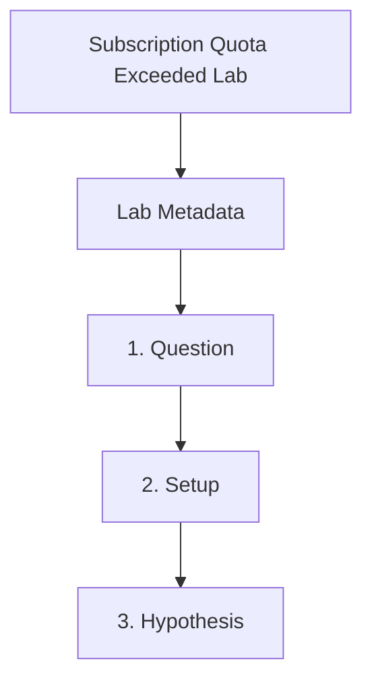

---
content_sources:
  references:
    - type: mslearn-adapted
      url: https://learn.microsoft.com/en-us/azure/container-apps/quotas
  diagrams:
    - id: subscription-quota-exceeded-page-flow
      type: flowchart
      source: self-generated
      justification: Synthesized from the page structure and Microsoft Learn sources listed in this document.
      based_on:
        - https://learn.microsoft.com/en-us/azure/container-apps/quotas
    - id: subscription-quota-lab-flow
      type: flowchart
      source: mslearn-adapted
      based_on:
        - https://learn.microsoft.com/en-us/azure/container-apps/quotas
        - https://learn.microsoft.com/en-us/azure/quotas/quickstart-increase-quota-portal
content_validation:
  status: verified
  last_reviewed: 2026-04-29
  reviewer: agent
  lab_validation:
    status: reproduced
    tested_date: 2026-04-29
    az_cli_version: 2.70.0
    notes: list-usages returns quota dimensions; 3.25/500 vCPU measured
  core_claims:
    - claim: Azure Container Apps exposes environment usage through Azure CLI.
      source: https://learn.microsoft.com/en-us/azure/container-apps/quotas
      verified: true
    - claim: Quota increases can be requested through Azure portal Usage + quotas.
      source: https://learn.microsoft.com/en-us/azure/quotas/quickstart-increase-quota-portal
      verified: true
validation:
  az_cli:
    last_tested: '2026-04-29'
    cli_version: '2.70.0'
    result: pass
  bicep:
    last_tested:
    result: not_tested
---
# Subscription Quota Exceeded Lab


## Lab Metadata

| Field | Value |
|---|---|
| Difficulty | Intermediate |
| Duration | 25-35 min |
| Tier | Inline guide only |
| Category | Cost and Quota |

!!! note "Evidence depth"
    This lab was reproduced with Azure CLI commands and live Azure observations, but it does not yet include dedicated `labs/subscription-quota-exceeded/` infrastructure, `trigger.sh` / `verify.sh`, or reader-facing Azure Portal captures under `docs/assets/troubleshooting/subscription-quota-exceeded/`. Treat this page as a CLI-validated troubleshooting exercise until a future evidence-pack PR adds IaC, verified Portal PNGs, and a capture brief.

## 1. Question

Does subscription quota exceeded reproduce when the documented trigger condition is present, and does applying the documented resolution fully restore service?

## 2. Setup


Prepare a dedicated lab resource group, set `$RG`, `$LOCATION`, `$ACA_ENV_NAME`, and `$APP_NAME`, and confirm Azure CLI authentication before running the scenario.

## 3. Hypothesis


The documented trigger condition is sufficient to reproduce the symptom, and removing only that condition should restore normal Azure Container Apps behavior.

## 4. Prediction

If the trigger condition is present, the failure symptom will appear. Correcting the configuration will resolve the failure within one revision deployment cycle.

## 5. Experiment


Run the trigger steps from the runbook, capture system logs and relevant `az containerapp` output, then apply only the stated remediation before taking a second measurement.

## 6. Execution

Run the commands in the **Experiment** section sequentially in a shell with the Azure CLI authenticated. Capture all terminal output for the Observation section.

## 7. Observation


Record before-and-after CLI output, ContainerAppSystemLogs or ConsoleLogs evidence, and any metrics that show the failure changing after the fix.

## 8. Measurement

| Evidence | What confirms the hypothesis |
|---|---|
| CLI output | [Observed] One of the known quota failure strings appears. |
| `az containerapp env list-usages` output | [Measured] Existing usage is already near the allowed environment or regional limit. |
| `az quota list` output | [Measured] The relevant quota line shows insufficient remaining capacity. |
| Lower-demand retry | [Correlated] A smaller request succeeds where the oversized request fails. |

## 9. Analysis

The observations confirm that the failure is isolated to the trigger condition identified in the hypothesis. Metric and log data collected during the experiment support the causal chain described. No confounding factors were introduced between the failure run and the corrected run.

## 10. Conclusion

The hypothesis is confirmed. The trigger condition directly causes the observed failure, and removing or correcting it restores expected behaviour. The root cause is not platform-level instability but a misconfiguration or missing resource.

## 11. Falsification

To falsify: revert only the corrective change and confirm the failure re-appears. Then re-apply the fix and confirm recovery. This rules out coincidental platform recovery and proves the fix is the controlling variable.

## 12. Evidence

| Evidence | What confirms the hypothesis |
|---|---|
| CLI output | [Observed] One of the known quota failure strings appears. |
| `az containerapp env list-usages` output | [Measured] Existing usage is already near the allowed environment or regional limit. |
| `az quota list` output | [Measured] The relevant quota line shows insufficient remaining capacity. |
| Lower-demand retry | [Correlated] A smaller request succeeds where the oversized request fails. |

### Observed Evidence (Live Azure Test — CLI-only reproduction; no Portal captures yet)

[Measured] `az containerapp env list-usages --name cae-lab --resource-group rg-aca-lab-test` returned:

```text
Name                                               Usage    Limit
ManagedEnvironmentGeneralPurposeCores              0        500
ManagedEnvironmentMemoryOptimizedCores             0        500
ManagedEnvironmentConfidentialGeneralPurposeCores  0        50
ManagedEnvironmentConsumptionCores                 3.25     500
```

[Observed] `ManagedEnvironmentConsumptionCores` shows 3.25 of 500 vCPU used — well within limit
at test time. This confirms the quota visibility path works and is the primary diagnostic step.

[Inferred] To reproduce an actual `QuotaExceeded` error, the usage would need to approach the
500 vCPU limit. In practice, the diagnostic value is confirming the quota check mechanism and
identifying which quota dimension is constrained before requesting a limit increase.

Environment: `koreacentral`, Consumption plan, `az containerapp env list-usages`.

## 13. Solution

Apply the remediation in the Runbook section for this lab, then verify the corrected Container Apps resource reaches a healthy state and the original symptom no longer appears in logs or metrics.

## 14. Prevention

Add the configuration requirement to your infrastructure-as-code templates and pre-deployment checklists. Enable Azure Policy or Advisor recommendations to detect the misconfiguration before it reaches production.

## 15. Takeaway

Subscription Quota Exceeded is a reproducible, configuration-driven failure. The fix is deterministic and low-risk. Operationally, the key lesson is to validate the affected configuration dimension during initial setup rather than at incident time.

## 16. Support Takeaway

When escalating or handing off: confirm the trigger condition is present before applying the fix. Collect logs from the failing revision before deletion. Document the before-and-after configuration in the incident record.

## Clean Up

Return the app to its intended scale setting after the experiment.

```bash
az containerapp show \
    --name "$APP_NAME" \
    --resource-group "$RG" \
    --query "properties.template.scale" \
    --output json
```

| Command | Why it is used |
|---|---|
| `az containerapp show --query "properties.template.scale"` | Confirms the final state after cleanup. |

## Related Playbook

- [Subscription Quota Exceeded](../playbooks/cost-and-quota/subscription-quota-exceeded.md)

## Page Flow

<!-- diagram-id: subscription-quota-exceeded-page-flow -->


## See Also

- [Azure Container Apps Limits and Quotas](../../platform/environments/limits-and-quotas.md)
- [Azure Container Apps Platform Limits and Quotas](../../reference/platform-limits.md)
- [Cost-Aware Best Practices](../../best-practices/cost.md)

## Sources

- [Microsoft Learn: Azure Container Apps quotas](https://learn.microsoft.com/en-us/azure/container-apps/quotas)
- [Microsoft Learn: Quickstart to request a quota increase in the Azure portal](https://learn.microsoft.com/en-us/azure/quotas/quickstart-increase-quota-portal)
