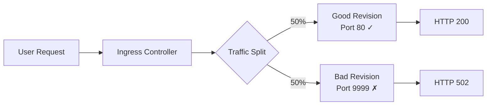

---
hide:
  - toc
content_sources:
  diagrams:
    - id: architecture
      type: flowchart
      source: mslearn-adapted
      based_on:
        - https://learn.microsoft.com/azure/container-apps/traffic-splitting
        - https://learn.microsoft.com/azure/container-apps/revisions
        - https://learn.microsoft.com/azure/container-apps/blue-green-deployment
---

# Traffic Routing and Canary Failure Lab

Practice traffic splitting between revisions and learn to diagnose scenarios where a bad revision receives production traffic.

## Lab Metadata

| Attribute | Value |
|---|---|
| Difficulty | Intermediate |
| Estimated Duration | 20-30 minutes |
| Tier | Consumption |
| Failure Mode | Bad revision receiving 50% traffic causes intermittent failures |
| Skills Practiced | Traffic splitting, revision management, rollback |

## 1) Background

Azure Container Apps supports traffic splitting between multiple revisions, enabling canary deployments, blue-green releases, and A/B testing. When `activeRevisionsMode` is set to `Multiple`, you can assign traffic weights to each revision.

A common failure scenario occurs when:

1. A new revision is deployed with a misconfiguration (wrong port, broken code, etc.)
2. Traffic is split between the good and bad revisions
3. Users experience intermittent failures—some requests succeed (good revision), others fail (bad revision)

This lab simulates this scenario by:

1. Deploying a healthy baseline revision
2. Creating a bad revision with an incorrect target port (9999)
3. Splitting traffic 50/50 between good and bad revisions
4. Observing intermittent failures and practicing rollback

### Architecture

<!-- diagram-id: architecture -->


## 2) Hypothesis

**IF** traffic is split 50/50 between a healthy revision and a revision with an incorrect target port, **THEN** approximately 50% of requests will fail with 502 errors.

| Variable | Control State | Experimental State |
|---|---|---|
| Revision Count | 1 (healthy) | 2 (healthy + bad) |
| Traffic Split | 100% to healthy | 50% healthy, 50% bad |
| Request Success Rate | ~100% | ~50% |

## 3) Runbook

### Deploy Baseline Infrastructure

```bash
export RG="rg-aca-lab-traffic"
export LOCATION="koreacentral"

az group create --name "$RG" --location "$LOCATION"

az deployment group create \
    --name "lab-traffic" \
    --resource-group "$RG" \
    --template-file "./labs/traffic-routing-canary/infra/main.bicep" \
    --parameters baseName="labtraffic"
```

### Capture Resource Names

```bash
export APP_NAME="$(az deployment group show \
    --resource-group "$RG" \
    --name "lab-traffic" \
    --query "properties.outputs.containerAppName.value" \
    --output tsv)"

export APP_FQDN="$(az containerapp show \
    --name "$APP_NAME" \
    --resource-group "$RG" \
    --query "properties.configuration.ingress.fqdn" \
    --output tsv)"
```

### Verify Baseline (Before Trigger)

```bash
# Confirm single revision with 100% traffic
az containerapp revision list \
    --name "$APP_NAME" \
    --resource-group "$RG" \
    --output table
```

Expected output:

```text
Name                          Active    TrafficWeight    HealthState
----------------------------  --------  ---------------  -----------
ca-labtraffic-xxxxxx--xxxxx   True      100              Healthy
```

```bash
# Confirm endpoint is fully reachable
for i in {1..5}; do
    curl --silent --fail "https://${APP_FQDN}" > /dev/null && echo "Request $i: OK"
done
```

Expected: All 5 requests succeed.

### Trigger the Failure

```bash
cd labs/traffic-routing-canary
./trigger.sh
```

The trigger script:

1. Records the current healthy revision name
2. Creates a new revision with target port 9999 (no process listening)
3. Splits traffic 50/50 between good and bad revisions

### Observe the Failure

```bash
# Check revision list - should show two revisions
az containerapp revision list \
    --name "$APP_NAME" \
    --resource-group "$RG" \
    --query "[].{name:name,active:properties.active,traffic:properties.trafficWeight,health:properties.healthState}" \
    --output table
```

Expected output:

```text
Name                          Active    Traffic    Health
----------------------------  --------  ---------  --------
ca-labtraffic-xxxxxx--xxxxx   True      50         Healthy
ca-labtraffic-xxxxxx--yyyyy   True      50         Healthy
```

Note: Both revisions may show "Healthy" because the health check might pass—the container is running, just on the wrong port.

```bash
# Test multiple requests - observe intermittent failures
for i in {1..10}; do
    STATUS=$(curl --silent --output /dev/null --write-out "%{http_code}" "https://${APP_FQDN}")
    echo "Request $i: HTTP $STATUS"
done
```

Expected: Approximately 50% return 200, 50% return 502 or timeout.

```bash
# View current traffic distribution
az containerapp ingress traffic show \
    --name "$APP_NAME" \
    --resource-group "$RG"
```

### Fix the Issue (Rollback)

Rollback by sending 100% traffic to the good revision:

```bash
# Get the good revision name (the one created first)
GOOD_REVISION=$(az containerapp revision list \
    --name "$APP_NAME" \
    --resource-group "$RG" \
    --query "sort_by([].{name:name,created:properties.createdTime}, &created)[0].name" \
    --output tsv)

# Send all traffic to good revision
az containerapp ingress traffic set \
    --name "$APP_NAME" \
    --resource-group "$RG" \
    --revision-weight "${GOOD_REVISION}=100"
```

Optionally, deactivate the bad revision:

```bash
BAD_REVISION=$(az containerapp revision list \
    --name "$APP_NAME" \
    --resource-group "$RG" \
    --query "sort_by([].{name:name,created:properties.createdTime}, &created)[-1].name" \
    --output tsv)

az containerapp revision deactivate \
    --name "$APP_NAME" \
    --resource-group "$RG" \
    --revision "$BAD_REVISION"
```

### Verify the Fix

```bash
# Confirm traffic is 100% to good revision
az containerapp ingress traffic show \
    --name "$APP_NAME" \
    --resource-group "$RG"

# Test multiple requests - all should succeed
for i in {1..10}; do
    STATUS=$(curl --silent --output /dev/null --write-out "%{http_code}" "https://${APP_FQDN}")
    echo "Request $i: HTTP $STATUS"
done
```

Expected: All requests return HTTP 200.

## 4) Experiment Log

| Step | Action | Expected | Actual | Pass/Fail |
|---|---|---|---|---|
| 1 | Deploy baseline | Single healthy revision | | |
| 2 | Test baseline | 100% success rate | | |
| 3 | Run trigger.sh | Two revisions at 50/50 | | |
| 4 | Test requests | ~50% failure rate | | |
| 5 | Rollback traffic | 100% to good revision | | |
| 6 | Test after rollback | 100% success rate | | |

## Expected Evidence

### During Failure

| Evidence Source | Expected State |
|---|---|
| `az containerapp revision list` | 2 revisions, both Active |
| `az containerapp ingress traffic show` | 50/50 split |
| Request loop | ~50% HTTP 502 |

### After Rollback

| Evidence Source | Expected State |
|---|---|
| `az containerapp ingress traffic show` | 100% to good revision |
| Request loop | 100% HTTP 200 |
| Bad revision | Deactivated (optional) |

## Clean Up

```bash
az group delete --name "$RG" --yes --no-wait
```

## Related Playbook

- [Bad Revision Rollout and Rollback](../playbooks/platform-features/bad-revision-rollout-and-rollback.md)

## See Also

- [Revision Failover Lab](./revision-failover.md)
- [Revision Provisioning Failure Lab](./revision-provisioning-failure.md)

## Sources

- [Traffic splitting in Azure Container Apps](https://learn.microsoft.com/azure/container-apps/traffic-splitting)
- [Revisions in Azure Container Apps](https://learn.microsoft.com/azure/container-apps/revisions)
- [Blue-green deployment for Azure Container Apps](https://learn.microsoft.com/azure/container-apps/blue-green-deployment)
