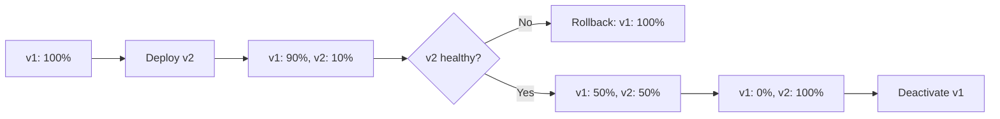

# Traffic Routing and Canary Deployment Lab

Practice blue-green deployments, canary releases, and traffic splitting between revisions.

## Scenario

- **Difficulty**: Intermediate
- **Estimated duration**: 30-40 minutes
- **Failure mode**: Traffic not shifting as expected, or bad revision receiving production traffic

## Prerequisites

- Azure CLI with Container Apps extension
- `curl` or similar HTTP client for testing

```bash
az extension add --name containerapp --upgrade
az login
```

## Quick Start

```bash
export RG="rg-aca-lab-traffic"
export LOCATION="koreacentral"

az group create --name "$RG" --location "$LOCATION"
az deployment group create --name "lab-traffic" --resource-group "$RG" --template-file ./labs/traffic-routing-canary/infra/main.bicep --parameters baseName="labtraffic"

export APP_NAME="$(az deployment group show --resource-group "$RG" --name "lab-traffic" --query "properties.outputs.containerAppName.value" --output tsv)"

cd labs/traffic-routing-canary
./trigger.sh
./verify.sh
./cleanup.sh
```

## Scenario Setup

This lab demonstrates traffic management scenarios:

1. Deploy v1 with 100% traffic
2. Deploy v2 as canary with 10% traffic
3. Gradually shift traffic to v2
4. Rollback when v2 shows errors
5. Complete cutover after validation



## Key Concepts

### Revision Modes

| Mode | Behavior | Use Case |
|---|---|---|
| Single | Only latest revision active | Simple deployments, no traffic splitting |
| Multiple | Multiple revisions can be active | Canary, blue-green, A/B testing |

### Traffic Weight Rules

- Weights must sum to 100 (or use `latestRevision: true`)
- Minimum weight is 0 (no traffic)
- `latestRevision: true` auto-routes to newest revision

## Step-by-Step Walkthrough

1. **Deploy baseline app (v1)**

   ```bash
   export RG="rg-aca-lab-traffic"
   export LOCATION="koreacentral"
   az group create --name "$RG" --location "$LOCATION"

   az deployment group create \
     --name "lab-traffic" \
     --resource-group "$RG" \
     --template-file "./labs/traffic-routing-canary/infra/main.bicep" \
     --parameters baseName="labtraffic"

   export APP_NAME="$(az deployment group show --resource-group "$RG" --name "lab-traffic" --query "properties.outputs.containerAppName.value" --output tsv)"
   ```

2. **Verify v1 receives 100% traffic**

   ```bash
   az containerapp revision list --name "$APP_NAME" --resource-group "$RG" --output table
   ```

   Expected output:

   ```text
   Name                    Active    TrafficWeight    HealthState
   ----------------------  --------  ---------------  -----------
   ca-labtraffic--v1       True      100              Healthy
   ```

3. **Deploy v2 with 0% traffic (dark launch)**

   ```bash
   az containerapp update \
     --name "$APP_NAME" \
     --resource-group "$RG" \
     --image "mcr.microsoft.com/azuredocs/containerapps-helloworld:v2" \
     --revision-suffix "v2"
   ```

   Then set traffic split:

   ```bash
   az containerapp ingress traffic set \
     --name "$APP_NAME" \
     --resource-group "$RG" \
     --revision-weight "ca-labtraffic--v1=100" "ca-labtraffic--v2=0"
   ```

4. **Enable canary: shift 10% to v2**

   ```bash
   az containerapp ingress traffic set \
     --name "$APP_NAME" \
     --resource-group "$RG" \
     --revision-weight "ca-labtraffic--v1=90" "ca-labtraffic--v2=10"
   ```

5. **Test traffic distribution**

   ```bash
   export APP_FQDN="$(az containerapp show --name "$APP_NAME" --resource-group "$RG" --query "properties.configuration.ingress.fqdn" --output tsv)"
   
   # Run 20 requests and count version distribution
   for i in {1..20}; do
     curl --silent "https://${APP_FQDN}/version" 
   done | sort | uniq -c
   ```

   Expected output pattern: ~18 v1, ~2 v2 (statistical variation expected).

6. **Direct access to specific revision (bypass traffic split)**

   ```bash
   # Access v2 directly for testing
   curl --silent "https://ca-labtraffic--v2.${APP_FQDN#*.}/health"
   ```

7. **Simulate v2 failure and rollback**

   If v2 shows errors:

   ```bash
   az containerapp ingress traffic set \
     --name "$APP_NAME" \
     --resource-group "$RG" \
     --revision-weight "ca-labtraffic--v1=100" "ca-labtraffic--v2=0"
   ```

8. **Complete cutover to v2 (if healthy)**

   ```bash
   az containerapp ingress traffic set \
     --name "$APP_NAME" \
     --resource-group "$RG" \
     --revision-weight "ca-labtraffic--v1=0" "ca-labtraffic--v2=100"
   ```

9. **Deactivate old revision**

   ```bash
   az containerapp revision deactivate \
     --name "$APP_NAME" \
     --resource-group "$RG" \
     --revision "ca-labtraffic--v1"
   ```

## Symptoms / Cause / Fix Matrix

| What you see | What is happening | How to fix |
|---|---|---|
| Traffic not splitting as expected | Revision mode is `Single` | Set `--revision-mode multiple` |
| New revision not receiving traffic | Traffic weight is 0 or not set | Explicitly set traffic weight |
| Old revision still active after cutover | Revision not deactivated | Deactivate or let auto-deactivate after 0 traffic |
| 502 errors during traffic shift | New revision not healthy | Wait for health probes to pass before shifting traffic |
| Weights don't sum to 100 | Invalid configuration | Ensure weights sum to 100 exactly |

## Traffic Inspection Commands

```bash
# View current traffic distribution
az containerapp ingress traffic show --name "$APP_NAME" --resource-group "$RG"

# List all revisions with traffic weights
az containerapp revision list --name "$APP_NAME" --resource-group "$RG" --output table

# Check revision health
az containerapp revision show --name "$APP_NAME" --resource-group "$RG" --revision "<revision-name>" --query "properties.healthState"
```

## Resolution Verification Checklist

1. Traffic weights sum to 100
2. Target revision shows `Healthy` state
3. Requests distribute according to configured weights
4. Direct revision access works for testing
5. Old revisions deactivated after cutover

## Expected Evidence

### During Canary

| Evidence Source | Expected State |
|---|---|
| `az containerapp ingress traffic show` | v1: 90%, v2: 10% |
| Request distribution test | ~90% v1, ~10% v2 |
| Both revisions | `Active: True`, `Healthy` |

### After Complete Cutover

| Evidence Source | Expected State |
|---|---|
| `az containerapp ingress traffic show` | v2: 100% |
| Old revision | `Active: False` or deactivated |
| All requests | Served by v2 |

## Clean Up

```bash
az group delete --name "$RG" --yes --no-wait
```

## Related Playbook

- [Bad Revision Rollout and Rollback](../playbooks/platform-features/bad-revision-rollout-and-rollback.md)

## See Also

- [Revision Failover Lab](./revision-failover.md)
- [Revision Provisioning Failure Lab](./revision-provisioning-failure.md)

## Sources

- [Traffic splitting in Azure Container Apps](https://learn.microsoft.com/azure/container-apps/traffic-splitting)
- [Revisions in Azure Container Apps](https://learn.microsoft.com/azure/container-apps/revisions)
- [Blue-green deployment for Azure Container Apps](https://learn.microsoft.com/azure/container-apps/blue-green-deployment)
