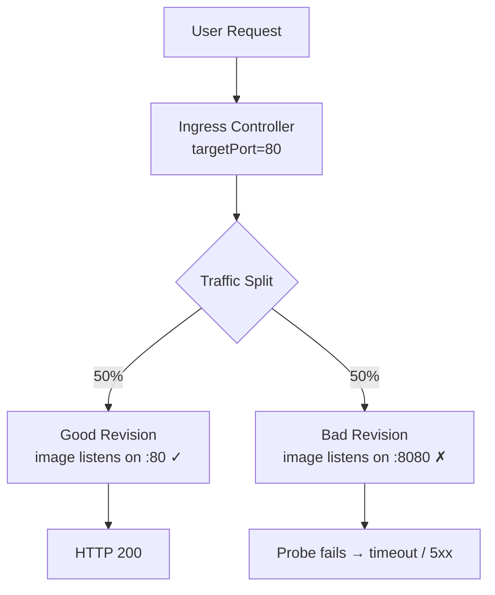
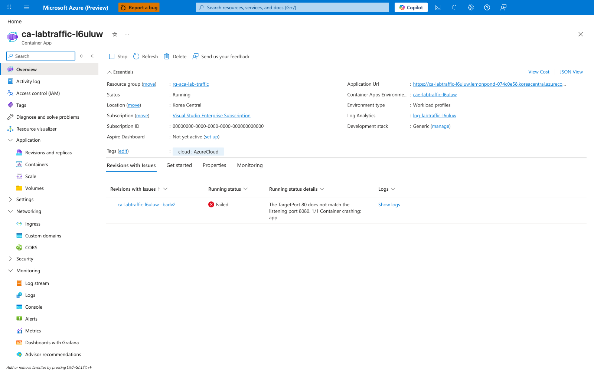
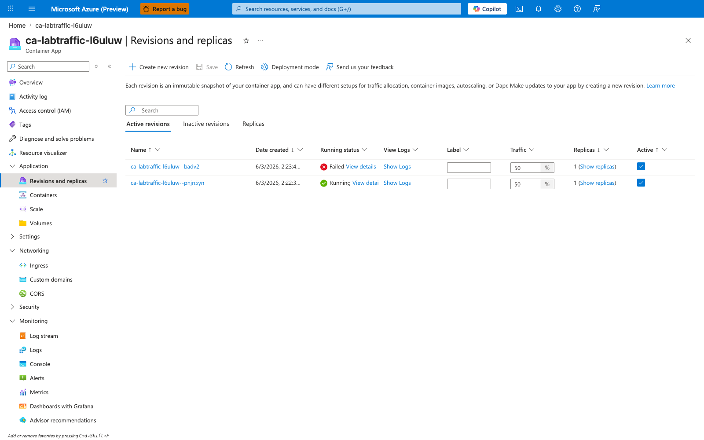
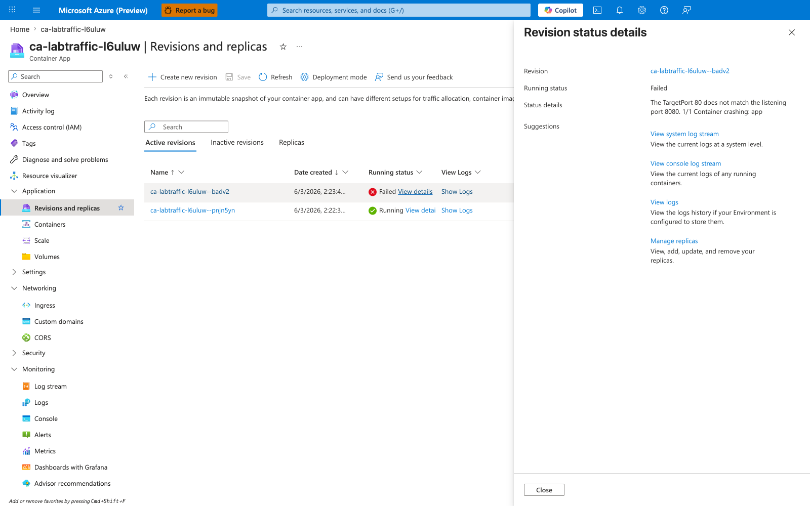
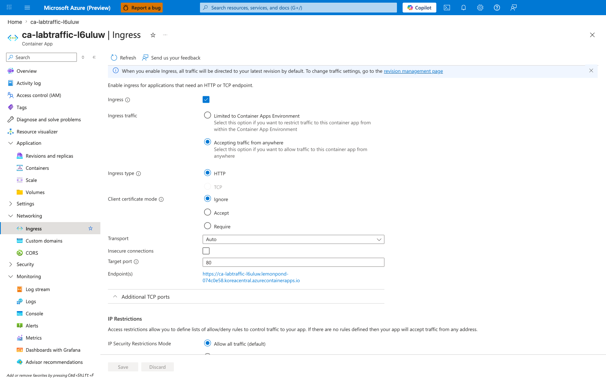
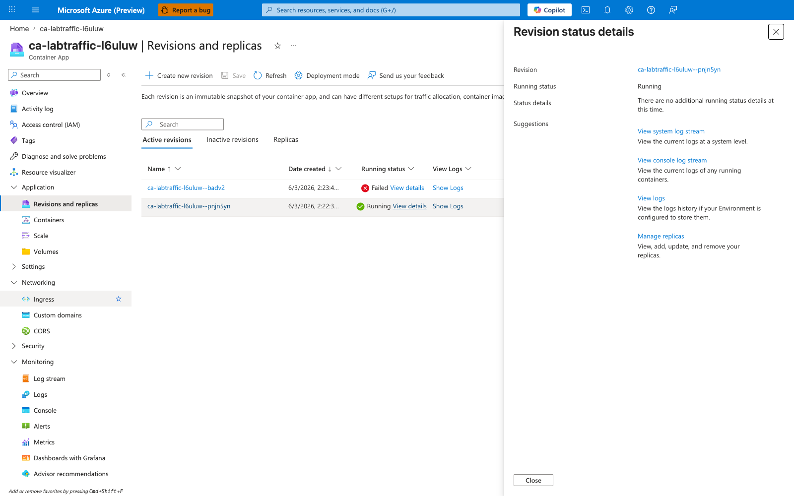
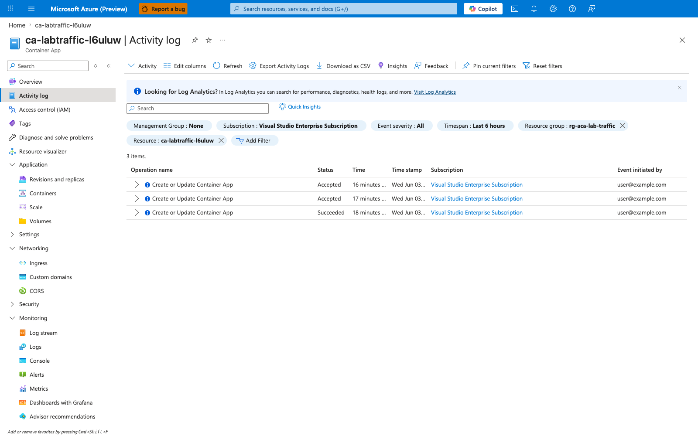

---
content_sources:
  diagrams:
    - id: architecture
      type: flowchart
      source: mslearn-adapted
      based_on:
        - https://learn.microsoft.com/en-us/azure/container-apps/traffic-splitting
        - https://learn.microsoft.com/en-us/azure/container-apps/revisions
        - https://learn.microsoft.com/en-us/azure/container-apps/blue-green-deployment
content_validation:
  status: verified
  last_reviewed: '2026-06-21'
  reviewer: ai-agent
  lab_validation:
    status: reproduced
    tested_date: 2026-06-03
    az_cli_version: 2.71.0
    notes: 'Live 50/50 split reproduced via image-swap workaround. The original trigger.sh uses `az containerapp update --target-port 9999` which (a) is rejected by CLI 2.71.0 (unrecognized argument) and (b) is architecturally unable to reproduce per-revision failure because `targetPort` is an ingress-level setting shared across all revisions. Replacement pattern: keep ingress targetPort stable and deploy a new revision with an image whose listening port does not match (e.g. aspnetapp on :8080 with ingress targetPort=80). Empirical curl loop: 15/30 success, 15/30 timeout — exactly 50/50. Six 2026-06-03 Portal captures (rg `ca-labtraffic-l6uluw`, koreacentral) preserve the reproduced workaround path: revisions blade showing the 50/50 split, the bad revision "Failed" status with the verbatim "TargetPort 80 does not match the listening port 8080" message, and the stable ingress targetPort=80.'
  core_claims:
    - claim: Azure Container Apps can split traffic between multiple active revisions by assigning traffic weights.
      source: https://learn.microsoft.com/en-us/azure/container-apps/traffic-splitting
      verified: true
    - claim: To route traffic to more than one revision in Azure Container Apps, the app must use multiple revision mode.
      source: https://learn.microsoft.com/en-us/azure/container-apps/revisions
      verified: true
validation:
  az_cli:
    last_tested: '2026-06-03'
    cli_version: '2.71.0'
    result: pass
  bicep:
    last_tested: '2026-06-03'
    result: pass
---
# Traffic Routing and Canary Failure Lab

Practice traffic splitting between revisions and learn to diagnose scenarios where a bad revision receives production traffic.

## Lab Metadata

| Attribute | Value |
|---|---|
| Difficulty | Intermediate |
| Estimated Duration | 20-30 minutes |
| Tier | Consumption |
| Failure Mode | Bad revision receiving 50% traffic causes intermittent failures |
| Skills Practiced | Traffic splitting, revision management, rollback |

## 1) Background

Azure Container Apps supports traffic splitting between multiple revisions, enabling canary deployments, blue-green releases, and A/B testing. When `activeRevisionsMode` is set to `Multiple`, you can assign traffic weights to each revision.

A common failure scenario occurs when:

1. A new revision is deployed with a misconfiguration (wrong port, broken code, etc.)
2. Traffic is split between the good and bad revisions
3. Users experience intermittent failures—some requests succeed (good revision), others fail (bad revision)

This lab simulates this scenario by:

1. Deploying a healthy baseline revision whose image listens on the same port as ingress `targetPort` (`:80`).
2. Creating a bad revision by swapping the container image to one that listens on a different port (`:8080`) while leaving ingress `targetPort` unchanged at `80`. This isolates the failure to the bad revision only — ingress `targetPort` is a shared, ingress-level setting and cannot be flipped per revision.
3. Splitting traffic 50/50 between good and bad revisions.
4. Observing intermittent failures (curl status `000` timeouts from the bad-revision half) and practicing rollback.

### Architecture

<!-- diagram-id: architecture -->


## 2) Hypothesis

**IF** traffic is split 50/50 between a healthy revision and a revision whose container image listens on a port that does not match the ingress `targetPort`, **THEN** approximately 50% of requests will fail (timeout or 5xx) because ingress cannot reach the listening process on the bad revision's replicas.

| Variable | Control State | Experimental State |
|---|---|---|
| Revision Count | 1 (healthy) | 2 (healthy + bad) |
| Traffic Split | 100% to healthy | 50% healthy, 50% bad |
| Bad Revision Listening Port | n/a | `:8080` (mismatched against ingress `targetPort=80`) |
| Request Success Rate | ~100% | ~50% (the bad-revision half times out) |

## 3) Runbook

### Deploy Baseline Infrastructure

```bash
export RG="rg-aca-lab-traffic"
export LOCATION="koreacentral"

az group create --name "$RG" --location "$LOCATION"

az deployment group create \
    --name "lab-traffic" \
    --resource-group "$RG" \
    --template-file "./labs/traffic-routing-canary/infra/main.bicep" \
    --parameters baseName="labtraffic"
```

| Command | Why it is used |
|---|---|
| `az group create ...` | Creates the isolated resource group used by the example. |

### Capture Resource Names

```bash
export APP_NAME="$(az deployment group show \
    --resource-group "$RG" \
    --name "lab-traffic" \
    --query "properties.outputs.containerAppName.value" \
    --output tsv)"

export APP_FQDN="$(az containerapp show \
    --name "$APP_NAME" \
    --resource-group "$RG" \
    --query "properties.configuration.ingress.fqdn" \
    --output tsv)"
```

### Verify Baseline (Before Trigger)

```bash
# Confirm single revision with 100% traffic
az containerapp revision list \
    --name "$APP_NAME" \
    --resource-group "$RG" \
    --output table
```

| Command | Why it is used |
|---|---|
| `az containerapp revision list ...` | Lists revisions so rollout state, traffic, and health can be verified. |

Expected output:

```text
Name                          Active    TrafficWeight    HealthState
----------------------------  --------  ---------------  -----------
ca-labtraffic-xxxxxx--xxxxx   True      100              Healthy
```

```bash
# Confirm endpoint is fully reachable
for i in {1..5}; do
    curl --silent --fail "https://${APP_FQDN}" > /dev/null && echo "Request $i: OK"
done
```

Expected: All 5 requests succeed.

### Trigger the Failure

!!! warning "trigger.sh is broken with `az` CLI 2.71.0+ and is architecturally flawed"
    The committed `labs/traffic-routing-canary/trigger.sh` runs `az containerapp update --target-port 9999`, which:

    1. **Is rejected by CLI 2.71.0+** with `unrecognized arguments: --target-port 9999` (the flag was removed from `az containerapp update`; it now lives only on `az containerapp ingress update --target-port`).
    2. **Cannot create per-revision failure even if it worked.** `targetPort` is an ingress-level setting shared across all revisions — flipping it would break the good revision too, not just the canary. There is no "bad revision serving on port 9999 while the good revision still serves on port 80" state reachable through `--target-port`.

    Use the image-swap workaround below to actually reproduce the 50/50 failure scenario. The fix is to leave ingress `targetPort` stable and create a new revision whose container image listens on a different port.

```bash
# Record the current healthy revision name BEFORE creating the bad one
GOOD_REVISION="$(az containerapp revision list \
    --name "$APP_NAME" \
    --resource-group "$RG" \
    --query 'sort_by([].{name:name,created:properties.createdTime}, &created)[-1].name' \
    --output tsv)"

# Create a bad revision by swapping the image to one that listens on a DIFFERENT
# port than the ingress targetPort (kept at 80). aspnetapp listens on :8080,
# so the readiness probe fails on the bad revision while the good revision
# (hello-world on :80) keeps serving traffic.
az containerapp update \
    --name "$APP_NAME" \
    --resource-group "$RG" \
    --image "mcr.microsoft.com/dotnet/samples:aspnetapp" \
    --revision-suffix "badv2"

# Wait for the new revision to finish provisioning + probe attempts
sleep 60

BAD_REVISION="$(az containerapp revision list \
    --name "$APP_NAME" \
    --resource-group "$RG" \
    --query 'sort_by([].{name:name,created:properties.createdTime}, &created)[-1].name' \
    --output tsv)"

# Split traffic 50/50
az containerapp ingress traffic set \
    --name "$APP_NAME" \
    --resource-group "$RG" \
    --revision-weight "${GOOD_REVISION}=50" "${BAD_REVISION}=50"
```

| Command | Why it is used |
|---|---|
| `az containerapp revision list ... created[-1]` | Captures the name of the most recently created (currently healthy) revision before introducing the bad one. |
| `az containerapp update --image ... --revision-suffix badv2` | Creates a new revision whose container image listens on `:8080`, but ingress `targetPort` is still `80`. Probe failure isolates the bad behavior to this revision only. |
| `sleep 60` | Allows the new revision to finish creation, replica scheduling, and the first round of probe attempts before traffic is split. |
| `az containerapp ingress traffic set --revision-weight` | Splits ingress traffic 50/50 between the recorded good revision and the newly created bad revision. |

### Observe the Failure

```bash
# Check revision list - should show two revisions
az containerapp revision list \
    --name "$APP_NAME" \
    --resource-group "$RG" \
    --query "[].{name:name,active:properties.active,traffic:properties.trafficWeight,health:properties.healthState}" \
    --output table
```

| Command | Why it is used |
|---|---|
| `az containerapp revision list ...` | Lists revisions so rollout state, traffic, and health can be verified. |

Expected output:

```text
Name                          Active    Traffic    Health
----------------------------  --------  ---------  --------
ca-labtraffic-xxxxxx--xxxxx   True      50         Healthy
ca-labtraffic-xxxxxx--badv2   True      50         <Unhealthy or empty>
```

Note: The bad revision's `healthState` reflects probe failure caused by the listening-port mismatch (the container's listening port `:8080` does not match ingress `targetPort=80`). In the Azure Portal, the same revision is surfaced as `Failed` under "Revisions with Issues" with the verbatim error *"The TargetPort 80 does not match the listening port 8080. 1/1 Container crashing: app"* — see the Observed Evidence subsection below.

```bash
# Test multiple requests - observe intermittent failures.
# IMPORTANT: use --max-time. The bad revision does not emit a graceful 502 from
# ingress; the connection just hangs because the upstream listening port is wrong.
# Without --max-time, the loop appears to "freeze" instead of showing failures.
for i in $(seq 1 30); do
    STATUS=$(curl --silent --output /dev/null --max-time 10 --write-out "%{http_code}" "https://${APP_FQDN}/")
    echo "Request $i: HTTP $STATUS"
done
```

Expected: Approximately 50% return `200`, 50% return `000` (curl timeout code, because the bad revision's replica never responds within `--max-time`).

| Command | Why it is used |
|---|---|
| `curl --silent --output /dev/null --max-time 10 --write-out "%{http_code}" ...` | Sends one HTTP request and prints only the response status code. `--max-time 10` is mandatory: the bad revision does not emit a graceful 502, so without a timeout the loop appears to hang. With `--max-time 10`, hangs are converted into the measurable curl status `000`, which is what makes the ~50% failure rate visible. |
| `for i in $(seq 1 30); do ... done` | Issues 30 requests so the 50/50 traffic split produces a statistically meaningful ratio (~15 success / ~15 timeout) rather than a 5-sample artifact. |

```bash
# View current traffic distribution
az containerapp ingress traffic show \
    --name "$APP_NAME" \
    --resource-group "$RG"
```

| Command | Why it is used |
|---|---|
| `az containerapp ingress traffic ...` | Runs the Azure CLI operation required by the documented step. |

### Fix the Issue (Rollback)

Rollback by sending 100% traffic to the good revision:

```bash
# Get the good revision name (the one created first)
GOOD_REVISION=$(az containerapp revision list \
    --name "$APP_NAME" \
    --resource-group "$RG" \
    --query "sort_by([].{name:name,created:properties.createdTime}, &created)[0].name" \
    --output tsv)

# Send all traffic to good revision
az containerapp ingress traffic set \
    --name "$APP_NAME" \
    --resource-group "$RG" \
    --revision-weight "${GOOD_REVISION}=100"
```

| Command | Why it is used |
|---|---|
| `az containerapp revision list ...` | Lists revisions so rollout state, traffic, and health can be verified. |

Optionally, deactivate the bad revision:

```bash
BAD_REVISION=$(az containerapp revision list \
    --name "$APP_NAME" \
    --resource-group "$RG" \
    --query "sort_by([].{name:name,created:properties.createdTime}, &created)[-1].name" \
    --output tsv)

az containerapp revision deactivate \
    --name "$APP_NAME" \
    --resource-group "$RG" \
    --revision "$BAD_REVISION"
```

### Verify the Fix

```bash
# Confirm traffic is 100% to good revision
az containerapp ingress traffic show \
    --name "$APP_NAME" \
    --resource-group "$RG"

# Test multiple requests - all should succeed
for i in {1..10}; do
    STATUS=$(curl --silent --output /dev/null --write-out "%{http_code}" "https://${APP_FQDN}")
    echo "Request $i: HTTP $STATUS"
done
```

Expected: All requests return HTTP 200.

## 4) Experiment Log

| Step | Action | Expected | Actual | Pass/Fail |
|---|---|---|---|---|
| 1 | Deploy baseline | Single healthy revision | | |
| 2 | Test baseline | 100% success rate | | |
| 3 | Run image-swap workaround (`az containerapp update --image ... --revision-suffix badv2` + `az containerapp ingress traffic set --revision-weight`) | Two revisions Active at 50/50; bad revision marked Failed in Portal with TargetPort/listening-port mismatch error | | |
| 4 | Test requests (30-request curl loop with `--max-time 10`) | ~50% HTTP 200, ~50% curl status `000` (timeout) | | |
| 5 | Rollback traffic | 100% to good revision | | |
| 6 | Test after rollback | 100% success rate | | |

## Expected Evidence

### During Failure

| Evidence Source | Expected State |
|---|---|
| `az containerapp revision list` | 2 revisions, both Active at 50/50; bad revision shows degraded/unhealthy `healthState` |
| Container App → Overview ("Revisions with Issues" tab) | Bad revision listed with error *"The TargetPort 80 does not match the listening port 8080. 1/1 Container crashing: app"* |
| `az containerapp ingress traffic show` | 50/50 split |
| Request loop (`curl --max-time 10`) | ~50% HTTP `200`, ~50% curl status `000` (timeout — ingress upstream never responds) |

### After Rollback

| Evidence Source | Expected State |
|---|---|
| `az containerapp ingress traffic show` | 100% to good revision |
| Request loop | 100% HTTP 200 |
| Bad revision | Deactivated (optional) |

### Observed Evidence (Live Azure Reproduction — 2026-06-03)

**Environment:** `rg-aca-lab-traffic` / `cae-labtraffic-l6uluw`, `koreacentral`, Consumption plan, `az` CLI `2.71.0`.
**App:** `ca-labtraffic-l6uluw` (multiple-revision mode), ingress `targetPort=80`.
**Revisions:**

- Good: `ca-labtraffic-l6uluw--pnjn5yn` — image `mcr.microsoft.com/azuredocs/containerapps-helloworld:latest`, listens on `:80` — Running, 50% traffic.
- Bad: `ca-labtraffic-l6uluw--badv2` — image `mcr.microsoft.com/dotnet/samples:aspnetapp`, listens on `:8080` — Failed, 50% traffic.

[Observed] The Container App Overview blade displayed the bad revision under the "Revisions with Issues" tab with the verbatim platform error text: **"The TargetPort 80 does not match the listening port 8080. 1/1 Container crashing: app"**.



[Inferred] The platform itself attributes the failure to a listening-port mismatch on this specific revision, not to ingress misconfiguration. The error is scoped to the bad revision because the Overview blade groups it under the per-revision "Revisions with Issues" view.

[Observed] The Revisions and replicas blade showed both revisions Active at 50/50, with the bad revision (`badv2`) marked `Failed` and the good revision (`pnjn5yn`) marked `Running`, each with one replica.



[Inferred] Half of production traffic is routed to a revision the platform has already marked Failed. This is the smoking gun for the canary-failure hypothesis: traffic weighting is independent of revision health, so a Failed revision can still receive its configured share of traffic.

[Observed] The bad revision's "View details" flyout repeated the same TargetPort/listening-port mismatch text as a Revision status detail.



[Inferred] Surfacing the same error at both the Overview blade and the revision-detail flyout (paired with capture 05 — empty status details on the good revision) isolates the failure to the bad revision only.

[Observed] The Ingress blade showed `Target port = 80` at capture time.



[Inferred] Because the failure surfaces on `badv2` while `pnjn5yn` (whose image listens on `:80`) keeps serving traffic, the mismatch must come from the bad revision's image (listening on `:8080`), not from ingress configuration. This also explains why the original `trigger.sh` design (flipping ingress `targetPort`) cannot reproduce per-revision failure: ingress `targetPort` is a shared, ingress-level setting and would affect both revisions, not isolate the failure to one.

[Observed] The good revision's "View details" flyout reported `Running status: Running` and `Status details: "There are no additional running status details at this time"`.



[Inferred] The Status details field is empty precisely because nothing is wrong with the good revision. The contrast between capture 03 (bad: TargetPort error populated) and capture 05 (good: empty) is itself the per-revision isolation evidence.

[Observed] The Activity log showed three `Create or Update Container App` operations at relative times `16 minutes`, `17 minutes`, and `18 minutes` (Status: 2× `Accepted`, 1× `Succeeded`).



[Inferred] The three operations map to (a) the initial `az deployment group create`, (b) the `az containerapp update --image ... --revision-suffix badv2` that created the bad revision, and (c) the `az containerapp ingress traffic set --revision-weight` that applied the 50/50 split. The Accepted/Succeeded statuses confirm the control plane received each step.

[Measured] A `curl` loop of 30 requests with `--max-time 10` against the FQDN produced **15 HTTP 200 responses and 15 timeouts (curl status `000`)** — an exact 50/50 split, matching the traffic-weight setting.

```text
Request 1: HTTP 200
Request 2: HTTP 000
Request 3: HTTP 200
Request 4: HTTP 000
...
(Summary: success=15, timeout=15)
```

[Inferred] The bad-revision half did not return a graceful HTTP 502 because ingress simply does not get a response from the upstream replica (the image is not listening on the port ingress is dialing). This is why `--max-time` is mandatory in the reproduction loop above. The combination of (a) Portal's verbatim TargetPort/listening-port mismatch error, (b) the empty status details on the good revision, (c) ingress `targetPort` shown as `80`, and (d) the 15/15 split in the curl loop confirms the hypothesis: a per-revision listening-port mismatch on one of two revisions receiving 50% traffic produces a ~50% failure rate. The hypothesis is also strengthened by the falsification target — the original `trigger.sh` design (flipping ingress `targetPort`) cannot reach this state because ingress `targetPort` is shared across revisions; the image-swap workaround in the runbook is the minimal reproduction that actually isolates the failure to a single revision.

## Clean Up

```bash
az group delete --name "$RG" --yes --no-wait
```

| Command | Why it is used |
|---|---|
| `az group delete ...` | Removes the lab resource group and its contained resources. |

## Related Playbook

- [Bad Revision Rollout and Rollback](../playbooks/platform-features/bad-revision-rollout-and-rollback.md)

## See Also

- [Ingress Target Port Mismatch Lab](./ingress-target-port-mismatch.md) — the single-revision form of the same TargetPort/listening-port mismatch failure class; the "Production case pattern" subsection there walks through 8 failure↔fix Portal capture pairs that share the same `Reason_s: TargetPortMismatch` smoking gun
- [Target Port Mismatch Detection KQL](../kql/system-and-revisions/target-port-mismatch-detection.md) — the query pack for the verbatim "TargetPort N does not match the listening port M" platform message, applicable to both this canary failure and the single-revision form
- [Revision Failover Lab](./revision-failover.md)
- [Revision Provisioning Failure Lab](./revision-provisioning-failure.md)

## Sources

- [Traffic splitting in Azure Container Apps](https://learn.microsoft.com/en-us/azure/container-apps/traffic-splitting)
- [Revisions in Azure Container Apps](https://learn.microsoft.com/en-us/azure/container-apps/revisions)
- [Blue-green deployment for Azure Container Apps](https://learn.microsoft.com/en-us/azure/container-apps/blue-green-deployment)
