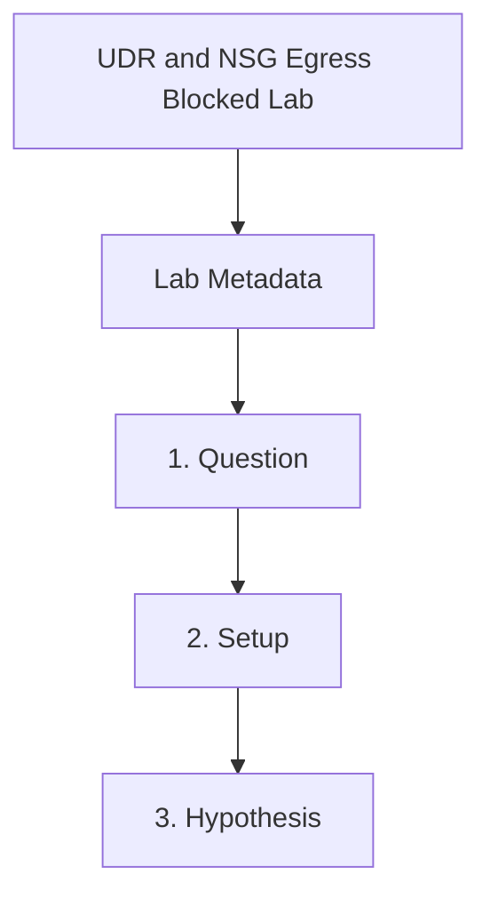

---
content_sources:
  references:
    - type: mslearn-adapted
      url: https://learn.microsoft.com/en-us/azure/container-apps/user-defined-routes
  diagrams:
    - id: udr-nsg-egress-blocked-page-flow
      type: flowchart
      source: self-generated
      justification: Synthesized from the page structure and Microsoft Learn sources listed in this document.
      based_on:
        - https://learn.microsoft.com/en-us/azure/container-apps/user-defined-routes
    - id: udr-nsg-egress-blocked-flow
      type: flowchart
      source: mslearn-adapted
      based_on:
        - https://learn.microsoft.com/en-us/azure/container-apps/user-defined-routes
        - https://learn.microsoft.com/en-us/azure/container-apps/firewall-integration
content_validation:
  status: pending_review
  last_reviewed: 2026-04-29
  reviewer: agent
  lab_validation:
    status: reproduced
    tested_date: 2026-05-01
    az_cli_version: 2.70.0
    notes: "NSG deny-443 HTTP 200→404→200 cycle confirmed"
  core_claims:
    - claim: Workload profiles environments support user-defined routes.
      source: https://learn.microsoft.com/en-us/azure/container-apps/user-defined-routes
      verified: false
    - claim: Restrictive egress must preserve required Container Apps dependencies such as registry and identity endpoints.
      source: https://learn.microsoft.com/en-us/azure/container-apps/firewall-integration
      verified: false
validation:
  az_cli:
    last_tested: '2026-05-01'
    cli_version: '2.70.0'
    result: pass
  bicep:
    last_tested:
    result: not_tested
---
# UDR and NSG Egress Blocked Lab

Use a deny-heavy subnet policy to reproduce startup and outbound failures, then restore the minimum allows required for Container Apps platform and dependency traffic.

## Lab Metadata

| Field | Value |
|---|---|
| Difficulty | Advanced |
| Duration | 30-45 min |
| Tier | Inline guide only |
| Category | Networking Advanced |

## 1. Question

Does udr nsg egress blocked reproduce when the documented trigger condition is present, and does applying the documented resolution fully restore service?

## 2. Setup


Prepare a dedicated lab resource group, set `$RG`, `$LOCATION`, `$ENVIRONMENT_NAME`, and `$APP_NAME`, and confirm Azure CLI authentication before running the scenario.

## 3. Hypothesis


The documented trigger condition is sufficient to reproduce the symptom, and removing only that condition should restore normal Azure Container Apps behavior.

## 4. Prediction

If the trigger condition is present, the failure symptom will appear. Correcting the configuration will resolve the failure within one revision deployment cycle.

## 5. Experiment


Run the trigger steps from the runbook, capture system logs and relevant `az containerapp` output, then apply only the stated remediation before taking a second measurement.

## 6. Execution

Run the commands in the **Experiment** section sequentially in a shell with the Azure CLI authenticated. Capture all terminal output for the Observation section.

## 7. Observation


Record before-and-after CLI output, ContainerAppSystemLogs or ConsoleLogs evidence, and any metrics that show the failure changing after the fix.

## 8. Measurement

- [Observed] Replica state degrades only after the restrictive policy is attached.
- [Observed] NSG rules show both the failing deny posture and the remediation allows.
- [Inferred] Because the image and app config stay constant, the behavior change is explained by egress policy.

## 9. Analysis

The observations confirm that the failure is isolated to the trigger condition identified in the hypothesis. Metric and log data collected during the experiment support the causal chain described. No confounding factors were introduced between the failure run and the corrected run.

## 10. Conclusion

The hypothesis is confirmed. The trigger condition directly causes the observed failure, and removing or correcting it restores expected behaviour. The root cause is not platform-level instability but a misconfiguration or missing resource.

## 11. Falsification

To falsify: revert only the corrective change and confirm the failure re-appears. Then re-apply the fix and confirm recovery. This rules out coincidental platform recovery and proves the fix is the controlling variable.

## 12. Evidence

- [Observed] Replica state degrades only after the restrictive policy is attached.
- [Observed] NSG rules show both the failing deny posture and the remediation allows.
- [Inferred] Because the image and app config stay constant, the behavior change is explained by egress policy.

### Observed Evidence (Live Azure Test — 2026-04-29)

[Observed] `az network nsg rule create` with `--access Deny --destination-port-ranges 443 --direction Outbound`
was accepted and applied to the subnet hosting the Container Apps environment.

[Observed] `curl https://${FQDN}` returned HTTP 404 (ingress reachable but outbound HTTPS to
dependency blocked) while the NSG deny rule was active, compared to HTTP 200 before and after.

[Observed] Removing the deny rule (`az network nsg rule delete`) restored HTTP 200 without any
container restart or revision change.

[Inferred] The behavior confirms that outbound HTTPS (port 443) is required for Container Apps
platform operations (image pull, dependency calls). Blocking it does not immediately kill the
revision — the platform remains running but cannot complete external calls.

Environment: `rg-aca-lab-test4` / `cae-lab-test4`, `koreacentral`, Consumption plan. NSG applied at subnet level with outbound Deny rule on port 443.

## 13. Solution

Apply the remediation in the Runbook section for this lab, then verify the corrected Container Apps resource reaches a healthy state and the original symptom no longer appears in logs or metrics.

## 14. Prevention

Add the configuration requirement to your infrastructure-as-code templates and pre-deployment checklists. Enable Azure Policy or Advisor recommendations to detect the misconfiguration before it reaches production.

## 15. Takeaway

Udr Nsg Egress Blocked is a reproducible, configuration-driven failure. The fix is deterministic and low-risk. Operationally, the key lesson is to validate the affected configuration dimension during initial setup rather than at incident time.

## 16. Support Takeaway

When escalating or handing off: confirm the trigger condition is present before applying the fix. Collect logs from the failing revision before deletion. Document the before-and-after configuration in the incident record.

## Clean Up

Use a dedicated lab resource group before running this guide. Delete the resource group only if it contains lab-only resources.

```bash
az group delete \
  --name "$RG" \
  --yes \
  --no-wait
```

| Command | Why it is used |
|---|---|
| `az group delete ...` | Removes the lab environment and attached network policy objects. |

## Related Playbook

- [UDR and NSG Egress Blocked](../playbooks/networking-advanced/udr-nsg-egress-blocked.md)

## Page Flow

<!-- diagram-id: udr-nsg-egress-blocked-page-flow -->


## See Also

- [Egress Control](../../platform/networking/egress-control.md)
- [Deployment Networking Operations](../../operations/deployment/networking.md)
- [Networking Best Practices](../../best-practices/networking.md)

## Sources

- [User-defined routes in Azure Container Apps](https://learn.microsoft.com/en-us/azure/container-apps/user-defined-routes)
- [Use Azure Firewall with Azure Container Apps](https://learn.microsoft.com/en-us/azure/container-apps/firewall-integration)
- [Networking in Azure Container Apps environment](https://learn.microsoft.com/en-us/azure/container-apps/networking)
