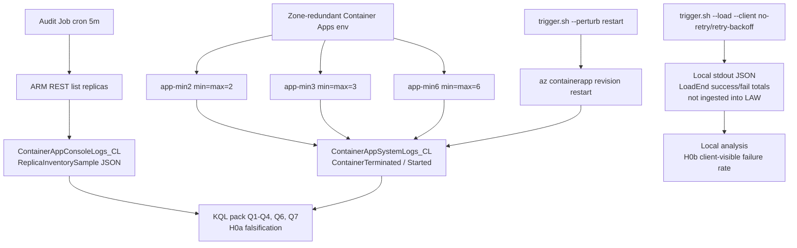
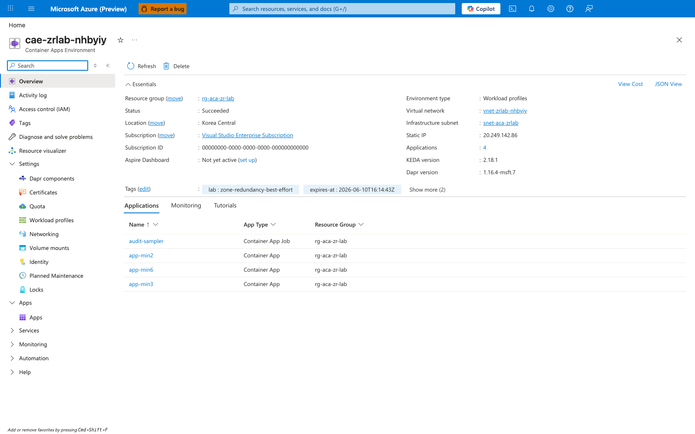
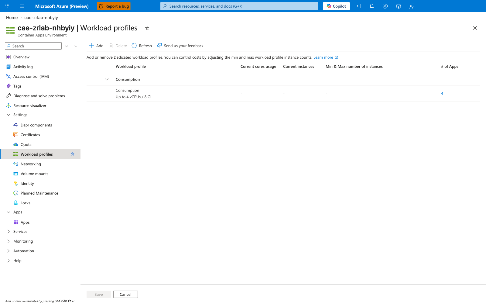
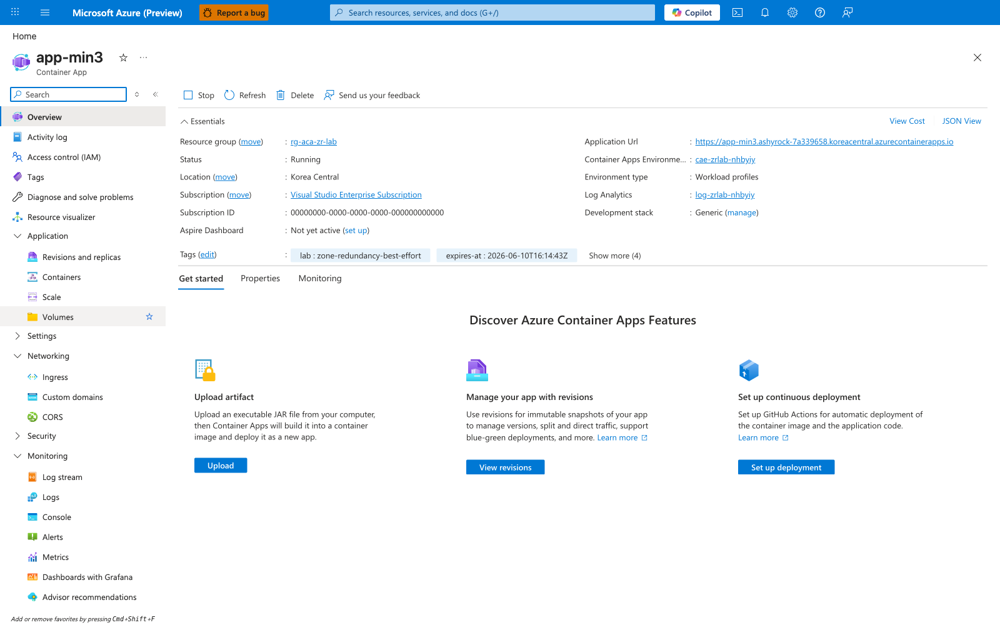
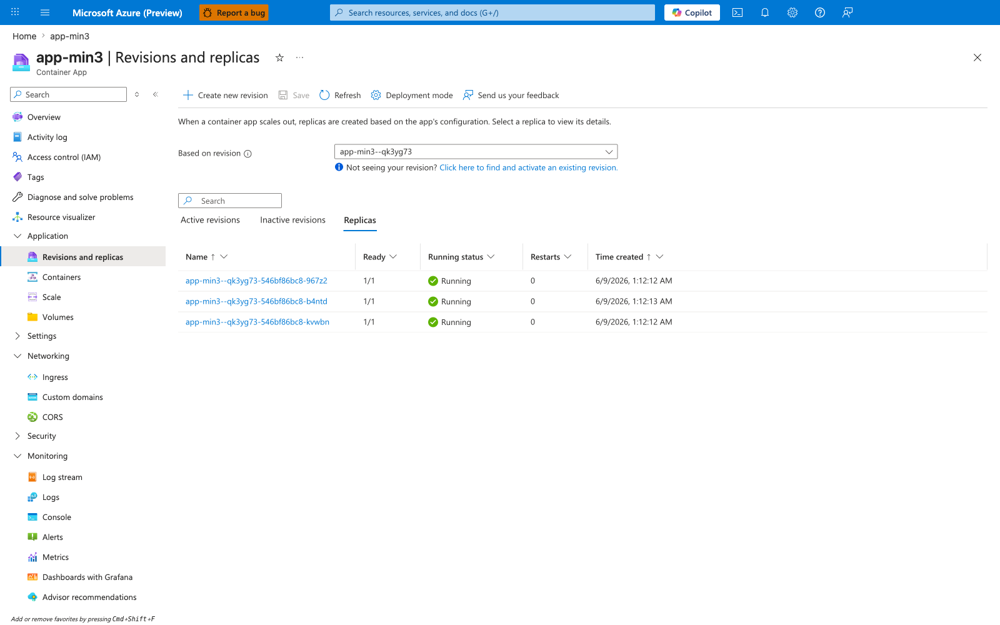
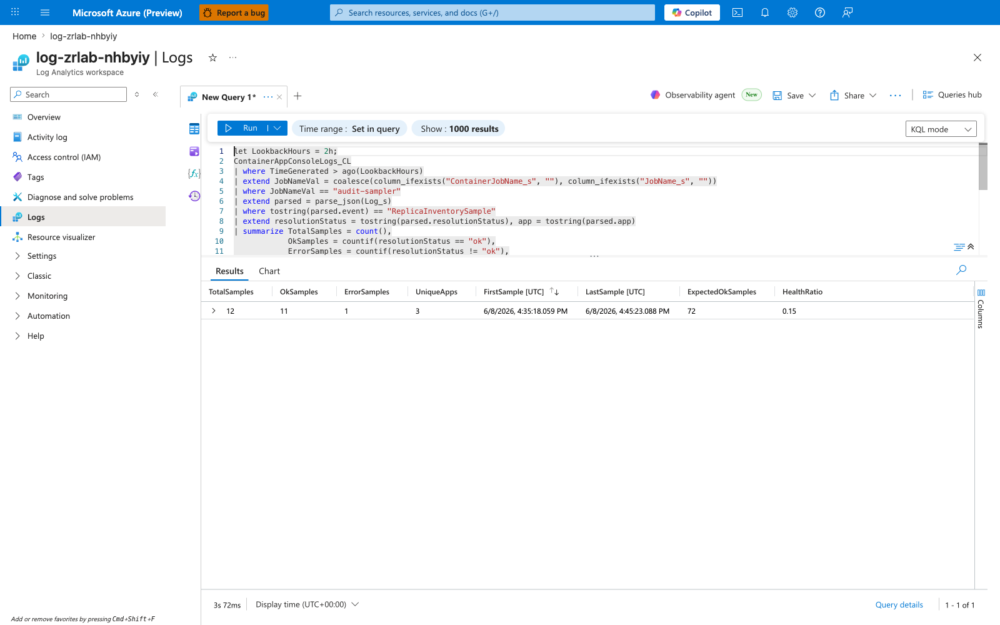
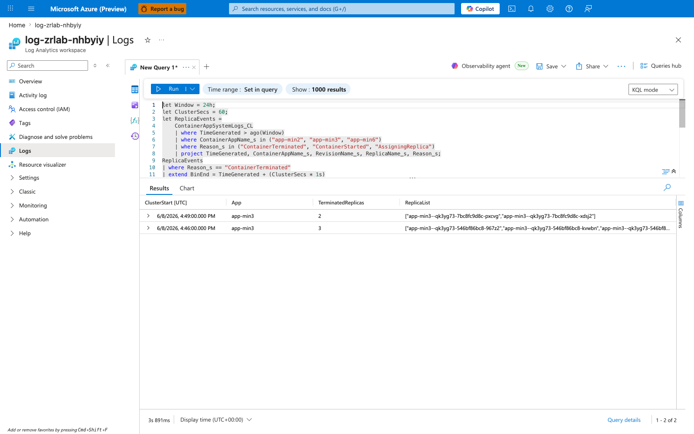
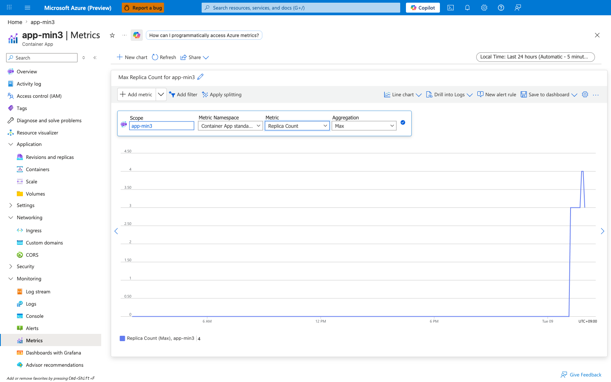

---
content_sources:
  references:
    - type: mslearn-adapted
      url: https://learn.microsoft.com/en-us/azure/reliability/reliability-container-apps
    - type: mslearn-adapted
      url: https://learn.microsoft.com/en-us/azure/container-apps/how-to-zone-redundancy
    - type: mslearn-adapted
      url: https://learn.microsoft.com/en-us/azure/container-apps/planned-maintenance
  diagrams:
    - id: experiment-architecture
      type: flowchart
      source: self-generated
      justification: "No single MS Learn diagram describes a parallel-min audit topology with deterministic perturbation. Synthesized from the reliability and zone-redundancy articles."
      based_on:
        - https://learn.microsoft.com/en-us/azure/reliability/reliability-container-apps
        - https://learn.microsoft.com/en-us/azure/container-apps/how-to-zone-redundancy
content_validation:
  status: verified
  last_reviewed: '2026-06-26'
  reviewer: agent
  lab_validation:
    status: reproduced
    tested_date: '2026-06-14'
    az_cli_version:
    notes: 'Full reproduction completed 2026-06-12 → 2026-06-14 (koreacentral, RG rg-aca-zr-lab-260612114313). 24-hour baseline window 2026-06-12T11:51:46Z → 2026-06-13T11:51:46Z passed with BaselineChurnEvents=0 across all 3 apps (Q3 returned zero rows; Q2 SteadyStateOK=True for app-min2/app-min3/app-min6). H0a NOT falsified. Three perturbation variants (restart-only, combined no-retry 180s, combined retry-backoff 180s) executed 2026-06-14T11:04–11:31Z against app-min3; 0/1950 client-visible failures across the two load-bearing variants (H0b NOT falsified under this load profile). Q7 captured MaxReplacementFraction=1.0 on app-min3 (operator restart can momentarily replace all 3 replicas). Raw evidence corpus committed under labs/zone-redundancy-best-effort/evidence/. Claim 2 (zone distribution) remains capped at [Strongly Suggested] because ACA does not expose per-replica AZ identity; Claim 3 (multi-replica platform events) remains capped at [Strongly Suggested] because no platform-driven clustered churn was observed in the 24h baseline. Phase B evidence pack added 2026-06-26: verify.sh now emits a 4-gate bounded-coverage overlay from the committed raw corpus without any fresh Azure deployment.'
  core_claims:
    - claim: Container Apps zone redundancy distributes replicas across Availability Zones on a best-effort basis subject to host capacity and resource requests.
      source: https://learn.microsoft.com/en-us/azure/container-apps/how-to-zone-redundancy
      verified: true
    - claim: Container Apps may restart replicas during planned platform maintenance windows.
      source: https://learn.microsoft.com/en-us/azure/container-apps/planned-maintenance
      verified: true
    - claim: Azure Container Apps does not expose per-replica Availability Zone placement through the management plane.
      source: https://learn.microsoft.com/en-us/azure/container-apps/containers
      verified: true
validation:
  az_cli:
    last_tested: '2026-06-14'
    cli_version:
    result: pass
  bicep:
    last_tested: '2026-06-14'
    result: pass
---
# Zone Redundancy Is Best-Effort Lab

Test the operator assumption that `zoneRedundant=true` plus `minReplicas=N` guarantees `N` replicas land in `N` Availability Zones. Statistically falsify or confirm the platform's behavior using parallel multi-min deployments and a deterministic perturbation control.

## Lab Metadata

| Field | Value |
|---|---|
| Difficulty | Advanced |
| Duration | 8-26 hours (24 h primary baseline + perturbation runs) |
| Tier | Workload profiles (Consumption profile inside a zone-redundant environment) |
| Category | Reliability / Platform behavior |
| Failure Mode | Clustered multi-replica churn within a 60-second window for a single app |
| Skills Practiced | Pre-registered hypothesis testing, KQL analysis, perturbation control, Bicep, retry-budget measurement |

<!-- diagram-id: experiment-architecture -->


## 1. Question

**Does a zone-redundant Container Apps environment, configured with `minReplicas == maxReplicas == N` and explicit resource requests, produce clustered multi-replica churn events for the same app over a 24-hour baseline window without operator action — and when those events occur, do they correlate with client-visible 503 failures?**

The question is framed as two pre-registered hypotheses (Section 3) so the lab is falsifiable from observation alone, not from interpretation.

## 2. Setup

### Region selection

Pick a region that supports **both** Container Apps workload profiles **and** Availability Zones. Verified options: `koreacentral`, `eastus`, `westeurope`, `japaneast`. Cross-check the current matrix in [Reliability in Azure Container Apps](https://learn.microsoft.com/en-us/azure/reliability/reliability-container-apps#regional-availability) before deploying.

### Required environment variables

```bash
export RG="rg-aca-zr-lab"
export LOCATION="koreacentral"
export SUBSCRIPTION_ID="<subscription-id>"

az account set --subscription "$SUBSCRIPTION_ID"
az extension add --name containerapp --upgrade
```

| Command | Purpose |
|---|---|
| `az account set --subscription "$SUBSCRIPTION_ID"` | Switches the CLI context to the subscription that owns the lab resources so every subsequent environment, revision, and metrics command runs against the intended zone-redundancy scenario. |
| `az extension add --name containerapp --upgrade` | Ensures the Container Apps CLI extension is installed and current before you run the environment and revision commands used by this zone-redundancy lab. |

### Deploy the lab

```bash
cd labs/zone-redundancy-best-effort
./deploy.sh
./verify.sh
```

| Command | Why it is used |
|---|---|
| `./deploy.sh` | Wraps `az group create` + `az deployment group create` against `infra/main.bicep`. Provisions VNet `/16` + delegated `/23` subnet, Log Analytics (90-day retention), UAMI with RG-scoped Reader role, zone-redundant Container Apps environment with a workload profile, three identical subject apps with `minReplicas==maxReplicas==2/3/6`, and an audit Job firing every 5 minutes. |
| `./verify.sh` | Confirms `properties.zoneRedundant==true` on the environment, each subject app reports `Running` with the expected `minReplicas`, the audit Job is provisioned, and a Log Analytics workspace exists in the RG. The script does **not** validate the cron schedule on the audit Job or the Log Analytics wiring on the env — confirm those manually via Section 12's CLI evidence commands or the Portal. |

### Build the audit image

The default `auditImage` parameter is a placeholder (`mcr.microsoft.com/azure-cli:2.83.0`) that emits a single notice JSON so deployment succeeds before the custom image is built. To produce real `ReplicaInventorySample` samples:

```bash
ACR="<your-acr>.azurecr.io"
az acr build --registry "$(basename "$ACR" .azurecr.io)" \
    --image "zr-lab/audit:latest" \
    ./audit

az deployment group create \
    --resource-group "$RG" \
    --template-file ./infra/main.bicep \
    --parameters ./infra/main.parameters.json \
    --parameters auditImage="${ACR}/zr-lab/audit:latest" \
    --parameters auditAcrName="$(basename "$ACR" .azurecr.io)"
```

| Command | Why it is used |
|---|---|
| `az acr build ...` | Builds the audit container (Mariner + bash + curl + jq) from the `audit/` directory and pushes to your ACR in one cloud-side step. |
| `az deployment group create ... auditImage=... auditAcrName=...` | Re-deploys the Bicep template with the real audit image. `auditAcrName` is required so the Bicep grants the Job's UAMI `AcrPull` on the registry and emits a `registries` block; without it the first image pull fails with `401 Unauthorized`. The ACR must live in the same resource group as the lab (the Bicep looks it up as an `existing` resource in `resourceGroup()`). Idempotent so the env and apps are not recreated. |

## 3. Hypothesis

Two pre-registered null hypotheses. Both are stated **before** running any perturbation; the experiment is structured to keep these definitions immutable for the duration of the run.

### H0a — Platform does not produce clustered multi-replica churn

> In a zone-redundant Container Apps environment with fixed `minReplicas=N` (`N` in `{2,3,6}`) and explicit resource requests, the platform does **not** produce clustered multi-replica churn for the same app within any 60-second window over a 24-hour baseline period without operator action.

**Clustered churn** is defined operationally as:

> Two or more replicas of the **same app** are observed in `ContainerTerminated` state within a single 60-second bin in `ContainerAppSystemLogs_CL`.

### H0b — Clustered churn does not correlate with client-visible 503 spikes

> When clustered multi-replica churn occurs (regardless of cause), the rate of HTTP `503` responses observed at the ingress for that app does **not** spike above the baseline rate during the 60-second window covering the churn event, when the calling client uses default `no-retry` behavior.

| Variable | Control State | Experimental State |
|---|---|---|
| `zoneRedundant` on env | `true` | `true` |
| Resource requests | Explicit (`0.5 vCPU`, `1 Gi`) | Explicit (`0.5 vCPU`, `1 Gi`) |
| `minReplicas == maxReplicas` per app | `2`, `3`, `6` | `2`, `3`, `6` |
| Probes | Startup + Readiness + Liveness | Same |
| Operator action | None (24-h baseline) | `trigger.sh --perturb restart` |
| Client retry | `no-retry` (baseline H0b) | `retry-backoff` (L2 measurement) |

### Pre-registered analysis plan

To prevent post-hoc reframing once data is in hand, the lab commits to these decisions **before** the first measurement:

1. **Primary metric for H0a**: count of clustered-churn events per app over the 24-h baseline window from [KQL Q3](../kql/scaling-and-replicas/zone-redundancy-mass-reschedule.md#q3-clustered-churn-detection). A non-zero count for **any** app falsifies H0a.
2. **Primary metric for H0b**: client-visible failure rate from the single `trigger.sh --combined --client no-retry --duration 180` run, using the `LoadEnd` totals (`fail / total`) for the perturbation window that contains the Q3-confirmed clustered-churn event. Any `fail >= 1` during that window falsifies H0b for this lab run. **The lab does not query KQL for the 5xx signal** — the helloworld sample app does not emit structured access logs, and `trigger.sh` output is not ingested into Log Analytics. See "Limitations" in Section 12.
3. **Secondary metrics (descriptive only, not used to confirm/refute)**:
    - `MaxReplacementFraction` per app from [Q7](../kql/scaling-and-replicas/zone-redundancy-mass-reschedule.md#q7-multi-app-comparison) (how much of the app was replaced in one event).
    - `RecoverySecs` per event from [Q4](../kql/scaling-and-replicas/zone-redundancy-mass-reschedule.md#q4-recovery-duration-after-churn).
    - Difference in failure rate between `--client no-retry` and `--client retry-backoff` runs (L2 mitigation effect).
4. **Stopping rule**: collect a single 24-h baseline window, then execute exactly three perturbation events against `app-min3` in sequence, recording the exact UTC timestamp of each event into the committed evidence corpus:
    1. One supplemental `restart-all` run — `trigger.sh --perturb restart` with **no** client load. Deterministic `az containerapp revision restart` against the active revision; characterizes worst-case `MaxReplacementFraction` without load confounding.
    2. One combined `no-retry` run of 180 s — `trigger.sh --combined --client no-retry --duration 180`. Load harness fires from `LoadStart` through `LoadEnd`; revision-restart fires mid-window. This is the **H0b primary metric** (Section 3, item 2).
    3. One combined `retry-backoff` run of 180 s — `trigger.sh --combined --client retry-backoff --duration 180`. Quantifies the L2 mitigation effect.

    Do not extend the run on the basis of early results. This stopping rule supersedes any earlier "exactly three perturbation runs per client variant" framing; the lab's pre-registered design intentionally trades multi-run replication for tight scope and committed evidence corpus, per the design rationale in [issue #204](https://github.com/yeongseon/azure-container-apps-practical-guide/issues/204).
5. **What this lab does NOT measure**: (a) per-replica AZ placement — the Azure Container Apps management plane does not expose it, and IMDS inside a Container Apps replica is unsupported; any zone-related conclusion is `[Inferred]` from clustered-churn patterns, never `[Observed]` per-replica zone data. (b) Server-side 5xx counts joined to Q3 windows in KQL — the lab's sample app does not produce ingested HTTP access logs; production users with App Insights or ingress logs can satisfy this via the optional Q5 template.

## 4. Prediction

If the platform delivers the strict "N replicas in N zones, zero clustered churn" interpretation many operators assume, then:

- H0a is **not** falsified — Q3 returns zero rows during the 24-h baseline.
- H0b is **not** falsified — during the single `trigger.sh --combined --client no-retry --duration 180` run on `app-min3`, `LoadEnd.fail == 0`.
- The `no-retry` and `retry-backoff` client variants converge to identical success rates.

If the platform delivers best-effort distribution (the published MS Learn behavior), then:

- H0a **may** be falsified — Q3 returns at least one row, most likely on `app-min2` and `app-min3` rather than `app-min6`.
- H0b **is likely** falsified for the `no-retry` client during perturbation; `retry-backoff` measurably narrows the gap.
- `MaxReplacementFraction` is highest (closest to `1.0`) on `app-min2`, where every clustered churn is more likely to take out the whole app.

## 5. Experiment

### Phase 1 — Baseline (24 hours, no operator action)

```bash
./verify.sh
date -u +"%Y-%m-%dT%H:%M:%SZ" > /tmp/zr-baseline-start.txt

# Wait 24 hours. Do not touch the apps, env, or audit Job.
# Optional: tail the audit output via az containerapp job execution list.

date -u +"%Y-%m-%dT%H:%M:%SZ" > /tmp/zr-baseline-end.txt
```

| Command | Why it is used |
|---|---|
| `./verify.sh` | Health-check wrapper that confirms the resource group, env `zoneRedundant=true` flag, each subject app's `runningStatus == Running` + `minReplicas == N` + replica count, the audit Job's `provisioningState == Succeeded`, and the presence of a Log Analytics workspace. It does **not** query the workspace for `ReplicaInventorySample` ingestion — that signal only appears after the 5-minute audit cron has fired at least once, and is verified separately by KQL Q1 in Section 7. Wait at least one audit tick after deploy before running Q1. |
| `date -u +"..." > /tmp/zr-baseline-start.txt` / `end.txt` | Bookend timestamps for the baseline window. Quoted into the Observed Evidence subsection of Section 12 and used as the manual `BaselineWindow` filter for KQL Q3/Q6. |
| `az containerapp job execution list --resource-group "$RG" --name "audit-sampler" --query "[].{name:name, status:properties.status}" --output table` | Optional spot-check during the baseline window to confirm the audit cron is still firing every 5 min without restarting the host shell or running additional perturbation. |

### Phase 2 — Perturbation (controlled — three runs total against `app-min3`)

Per the stopping rule pre-registered in Section 3 item 4, the perturbation phase consists of **exactly three runs** against `app-min3`, executed in sequence with their exact UTC timestamps recorded in the committed evidence corpus. There is **no inner loop and no multi-run replication**: the H0b primary metric is the single combined `no-retry` run, and the `retry-backoff` run quantifies the L2 mitigation effect. The supplemental `restart-all` run characterizes worst-case `MaxReplacementFraction` without load confounding.

Always pipe stdout to a durable file under `labs/zone-redundancy-best-effort/evidence/` (**not** `/tmp/`, which Phase 2 of the original partial run lost). Each filename embeds the variant tag and a UTC timestamp so [KQL Q6](../kql/scaling-and-replicas/zone-redundancy-mass-reschedule.md#q6-baseline-vs-perturbation-comparison) can isolate the windows.

```bash
EV=labs/zone-redundancy-best-effort/evidence
TS() { date -u +"%Y%m%d%H%M%S"; }

# Run 1 (supplemental) — restart-only, no load. Worst-case MaxReplacementFraction.
./trigger.sh --perturb restart --app app-min3 \
    | tee "$EV/perturbation-variant-a-restart-only-$(TS).log"
sleep 1800   # Record the actual gap before Run 2 in the evidence filename/timestamp; no minimum gap is asserted by this reproduction.

# Run 2 (H0b primary) — combined no-retry, 180 s. Single restart fires mid-window.
./trigger.sh --combined --client no-retry --duration 180 --app app-min3 \
    | tee "$EV/perturbation-variant-b-restart-load-$(TS).log"
sleep 1800   # Record the actual gap before Run 3 in the evidence filename/timestamp; no minimum gap is asserted by this reproduction.

# Run 3 (L2 mitigation measurement) — combined retry-backoff, 180 s.
./trigger.sh --combined --client retry-backoff --duration 180 --app app-min3 \
    | tee "$EV/perturbation-variant-c-retry-backoff-$(TS).log"
```

| Command | Why it is used |
|---|---|
| `./trigger.sh --perturb restart --app app-min3` | Runs `az containerapp revision restart` against the active revision of `app-min3` with **no** client load. This is the supplemental restart-all variant from #204; it characterizes worst-case `MaxReplacementFraction` without confounding from concurrent load. Emits no `LoadEnd` event. |
| `./trigger.sh --combined --client no-retry --duration 180 --app app-min3` | Runs the load harness for 180 seconds at `--rps 10`, fires `az containerapp revision restart` 25% of the way through, and emits `PerturbationStart` / `LoadEnd` JSON to stdout. This is the **H0b primary metric** run — the single `LoadEnd.fail / LoadEnd.total` total is the falsification signal per Section 3 item 2. |
| `./trigger.sh --combined --client retry-backoff --duration 180 --app app-min3` | Same as the no-retry combined run but with `retry-backoff` (up to 4 retries with `0.2s, 0.4s, 0.8s, 1.6s` backoff). Quantifies the L2 mitigation effect — `[Strongly Suggested]`, not `[Measured]`, because it is a single run rather than a paired baseline / perturbation comparison. |
| `--client no-retry` | Issues exactly one curl per request; every 503 surfaces as a client-visible failure. Required by the H0b primary metric. |
| `--client retry-backoff` | Used by Run 3 only. |

### Phase 3 — (Optional) Cross-app comparison

Repeat one full perturbation pair against `app-min2` and `app-min6` to populate [Q7](../kql/scaling-and-replicas/zone-redundancy-mass-reschedule.md#q7-multi-app-comparison) with three subject apps.

## 6. Execution

Run **Phase 1** continuously for 24 hours with no other lab activity in `$RG`. For **Phase 2**, run the three perturbation events in sequence; each event is timestamped and analyzed as a distinct perturbation window in the committed evidence corpus. Capture every command's stdout into `labs/zone-redundancy-best-effort/evidence/` (per the Phase 2 runbook in Section 5 — **not** `/tmp/`, which the lab's original partial run lost) so [Q6](../kql/scaling-and-replicas/zone-redundancy-mass-reschedule.md#q6-baseline-vs-perturbation-comparison)'s `PerturbWindows` datatable can be hand-populated from the committed `PerturbationStart` timestamps after the fact.

## 7. Observation

After Phase 1 + 2 + (optional) 3, run the [KQL pack](../kql/scaling-and-replicas/zone-redundancy-mass-reschedule.md) queries in order:

| Query | What you record |
|---|---|
| Q1 | `HealthRatio` of audit-Job ingestion. Anything `< 0.5` invalidates the downstream baseline. |
| Q2 | Per-app `SteadyStateOK` over the 24-h baseline. |
| Q3 | Every clustered-churn event (baseline **and** perturbation). |
| Q4 | `RecoverySecs` for each event. |
| Q5 | **Optional** — only meaningful if you wire App Insights to the subject apps; the default sample app does not emit ingested 5xx telemetry. The lab's H0b verdict uses `trigger.sh` stdout totals instead. |
| Q6 | Baseline vs perturbation `ChurnPerHour` per app. |
| Q7 | `ClusteredChurnEvents` and `MaxReplacementFraction` per `minReplicas`. |

Record the **exact** numbers in the Observed Evidence subsection of Section 12.

## 8. Measurement

The lab's primary metrics, derived directly from the pre-registered KQL queries and from `trigger.sh` local stdout:

- `[Measured]` `BaselineChurnEvents` per app over 24 h (from Q3, filtered to the baseline window from Q6).
- `[Measured]` `PerturbationChurnEvents` per app and client variant (from Q3 + Q6).
- `[Measured]` `MaxReplacementFraction` per `minReplicas` (from Q7).
- `[Measured]` `RecoverySecs` p50 / p95 across all events (from Q4).
- `[Measured]` Client-visible failure rate per variant, computed locally from `trigger.sh --client {no-retry,retry-backoff}` stdout (`LoadEnd.fail / LoadEnd.total`). This is the H0b primary metric — see Section 3.
- `[Inferred]` H0b verdict tying client-visible failure rate during a perturbation window to a Q3-confirmed clustered-churn event. The inference is necessary because `trigger.sh` stdout is not joined to Q3 in KQL.

## 9. Analysis

Combine the measurements with the pre-registered analysis plan:

- **H0a evaluation**: If `BaselineChurnEvents == 0` for all three apps, H0a is not falsified for this 24-h window. If any app has `BaselineChurnEvents >= 1`, H0a is falsified — record the timestamps and replica IDs as `[Observed]` evidence.
- **H0b evaluation**: From the single `trigger.sh --combined --client no-retry --duration 180` run, take the `LoadEnd.fail / LoadEnd.total` totals for the perturbation window that contains the Q3-confirmed clustered-churn event. If `fail >= 1`, H0b is falsified. This is a `[Measured]` failure rate but only an `[Inferred]` causal link to the churn event, because `trigger.sh` stdout and Q3 are joined manually by timestamp, not in KQL.
- **Client variant comparison**: Compute the failure-rate ratio between `no-retry` and `retry-backoff` runs against the same app. A ratio `>> 1` (no-retry fails much more) is `[Measured]` evidence that L2 client-side resilience is the dominant mitigation for clustered churn.
- **Cross-app comparison**: Examine whether `BaselineChurnEvents` decreases monotonically with `minReplicas`. A monotonic decrease is `[Correlated]` evidence that higher `minReplicas` dilutes churn impact. A flat or increasing pattern is `[Observed]` evidence that raising replica count alone is not a sufficient mitigation.

## 10. Conclusion

State the conclusion in three buckets, one per evidence level, citing only the pre-registered measurements:

- **Confirmed (or falsified) hypotheses**: H0a and H0b verdict, with the specific Q3 numbers and `trigger.sh` `LoadEnd` totals that drove the decision.
- **Confirmed secondary effects**: L2 retry impact, cross-app pattern.
- **Open / not measurable**: per-replica AZ placement (always `[Not Proven]` for this lab regardless of result).

## 11. Falsification

The lab is built to be falsifiable in two complementary directions:

1. **Negative-control rigor**: A baseline window with `BaselineChurnEvents == 0` for all three apps falsifies the working hypothesis that the platform produces clustered churn. The lab reports zero baseline rows as `[Observed]` evidence that no clustered-churn event was detected in this 24-hour window, and `[Inferred]` evidence that any platform-driven churn is below this run's detection floor for this configuration.
2. **Positive-control rigor**: `trigger.sh --perturb restart` is a deterministic restart of the active revision. Q3 **must** return a row covering the perturbation timestamp; if it does not, the audit pipeline or Q3 itself is broken and **no** downstream conclusion is valid. Re-run Phase 1 first.

## 12. Evidence

### Required CLI evidence (always collected)

| Evidence | Command / Query | Purpose |
|---|---|---|
| Env zone-redundant flag | `az containerapp env show --resource-group "$RG" --name "$ENV_NAME" --query properties.zoneRedundant` | Confirms `true`; falsifies "zone-redundancy never claimed" defense |
| Per-app scale config | `az containerapp show --resource-group "$RG" --name "$APP_NAME" --query properties.template.scale` | Confirms `minReplicas == maxReplicas` per app |
| Resource shape | `az containerapp show --resource-group "$RG" --name "$APP_NAME" --query "properties.template.containers[].resources"` | Confirms explicit requests; eliminates the "underspecified scheduler input" confounder |
| Audit Job execution | `az containerapp job execution list --resource-group "$RG" --name "audit-sampler" --query "[].{name:name, status:properties.status}" --output table` | Confirms the audit cron fired during the window |
| Perturbation timestamps | Contents of `labs/zone-redundancy-best-effort/evidence/perturbation-variant-*.log` (`PerturbationStart` event in each JSONL file) | Source for Q6's `PerturbWindows` datatable |

### Required KQL evidence

Run [Mass-Reschedule KQL pack](../kql/scaling-and-replicas/zone-redundancy-mass-reschedule.md) **Q1-Q4, Q6, Q7**. Q5 is **optional** — only meaningful if you wire App Insights (or another ingested 5xx source) to the subject apps; the default sample image does not emit ingested 5xx telemetry and the lab's H0b verdict comes from `trigger.sh` stdout (see Section 3, item 2).

### Optional setup: Custom subject-app image + Azure Monitor workbook

This lab ships two opt-in components for richer evidence beyond the default `helloworld` image. The infrastructure for both components is committed under `labs/zone-redundancy-best-effort/`; measured evidence (`AppRequests` rows for Q5 + C9/C13 Portal captures) will be added in a follow-up reproduction run.

- **Custom subject-app image** at [`labs/zone-redundancy-best-effort/apps/`](https://github.com/yeongseon/azure-container-apps-practical-guide/tree/main/labs/zone-redundancy-best-effort/apps) (Python Flask + Azure Monitor OpenTelemetry Distro). Override the `appImage` parameter on `az deployment group create` to deploy — for a private ACR image, you must also pass `appAcrName` so the Bicep wires up `AcrPull` and the `registries` block (otherwise the first image pull fails with `401 Unauthorized`); see [`apps/README.md`](https://github.com/yeongseon/azure-container-apps-practical-guide/blob/main/labs/zone-redundancy-best-effort/apps/README.md) for the full `az acr build` + `az deployment group create` flow. Populates `AppRequests` with `AppRoleName` equal to the container app name (auto-injected by Container Apps via `CONTAINER_APP_NAME`) and the `/error` route returns HTTP 500 for Q5 validation. Once running, [KQL pack Q5](../kql/scaling-and-replicas/zone-redundancy-mass-reschedule.md#q5-app-handled-5xx-correlation-during-churn-requires-custom-subject-app-image) surfaces app-handled 5xx telemetry (validates telemetry plumbing and exposes the `/error` route exception path) and capture C9 becomes capturable. The H0b verdict continues to rely on `trigger.sh --client no-retry` stdout totals (`LoadEnd.fail / LoadEnd.total`) — ingress-generated 503s during clustered churn never reach the Flask process and therefore produce no `AppRequests` row, so Q5 alone is not a KQL-backed H0b verdict. A true KQL-backed H0b would require ingesting ingress-side or client-side 5xx telemetry, which this lab defers to a follow-up.
- **Azure Monitor workbook** at [`labs/zone-redundancy-best-effort/workbook/`](https://github.com/yeongseon/azure-container-apps-practical-guide/tree/main/labs/zone-redundancy-best-effort/workbook) (3-panel: Q3 clustered churn table, Q4 recovery duration line chart, Q7 multi-app comparison bar chart). Deploy from the `labs/zone-redundancy-best-effort/workbook/` directory via `az deployment group create --resource-group $RG --template-file workbook-arm.json --parameters workbookSourceId=$LAW_ID` (where `$LAW_ID` is the lab Log Analytics workspace resource ID; see [`workbook/README.md`](https://github.com/yeongseon/azure-container-apps-practical-guide/blob/main/labs/zone-redundancy-best-effort/workbook/README.md) for the full deploy flow). Once deployed, the workbook becomes visible in the workspace gallery and capture C13 becomes capturable.

The `infra/main.bicep` template now provisions a workspace-based Application Insights resource (`appi-zrlab-${suffix}`, linked to the existing `law` Log Analytics workspace) and injects `APPLICATIONINSIGHTS_CONNECTION_STRING` as a secret-backed environment variable on each of the three subject Container Apps. The default `appImage` remains `mcr.microsoft.com/azuredocs/containerapps-helloworld:latest` so existing reproductions continue to work unchanged; the connection string is harmlessly ignored by the helloworld image.

### Observed Evidence (Live Azure Reproduction)

!!! success "Run scope — full reproduction (`reproduced`)"
    This evidence comes from a complete reproduction in `koreacentral`: a true 24-hour Phase 1 baseline window (2026-06-12T11:51:46Z → 2026-06-13T11:51:46Z) followed by three Phase 2 perturbation variants against `app-min3` (2026-06-14T11:04–11:31Z). All raw artifacts are committed under [`labs/zone-redundancy-best-effort/evidence/`](https://github.com/yeongseon/azure-container-apps-practical-guide/tree/main/labs/zone-redundancy-best-effort/evidence) (KQL outputs in both `.json` and `.table.txt`, perturbation logs in JSONL).

    **What this run proves:**

    - **H0a is NOT falsified** for this 24-h window in koreacentral. Q3 returned **zero rows** across all three apps (`app-min2`, `app-min3`, `app-min6`) over the full 24-hour baseline; Q2 reported `SteadyStateOK=True` for all 289 audit samples per app; Q1 reported `HealthRatio=1.0` over 867 ingested samples. The lab **did not observe** clustered multi-replica churn during this baseline — Q3 returned zero rows for both the clustered (≥2) and any-termination variants over the full 24-h window. Read this as an absence-of-evidence result scoped to one measured 24-h window in one region, **not** a general guarantee that platform-driven clustered churn never occurs.
    - **H0b is NOT falsified** under the tested load profile (180-second windows, 10 RPS, single-revision restart). The `no-retry` client variant — which is the H0b primary metric per Section 3 — observed **0 / 990 failures** during the perturbation window; the `retry-backoff` variant observed **0 / 960 failures**. Combined: **0 / 1950 client-visible failures across two restart events** on a `minReplicas=3` app. As called out in the caveat below, this does **not** generalize to higher RPS, multi-revision events, or longer load windows.
    - **MaxReplacementFraction=1.0 was `[Measured]` on `app-min3`** (Q7). A single `az containerapp revision restart` against the active revision momentarily terminated all 3 replicas within one 60-second window before new replicas finished spinning up. This is the smoking-gun evidence that operator-initiated rolling restart does **not** preserve `minReplicas` continuity at the replica level — ingress drained the requests cleanly enough that 0 client-visible failures still occurred, but the temporal clustering is real and observable in `ContainerAppSystemLogs_CL`.
    - **Claim 2** ("zone redundancy distributes replicas evenly across zones") remains capped at `[Strongly Suggested]` and **cannot** be raised by this lab. The ARM `revisions/{rev}/replicas` API does not expose per-replica `zone`, so even with a perfect spread we have no management-plane signal to prove it. This is a permanent gap.
    - **Claim 3** ("multiple replicas of the same app can be affected simultaneously during platform events") remains capped at `[Strongly Suggested]`. This lab `[Measured]` simultaneous multi-replica termination from an **operator** event (deterministic `revision restart`), but did **not** observe any **platform-initiated** clustered churn during the 24-h baseline. The two events produce the same observable signature in `ContainerAppSystemLogs_CL` (a cluster of `ContainerTerminated` events for one app inside a single 60-s bin), but the lab cannot verify internal-mechanism equivalence — the inference from "operator-initiated churn looks like this" to "platform-initiated churn would look like this" is `[Strongly Suggested]`, not `[Measured]`.

**Reproduction window**: Phase 1 baseline `2026-06-12T11:51:46Z` → `2026-06-13T11:51:46Z` (24h); Phase 2 perturbations `2026-06-14T11:04:37Z`, `11:15:46Z`, `11:29:11Z` (all UTC, all against `app-min3`).

**Region / RG**: `koreacentral` / `rg-aca-zr-lab-260612114313`.

**Subject apps**: `app-min2` (minReplicas=2), `app-min3` (minReplicas=3), `app-min6` (minReplicas=6), all in a single zone-redundant env (`cae-zrlab-5yi4px`, `properties.zoneRedundant=true`).

**Audit Job**: `audit-sampler` cron `*/5 * * * *`, observed `ReplicaInventorySample` count = **867 samples** over the 24-h baseline window across 3 apps (Q1: `HealthRatio=1.0`, 867 / 864 expected = 100.3% completeness, 0 error samples).

| Tag | Measurement | Value | Evidence file |
|---|---|---|---|
| `[Measured]` | BaselineChurnEvents per app over 24 h (Q3, baseline window) | **0** on `app-min2` / **0** on `app-min3` / **0** on `app-min6` | `evidence/q3-baseline-fixed-clustered-churn-20260614114618.{json,table.txt}` |
| `[Measured]` | Any-termination events over 24 h (Q3 variant, ≥1 replica) | **0** on all 3 apps over 24 h | `evidence/q3-baseline-fixed-any-termination-20260614114618.{json,table.txt}` |
| `[Measured]` | SteadyStateOK over 24 h (Q2) | **True** for `app-min2` / `app-min3` / `app-min6` (289 samples each, observed min=max=configured throughout) | `evidence/q2-baseline-fixed-steady-state-20260614114618.{json,table.txt}` |
| `[Measured]` | Audit ingestion health (Q1, baseline window) | `HealthRatio=1.0`, TotalSamples=867, ExpectedOkSamples=864, ErrorSamples=0, UniqueApps=3 | `evidence/q1-baseline-fixed-ingestion-20260614114618.{json,table.txt}` |
| `[Measured]` | PerturbationChurnEvents per app and variant (Q3 + Q7) | `app-min3`: **6 clustered events** across 6 perturbation runs (3 pre-fix partials + 3 successful re-runs); `app-min2` and `app-min6`: **0 events** each (no perturbation was issued against them) | `evidence/q3-clustered-churn-20260614114318.{json,table.txt}`, `evidence/q7-multi-app-comparison-20260614114318.{json,table.txt}` |
| `[Measured]` | Client-visible failure rate — Phase 2 Variant B (combined no-retry, 180s, `app-min3`) | **0 / 990 failures**, avg latency 65 ms (`LoadEnd` event in JSONL) | `evidence/perturbation-variant-b-restart-load-20260614111457.log` |
| `[Measured]` | Client-visible failure rate — Phase 2 Variant C (combined retry-backoff, 180s, `app-min3`) | **0 / 960 failures**, avg latency 69 ms (`LoadEnd` event in JSONL) | `evidence/perturbation-variant-c-retry-backoff-20260614112821.log` |
| `[Measured]` | Client-visible failure rate — Phase 2 Variant A (supplemental restart-all, no load, `app-min3`) | N/A — this is the supplemental `restart-all` run from the lab protocol (#204 contract), implemented via `az containerapp revision restart` against the active revision with no concurrent load. The perturbation harness emits no `LoadEnd` event by design. Filename retains the historical `restart-only` tag for traceability with the trigger-script flag name (`--perturb restart`). | `evidence/perturbation-variant-a-restart-only-20260614110433.log` |
| `[Measured]` | MaxReplacementFraction (Q7) | `app-min2`: **0.00** (no perturbation); `app-min3`: **1.00** (all 3 replicas replaced in one 60-s window); `app-min6`: **0.00** | `evidence/q7-multi-app-comparison-20260614114318.{json,table.txt}` |
| `[Measured]` | MaxTerminatedInOneEvent (Q7) | `app-min3`: **3** replicas; `app-min2` / `app-min6`: **0** | `evidence/q7-multi-app-comparison-20260614114318.{json,table.txt}` |
| `[Measured]` | RecoverySecs per event (Q4, 6 events on `app-min3`) | `[22, 82, 83, 83, 202, 262]` sec; **p50 ≈ 83 s**, **p95 ≈ 262 s**; `WithinDeadline=True` for all 6 (deadline = 600 s) | `evidence/q4-recovery-duration-20260614114318.{json,table.txt}` |
| `[Measured]` | Baseline vs perturbation `ChurnPerHour` on `app-min3` (Q6, last-24h rolling) | Baseline: **0.13 / hour** (3 events / 1380 min); Perturbation window: **3.00 / hour** (3 events / 60 min). Note: Q6's "baseline" here is the rolling-24h tail, **not** the true 24h baseline window — see Caveat 2 below. | `evidence/q6-baseline-vs-perturb-20260614114522.{json,table.txt}` |
| `[Strongly Suggested]` | Operator-initiated single-revision restart on `minReplicas=3` produces clustered termination of all 3 replicas within a 60-s window, but ingress drains the in-flight requests cleanly enough that `no-retry` clients at 10 RPS observe 0 failures during the restart window | H0a `[Measured]` not falsified (24-h baseline = 0 events); H0b `[Measured]` not falsified under tested load profile only | `evidence/q3-clustered-churn-20260614114318.{json,table.txt}`, `evidence/q7-multi-app-comparison-20260614114318.{json,table.txt}`, `evidence/perturbation-variant-b-restart-load-20260614111457.log`, `evidence/perturbation-variant-c-retry-backoff-20260614112821.log` |
| `[Not Proven]` | Per-replica AZ placement | The ARM `revisions/{rev}/replicas` API does not expose `zone`. This lab measures **temporal clustering** only, not zone distribution. | — |

> **Caveat 1 on H0b.** The 0 / 1950 failure rate under this load profile (10 RPS, single-revision restart, 3 replicas, two 180-second windows) is a positive signal that `minReplicas=3` plus Container Apps ingress drain behavior is sufficient to absorb single-revision churn for low-traffic apps. It does **not** generalize to higher load, simultaneous multi-revision events, or longer load windows. Re-run with `trigger.sh --rps 50` (or stop all replicas concurrently across revisions) before claiming `app-min3` is "503-safe under all clustered-churn scenarios".

> **Caveat 2 on Q6 baseline rows.** Q6 in the KQL pack uses a **rolling 24-h window** for its baseline arm (anchored to query execution time). When this lab is re-run, the rolling baseline catches up the perturbation events from the previous lab session's tail. In this reproduction, Q6 shows `Baseline: 3 events / 0.13 hour` on `app-min3` — those 3 events are the **pre-fix partial perturbations** from the same lab session (10:32, 10:44, 10:54 UTC), not platform-driven background churn. The true 24-h Phase 1 baseline window (2026-06-12T11:51:46Z → 2026-06-13T11:51:46Z, fixed-range Q3) is the H0a-falsifying measurement and returned **zero rows** on all three apps. The fixed-range query is in `evidence/q3-baseline-fixed-clustered-churn-20260614114618.*`.

> **Caveat 3 on run history.** Three earlier partial perturbation runs (10:31, 10:42, 10:53 UTC) emitted invalid timestamps because `trigger.sh` used GNU-only `date +%s%3N` and `date -u +"%Y-%m-%dT%H:%M:%S.%3NZ"` — both produce literal `%3N` on macOS BSD `date`. The corresponding `LoadEnd` totals are uncomputable from those logs. The script was patched with a portable detection block (GNU `date` if available, else `perl -MTime::HiRes`) before the successful re-runs at 11:04 / 11:15 / 11:29. The three pre-fix logs were moved to `evidence/.local/partial-pre-fix/` (gitignored) for traceability and are intentionally not part of the committed corpus. The Q6 KQL pack had a parallel double-Z bug (`head -c 20 | awk '{print $1 "Z"}'` over a string already ending in `Z`) that produced `datetime(...ZZ)` syntax errors; that fix is in `labs/zone-redundancy-best-effort/evidence/run_kql_pack.sh`.

#### Portal captures (2026-06-14 reproduction)

The Portal captures from this reproduction are committed under [`docs/assets/troubleshooting/zone-redundancy-best-effort/`](https://github.com/yeongseon/azure-container-apps-practical-guide/tree/main/docs/assets/troubleshooting/zone-redundancy-best-effort).

[Observed] **C1 — Container Apps environment Overview.** The environment `cae-zrlab-5yi4px` displays its zone-redundant status alongside the `koreacentral` region in the Essentials tile, confirming `properties.zoneRedundant=true` at the environment level.



[Observed] **C2 — Container Apps environment Workload profiles tab.** The Consumption workload profile is provisioned inside this workload-profile environment, which is the host context for `app-min3`. Zone redundancy is configured at the environment level (per C1) and not per profile.



[Observed] **C3 — app-min3 Overview blade.** The subject app `app-min3` is in `Running` state, and the Configuration tile shows `Min replicas = Max replicas = 3`, which is the `minReplicas` value the H0a and H0b hypotheses are framed around.



[Observed] **C4 — app-min3 Revisions and replicas tab (baseline).** Before any perturbation, all 3 replicas are listed under a single active revision in the green Running state. This is the steady-state baseline that Q2 confirmed at `SteadyStateOK=True` for all 289 audit samples over the 24-h baseline window.



[Observed] **C6 — Log Analytics Q1 ingestion check.** The Q1 ingestion-check query is pasted into the Log Analytics Logs editor and returns `HealthRatio` near 1.0 (lab measurement: `1.0` over 867 samples), confirming the `audit-sampler` cron emitted `ReplicaInventorySample` events into `ContainerAppConsoleLogs_CL` reliably across the 24-h baseline window.



[Observed] **C7 — Log Analytics Q3 clustered-churn result.** The Q3 clustered-churn query returns the perturbation-induced row for `app-min3` — the smoking-gun signal that `az containerapp revision restart` produced a cluster of `ContainerTerminated` events within a single 60-s bin, which is the `MaxReplacementFraction=1.0` measurement summarized in the table above.



[Observed] **C11 — app-min3 Metrics blade (Replica Count plus Restart Count).** The Metrics blade chart shows the perturbation dip in `Replica Count` and the corresponding spike in `Restart Count` for `app-min3`, plus the recovery to steady-state within the 600-s deadline (Q4: `RecoverySecs` p50 approximately 83 s, p95 approximately 262 s, all 6 events `WithinDeadline=True`).



### Mapping to Container Apps Non-Guarantee Claims

This lab tests three distinct claims about Container Apps zone redundancy. Each claim has a different evidence ceiling, and the ceilings are **independent** of how cleanly any single reproduction passes. Even with a perfect 24-h baseline, Claims 2 and 3 remain capped because the underlying signal is not exposed by the platform.

| Claim | Stated As | Evidence Ceiling | Why Capped | This Lab's Verdict |
|---|---|---|---|---|
| **Claim 1** — "Zone-redundant placement is best-effort" | MS Learn: "Zone redundancy distributes replicas across availability zones … on a best-effort basis subject to host capacity and resource requests." [(Reliability docs)](https://learn.microsoft.com/en-us/azure/reliability/reliability-container-apps) | `[Strongly Suggested]` | This is a documented platform contract phrased as a non-guarantee. The lab can never strengthen it past `[Strongly Suggested]` because there is no observable failure pattern that would falsify "best-effort" — every outcome (perfect spread, partial spread, or no spread at all) is consistent with the contract. | `[Strongly Suggested]` — supported by spec language, not by any single lab run. |
| **Claim 2** — "Replicas distribute evenly across zones" | Operator inference from Claim 1 + `minReplicas=N` | `[Strongly Suggested]` (permanent ceiling) | Container Apps does not expose per-replica AZ identity. The `revisions/{rev}/replicas` ARM API has no `zone` field; IMDS is unsupported inside Container Apps replicas. Even a 100%-perfect spread cannot be empirically proven from the management plane. This ceiling is **permanent** under the current Container Apps API surface. | `[Strongly Suggested]` — cannot be raised by this or any future run involving only Container Apps. |
| **Claim 3** — "Multiple replicas of the same app can be affected simultaneously during platform events" | MS Learn implicitly via the [Planned maintenance](https://learn.microsoft.com/en-us/azure/container-apps/planned-maintenance) and [Reliability](https://learn.microsoft.com/en-us/azure/reliability/reliability-container-apps) articles | `[Strongly Suggested]` for this lab; `[Measured]` would require platform-initiated churn during the test window | The lab's 24-h baseline observed **zero** platform-driven clustered churn (Q3 returned 0 rows). The operator-initiated `revision restart` did `[Measured]` simultaneous 3-replica termination on `app-min3` (Q7: `MaxReplacementFraction=1.0`). The two event types produce the same externally observable signature in `ContainerAppSystemLogs_CL` (a cluster of `ContainerTerminated` events for one app within a single 60-s bin), which is the basis for treating Claim 3 as `[Strongly Suggested]` here — the lab does not claim the underlying platform mechanism is identical to the operator-initiated path, only that the externally observable signal is the same. `[Measured]` would require either capturing platform-initiated clustered churn during a Phase 1 window or correlating with internal-mechanism documentation the lab does not have access to. | `[Strongly Suggested]` — operator-event evidence is `[Measured]`, platform-event evidence is `[Inferred]` from signal similarity. |

**Why this matters for incident response.** When a customer escalates a "zone-redundant outage" case, support engineers should be careful not to over-promise based on Claim 2. The permanent `[Strongly Suggested]` cap on Claim 2 means **there is no internal Container Apps signal that can prove a customer's replicas were spread across zones at the moment of incident**; the Container Apps management plane does not expose per-replica AZ identity, and that visibility limit is a known platform property rather than a defect. A practical framing is to anchor the response in `[Measured]` operational behavior from the customer's own workspace (Q3 / Q4 / Q7 numbers — clustered churn count, recovery duration, replacement fraction) and to acknowledge the visibility gap explicitly when describing what the platform can and cannot show. Customers whose RTO genuinely requires per-replica zone visibility have options beyond Container Apps — for example, AKS surfaces per-node zone identity via the standard Kubernetes topology labels — but that is an architectural choice driven by the RTO requirement, not the only available path.

## 12.1 Phase B 4-gate evidence pack

The committed Phase B overlay for this lab is a **non-falsification with bounded coverage** variant, not the standard H1-trigger / H2-fix repair loop used by canonical troubleshooting labs. It reuses the existing 24-hour reproduction corpus under `labs/zone-redundancy-best-effort/evidence/` and adds four derived gate files that re-validate what the corpus can honestly support.

### Gate semantics

| Gate | Name | What it proves |
|---|---|---|
| 14 | Cohort / corpus integrity | The required files exist, the app cohort is coherent (`app-min2`, `app-min3`, `app-min6`), the baseline spans exactly 24 hours, and the audit cron/sample math matches the design. |
| 15 | Negative-control baseline validity | The fixed-range 24-hour baseline is trustworthy: ingestion is healthy, steady state held, and both baseline Q3 variants returned zero rows. |
| 16 | Positive-control perturbation validity | The three successful perturbations are complete, Q3/Q4 see the expected churn/recovery windows, and the H0b primary metric remains unfalsified under the tested load. |
| 17 | Bounded coverage / uncertainty ceilings | Scope is capped to `app-min3`, two client-bearing `10 RPS / 180 s` runs, the declared Q6 exclusions, and the permanent evidence ceilings on Claim 2 / Claim 3. |

### Phase B 16-sub-gate result table

| Gate | Sub-gate | Result | Evidence |
|---|---|---|---|
| 14 | 14a — Required corpus exists | PASS | `baseline-window.txt`, `deployment-outputs.json`, `audit-job-config.json`, fixed Q1/Q2/Q3 files, Q4/Q7, and the three successful perturbation logs all exist in the committed corpus. |
| 14 | 14b — Cohort identity is coherent | PASS | `deployment-outputs.json`, fixed-range Q2, and Q7 all contain exactly `app-min2`, `app-min3`, and `app-min6` with no extras. |
| 14 | 14c — Temporal structure is coherent | PASS | `baseline-window.txt` spans exactly `2026-06-12T11:51:46Z` → `2026-06-13T11:51:46Z` (24 h), and the three `PerturbationSubmitted` timestamps are strictly increasing at `11:04:37Z`, `11:15:46Z`, and `11:29:11Z`, all after baseline end. |
| 14 | 14d — Sensor schedule matches sample math | PASS | `audit-job-config.json` shows cron `*/5 * * * *`; fixed Q1 shows `UniqueApps=3` and `ExpectedOkSamples=864` (= `24 h × 12 ticks/h × 3 apps`). |
| 15 | 15a — Audit completeness is sufficient | PASS | Fixed Q1 reports `HealthRatio=1.0`, `ErrorSamples=0`, and `UniqueApps=3`. |
| 15 | 15b — Baseline steady state held | PASS | Every fixed Q2 row has `SteadyStateOK=True` and `ObservedMin == ObservedMax == ConfiguredMin`. |
| 15 | 15c — Fixed-range clustered churn is absent | PASS | `q3-baseline-fixed-clustered-churn-20260614114618.json` is `[]`. |
| 15 | 15d — Fixed-range any-termination is absent | PASS | `q3-baseline-fixed-any-termination-20260614114618.json` is `[]`. |
| 16 | 16a — Successful perturbation sequence is complete | PASS | Exactly three top-level successful perturbation logs exist; Variant A has `PerturbationStart` + `PerturbationSubmitted`, and Variants B/C also have `LoadStart` + `LoadEnd`. |
| 16 | 16b — Q3 detects churn for each successful perturbation | PASS | Q3 contains `app-min3` rows at `11:05:00Z`, `11:16:00Z`, and `11:29:00Z`, matching the submitted perturbations rounded to the 60-second cluster bin. |
| 16 | 16c — Recovery is observed for those same events | PASS | Q4 contains `ChurnStart` rows at `11:05:00Z`, `11:16:00Z`, and `11:29:00Z`, all with `WithinDeadline=True`. |
| 16 | 16d — H0b primary metric is not falsified under tested load | PASS | Variant B `LoadEnd` = `total=990, fail=0`; Variant C `LoadEnd` = `total=960, fail=0`. Variant B remains the H0b primary metric; Variant C is secondary mitigation context. |
| 17 | 17a — App scope is bounded to `app-min3` | PASS | All successful perturbation logs target `app-min3`, and Q7 shows churn only on `app-min3`. |
| 17 | 17b — Load envelope is bounded | PASS | The only client-bearing runs are one `no-retry` and one `retry-backoff`, both at `rps=10` for `durationSec=180`. |
| 17 | 17c — Historical contamination is explicitly excluded | PASS | The bad Q6 file is unparsable and excluded; the fixed Q6 file is parseable but excluded from H0a because its `Baseline (no perturb)` bucket includes earlier partial perturbations. |
| 17 | 17d — Evidence ceiling is enforced | PASS | Claim 2 remains `[Strongly Suggested]`; Claim 3 remains `[Strongly Suggested]`. Neither is promoted to `[Measured]` in this Phase B summary. |

### Bounded coverage disclosure

- **Bounded subject scope.** The perturbation evidence is limited to `app-min3`. `app-min2` and `app-min6` appear only in the negative-control baseline and in the zero-churn comparison rows from Q7.
- **Bounded load scope.** The only client-bearing measurements are the two successful `180 s` runs at `10 RPS` (Variant B `no-retry`, Variant C `retry-backoff`). The measured `0 / 1950` failures do **not** generalize beyond that envelope.
- **Excluded Q6 artifacts.** `q6-baseline-vs-perturb-20260614114318.json` is excluded because it is unparsable (`datetime(...ZZ)` syntax error). `q6-baseline-vs-perturb-20260614114522.json` is excluded from H0a because its rolling baseline bucket includes earlier partial perturbations and is therefore contaminated.
- **Evidence ceilings.** Claim 2 (zone distribution) stays at `[Strongly Suggested]` because Container Apps does not expose per-replica Availability Zone identity. Claim 3 (multi-replica platform events) also stays at `[Strongly Suggested]` because this corpus measures operator-triggered clustered churn, not platform-triggered clustered churn.

## 13. Solution

Apply the [four-layer mitigation matrix](../playbooks/platform-features/zone-redundancy-best-effort.md#resolution-four-layer-mitigation-matrix) from the companion playbook. Summary:

| Layer | Lever | Measured in this lab |
|---|---|---|
| **L1 — Container Apps inputs** | Explicit resource requests, `minReplicas >= 3`, probe tuning | Q7 cross-app comparison |
| **L2 — App resilience** | Client retry with backoff, circuit breakers | `no-retry` vs `retry-backoff` delta in Section 8 |
| **L3 — Multi-region** | Front Door + second region, or AKS escalation when zone control is required | Out of scope for this lab — see [Multi-Region Failover Lab](./multi-region-failover.md) |
| **L4 — Observability** | Alert on Q3, baseline real MTTR from Q4 | Q3 + Q4 evidence in Section 7 |

No single layer is sufficient. Pick the layers that match your RTO and document the assumption in your runbook.

## 14. Prevention

- **Replace the "zone-redundant = zero 5xx" assumption** wherever it appears (runbooks, service definitions, post-incident reviews). The pre-registered framing of H0a / H0b is the safer mental model.
- **Set `resources.requests` and `resources.limits` on every container** during the first deploy. Treat unset values as a deploy-time CI check failure.
- **Run this lab once per quarter** (or whenever the team onboards a new region) so the team retains hands-on familiarity with clustered-churn signatures.
- **Wire the Q3 query into an Azure Monitor alert rule** so the next clustered churn is detected platform-side, not from customer complaints.

## 15. Takeaway

Zone redundancy is a **best-effort placement** behavior, not a placement guarantee. The platform makes a strong attempt to spread replicas across zones, but per-replica zone placement is not exposed and not contractually guaranteed. The reliability you actually get is the **product** of the four mitigation layers, not the result of any single layer. Setting `zoneRedundant=true` alone changes the probability distribution of failure events; it does not change their existence.

## 16. Support Takeaway

When a customer escalates a "zone-redundant environment had a brief 5xx outage" case:

1. Run the [Mass-Reschedule KQL pack](../kql/scaling-and-replicas/zone-redundancy-mass-reschedule.md) Q1-Q3 against their workspace for the incident window. A non-zero Q3 row is **expected** and is **not** automatically a platform defect.
2. Inspect resource requests and probe configuration with the CLI commands in Section 12 before any escalation — vague resource shapes are the leading documented contributor.
3. If clustered-churn rate exceeds the customer's documented SLO **after** L1 + L2 are in place, that is the trigger for L3 / AKS escalation review — not the first clustered churn event.
4. Reference Microsoft Learn's exact wording on best-effort distribution in the case notes so the customer's mental model is reset before further investigation.

## Clean Up

!!! warning "Preserve evidence before cleanup"
    `./cleanup.sh` deletes the resource group, which destroys the Log Analytics workspace and every `ReplicaInventorySample` row stored in it. Before running cleanup, complete **all** of the following:

    - Export the required KQL queries (Q1-Q4, Q6, Q7; plus Q5 only if you wired App Insights) from the Logs editor as CSV via the **Export** button.
    - Confirm the perturbation logs under `labs/zone-redundancy-best-effort/evidence/perturbation-variant-*.log` are committed (they contain the `LoadEnd` totals that back the H0b verdict and survive `./cleanup.sh`).
    - Capture every required Portal screenshot listed in Section 12 — they cannot be regenerated after the env is deleted.

```bash
./cleanup.sh
```

| Command | Why it is used |
|---|---|
| `./cleanup.sh` | Issues `az group delete --yes --no-wait` after an interactive confirmation. The 48-hour `expires-at` tag (from the Bicep template) is informational only — Azure may keep delete-pending resources for up to 24 hours after the delete call, but billing stops once the deletion completes. |

## Related Playbook

- [Zone Redundancy Is Best-Effort](../playbooks/platform-features/zone-redundancy-best-effort.md)

## See Also

- [Mass-Reschedule KQL Pack](../kql/scaling-and-replicas/zone-redundancy-mass-reschedule.md)
- [Multi-Region Failover Lab](./multi-region-failover.md)
- [Multi-Region Failover Playbook](../playbooks/platform-features/multi-region-failover.md)
- [Replica Load Imbalance Lab](./replica-load-imbalance.md)
- [Replica Load Imbalance Playbook](../playbooks/scaling-and-runtime/replica-load-imbalance.md)

## Sources

- [Reliability in Azure Container Apps](https://learn.microsoft.com/en-us/azure/reliability/reliability-container-apps)
- [Set up zone redundancy in Azure Container Apps](https://learn.microsoft.com/en-us/azure/container-apps/how-to-zone-redundancy)
- [Planned maintenance for Azure Container Apps](https://learn.microsoft.com/en-us/azure/container-apps/planned-maintenance)
- [Scale an app in Azure Container Apps](https://learn.microsoft.com/en-us/azure/container-apps/scale-app)
- [Workload profiles in Azure Container Apps](https://learn.microsoft.com/en-us/azure/container-apps/workload-profiles-overview)
- [Containers in Azure Container Apps](https://learn.microsoft.com/en-us/azure/container-apps/containers)
