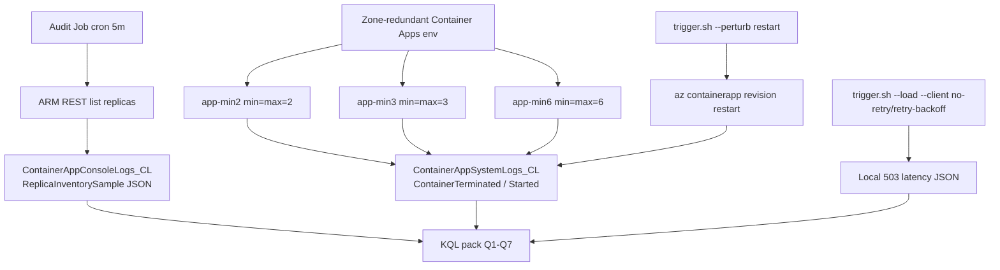

---
content_sources:
  references:
  - type: mslearn-adapted
    url: https://learn.microsoft.com/en-us/azure/reliability/reliability-container-apps
  - type: mslearn-adapted
    url: https://learn.microsoft.com/en-us/azure/container-apps/how-to-zone-redundancy
  - type: mslearn-adapted
    url: https://learn.microsoft.com/en-us/azure/container-apps/planned-maintenance
  diagrams:
  - id: experiment-architecture
    type: flowchart
    source: self-generated
    justification: "No single MS Learn diagram describes a parallel-min audit topology with deterministic perturbation. Synthesized from the reliability and zone-redundancy articles."
    based_on:
    - https://learn.microsoft.com/en-us/azure/reliability/reliability-container-apps
    - https://learn.microsoft.com/en-us/azure/container-apps/how-to-zone-redundancy
content_validation:
  status: verified
  last_reviewed: '2026-06-08'
  reviewer: agent
  lab_validation:
    status: pending_reproduction
    tested_date: null
    az_cli_version: null
    notes: Bicep + scripts authored 2026-06-08. Pending real Azure deployment for captures and metric collection.
  core_claims:
  - claim: Container Apps zone redundancy distributes replicas across Availability Zones on a best-effort basis subject to host capacity and resource requests.
    source: https://learn.microsoft.com/en-us/azure/container-apps/how-to-zone-redundancy
    verified: true
  - claim: Container Apps may restart replicas during planned platform maintenance windows.
    source: https://learn.microsoft.com/en-us/azure/container-apps/planned-maintenance
    verified: true
  - claim: Azure Container Apps does not expose per-replica Availability Zone placement through the management plane.
    source: https://learn.microsoft.com/en-us/azure/container-apps/containers
    verified: true
validation:
  az_cli:
    last_tested: null
    cli_version: null
    result: not_tested
  bicep:
    last_tested: null
    result: not_tested
---
# Zone Redundancy Is Best-Effort Lab

Test the operator assumption that `zoneRedundant=true` plus `minReplicas=N` guarantees `N` replicas land in `N` Availability Zones. Statistically falsify or confirm the platform's behavior using parallel multi-min deployments and a deterministic perturbation control.

## Lab Metadata

| Field | Value |
|---|---|
| Difficulty | Advanced |
| Duration | 8-26 hours (24 h primary baseline + perturbation runs) |
| Tier | Workload profiles (Consumption profile inside a zone-redundant environment) |
| Category | Reliability / Platform behavior |
| Failure Mode | Clustered multi-replica churn within a 60-second window for a single app |
| Skills Practiced | Pre-registered hypothesis testing, KQL analysis, perturbation control, Bicep, retry-budget measurement |

<!-- diagram-id: experiment-architecture -->


## 1. Question

**Does a zone-redundant Container Apps environment, configured with `minReplicas == maxReplicas == N` and explicit resource requests, produce clustered multi-replica churn events for the same app over a 24-hour baseline window without operator action — and when those events occur, do they correlate with client-visible 503 failures?**

The question is framed as two pre-registered hypotheses (Section 3) so the lab is falsifiable from observation alone, not from interpretation.

## 2. Setup

### Region selection

Pick a region that supports **both** Container Apps workload profiles **and** Availability Zones. Verified options: `koreacentral`, `eastus`, `westeurope`, `japaneast`. Cross-check the current matrix in [Reliability in Azure Container Apps](https://learn.microsoft.com/en-us/azure/reliability/reliability-container-apps#regional-availability) before deploying.

### Required environment variables

```bash
export RG="rg-aca-zr-lab"
export LOCATION="koreacentral"
export SUBSCRIPTION_ID="<subscription-id>"

az account set --subscription "$SUBSCRIPTION_ID"
az extension add --name containerapp --upgrade
```

### Deploy the lab

```bash
cd labs/zone-redundancy-best-effort
./deploy.sh
./verify.sh
```

| Command | Why it is used |
|---|---|
| `./deploy.sh` | Wraps `az group create` + `az deployment group create` against `infra/main.bicep`. Provisions VNet `/16` + delegated `/23` subnet, Log Analytics (90-day retention), UAMI with RG-scoped Reader role, zone-redundant Container Apps environment with a workload profile, three identical subject apps with `minReplicas==maxReplicas==2/3/6`, and an audit Job firing every 5 minutes. |
| `./verify.sh` | Confirms `properties.zoneRedundant==true` on the environment, every app reaches `Running`, the audit Job exists with the cron schedule, and the Log Analytics workspace is wired into the env. |

### Build the audit image

The default `auditImage` parameter is a placeholder (`mcr.microsoft.com/azure-cli:2.83.0`) that emits a single notice JSON so deployment succeeds before the custom image is built. To produce real `ReplicaInventorySample` samples:

```bash
ACR="<your-acr>.azurecr.io"
az acr build --registry "$(basename "$ACR" .azurecr.io)" \
    --image "zr-lab/audit:latest" \
    ./audit

az deployment group create \
    --resource-group "$RG" \
    --template-file ./infra/main.bicep \
    --parameters ./infra/main.parameters.json \
    --parameters auditImage="${ACR}/zr-lab/audit:latest"
```

| Command | Why it is used |
|---|---|
| `az acr build ...` | Builds the audit container (Mariner + bash + curl + jq) from the `audit/` directory and pushes to your ACR in one cloud-side step. |
| `az deployment group create ... auditImage=...` | Re-deploys the Bicep template with the real audit image; idempotent so the env and apps are not recreated. |

## 3. Hypothesis

Two pre-registered null hypotheses. Both are stated **before** running any perturbation; the experiment is structured to keep these definitions immutable for the duration of the run.

### H0a — Platform does not produce clustered multi-replica churn

> In a zone-redundant Container Apps environment with fixed `minReplicas=N` (`N` in `{2,3,6}`) and explicit resource requests, the platform does **not** produce clustered multi-replica churn for the same app within any 60-second window over a 24-hour baseline period without operator action.

**Clustered churn** is defined operationally as:

> Two or more replicas of the **same app** are observed in `ContainerTerminated` state within a single 60-second bin in `ContainerAppSystemLogs_CL`.

### H0b — Clustered churn does not correlate with client-visible 503 spikes

> When clustered multi-replica churn occurs (regardless of cause), the rate of HTTP `503` responses observed at the ingress for that app does **not** spike above the baseline rate during the 60-second window covering the churn event, when the calling client uses default `no-retry` behavior.

| Variable | Control State | Experimental State |
|---|---|---|
| `zoneRedundant` on env | `true` | `true` |
| Resource requests | Explicit (`0.5 vCPU`, `1 Gi`) | Explicit (`0.5 vCPU`, `1 Gi`) |
| `minReplicas == maxReplicas` per app | `2`, `3`, `6` | `2`, `3`, `6` |
| Probes | Startup + Readiness + Liveness | Same |
| Operator action | None (24-h baseline) | `trigger.sh --perturb restart` |
| Client retry | `no-retry` (baseline H0b) | `retry-backoff` (L2 measurement) |

### Pre-registered analysis plan

To prevent post-hoc reframing once data is in hand, the lab commits to these decisions **before** the first measurement:

1. **Primary metric for H0a**: count of clustered-churn events per app over the 24-h baseline window from [KQL Q3](../kql/scaling-and-replicas/zone-redundancy-mass-reschedule.md#q3-clustered-churn-detection). A non-zero count for **any** app falsifies H0a.
2. **Primary metric for H0b**: when at least one clustered-churn event occurs, the difference between churn-window 503 count and the immediately-preceding 60-second 503 count from [KQL Q5](../kql/scaling-and-replicas/zone-redundancy-mass-reschedule.md#q5-503-correlation-during-churn). A delta of `>= 1` for **any** churn event falsifies H0b.
3. **Secondary metrics (descriptive only, not used to confirm/refute)**:
    - `MaxReplacementFraction` per app from [Q7](../kql/scaling-and-replicas/zone-redundancy-mass-reschedule.md#q7-multi-app-comparison) (how much of the app was replaced in one event).
    - `RecoverySecs` per event from [Q4](../kql/scaling-and-replicas/zone-redundancy-mass-reschedule.md#q4-recovery-duration-after-churn).
    - Difference in failure rate between `--client no-retry` and `--client retry-backoff` runs (L2 mitigation effect).
4. **Stopping rule**: collect a single 24-h baseline window, then exactly three perturbation runs per client variant (`no-retry` and `retry-backoff`), each separated by 30 minutes. Do not extend the run on the basis of early results.
5. **What this lab does NOT measure**: per-replica AZ placement. The ACA management plane does not expose it, and IMDS inside an ACA replica is unsupported. Any zone-related conclusion is `[Inferred]` from clustered-churn patterns, never `[Observed]` per-replica zone data.

## 4. Prediction

If the platform delivers the strict "N replicas in N zones, zero clustered churn" interpretation many operators assume, then:

- H0a is **not** falsified — Q3 returns zero rows during the 24-h baseline.
- H0b is **not** falsified — Q5 shows no 503 delta during any perturbation window.
- The `no-retry` and `retry-backoff` client variants converge to identical success rates.

If the platform delivers best-effort distribution (the published MS Learn behavior), then:

- H0a **may** be falsified — Q3 returns at least one row, most likely on `app-min2` and `app-min3` rather than `app-min6`.
- H0b **is likely** falsified for the `no-retry` client during perturbation; `retry-backoff` measurably narrows the gap.
- `MaxReplacementFraction` is highest (closest to `1.0`) on `app-min2`, where every clustered churn is more likely to take out the whole app.

## 5. Experiment

### Phase 1 — Baseline (24 hours, no operator action)

```bash
./verify.sh
date -u +"%Y-%m-%dT%H:%M:%SZ" > /tmp/zr-baseline-start.txt

# Wait 24 hours. Do not touch the apps, env, or audit Job.
# Optional: tail the audit output via az containerapp job execution list.

date -u +"%Y-%m-%dT%H:%M:%SZ" > /tmp/zr-baseline-end.txt
```

### Phase 2 — Perturbation (controlled)

Three perturbation events per client variant. Always record the perturbation start timestamp into a local log so [KQL Q6](../kql/scaling-and-replicas/zone-redundancy-mass-reschedule.md#q6-baseline-vs-perturbation-comparison) can isolate baseline from perturbation windows.

```bash
mkdir -p /tmp/zr-perturb
for i in 1 2 3; do
    ./trigger.sh --combined --client no-retry --duration 180 --app app-min3 \
        | tee /tmp/zr-perturb/no-retry-app-min3-run${i}.json
    sleep 1800   # 30 minutes between events
done

for i in 1 2 3; do
    ./trigger.sh --combined --client retry-backoff --duration 180 --app app-min3 \
        | tee /tmp/zr-perturb/retry-backoff-app-min3-run${i}.json
    sleep 1800
done
```

| Command | Why it is used |
|---|---|
| `./trigger.sh --combined ...` | Runs the load harness for `--duration` seconds at `--rps 10`, fires `az containerapp revision restart` 25% of the way through, and emits `PerturbationStart` / `LoadEnd` JSON to stdout. Pipe to a file so the timestamps are recoverable for Q6. |
| `--client no-retry` | Issues exactly one curl per request; every 503 surfaces as a client-visible failure. Baseline for H0b. |
| `--client retry-backoff` | Retries up to 4 times with `0.2s, 0.4s, 0.8s, 1.6s` backoff. Used to quantify the L2 mitigation. |

### Phase 3 — (Optional) Cross-app comparison

Repeat one full perturbation pair against `app-min2` and `app-min6` to populate [Q7](../kql/scaling-and-replicas/zone-redundancy-mass-reschedule.md#q7-multi-app-comparison) with three subject apps.

## 6. Execution

Run **Phase 1** continuously for 24 hours with no other lab activity in `$RG`. Stagger **Phase 2** so each perturbation falls inside a previously-quiet 30-minute window. Capture every command's stdout into `/tmp/zr-perturb/` so [Q6](../kql/scaling-and-replicas/zone-redundancy-mass-reschedule.md#q6-baseline-vs-perturbation-comparison)'s `PerturbWindows` datatable can be hand-populated from real timestamps after the fact.

## 7. Observation

After Phase 1 + 2 + (optional) 3, run the [KQL pack](../kql/scaling-and-replicas/zone-redundancy-mass-reschedule.md) queries in order:

| Query | What you record |
|---|---|
| Q1 | `HealthRatio` of audit-Job ingestion. Anything `< 0.5` invalidates the downstream baseline. |
| Q2 | Per-app `SteadyStateOK` over the 24-h baseline. |
| Q3 | Every clustered-churn event (baseline **and** perturbation). |
| Q4 | `RecoverySecs` for each event. |
| Q5 | Churn × 503 correlation, broken down by client variant. |
| Q6 | Baseline vs perturbation `ChurnPerHour` per app. |
| Q7 | `ClusteredChurnEvents` and `MaxReplacementFraction` per `minReplicas`. |

Record the **exact** numbers in the Observed Evidence subsection of Section 12.

## 8. Measurement

The lab's primary metrics, derived directly from the pre-registered KQL queries:

- `[Measured]` `BaselineChurnEvents` per app over 24 h (from Q3, filtered to the baseline window from Q6).
- `[Measured]` `PerturbationChurnEvents` per app and client variant (from Q3 + Q6).
- `[Measured]` `MaxReplacementFraction` per `minReplicas` (from Q7).
- `[Measured]` `RecoverySecs` p50 / p95 across all events (from Q4).
- `[Measured]` `503Delta` per churn event (from Q5), separately for `no-retry` and `retry-backoff`.
- `[Measured]` Client-visible failure rate per variant (from local stdout of `trigger.sh`).

## 9. Analysis

Combine the measurements with the pre-registered analysis plan:

- **H0a evaluation**: If `BaselineChurnEvents == 0` for all three apps, H0a is not falsified for this 24-h window. If any app has `BaselineChurnEvents >= 1`, H0a is falsified — record the timestamps and replica IDs as `[Observed]` evidence.
- **H0b evaluation**: For every churn event from Q3 (including perturbation-induced events), compute `503Delta` from Q5. If any event has `503Delta >= 1` under the `no-retry` client, H0b is falsified.
- **Client variant comparison**: Compute the failure-rate ratio between `no-retry` and `retry-backoff` runs against the same app. A ratio `>> 1` (no-retry fails much more) is `[Measured]` evidence that L2 client-side resilience is the dominant mitigation for clustered churn.
- **Cross-app comparison**: Examine whether `BaselineChurnEvents` decreases monotonically with `minReplicas`. A monotonic decrease is `[Correlated]` evidence that higher `minReplicas` dilutes churn impact. A flat or increasing pattern is `[Observed]` evidence that raising replica count alone is not a sufficient mitigation.

## 10. Conclusion

State the conclusion in three buckets, one per evidence level, citing only the pre-registered measurements:

- **Confirmed (or falsified) hypotheses**: H0a and H0b verdict, with the specific Q3 / Q5 numbers that drove the decision.
- **Confirmed secondary effects**: L2 retry impact, cross-app pattern.
- **Open / not measurable**: per-replica AZ placement (always `[Not Proven]` for this lab regardless of result).

## 11. Falsification

The lab is built to be falsifiable in two complementary directions:

1. **Negative-control rigor**: A baseline window with `BaselineChurnEvents == 0` for all three apps falsifies the working hypothesis that the platform produces clustered churn. The lab does not interpret zero baseline rows as "absence of evidence" — it reports them as `[Observed]` evidence that platform-driven churn is below the 24-h-window detection floor for this configuration.
2. **Positive-control rigor**: `trigger.sh --perturb restart` is a deterministic restart of the active revision. Q3 **must** return a row covering the perturbation timestamp; if it does not, the audit pipeline or Q3 itself is broken and **no** downstream conclusion is valid. Re-run Phase 1 first.

## 12. Evidence

### Required CLI evidence (always collected)

| Evidence | Command / Query | Purpose |
|---|---|---|
| Env zone-redundant flag | `az containerapp env show --resource-group "$RG" --name "$ENV_NAME" --query properties.zoneRedundant` | Confirms `true`; falsifies "zone-redundancy never claimed" defense |
| Per-app scale config | `az containerapp show --resource-group "$RG" --name "$APP_NAME" --query properties.template.scale` | Confirms `minReplicas == maxReplicas` per app |
| Resource shape | `az containerapp show --resource-group "$RG" --name "$APP_NAME" --query "properties.template.containers[].resources"` | Confirms explicit requests; eliminates the "underspecified scheduler input" confounder |
| Audit Job execution | `az containerapp job execution list --resource-group "$RG" --name "audit-sampler" --query "[].{name:name, status:properties.status}" --output table` | Confirms the audit cron fired during the window |
| Perturbation timestamps | Contents of `/tmp/zr-perturb/*.json` | Source for Q6's `PerturbWindows` datatable |

### Required KQL evidence (run the full pack)

- [Mass-Reschedule KQL pack](../kql/scaling-and-replicas/zone-redundancy-mass-reschedule.md) Q1-Q7.

### Required Portal captures

These eleven captures make the result UI-verifiable. Save under `docs/assets/troubleshooting/zone-redundancy-best-effort/` using the exact filenames in the table; PII rules per [AGENTS.md → Portal Screenshot Capture (PII Replacement Rules)](https://github.com/yeongseon/azure-container-apps-practical-guide/blob/main/AGENTS.md#portal-screenshot-capture-pii-replacement-rules).

| # | When | Portal blade | What it proves | Filename |
|---|---|---|---|---|
| C1 | After deploy, before perturb | Container Apps env → Overview | Environment surfaces zone-redundant status alongside region | `01-env-overview-zone-redundant.png` |
| C2 | After deploy | Container Apps env → Workload profiles | Confirms the Consumption profile inside a workload-profile env, the only mode that supports zone redundancy | `02-env-workload-profiles.png` |
| C3 | After deploy | app-min3 → Overview | Single app shows `Running` with `Min replicas = Max replicas = 3` visible in the Configuration tile | `03-app-min3-overview.png` |
| C4 | After deploy | app-min3 → Revisions and replicas | All 3 replicas listed under one revision; running state green | `04-app-min3-revisions-replicas-baseline.png` |
| C6 | Anytime after Phase 1 has produced samples | Log Analytics → Logs editor | Q1 ingestion-check query pasted, returning `HealthRatio` near 1.0 | `06-log-analytics-q1-ingestion.png` |
| C7 | After perturbation run #1 | Log Analytics → Logs editor | Q3 clustered-churn query showing the perturbation-induced row | `07-log-analytics-q3-clustered-churn.png` |
| C9 | After perturbation runs | Log Analytics → Logs editor | Q5 503 correlation query for the `no-retry` window | `09-log-analytics-q5-503-correlation.png` |
| C10 | After perturbation runs | Log Analytics → Logs editor | Q7 multi-app comparison, side-by-side `MaxReplacementFraction` | `10-log-analytics-q7-multi-app.png` |
| C11 | After perturbation runs | app-min3 → Metrics blade | Replica Count + Restart Count chart showing the perturbation dip and recovery | `11-app-min3-metrics-replicas.png` |
| C12 | After perturbation runs | app-min3 → Log stream (live) | Real-time logs showing the restart sequence (ContainerTerminated → ContainerStarted) | `12-app-min3-log-stream.png` |
| C13 | After analysis | Azure Monitor → Workbooks (custom 3-panel) | Single workbook showing Q3 + Q4 + Q7 panels for the operator view | `13-workbook-3-panel-overview.png` |

Optional / conditional captures (capture only if conditions hit):

- `C6a-log-analytics-q1-ingestion-table.png` — if your reviewer also asks for the result-table-only screenshot separated from the editor view.
- `C14-azure-monitor-alert.png` — only if you wire up an Azure Monitor alert on Q3 during the lab and need to evidence the firing alert.

### Observed Evidence (Live Azure Reproduction)

> Placeholder — to be populated after the lab is run against a real Azure subscription. Pair every `[Observed]` line with the relevant filename from the capture table above.

```text
[Observed] BaselineChurnEvents = TBD per app over 24 h
[Observed] PerturbationChurnEvents (no-retry, app-min3) = TBD
[Measured] 503Delta during perturbation (no-retry) = TBD
[Measured] 503Delta during perturbation (retry-backoff) = TBD
[Measured] MaxReplacementFraction app-min2 = TBD, app-min3 = TBD, app-min6 = TBD
[Measured] RecoverySecs p50 = TBD s, p95 = TBD s
[Inferred] Zone redundancy reduces but does not eliminate clustered churn (or: does eliminate it under this configuration)
[Not Proven] Per-replica AZ placement
```

## 13. Solution

Apply the [four-layer mitigation matrix](../playbooks/platform-features/zone-redundancy-best-effort.md#resolution-four-layer-mitigation-matrix) from the companion playbook. Summary:

| Layer | Lever | Measured in this lab |
|---|---|---|
| **L1 — ACA inputs** | Explicit resource requests, `minReplicas >= 3`, probe tuning | Q7 cross-app comparison |
| **L2 — App resilience** | Client retry with backoff, circuit breakers | `no-retry` vs `retry-backoff` delta in Section 8 |
| **L3 — Multi-region** | Front Door + second region, or AKS escalation when zone control is required | Out of scope for this lab — see [Multi-Region Failover Lab](./multi-region-failover.md) |
| **L4 — Observability** | Alert on Q3, baseline real MTTR from Q4 | Q3 + Q4 evidence in Section 7 |

No single layer is sufficient. Pick the layers that match your RTO and document the assumption in your runbook.

## 14. Prevention

- **Replace the "zone-redundant = zero 5xx" assumption** wherever it appears (runbooks, service definitions, post-incident reviews). The pre-registered framing of H0a / H0b is the safer mental model.
- **Set `resources.requests` and `resources.limits` on every container** during the first deploy. Treat unset values as a deploy-time CI check failure.
- **Run this lab once per quarter** (or whenever the team onboards a new region) so the team retains hands-on familiarity with clustered-churn signatures.
- **Wire the Q3 query into an Azure Monitor alert rule** so the next clustered churn is detected platform-side, not from customer complaints.

## 15. Takeaway

Zone redundancy is a **best-effort placement** behavior, not a placement guarantee. The platform makes a strong attempt to spread replicas across zones, but per-replica zone placement is not exposed and not contractually guaranteed. The reliability you actually get is the **product** of the four mitigation layers, not the result of any single layer. Setting `zoneRedundant=true` alone changes the probability distribution of failure events; it does not change their existence.

## 16. Support Takeaway

When a customer escalates a "zone-redundant environment had a brief 5xx outage" case:

1. Run the [Mass-Reschedule KQL pack](../kql/scaling-and-replicas/zone-redundancy-mass-reschedule.md) Q1-Q3 against their workspace for the incident window. A non-zero Q3 row is **expected** and is **not** automatically a platform defect.
2. Inspect resource requests and probe configuration with the CLI commands in Section 12 before any escalation — vague resource shapes are the leading documented contributor.
3. If clustered-churn rate exceeds the customer's documented SLO **after** L1 + L2 are in place, that is the trigger for L3 / AKS escalation review — not the first clustered churn event.
4. Reference Microsoft Learn's exact wording on best-effort distribution in the case notes so the customer's mental model is reset before further investigation.

## Clean Up

```bash
./cleanup.sh
```

| Command | Why it is used |
|---|---|
| `./cleanup.sh` | Issues `az group delete --yes --no-wait` after an interactive confirmation. The 48-hour `expires-at` tag (from the Bicep template) is informational only — Azure may keep delete-pending resources for up to 24 hours after the delete call, but billing stops once the deletion completes. |

## Related Playbook

- [Zone Redundancy Is Best-Effort](../playbooks/platform-features/zone-redundancy-best-effort.md)

## See Also

- [Mass-Reschedule KQL Pack](../kql/scaling-and-replicas/zone-redundancy-mass-reschedule.md)
- [Multi-Region Failover Lab](./multi-region-failover.md)
- [Multi-Region Failover Playbook](../playbooks/platform-features/multi-region-failover.md)
- [Replica Load Imbalance Lab](./replica-load-imbalance.md)
- [Replica Load Imbalance Playbook](../playbooks/scaling-and-runtime/replica-load-imbalance.md)

## Sources

- [Reliability in Azure Container Apps](https://learn.microsoft.com/en-us/azure/reliability/reliability-container-apps)
- [Set up zone redundancy in Azure Container Apps](https://learn.microsoft.com/en-us/azure/container-apps/how-to-zone-redundancy)
- [Planned maintenance for Azure Container Apps](https://learn.microsoft.com/en-us/azure/container-apps/planned-maintenance)
- [Scale an app in Azure Container Apps](https://learn.microsoft.com/en-us/azure/container-apps/scale-app)
- [Workload profiles in Azure Container Apps](https://learn.microsoft.com/en-us/azure/container-apps/workload-profiles-overview)
- [Containers in Azure Container Apps](https://learn.microsoft.com/en-us/azure/container-apps/containers)
