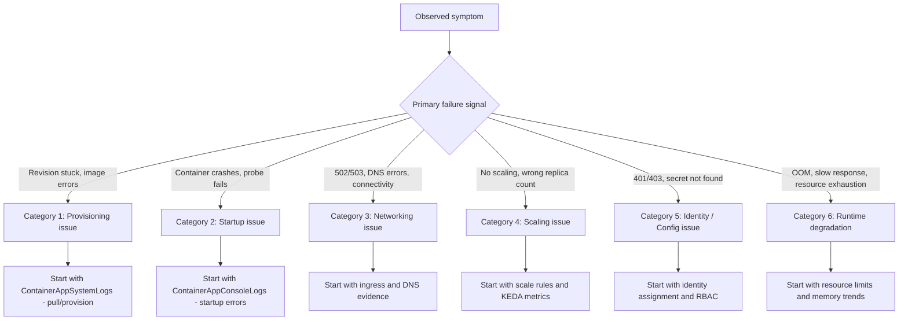

---
hide:
  - toc
---

# Troubleshooting Mental Model

This page provides a classification model for Azure Container Apps incidents so you can start with the correct evidence source instead of guessing.

**Core idea**: classify the problem first, then investigate deeply.

## Why this model matters

Most incident delays come from category mistakes:

- image pull failures investigated as application code bugs
- scaling issues investigated as networking problems
- identity/auth failures investigated as connectivity issues
- probe failures investigated as container crashes

This classification helps you avoid looking at the wrong logs from the start.

## Classification flowchart



## Category summary matrix

| Category | Typical Symptoms | First Signal to Check | Common Mistake |
|---|---|---|---|
| Provisioning issue | Revision stuck "Provisioning", image pull errors | `ContainerAppSystemLogs` - pull/auth errors | Assuming app code is broken |
| Startup issue | Container crashes, probe timeout, unhealthy | `ContainerAppConsoleLogs` - startup sequence | Checking only system logs |
| Networking issue | 502/503, DNS failures, connectivity errors | Ingress config + DNS resolution | Restarting app without validating network |
| Scaling issue | No scale-out, stuck at min/max replicas | Scale rules + KEDA scaler logs | Looking at application logs only |
| Identity / Config issue | 401/403 to Azure services, secret not found | Identity assignment + RBAC roles | Assuming network block |
| Runtime degradation | OOM restarts, slow response, resource pressure | Resource limits + memory/CPU trends | Looking only at error logs |

## 1) Category: Provisioning Issue

Provisioning issues occur when a new revision cannot be created or deployed successfully.

### Typical symptom patterns

- Revision stays in "Provisioning" state indefinitely
- Image pull errors: `unauthorized`, `manifest unknown`
- ACR authentication failures
- Revision creation timeout

### First signal to check

```kusto
ContainerAppSystemLogs
| where TimeGenerated > ago(1h)
| where Log_s has_any ("pull", "image", "manifest", "auth", "401", "403", "provision", "failed")
| project TimeGenerated, Log_s
| order by TimeGenerated desc
```

### Common mistakes

- Assuming the application code is the problem when the image never started
- Not verifying ACR credentials or managed identity permissions
- Missing the difference between image pull failure and container start failure

### Recommended playbooks

- [Image Pull Failure](playbooks/startup-and-provisioning/image-pull-failure.md)
- [Revision Provisioning Failure](playbooks/startup-and-provisioning/revision-provisioning-failure.md)

## 2) Category: Startup Issue

Startup issues occur when the container image is pulled successfully but the application fails to start or pass health probes.

### Typical symptom patterns

- Container starts but crashes immediately (CrashLoopBackOff)
- Health probe timeout
- Application listening on wrong port
- Missing environment variables or configuration

### First signal to check

```kusto
ContainerAppConsoleLogs
| where TimeGenerated > ago(1h)
| where Log_s has_any ("error", "exception", "traceback", "failed", "exit", "bind", "listen", "port")
| project TimeGenerated, RevisionName_s, Log_s
| order by TimeGenerated desc
```

### Common mistakes

- Checking only system logs when the issue is in application startup
- Not verifying the `targetPort` matches the actual listening port
- Ignoring probe configuration mismatch

### Recommended playbooks

- [Container Start Failure](playbooks/startup-and-provisioning/container-start-failure.md)
- [Probe Failure and Slow Start](playbooks/startup-and-provisioning/probe-failure-and-slow-start.md)

## 3) Category: Networking Issue

Networking issues occur when the container is running but cannot be reached or cannot reach dependencies.

### Typical symptom patterns

- 502/503 errors from ingress
- DNS resolution failures for private endpoints
- Service-to-service connectivity failures
- VNet integration issues

### First signal to check

```kusto
ContainerAppSystemLogs
| where TimeGenerated > ago(1h)
| where Log_s has_any ("ingress", "upstream", "502", "503", "DNS", "resolve", "connection refused")
| project TimeGenerated, Log_s
| order by TimeGenerated desc
```

### Common mistakes

- Restarting the app without checking network configuration
- Assuming DNS works without testing from inside the container
- Missing Private DNS Zone linkage to VNet

### Recommended playbooks

- [Ingress Not Reachable](playbooks/ingress-and-networking/ingress-not-reachable.md)
- [Internal DNS and Private Endpoint Failure](playbooks/ingress-and-networking/internal-dns-and-private-endpoint-failure.md)
- [Service-to-Service Connectivity Failure](playbooks/ingress-and-networking/service-to-service-connectivity-failure.md)

## 4) Category: Scaling Issue

Scaling issues occur when KEDA autoscaling does not respond correctly to load or events.

### Typical symptom patterns

- Replica count stays at minimum despite traffic
- Scale-out too slow for traffic spikes
- Event-driven scaling not triggering (queue, Kafka, etc.)
- Scale rules not evaluated

### First signal to check

```kusto
ContainerAppSystemLogs
| where TimeGenerated > ago(2h)
| where Log_s has_any ("scale", "replica", "KEDA", "scaler", "metric", "trigger")
| project TimeGenerated, Log_s
| order by TimeGenerated desc
```

### Common mistakes

- Assuming scaling is broken when the issue is misconfigured rules
- Not checking minReplicas/maxReplicas constraints
- Ignoring scaler authentication/connection issues

### Recommended playbooks

- [HTTP Scaling Not Triggering](playbooks/scaling-and-runtime/http-scaling-not-triggering.md)
- [Event Scaler Mismatch](playbooks/scaling-and-runtime/event-scaler-mismatch.md)

## 5) Category: Identity / Config Issue

Identity issues occur when the application cannot authenticate to Azure services or access secrets.

### Typical symptom patterns

- 401/403 errors when accessing Key Vault, Storage, SQL
- "Secret not found" or reference resolution failures
- Managed identity token acquisition failures
- Missing RBAC role assignments

### First signal to check

```kusto
ContainerAppConsoleLogs
| where TimeGenerated > ago(1h)
| where Log_s has_any ("401", "403", "Unauthorized", "Forbidden", "AADSTS", "ManagedIdentity", "secret", "keyvault")
| project TimeGenerated, Log_s
| order by TimeGenerated desc
```

### Common mistakes

- Assuming network block when the issue is missing RBAC
- Not verifying managed identity is assigned to the container app
- Confusing system-assigned vs user-assigned identity scope

### Recommended playbooks

- [Managed Identity Auth Failure](playbooks/identity-and-configuration/managed-identity-auth-failure.md)
- [Secret and Key Vault Reference Failure](playbooks/identity-and-configuration/secret-and-key-vault-reference-failure.md)

## 6) Category: Runtime Degradation

Runtime degradation means the app starts correctly but performance deteriorates due to resource constraints.

### Typical symptom patterns

- OOM kills and container restarts
- Increasing latency over time
- CPU throttling under load
- Memory growth without release

### First signal to check

```kusto
ContainerAppSystemLogs
| where TimeGenerated > ago(6h)
| where Log_s has_any ("OOM", "killed", "memory", "evicted", "resource", "throttle")
| project TimeGenerated, Log_s
| order by TimeGenerated desc
```

### Common mistakes

- Relying only on error logs without checking resource metrics
- Setting memory limits too low for the workload
- Not identifying memory leaks vs legitimate memory usage

### Recommended playbooks

- [CrashLoop OOM and Resource Pressure](playbooks/scaling-and-runtime/crashloop-oom-and-resource-pressure.md)

## Classification workflow in practice

1. Pick one dominant symptom and timestamp window.
2. Map to one of the six categories using the flowchart.
3. Run only the first evidence query for that category.
4. If evidence contradicts the category, reclassify immediately.
5. Open the linked playbook and continue with hypothesis-driven analysis.

## Anti-patterns this model prevents

- **Wrong-table bias**: querying `ContainerAppConsoleLogs` for image pull issues.
- **Single-signal bias**: assuming all 502s are application bugs.
- **Identity blind spot**: treating auth failures as network problems.
- **Scaling assumption**: assuming KEDA is broken without checking configuration.

!!! tip "Use category labels in incident notes"
    Add an explicit category label in the first incident update.
    Example: "Initial classification: Category 3 (Networking), confidence medium."
    This keeps the team aligned on which evidence to collect first.

## See Also

- [Troubleshooting Method](methodology/index.md)
- [Detector Map](methodology/detector-map.md)
- [Architecture Overview](architecture-overview.md)
- [Evidence Map](evidence-map.md)
- [Decision Tree](decision-tree.md)
- [Quick Diagnosis Cards](quick-diagnosis-cards.md)
- [Playbooks Index](playbooks/index.md)
- [KQL Query Library](kql/index.md)

## Sources

- [Azure Container Apps monitoring overview](https://learn.microsoft.com/en-us/azure/container-apps/observability)
- [Azure Container Apps troubleshooting](https://learn.microsoft.com/en-us/azure/container-apps/troubleshooting)
- [Health probes in Azure Container Apps](https://learn.microsoft.com/en-us/azure/container-apps/health-probes)
- [Scaling in Azure Container Apps](https://learn.microsoft.com/en-us/azure/container-apps/scale-app)
- [Managed identities in Azure Container Apps](https://learn.microsoft.com/en-us/azure/container-apps/managed-identity)
