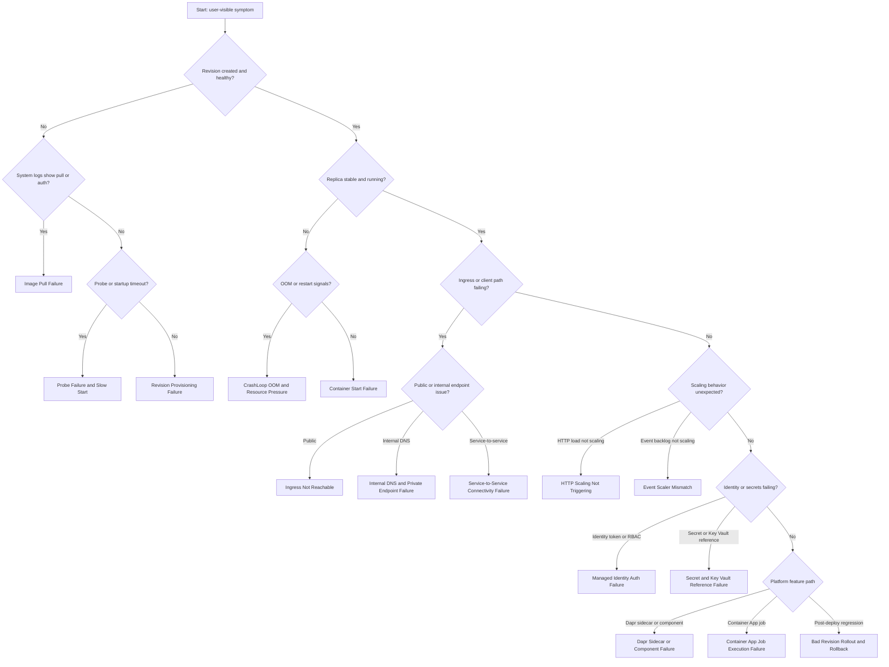

---
hide:
  - toc
content_sources:
  diagrams:
    - id: symptom-routing-flow
      type: flowchart
      source: mslearn-adapted
      based_on:
        - https://learn.microsoft.com/en-us/azure/container-apps/troubleshooting
        - https://learn.microsoft.com/en-us/azure/container-apps/observability
        - https://learn.microsoft.com/en-us/azure/container-apps/health-probes
content_validation:
  status: verified
  last_reviewed: "2026-04-12"
  reviewer: ai-agent
  core_claims:
    - claim: "Azure Container Apps troubleshooting guidance includes common startup, networking, and runtime failure scenarios."
      source: "https://learn.microsoft.com/azure/container-apps/troubleshooting"
      verified: true
    - claim: "Azure Container Apps observability includes system and console logs."
      source: "https://learn.microsoft.com/azure/container-apps/observability"
      verified: true
    - claim: "Azure Container Apps health probes are used to determine whether containers are healthy."
      source: "https://learn.microsoft.com/azure/container-apps/health-probes"
      verified: true
    - claim: "Azure Container Apps supports scale rules for automatic scaling."
      source: "https://learn.microsoft.com/azure/container-apps/scale-app"
      verified: true
---

# Detector Map: Symptom to Playbook

Use this detector map to move from first symptom to the most likely troubleshooting playbook with minimal guesswork.

## Observed Baseline Lifecycle Signals (Real Deployment)

| Reason_s | Type_s | Typical count | Interpretation during triage |
|---|---|---:|---|
| ProbeFailed | Warning | 74 | Often expected during cold start if revision later becomes ready |
| RevisionUpdate | Normal | 14 | Revision template/config updated |
| ContainerAppUpdate | Normal | 9 | App-level config update accepted |
| RevisionReady | Normal | 7 | Revision reached healthy ready state |
| ContainerAppReady | Normal | 6 | App reached running state |
| KEDAScalersStarted | Normal | 6 | Scalers activated for revision |
| RevisionDeactivating | Normal | 5 | Prior revision being drained/deactivated |
| ContainerStarted | Normal | 3 | Container process started |
| PulledImage | Normal | 3 | Image pull completed successfully |
| ContainerCreated | Normal | 3 | Container object created |
| AssigningReplica | Normal | 3 | Replica scheduled to node |
| PullingImage | Normal | 2 | Image pull started |
| ContainerTerminated | Warning | 2 | Container exited; check exit code/context |

## Symptom Routing Flow

<!-- diagram-id: symptom-routing-flow -->

## Error String Mapping

| Error string or pattern | Recommended playbook |
|---|---|
| `ImagePullBackOff`, `manifest unknown`, `unauthorized`, `denied` | [Image Pull Failure](../playbooks/startup-and-provisioning/image-pull-failure.md) |
| `Provisioning failed`, `secretRef not found`, template validation errors | [Revision Provisioning Failure](../playbooks/startup-and-provisioning/revision-provisioning-failure.md) |
| `Traceback`, `Address already in use`, startup command exit | [Container Start Failure](../playbooks/startup-and-provisioning/container-start-failure.md) |
| `Readiness probe failed`, `liveness probe failed`, startup timeout | [Probe Failure and Slow Start](../playbooks/startup-and-provisioning/probe-failure-and-slow-start.md) |
| 502/504 from app FQDN, `upstream connect error` | [Ingress Not Reachable](../playbooks/ingress-and-networking/ingress-not-reachable.md) |
| `Temporary failure in name resolution`, `NXDOMAIN` | [Internal DNS and Private Endpoint Failure](../playbooks/ingress-and-networking/internal-dns-and-private-endpoint-failure.md) |
| `connection refused`, TLS handshake timeout between services | [Service-to-Service Connectivity Failure](../playbooks/ingress-and-networking/service-to-service-connectivity-failure.md) |
| HTTP latency spike with flat replica count | [HTTP Scaling Not Triggering](../playbooks/scaling-and-runtime/http-scaling-not-triggering.md) |
| Queue backlog grows, no scale-out, KEDA trigger errors | [Event Scaler Mismatch](../playbooks/scaling-and-runtime/event-scaler-mismatch.md) |
| `CrashLoopBackOff`, `OOMKilled`, frequent replica restarts | [CrashLoop OOM and Resource Pressure](../playbooks/scaling-and-runtime/crashloop-oom-and-resource-pressure.md) |
| `ManagedIdentityCredential` errors, 401/403 to Azure resource | [Managed Identity Auth Failure](../playbooks/identity-and-configuration/managed-identity-auth-failure.md) |
| Secret reference errors, Key Vault access denied | [Secret and Key Vault Reference Failure](../playbooks/identity-and-configuration/secret-and-key-vault-reference-failure.md) |
| Dapr invocation/state/pubsub failures | [Dapr Sidecar or Component Failure](../playbooks/platform-features/dapr-sidecar-or-component-failure.md) |
| Job `Failed` / `TimedOut` / retry storm | [Container App Job Execution Failure](../playbooks/platform-features/container-app-job-execution-failure.md) |
| Errors spike immediately after traffic shift | [Bad Revision Rollout and Rollback](../playbooks/platform-features/bad-revision-rollout-and-rollback.md) |

## Playbook Catalog

### Startup and Provisioning

- [Image Pull Failure](../playbooks/startup-and-provisioning/image-pull-failure.md)
- [Revision Provisioning Failure](../playbooks/startup-and-provisioning/revision-provisioning-failure.md)
- [Container Start Failure](../playbooks/startup-and-provisioning/container-start-failure.md)
- [Probe Failure and Slow Start](../playbooks/startup-and-provisioning/probe-failure-and-slow-start.md)

### Ingress and Networking

- [Ingress Not Reachable](../playbooks/ingress-and-networking/ingress-not-reachable.md)
- [Internal DNS and Private Endpoint Failure](../playbooks/ingress-and-networking/internal-dns-and-private-endpoint-failure.md)
- [Service-to-Service Connectivity Failure](../playbooks/ingress-and-networking/service-to-service-connectivity-failure.md)

### Scaling and Runtime

- [HTTP Scaling Not Triggering](../playbooks/scaling-and-runtime/http-scaling-not-triggering.md)
- [Event Scaler Mismatch](../playbooks/scaling-and-runtime/event-scaler-mismatch.md)
- [CrashLoop OOM and Resource Pressure](../playbooks/scaling-and-runtime/crashloop-oom-and-resource-pressure.md)

### Identity and Configuration

- [Managed Identity Auth Failure](../playbooks/identity-and-configuration/managed-identity-auth-failure.md)
- [Secret and Key Vault Reference Failure](../playbooks/identity-and-configuration/secret-and-key-vault-reference-failure.md)

### Platform Features

- [Dapr Sidecar or Component Failure](../playbooks/platform-features/dapr-sidecar-or-component-failure.md)
- [Container App Job Execution Failure](../playbooks/platform-features/container-app-job-execution-failure.md)
- [Bad Revision Rollout and Rollback](../playbooks/platform-features/bad-revision-rollout-and-rollback.md)

## See Also

- [Troubleshooting Methodology](index.md)
- [First 10 Minutes: Quick Triage Checklist](../first-10-minutes/index.md)
- [Troubleshooting Playbooks](../playbooks/index.md)
