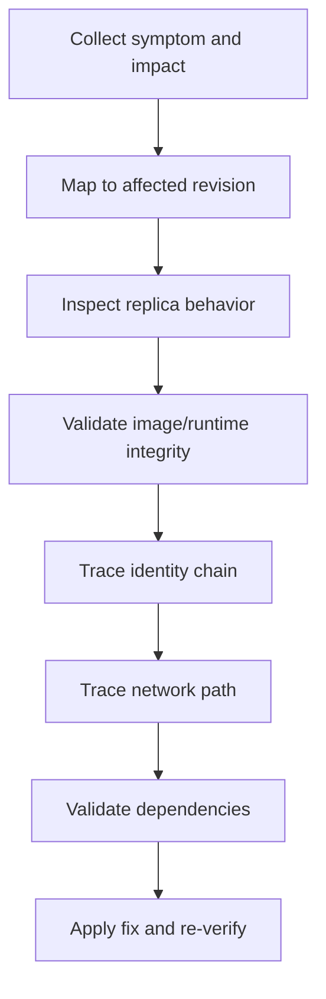

# Troubleshooting Methodology

When the quick triage checklist does not isolate the issue, use this systematic workflow to move from symptom to verified root cause.

## Diagnostic Flow



## 1) Symptom Collection

Capture exact failure mode first: no response, HTTP 5xx, slow response, intermittent timeout, startup failure.

```kql
let AppName = "ca-myapp-api";
ContainerAppConsoleLogs_CL
| where ContainerAppName_s == AppName
| where Log_s has_any ("error", "exception", "timeout", "traceback")
| project TimeGenerated, RevisionName_s, ReplicaName_s, Log_s
| order by TimeGenerated desc
```

- Record first seen timestamp, blast radius, and user-facing symptom.
- Decision: if no app logs exist, start with system logs and provisioning path.

## 2) Revision Analysis

Determine whether failure is isolated to the latest revision or shared across active revisions.

```bash
az containerapp revision list --name "$APP_NAME" --resource-group "$RG" --query "[].{name:name,active:properties.active,trafficWeight:properties.trafficWeight,health:properties.healthState}" --output table
```

```kql
let AppName = "ca-myapp-api";
ContainerAppSystemLogs_CL
| where ContainerAppName_s == AppName
| project TimeGenerated, RevisionName_s, Reason_s, Log_s
| order by TimeGenerated desc
```

- Check active vs inactive revisions and traffic percentage.
- Decision: broken latest revision with healthy prior revision suggests rollback/failover path.

## 3) Replica Deep Dive

Focus on restart frequency, OOM kill patterns, and resource pressure.

```kql
let AppName = "ca-myapp-api";
ContainerAppSystemLogs_CL
| where ContainerAppName_s == AppName
| where Log_s has_any ("restart", "terminated", "OOM", "killed")
| summarize events=count() by RevisionName_s, ReplicaName_s
| order by events desc
```

- Frequent restarts with no code tracebacks often point to resource limits or probe failures.
- Decision: if OOM or throttling signals appear, tune CPU/memory and startup behavior before redeploy.

## 4) Image Investigation

Validate image tag immutability, base image compatibility, and dependency completeness.

```bash
az containerapp show --name "$APP_NAME" --resource-group "$RG" --query "properties.template.containers[0].image" --output tsv
az acr repository show-tags --name "$ACR_NAME" --repository "$APP_NAME" --output table
```

```kql
let AppName = "ca-myapp-api";
ContainerAppSystemLogs_CL
| where ContainerAppName_s == AppName
| where Log_s has_any ("pull", "manifest", "unauthorized", "denied")
| project TimeGenerated, RevisionName_s, Log_s
| order by TimeGenerated desc
```

- Decision: if image pulls fail, treat identity/registry/network as primary branch.

## 5) Identity Chain

Walk the chain: managed identity assignment → RBAC grant → token retrieval → target resource authorization.

```bash
az containerapp show --name "$APP_NAME" --resource-group "$RG" --query "identity" --output json
az role assignment list --assignee "$(az containerapp show --name "$APP_NAME" --resource-group "$RG" --query identity.principalId --output tsv)" --output table
```

```kql
let AppName = "ca-myapp-api";
ContainerAppConsoleLogs_CL
| where ContainerAppName_s == AppName
| where Log_s has_any ("ManagedIdentityCredential", "403", "401", "token")
| project TimeGenerated, RevisionName_s, Log_s
| order by TimeGenerated desc
```

- Decision: identity exists but 403 persists usually means missing role scope or wrong audience.

## 6) Network Path

Trace path end-to-end: DNS resolution → ingress routing → healthy replica → egress connectivity.

```bash
az containerapp show --name "$APP_NAME" --resource-group "$RG" --query "properties.configuration.ingress" --output json
az containerapp env show --name "$ENVIRONMENT_NAME" --resource-group "$RG" --query "properties.vnetConfiguration" --output json
```

```kql
let AppName = "ca-myapp-api";
ContainerAppSystemLogs_CL
| where ContainerAppName_s == AppName
| where Log_s has_any ("DNS", "ingress", "connection refused", "timeout")
| project TimeGenerated, RevisionName_s, Log_s
| order by TimeGenerated desc
```

- Decision: ingress healthy but dependency timeout indicates egress or dependency firewall branch.

## 7) Dependency Mapping

Create an explicit map of downstream dependencies and test each path.

```kql
let AppName = "ca-myapp-api";
ContainerAppConsoleLogs_CL
| where ContainerAppName_s == AppName
| where Log_s has_any ("sql", "redis", "cosmos", "storage", "api")
| project TimeGenerated, RevisionName_s, Log_s
| order by TimeGenerated desc
```

- Verify endpoint hostnames, identity scopes, firewall allow rules, and secret versions.
- Decision: a single failing dependency can produce cascading startup or probe failures.

## Decision Tree (Symptom → Likely Cause → Next Investigation)

| Symptom | Likely cause | Investigate next |
| --- | --- | --- |
| `ImagePullBackOff` | Registry auth or image tag issue | Image Investigation, Identity Chain |
| Revision `Failed` before traffic | Invalid config or missing secret | Revision Analysis, Secret references |
| 502/504 from ingress | No healthy replica or wrong target port | Replica Deep Dive, Network Path |
| Intermittent timeout under load | Scale rule mismatch or throttling | Replica Deep Dive, scaling logs |
| Works locally, fails in ACA | Identity/network/environment mismatch | Identity Chain, Network Path |

## Anti-Patterns (Don't Do This)

!!! warning "Do not redeploy blindly"
    Repeated redeploys without collecting logs destroys evidence and slows root-cause analysis.

!!! warning "Do not change multiple variables at once"
    Change one dimension per iteration (image, config, probes, scale) so the result is attributable.

!!! warning "Do not ignore system logs"
    Console logs show app behavior; system logs usually reveal platform-level failures first.

## See Also

- [First 10 Minutes: Quick Triage Checklist](../first-10-minutes/index.md)
- [Playbooks](../playbooks/index.md)
- [KQL Queries](../kql/index.md)
- [Detector Map: Symptom to Playbook](detector-map.md)
