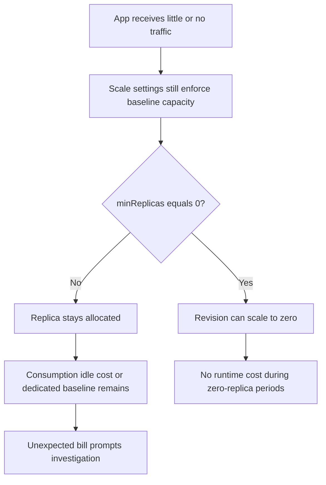

---
content_sources:
  text:
    - type: mslearn-adapted
      url: https://learn.microsoft.com/en-us/azure/container-apps/billing
diagrams:
  - id: min-replicas-cost-surprise-flow
    type: flowchart
    source: mslearn-adapted
    based_on:
      - https://learn.microsoft.com/en-us/azure/container-apps/billing
      - https://learn.microsoft.com/en-us/azure/container-apps/scale-app
      - https://learn.microsoft.com/en-us/azure/container-apps/workload-profiles-overview
content_validation:
  status: verified
  last_reviewed: 2026-04-29
  reviewer: agent
  core_claims:
    - claim: "Azure Container Apps uses per-revision scale settings including minimum replica count."
      source: https://learn.microsoft.com/en-us/azure/container-apps/scale-app
      verified: true
    - claim: "Scale-to-zero affects Azure Container Apps billing behavior."
      source: https://learn.microsoft.com/en-us/azure/container-apps/billing
      verified: true
    - claim: "Workload profiles change the cost model because dedicated capacity is reserved at the profile level."
      source: https://learn.microsoft.com/en-us/azure/container-apps/workload-profiles-overview
      verified: true
---

# Min Replicas Cost Surprise

## Symptom

There is no runtime failure, but Azure Cost Management shows continuous spend during quiet periods. The app appears idle, yet charges continue because at least one replica or one dedicated node stays allocated.

<!-- diagram-id: min-replicas-cost-surprise-flow -->


## Possible Causes

- `minReplicas` is set to `1` or higher on a workload that is idle for long periods.
- Multiple active revisions each keep a baseline replica.
- The app runs in a dedicated workload profile, so node cost remains even when traffic is light.
- A performance optimization kept replicas warm without documenting the ongoing cost trade-off.

## Diagnosis Steps

1. Inspect the app scale configuration:

```bash
az containerapp show \
    --name "$APP_NAME" \
    --resource-group "$RG" \
    --query "properties.template.scale" \
    --output json
```

2. Check whether more than one active revision is holding replicas:

```bash
az containerapp revision list \
    --name "$APP_NAME" \
    --resource-group "$RG" \
    --query "[].{name:name,active:properties.active,replicas:properties.replicas}"
```

3. Review the replica metric during an idle window:

```bash
az monitor metrics list \
    --resource "/subscriptions/<subscription-id>/resourceGroups/$RG/providers/Microsoft.App/containerApps/$APP_NAME" \
    --metric Replicas \
    --aggregation Average \
    --timespan P1D
```

| Command | Why it is used |
|---|---|
| `az containerapp show --query "properties.template.scale"` | Confirms whether `minReplicas` is intentionally keeping replicas alive. |
| `az containerapp revision list --query "[].{name:name,active:properties.active,replicas:properties.replicas}"` | Finds revision sprawl that can multiply baseline cost. |
| `az monitor metrics list --metric Replicas --aggregation Average --timespan P1D` | Verifies that replicas remained present even during low-traffic periods. |

4. If the environment uses dedicated workload profiles, check whether the issue is actually reserved node cost instead of app-level runtime cost.

## Resolution

1. **Set `minReplicas` to `0`** for workloads that can tolerate cold starts:

```bash
az containerapp update \
    --name "$APP_NAME" \
    --resource-group "$RG" \
    --min-replicas 0 \
    --max-replicas 3
```

2. **Keep `minReplicas` above zero intentionally** only when latency, cache warmness, or queue pickup time justifies the baseline spend.
3. **Reduce active revisions** if old revisions are still holding warm replicas.
4. **Right-size dedicated profiles** when the real cost driver is reserved dedicated capacity rather than `minReplicas` itself.

| Command | Why it is used |
|---|---|
| `az containerapp update --min-replicas 0 --max-replicas 3` | Removes the always-on replica baseline for workloads that can scale to zero. |

## Prevention

- Treat `minReplicas` as a cost decision, not only a performance setting.
- Document which apps are allowed to scale to zero and which must stay warm.
- Review idle replica metrics during monthly cost reviews.
- When using dedicated workload profiles, separate app-level replica tuning from environment-level node reservation decisions.

## See Also

- [Min Replicas Cost Surprise Lab](../../lab-guides/min-replicas-cost-surprise.md)
- [Cold Start and Scale-to-Zero Lab](../../lab-guides/cold-start-scale-to-zero.md)
- [Cost-Aware Best Practices](../../../best-practices/cost.md)
- [Workload Profiles](../../../platform/environments/workload-profiles.md)

## Sources

- [Microsoft Learn: Azure Container Apps billing](https://learn.microsoft.com/en-us/azure/container-apps/billing)
- [Microsoft Learn: Set scaling rules in Azure Container Apps](https://learn.microsoft.com/en-us/azure/container-apps/scale-app)
- [Microsoft Learn: Workload profiles in Azure Container Apps](https://learn.microsoft.com/en-us/azure/container-apps/workload-profiles-overview)
