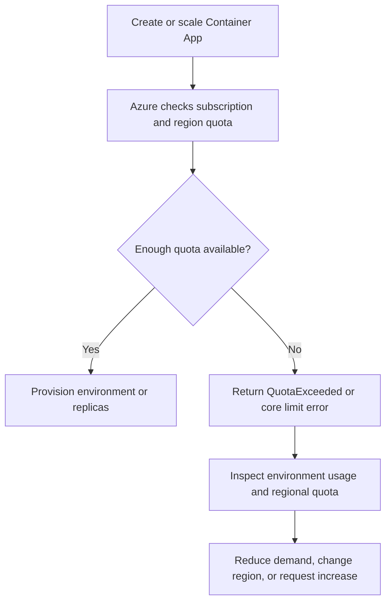

---
content_sources:
  text:
    - type: mslearn-adapted
      url: https://learn.microsoft.com/en-us/azure/container-apps/quotas
diagrams:
  - id: subscription-quota-exceeded-flow
    type: flowchart
    source: mslearn-adapted
    based_on:
      - https://learn.microsoft.com/en-us/azure/container-apps/quotas
      - https://learn.microsoft.com/en-us/azure/quotas/quickstart-increase-quota-portal
      - https://learn.microsoft.com/en-us/azure/container-apps/environment
content_validation:
  status: verified
  last_reviewed: 2026-04-29
  reviewer: agent
  core_claims:
    - claim: "Azure Container Apps quota limits are enforced at least at the subscription and region scope."
      source: https://learn.microsoft.com/en-us/azure/container-apps/quotas
      verified: true
    - claim: "Azure exposes Container Apps usage information for an environment through Azure CLI."
      source: https://learn.microsoft.com/en-us/azure/container-apps/quotas
      verified: true
    - claim: "Quota increases can be requested through the Azure Usage + quotas experience."
      source: https://learn.microsoft.com/en-us/azure/quotas/quickstart-increase-quota-portal
      verified: true
---

# Subscription Quota Exceeded

## Symptom

Deployments, revisions, or scale operations fail with messages such as `QuotaExceeded`, `The subscription does not have enough quota to create the resource`, or `Maximum Allowed Cores exceeded for the Managed Environment.` The environment can remain in a failed or partially provisioned state while the app never reaches the requested replica count.

<!-- diagram-id: subscription-quota-exceeded-flow -->


## Possible Causes

- Regional core quota for Azure Container Apps is already consumed by existing environments or replicas.
- Public IP or related regional quota is exhausted before compute quota is exhausted.
- The requested replica count or CPU allocation pushes the managed environment past its allowed core envelope.
- A new environment is being created in a region where the subscription has insufficient Container Apps capacity.

## Diagnosis Steps

1. Capture the exact Azure error text from the failed deployment, revision event, or CLI response.
2. Check whether the environment itself is healthy:

```bash
az containerapp env show \
    --name "$CONTAINER_ENV" \
    --resource-group "$RG" \
    --query "properties.provisioningState" \
    --output tsv
```

3. Inspect current environment usage:

```bash
az containerapp env list-usages \
    --name "$CONTAINER_ENV" \
    --resource-group "$RG"
```

4. Inspect subscription quota for the target region:

```bash
az quota list \
    --scope "/subscriptions/<subscription-id>/providers/Microsoft.App/locations/$LOCATION"
```

| Command | Why it is used |
|---|---|
| `az containerapp env show --query "properties.provisioningState"` | Confirms whether the managed environment is healthy or blocked during provisioning. |
| `az containerapp env list-usages` | Shows current usage versus available capacity inside the environment boundary. |
| `az quota list --scope "/subscriptions/<subscription-id>/providers/Microsoft.App/locations/$LOCATION"` | Confirms whether the subscription and region quota is the actual blocking constraint. |

5. Compare the requested scale change with the current usage numbers. If the gap between current usage and requested capacity is smaller than the requested increase, quota is the likely blocker.
6. In the Azure portal, open **Subscriptions** → **Usage + quotas** and confirm whether the same region shows a pending or exhausted quota state.

## Resolution

1. **Reduce demand temporarily** by lowering `minReplicas`, `maxReplicas`, or per-replica CPU/memory so the request fits inside the current quota.
2. **Retry in another region** if the workload is portable and that region has available quota.
3. **Request a quota increase** through **Usage + quotas** for the affected region.
4. **Re-run the failed operation** only after quota shows available capacity.

Typical mitigation command:

```bash
az containerapp update \
    --name "$APP_NAME" \
    --resource-group "$RG" \
    --min-replicas 1 \
    --max-replicas 2 \
    --cpu 0.5 \
    --memory "1Gi"
```

| Command | Why it is used |
|---|---|
| `az containerapp update --min-replicas 1 --max-replicas 2 --cpu 0.5 --memory "1Gi"` | Temporarily lowers requested runtime capacity so the app can fit within the current quota envelope. |

## Prevention

- Add a quota pre-check to deployment runbooks for every production region.
- Track environment usage growth before planned scale events, large promotions, or seasonal traffic.
- Separate high-growth workloads so one environment does not unexpectedly consume the whole regional budget.
- Keep a documented fallback region for workloads that must deploy while a quota increase is pending.

## See Also

- [Subscription Quota Exceeded Lab](../../lab-guides/subscription-quota-exceeded.md)
- [Azure Container Apps Limits and Quotas](../../../platform/environments/limits-and-quotas.md)
- [Azure Container Apps Platform Limits and Quotas](../../../reference/platform-limits.md)
- [Cost-Aware Best Practices](../../../best-practices/cost.md)

## Sources

- [Microsoft Learn: Azure Container Apps quotas](https://learn.microsoft.com/en-us/azure/container-apps/quotas)
- [Microsoft Learn: Quickstart to request a quota increase in the Azure portal](https://learn.microsoft.com/en-us/azure/quotas/quickstart-increase-quota-portal)
- [Microsoft Learn: Azure Container Apps environment](https://learn.microsoft.com/en-us/azure/container-apps/environment)
