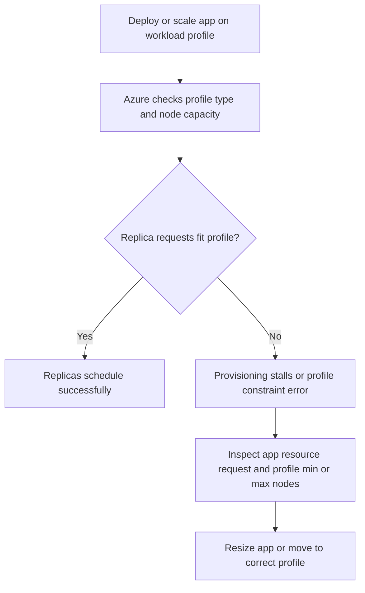

---
content_sources:
  text:
    - type: mslearn-adapted
      url: https://learn.microsoft.com/en-us/azure/container-apps/workload-profiles-overview
diagrams:
  - id: workload-profile-mismatch-flow
    type: flowchart
    source: mslearn-adapted
    based_on:
      - https://learn.microsoft.com/en-us/azure/container-apps/workload-profiles-overview
      - https://learn.microsoft.com/en-us/azure/container-apps/workload-profiles-manage-cli
      - https://learn.microsoft.com/en-us/azure/container-apps/billing
content_validation:
  status: verified
  last_reviewed: 2026-04-29
  reviewer: agent
  core_claims:
    - claim: "Azure Container Apps supports workload profiles inside an environment."
      source: https://learn.microsoft.com/en-us/azure/container-apps/workload-profiles-overview
      verified: true
    - claim: "Workload profile node counts can be managed through Azure CLI."
      source: https://learn.microsoft.com/en-us/azure/container-apps/workload-profiles-manage-cli
      verified: true
    - claim: "Dedicated workload profile cost is tied to reserved profile capacity rather than only request-driven execution."
      source: https://learn.microsoft.com/en-us/azure/container-apps/billing
      verified: true
---

# Workload Profile Mismatch

## Symptom

An app assigned to a dedicated workload profile fails to start, remains stuck in provisioning, or returns errors such as `WorkloadProfileMaximumCoresConstraint`. The requested replicas or resources do not land successfully even though the app definition itself looks valid.

<!-- diagram-id: workload-profile-mismatch-flow -->


## Possible Causes

- The app is pinned to a workload profile whose node type is too small for the requested CPU or memory.
- `maximumCount` is too low to host the requested replica count.
- `minimumCount` and `maximumCount` were misconfigured during environment updates.
- A cost-optimization change shrank dedicated capacity without checking the app's actual runtime footprint.

## Diagnosis Steps

1. Identify the workload profile the app is using and the per-replica resource request:

```bash
az containerapp show \
    --name "$APP_NAME" \
    --resource-group "$RG" \
    --query "{workloadProfile:properties.workloadProfileName,cpu:properties.template.containers[0].resources.cpu,memory:properties.template.containers[0].resources.memory,minReplicas:properties.template.scale.minReplicas,maxReplicas:properties.template.scale.maxReplicas}" \
    --output json
```

2. List workload profiles on the environment:

```bash
az containerapp env workload-profile list \
    --name "$CONTAINER_ENV" \
    --resource-group "$RG"
```

3. Inspect the specific profile that should host the app:

```bash
az containerapp env workload-profile show \
    --name "$CONTAINER_ENV" \
    --resource-group "$RG" \
    --workload-profile-name "general-purpose"
```

| Command | Why it is used |
|---|---|
| `az containerapp show --query "{workloadProfile:...,cpu:...,memory:...,minReplicas:...,maxReplicas:...}"` | Confirms the app-to-profile binding and the exact per-replica demand. |
| `az containerapp env workload-profile list` | Shows every workload profile available in the environment. |
| `az containerapp env workload-profile show --workload-profile-name "general-purpose"` | Verifies profile settings such as current node range and type. |

4. Compare **replica demand** (`cpu × expected replicas`) with the profile's available nodes.
5. If the app requests more than the profile can place, treat the issue as sizing mismatch rather than application failure.

## Resolution

1. **Increase profile capacity** if the current profile is correct but too small:

```bash
az containerapp env workload-profile update \
    --name "$CONTAINER_ENV" \
    --resource-group "$RG" \
    --workload-profile-name "general-purpose" \
    --min-nodes 1 \
    --max-nodes 5
```

2. **Reduce app demand** if the profile should stay small:

```bash
az containerapp update \
    --name "$APP_NAME" \
    --resource-group "$RG" \
    --cpu 0.5 \
    --memory "1Gi" \
    --min-replicas 1 \
    --max-replicas 2
```

3. **Move the workload** to a more appropriate profile or to Consumption when burst economics matter more than always-reserved capacity.

| Command | Why it is used |
|---|---|
| `az containerapp env workload-profile update --min-nodes 1 --max-nodes 5` | Expands dedicated capacity so the environment can place the app's replicas. |
| `az containerapp update --cpu 0.5 --memory "1Gi" --min-replicas 1 --max-replicas 2` | Shrinks the app request so it fits the existing profile. |

## Prevention

- Validate workload profile sizing before reducing `max-nodes` for cost reasons.
- Keep a sizing table for each production app that maps per-replica resources to profile capacity.
- Review dedicated profile changes together with app scale settings, not as separate cost-only changes.
- Use Consumption for bursty or uncertain workloads until steady-state demand is proven.

## See Also

- [Workload Profile Mismatch Lab](../../lab-guides/workload-profile-mismatch.md)
- [Plans and Workload Profiles](../../../platform/environments/plans-and-workload-profiles.md)
- [Workload Profiles](../../../platform/environments/workload-profiles.md)
- [Cost-Aware Best Practices](../../../best-practices/cost.md)

## Sources

- [Microsoft Learn: Workload profiles in Azure Container Apps](https://learn.microsoft.com/en-us/azure/container-apps/workload-profiles-overview)
- [Microsoft Learn: Manage workload profiles with Azure CLI](https://learn.microsoft.com/en-us/azure/container-apps/workload-profiles-manage-cli)
- [Microsoft Learn: Azure Container Apps billing](https://learn.microsoft.com/en-us/azure/container-apps/billing)
