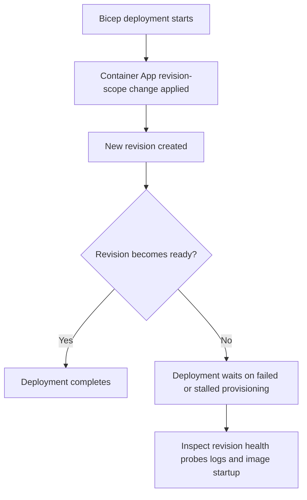

---
content_sources:
  references:
    - type: mslearn-adapted
      url: https://learn.microsoft.com/en-us/azure/container-apps/application-lifecycle-management
diagrams:
  - id: bicep-deployment-timeout-flow
    type: flowchart
    source: mslearn-adapted
    based_on:
      - https://learn.microsoft.com/en-us/azure/container-apps/application-lifecycle-management
      - https://learn.microsoft.com/en-us/azure/container-apps/revisions
      - https://learn.microsoft.com/en-us/azure/container-apps/troubleshooting
content_validation:
  status: pending_review
  last_reviewed: 2026-04-29
  reviewer: agent
  core_claims:
    - claim: "Revision-scope changes create a new revision in Azure Container Apps."
      source: https://learn.microsoft.com/en-us/azure/container-apps/revisions
      verified: false
    - claim: "Azure Container Apps uses revision lifecycle behavior during deployments and cutovers."
      source: https://learn.microsoft.com/en-us/azure/container-apps/application-lifecycle-management
      verified: false
    - claim: "Troubleshooting guidance for Container Apps includes checking provisioning, configuration, and runtime signals when deployments do not complete successfully."
      source: https://learn.microsoft.com/en-us/azure/container-apps/troubleshooting
      verified: false
---

# Bicep Deployment Timeout

## Symptom

An ARM or Bicep deployment that updates a Container App takes much longer than expected or ends with a deployment timeout while the target revision remains in `Provisioning`, `Running: Processing`, or `Provisioning failed`. The control plane accepted the template, but the workload never reached a ready state quickly enough for the deployment window.

<!-- diagram-id: bicep-deployment-timeout-flow -->


## Possible Causes

- The deployment created a new revision, but the container never became ready.
- Startup, readiness, or liveness probes are too aggressive for the application's boot time.
- Image pull, registry access, DNS, or VNet connectivity problems block provisioning.
- The template is valid syntactically, but the runtime configuration is not viable.
- Single revision mode waits for a healthy replacement revision before traffic cutover, extending deployment time.

## Diagnosis Steps

1. Check whether the deployment change was revision-scoped.
2. Inspect revision state and health instead of looking only at the deployment operation status.
3. Review system logs for probe failures, startup errors, or image pull delays.
4. Compare the failing revision with the last known good revision.

```bash
az containerapp revision list \
    --name "$APP_NAME" \
    --resource-group "$RG" \
    --output table

az containerapp revision show \
    --name "$APP_NAME" \
    --resource-group "$RG" \
    --revision "<revision-name>"

az containerapp show \
    --name "$APP_NAME" \
    --resource-group "$RG" \
    --output json
```

| Command | Why it is used |
|---|---|
| `az containerapp revision list --name "$APP_NAME" --resource-group "$RG" --output table` | Shows whether the newest revision is stuck in a failed or incomplete lifecycle state. |
| `az containerapp revision show --name "$APP_NAME" --resource-group "$RG" --revision "<revision-name>"` | Retrieves detailed state for the specific revision that is blocking the deployment. |
| `az containerapp show --name "$APP_NAME" --resource-group "$RG" --output json` | Confirms the current app configuration and whether the deployment introduced revision-scope changes. |

```bash
az containerapp logs show \
    --name "$APP_NAME" \
    --resource-group "$RG" \
    --type system
```

| Command | Why it is used |
|---|---|
| `az containerapp logs show --name "$APP_NAME" --resource-group "$RG" --type system` | Captures revision creation, provisioning, and readiness-related platform events. |

## Resolution

1. Fix the actual revision readiness issue first: probes, image startup, registry access, secret references, or network dependencies.
2. Redeploy so the platform creates a new healthy revision.
3. If the rollout is blocking production and multiple revision mode is enabled, keep traffic on the previous healthy revision until the new revision is proven healthy.
4. Reduce deployment blast radius by testing revision-scope changes separately before a full infrastructure run.

Typical focus areas:

- Increase startup probe delays for slow boot paths.
- Verify the container image and entrypoint locally before redeploying.
- Confirm ACR authentication, DNS resolution, and egress to required dependencies.
- Separate infrastructure provisioning from application revision rollout when debugging long deployments.

## Prevention

- Treat long Bicep deployments as a revision health problem first, not only a template problem.
- Keep startup paths small and predictable so readiness completes within the deployment window.
- Validate probe settings and dependent services in a pre-production environment.
- Roll out high-risk changes with multiple revisions and explicit traffic control when possible.
- Capture revision status and system logs automatically in CI/CD after each deployment.

## See Also

- [Bicep Deployment Timeout Lab](../../lab-guides/bicep-deployment-timeout.md)
- [Revision Provisioning Failure](../startup-and-provisioning/revision-provisioning-failure.md)
- [Probe Failure and Slow Start](../startup-and-provisioning/probe-failure-and-slow-start.md)

## Sources

- [Application lifecycle management in Azure Container Apps](https://learn.microsoft.com/en-us/azure/container-apps/application-lifecycle-management)
- [Revisions in Azure Container Apps](https://learn.microsoft.com/en-us/azure/container-apps/revisions)
- [Troubleshoot Azure Container Apps](https://learn.microsoft.com/en-us/azure/container-apps/troubleshooting)
