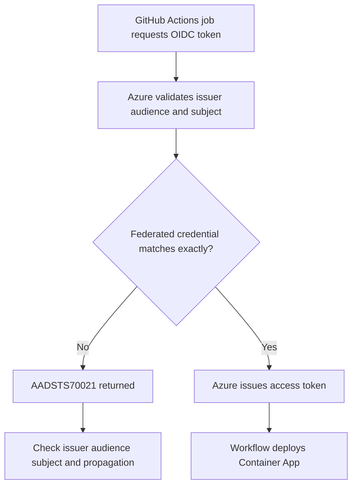

---
content_sources:
  references:
    - type: mslearn-adapted
      url: https://learn.microsoft.com/en-us/azure/developer/github/connect-from-azure-openid-connect
diagrams:
  - id: github-actions-oidc-failure-flow
    type: flowchart
    source: mslearn-adapted
    based_on:
      - https://learn.microsoft.com/en-us/azure/developer/github/connect-from-azure-openid-connect
      - https://learn.microsoft.com/en-us/entra/workload-id/workload-identity-federation
      - https://learn.microsoft.com/en-us/entra/workload-id/workload-identity-federation-considerations
content_validation:
  status: pending_review
  last_reviewed: 2026-04-29
  reviewer: agent
  core_claims:
    - claim: "GitHub Actions can use OpenID Connect to sign in to Azure without storing long-lived secrets."
      source: https://learn.microsoft.com/en-us/azure/developer/github/connect-from-azure-openid-connect
      verified: false
    - claim: "A federated identity credential must match the incoming issuer, audience, and subject claims for workload identity federation to succeed."
      source: https://learn.microsoft.com/en-us/entra/workload-id/workload-identity-federation
      verified: false
    - claim: "Federated identity credential changes can be affected by propagation timing and configuration constraints."
      source: https://learn.microsoft.com/en-us/entra/workload-id/workload-identity-federation-considerations
      verified: false
---

# GitHub Actions OIDC Failure

## Symptom

GitHub Actions deployment jobs fail during Azure sign-in or before the Container Apps deployment step runs. The workflow often reports `AADSTS70021: No matching federated identity record found for presented assertion.` and the job never obtains an Azure access token.

<!-- diagram-id: github-actions-oidc-failure-flow -->


## Possible Causes

- The federated credential subject does not exactly match the repository and branch pattern used by the workflow.
- The issuer is not `https://token.actions.githubusercontent.com`.
- The audience is not `api://AzureADTokenExchange` for the public Azure cloud scenario documented by Microsoft Learn.
- The workflow references the wrong Microsoft Entra application or service principal.
- The federated credential was just created and directory replication has not completed yet.

## Diagnosis Steps

1. Confirm the workflow is using OpenID Connect instead of a client secret.
2. Inspect the Entra application and list its federated identity credentials.
3. Compare the configured `issuer`, `audiences`, and `subject` with the workflow branch and repository.
4. Retry once after a short wait if the credential was recently created.

```bash
az ad app show \
    --id "<app-id>"

az ad app federated-credential list \
    --id "<app-id>"

az rest \
    --method GET \
    --uri "https://graph.microsoft.com/v1.0/applications(appId='<app-id>')/federatedIdentityCredentials"
```

| Command | Why it is used |
|---|---|
| `az ad app show --id "<app-id>"` | Confirms the target application object used for federation. |
| `az ad app federated-credential list --id "<app-id>"` | Lists federated credentials so you can inspect issuer, audience, and subject values. |
| `az rest --method GET --uri "https://graph.microsoft.com/v1.0/applications(appId='<app-id>')/federatedIdentityCredentials"` | Retrieves the raw Microsoft Graph representation when you need exact claim details. |

Use this matching rule for a branch-based workflow:

```text
issuer:   https://token.actions.githubusercontent.com
audience: api://AzureADTokenExchange
subject:  repo:<ORG>/<REPO>:ref:refs/heads/<BRANCH>
```

## Resolution

1. Update the federated identity credential so the subject exactly matches the GitHub repository and ref used by the deployment workflow.
2. Confirm the issuer and audience follow the Microsoft Learn guidance for GitHub Actions OIDC.
3. If the credential was created moments ago, wait briefly and rerun the workflow.
4. Keep branch-specific and environment-specific credentials explicit instead of relying on guessed patterns.

Example credential payload:

```json
{
  "name": "github-main",
  "issuer": "https://token.actions.githubusercontent.com",
  "subject": "repo:contoso/aca-guide:ref:refs/heads/main",
  "audiences": [
    "api://AzureADTokenExchange"
  ]
}
```

```bash
az ad app federated-credential create \
    --id "<app-id>" \
    --parameters "credential.json"
```

| Command | Why it is used |
|---|---|
| `az ad app federated-credential create --id "<app-id>" --parameters "credential.json"` | Creates or re-creates the federated credential with an exact JSON payload instead of relying on a partial manual configuration. |

## Prevention

- Treat the federated credential subject as an exact string contract, not a fuzzy pattern.
- Keep GitHub branch names, protected environments, and Entra credential definitions aligned in IaC or scripted provisioning.
- Add a pre-deploy validation step that lists the app's federated credentials before changing the pipeline.
- After creating or updating the credential, allow for propagation before declaring the pipeline broken.

## See Also

- [GitHub Actions OIDC Failure Lab](../../lab-guides/github-actions-oidc-failure.md)
- [Managed Identity Authentication Failure](../identity-and-configuration/managed-identity-auth-failure.md)
- [Revision Provisioning Failure](../startup-and-provisioning/revision-provisioning-failure.md)

## Sources

- [Use GitHub Actions to connect to Azure](https://learn.microsoft.com/en-us/azure/developer/github/connect-from-azure-openid-connect)
- [Workload identity federation](https://learn.microsoft.com/en-us/entra/workload-id/workload-identity-federation)
- [Considerations and unsupported scenarios for workload identity federation](https://learn.microsoft.com/en-us/entra/workload-id/workload-identity-federation-considerations)
