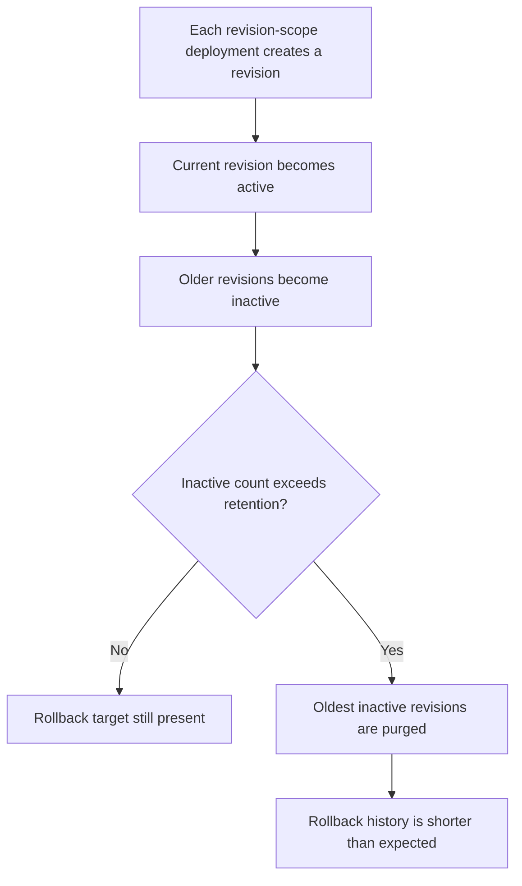

---
content_sources:
  references:
    - type: mslearn-adapted
      url: https://learn.microsoft.com/en-us/azure/container-apps/revisions
diagrams:
  - id: revision-history-limit-flow
    type: flowchart
    source: mslearn-adapted
    based_on:
      - https://learn.microsoft.com/en-us/azure/container-apps/revisions
      - https://learn.microsoft.com/en-us/azure/container-apps/revisions-manage
      - https://learn.microsoft.com/en-us/azure/container-apps/application-lifecycle-management
content_validation:
  status: pending_review
  last_reviewed: 2026-04-29
  reviewer: agent
  core_claims:
    - claim: "Azure Container Apps keeps up to 100 inactive revisions by default."
      source: https://learn.microsoft.com/en-us/azure/container-apps/revisions
      verified: false
    - claim: "The maxInactiveRevisions property controls inactive revision retention."
      source: https://learn.microsoft.com/en-us/azure/container-apps/revisions
      verified: false
    - claim: "Azure Container Apps supports manual revision activation and deactivation."
      source: https://learn.microsoft.com/en-us/azure/container-apps/revisions-manage
      verified: false
---

# Revision History Limit

## Symptom

Teams expect a long rollback history, but older inactive revisions disappear after repeated deployments. A recent deployment may still work, yet the desired rollback target is no longer available because inactive revision retention was exhausted.

<!-- diagram-id: revision-history-limit-flow -->


## Possible Causes

- Frequent image or configuration deployments create revision churn.
- The team assumed inactive revisions are a permanent release archive.
- `maxInactiveRevisions` was set too low for the release cadence.
- Multiple revision mode kept additional revisions around while newer ones continued to be created.

## Diagnosis Steps

1. List revisions and identify which are active versus inactive.
2. Check the app configuration for the inactive revision retention setting.
3. Compare the deployment frequency with the configured rollback window.

```bash
az containerapp revision list \
    --name "$APP_NAME" \
    --resource-group "$RG" \
    --query "[].{name:name,active:properties.active,createdTime:properties.createdTime}" \
    --output table

az containerapp show \
    --name "$APP_NAME" \
    --resource-group "$RG" \
    --query "properties.configuration.maxInactiveRevisions" \
    --output tsv
```

| Command | Why it is used |
|---|---|
| `az containerapp revision list --name "$APP_NAME" --resource-group "$RG" --query "[].{name:name,active:properties.active,createdTime:properties.createdTime}" --output table` | Shows the retained revision set and helps confirm whether an expected rollback target has already been purged. |
| `az containerapp show --name "$APP_NAME" --resource-group "$RG" --query "properties.configuration.maxInactiveRevisions" --output tsv` | Reveals the configured inactive revision retention limit for the app. |

## Resolution

1. Increase `maxInactiveRevisions` if the current setting is smaller than the practical rollback window.
2. Reduce unnecessary revision churn by avoiding configuration-only redeploys that create no operational value.
3. If you need long-term release history, use CI/CD release records, tags, or artifact retention rather than inactive revisions alone.
4. In multiple revision mode, deactivate unneeded revisions deliberately so the remaining history reflects meaningful rollback points.

Example Bicep fragment:

```bicep
resource app 'Microsoft.App/containerApps@2026-01-01' = {
  name: appName
  location: location
  properties: {
    configuration: {
      maxInactiveRevisions: 50
    }
  }
}
```

## Prevention

- Size `maxInactiveRevisions` from deployment frequency and rollback policy, not from the default alone.
- Keep a release ledger outside the Container Apps control plane.
- Review revision count during high-frequency deployment programs.
- Use image tags, Git commit SHAs, and CI/CD release metadata so rollback is still possible even when old inactive revisions are gone.

## See Also

- [Revision History Limit Lab](../../lab-guides/revision-history-limit.md)
- [Revision Lifecycle in Azure Container Apps](../../../platform/revisions/lifecycle.md)
- [Bad Revision Rollout and Rollback](../platform-features/bad-revision-rollout-and-rollback.md)

## Sources

- [Revisions in Azure Container Apps](https://learn.microsoft.com/en-us/azure/container-apps/revisions)
- [Manage revisions in Azure Container Apps](https://learn.microsoft.com/en-us/azure/container-apps/revisions-manage)
- [Application lifecycle management in Azure Container Apps](https://learn.microsoft.com/en-us/azure/container-apps/application-lifecycle-management)
