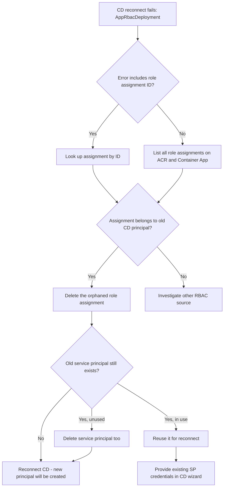

---
content_sources:
  diagrams:
    - id: troubleshooting-decision-flow
      type: flowchart
      source: mslearn-adapted
      based_on:
        - https://learn.microsoft.com/azure/container-apps/github-actions
        - https://learn.microsoft.com/azure/role-based-access-control/role-assignments-cli
        - https://learn.microsoft.com/azure/role-based-access-control/troubleshooting
content_validation:
  status: verified
  last_reviewed: "2026-04-21"
  reviewer: ai-agent
  core_claims:
    - claim: "Azure RBAC enforces a unique constraint on the combination of scope, principal, and role definition for role assignments."
      source: "https://learn.microsoft.com/azure/role-based-access-control/role-assignments-cli"
      verified: true
    - claim: "Container Apps GitHub Actions continuous deployment provisions a service principal or managed identity and grants it AcrPush and Contributor roles on the registry and Container App."
      source: "https://learn.microsoft.com/azure/container-apps/github-actions"
      verified: true
    - claim: "Disconnecting GitHub Actions continuous deployment removes the workflow and secrets but does not always remove the underlying Azure service principal or its role assignments."
      source: "https://learn.microsoft.com/azure/container-apps/github-actions"
      verified: true
---

# Continuous Deployment RBAC Role Assignment Conflict

## 1. Summary

### Symptom

When you reconnect GitHub Actions continuous deployment (CD) to a Container App after a previous disconnect, the Portal or `az containerapp github-action add` returns:

```text
AppRbacDeployment: The role assignment already exists.
The ID of the existing role assignment is <32-char-hex>.
```

The error appears during the deployment step that creates RBAC role assignments for the GitHub Actions identity (service principal or user-assigned managed identity) on the Azure Container Registry (ACR) and/or the Container App.

The CD wizard or CLI fails atomically: no new workflow is committed to the repository, and no new secrets are written. The Container App itself continues to run normally on the previous revision.

### Why this scenario is confusing

The error message suggests something about the *new* assignment is wrong, but the actual cause is leftover state from the *previous* CD setup. The Portal "Disconnect" action removes the GitHub-side artifacts (workflow file, secrets) and the workflow's CI metadata, but it does **not** reliably delete the Azure-side service principal or its role assignments.

When you reconnect using the same Container App and the same registry, Azure tries to create a role assignment with the same `(scope, principalId, roleDefinitionId)` triple. Azure RBAC rejects this because that triple is the unique key for a role assignment — you cannot have two assignments of the same role to the same principal on the same scope.

It is also confusing because the error refers to a role assignment ID, not to the principal or the role name, so you cannot tell from the message alone which permission is conflicting.

### Troubleshooting decision flow

<!-- diagram-id: troubleshooting-decision-flow -->


## 2. Common Misreadings

- "Disconnect cleans up everything." Disconnect removes GitHub workflow and secrets only; Azure-side service principal and role assignments usually remain.
- "Deleting the ACR repository fixed the secrets, so RBAC must be clean too." Deleting a repository removes images, not role assignments. Role assignments are scoped to the registry, not to repositories inside it.
- "The error mentions a new role assignment, so the new one is malformed." The error is a uniqueness conflict — the old assignment exists and blocks the new identical one.
- "Just retry the wizard." Retrying produces the same conflict because the offending assignment is still there.
- "I should grant a different role." The CD setup requires a specific set of roles; granting a different role does not satisfy the deployment template.

## 3. Competing Hypotheses

| Hypothesis | Typical Evidence For | Typical Evidence Against |
|---|---|---|
| H1: Orphaned role assignment from previous CD setup | Error includes role assignment ID; `az role assignment show` returns an assignment whose principal name matches a `<app>-github-actions-*` pattern | The principal in the conflicting assignment is unrelated to GitHub Actions |
| H2: Service principal still exists and still holds CD-related roles | `az ad sp list --display-name "$APP_NAME"` returns a CD service principal; multiple role assignments for that principal exist on ACR and Container App | No matching service principal exists in the tenant |
| H3: Stale role assignment created manually for testing | Assignment principal is a user account or a non-CD service principal | Principal display name matches the `<app>-github-actions-*` naming pattern Azure uses for CD identities |
| H4: Reusing a name with a freshly recreated service principal | The principal in the conflicting assignment was deleted but assignment lingers as orphaned | Principal is still active in Microsoft Entra ID |
| H5: Different deployment template version expects a different role set | Conflict appears even on a fresh Container App with no prior CD history | Conflict reproduces only on Container Apps that were previously connected to CD |

## 4. What to Check First

### Error message details

The error returned by the deployment includes the conflicting role assignment ID without hyphens:

```text
The ID of the existing role assignment is cbc24f76c0e047e48df985b8bc541ce0
```

Convert this 32-character hex string into a standard GUID by inserting hyphens at positions 8, 12, 16, and 20:

```text
cbc24f76-c0e0-47e4-8df9-85b8bc541ce0
```

### Platform Signals

```bash
SUBSCRIPTION_ID="<subscription-id>"
ROLE_ASSIGNMENT_ID="cbc24f76-c0e0-47e4-8df9-85b8bc541ce0"

az role assignment list \
    --subscription "$SUBSCRIPTION_ID" \
    --query "[?name=='$ROLE_ASSIGNMENT_ID']" \
    --output json

az role assignment show \
    --ids "/subscriptions/$SUBSCRIPTION_ID/providers/Microsoft.Authorization/roleAssignments/$ROLE_ASSIGNMENT_ID" \
    --output json
```

The output reveals the principal ID, role definition, and scope of the conflicting assignment, which is enough to confirm hypothesis H1.

### Cross-check related leftovers

```bash
RG="<your-resource-group>"
APP_NAME="<your-container-app-name>"
ACR_NAME="<your-acr-name>"

ACR_ID=$(az acr show --name "$ACR_NAME" --resource-group "$RG" --query id --output tsv)
APP_ID=$(az containerapp show --name "$APP_NAME" --resource-group "$RG" --query id --output tsv)

az role assignment list --scope "$ACR_ID" --output table
az role assignment list --scope "$APP_ID" --output table
az ad sp list --display-name "$APP_NAME" --query "[].{displayName:displayName, appId:appId, id:id}" --output table
```

Look for service principals whose `displayName` references the Container App name and matches the GitHub Actions naming pattern that Azure generates during CD setup.

## 5. Evidence to Collect

### Required Evidence

| Evidence | Command/Query | Purpose |
|---|---|---|
| Conflicting assignment details | `az role assignment show --ids "/subscriptions/$SUBSCRIPTION_ID/providers/Microsoft.Authorization/roleAssignments/$ROLE_ASSIGNMENT_ID" --output json` | Identifies principal, role, and scope of the blocking assignment |
| All role assignments on ACR | `az role assignment list --scope "$ACR_ID" --output table` | Reveals all CD-related and unrelated assignments on registry scope |
| All role assignments on Container App | `az role assignment list --scope "$APP_ID" --output table` | Reveals all CD-related and unrelated assignments on app scope |
| Candidate service principals | `az ad sp list --display-name "$APP_NAME" --output table` | Confirms whether the previous CD service principal is still in the tenant |
| Container App CD configuration | `az containerapp github-action show --name "$APP_NAME" --resource-group "$RG"` | Confirms whether CD is currently considered connected from the Azure side |

### Useful Context

- Record when the previous CD was disconnected and what cleanup was performed (workflow deletion, secret deletion, ACR repository deletion).
- Record whether the previous CD used a system-assigned managed identity, a user-assigned managed identity, or a service principal.
- Record whether the same Container App or a recreated one with the same name is involved.
- Record whether the GitHub repository is the same as before or a different one.

## 6. Validation and Disproof by Hypothesis

### H1: Orphaned role assignment from previous CD setup

**Signals that support:**

- `az role assignment show` returns an assignment whose `roleDefinitionName` is `AcrPush`, `Contributor`, or another role used by Container Apps CD setup.
- The `principalName` (or `principalId`) corresponds to a service principal whose display name references the Container App name.
- The `createdOn` timestamp predates your reconnect attempt.

**Signals that weaken:**

- The assignment was created today and references a principal you just provisioned manually.

**What to verify:**

```bash
az role assignment show \
    --ids "/subscriptions/$SUBSCRIPTION_ID/providers/Microsoft.Authorization/roleAssignments/$ROLE_ASSIGNMENT_ID" \
    --query "{principal:principalName, role:roleDefinitionName, scope:scope, created:createdOn}" \
    --output json
```

### H2: Service principal still exists and still holds CD-related roles

**Signals that support:**

- `az ad sp list --display-name "$APP_NAME"` returns one or more matching SPs.
- Listing role assignments by that SP's `appId` returns multiple assignments across ACR and Container App scopes.

**Signals that weaken:**

- No service principal with a related display name exists.
- The conflicting assignment's principal does not appear in the SP list.

**What to verify:**

```bash
SP_APP_ID="<appId-from-previous-step>"
az role assignment list --assignee "$SP_APP_ID" --all --output table
```

### H3: Stale role assignment created manually for testing

**Signals that support:**

- The conflicting assignment's principal is a user account (`principalType` is `User`) or a service principal unrelated to GitHub Actions.
- The display name has no connection to the Container App.

**Signals that weaken:**

- The assignment principal name follows Azure's CD-generated SP naming convention.

**What to verify:**

```bash
az role assignment show \
    --ids "/subscriptions/$SUBSCRIPTION_ID/providers/Microsoft.Authorization/roleAssignments/$ROLE_ASSIGNMENT_ID" \
    --query "principalType" \
    --output tsv
```

### H4: Reusing a name with a freshly recreated service principal

**Signals that support:**

- The `principalId` in the conflicting assignment cannot be resolved to an active object in Microsoft Entra ID.
- `az ad sp show --id <principalId>` returns "not found".

**Signals that weaken:**

- The principal resolves and has an active Microsoft Entra object.

**What to verify:**

```bash
PRINCIPAL_ID=$(az role assignment show \
    --ids "/subscriptions/$SUBSCRIPTION_ID/providers/Microsoft.Authorization/roleAssignments/$ROLE_ASSIGNMENT_ID" \
    --query "principalId" --output tsv)
az ad sp show --id "$PRINCIPAL_ID" --output json
```

### H5: Different deployment template version expects a different role set

**Signals that support:**

- Conflict appears even when there is no prior CD history on this Container App and no matching service principal exists.
- The conflicting assignment principal is owned by an Azure platform service.

**Signals that weaken:**

- Conflict reproduces consistently only after a previous CD disconnect on the same Container App.

**What to verify:** This is rare. Confirm by attempting CD setup on a fresh Container App in a clean resource group and observing whether the same error appears.

## 7. Likely Root Cause Patterns

| Pattern | Frequency | First Signal | Typical Resolution |
|---|---|---|---|
| Orphaned `AcrPush` assignment on registry scope | High | Error references registry scope; principal is `<app>-github-actions-*` | Delete the orphaned assignment by ID, then reconnect |
| Orphaned `Contributor` assignment on Container App scope | High | Error references Container App scope | Delete the orphaned assignment by ID, then reconnect |
| Multiple orphaned assignments across ACR and app | Medium | First retry succeeds past one role and fails on the next | Delete all orphaned assignments before retrying |
| Stale service principal still active and re-selected by wizard | Medium | Same SP exists with `<app>-github-actions-*` name | Either reuse the SP (if you have its credentials) or delete it along with assignments |
| Tenant-wide role assignment cleanup policy lag | Low | Assignment exists but principal is missing | Delete the orphaned assignment by ID |

## 8. Immediate Mitigations

1. Convert the role assignment ID from the error message into GUID format and capture the assignment details.

    ```bash
    SUBSCRIPTION_ID="<subscription-id>"
    ROLE_ASSIGNMENT_ID="cbc24f76-c0e0-47e4-8df9-85b8bc541ce0"
    az role assignment show \
        --ids "/subscriptions/$SUBSCRIPTION_ID/providers/Microsoft.Authorization/roleAssignments/$ROLE_ASSIGNMENT_ID" \
        --output json
    ```

2. Delete the conflicting role assignment.

    ```bash
    az role assignment delete \
        --ids "/subscriptions/$SUBSCRIPTION_ID/providers/Microsoft.Authorization/roleAssignments/$ROLE_ASSIGNMENT_ID"
    ```

3. List remaining role assignments on the ACR and Container App scopes and remove any other CD-related orphans.

    ```bash
    az role assignment list --scope "$ACR_ID" --output table
    az role assignment list --scope "$APP_ID" --output table
    ```

4. Optionally delete the orphaned service principal if it is no longer used.

    ```bash
    az ad sp delete --id "<appId>"
    ```

5. Retry CD reconnect from the Portal or via CLI.

    ```bash
    az containerapp github-action add \
        --name "$APP_NAME" \
        --resource-group "$RG" \
        --repo-url "https://github.com/<owner>/<repo>" \
        --branch main \
        --registry-url "${ACR_NAME}.azurecr.io" \
        --service-principal-client-id "<client-id>" \
        --service-principal-client-secret "<secret>" \
        --service-principal-tenant-id "<tenant-id>"
    ```

6. Verify the new CD configuration is registered.

    ```bash
    az containerapp github-action show --name "$APP_NAME" --resource-group "$RG" --output json
    ```

## 9. Prevention

- Treat CD disconnect as a multi-step cleanup: workflow file, GitHub secrets, Azure service principal, and Azure role assignments.
- Script the disconnect path in a runbook so leftover RBAC is removed deterministically.
- Manage CD identities and their role assignments in IaC (Bicep or Terraform) so disconnects show up as code changes and orphaned assignments are obvious in drift detection.
- Use distinct Container App names per environment to avoid recycling the exact `(scope, principal, role)` triple.
- Document which identity model your team uses for CD (system-assigned MI, user-assigned MI, or service principal) so reconnects always pick the same option.
- Add a pre-flight check before reconnect that lists role assignments on the registry and app scopes and warns about CD-related leftovers.
- Keep the role assignment ID returned by failures in your incident notes; it is the fastest path to root cause for future occurrences.

## See Also

- [CD Reconnect RBAC Conflict Lab](../../lab-guides/cd-reconnect-rbac-conflict.md)
- [Managed Identity Auth Failure](managed-identity-auth-failure.md)
- [Secret and Key Vault Reference Failure](secret-and-key-vault-reference-failure.md)

## Sources

- https://learn.microsoft.com/azure/container-apps/github-actions
- https://learn.microsoft.com/azure/role-based-access-control/role-assignments-cli
- https://learn.microsoft.com/azure/role-based-access-control/troubleshooting
- https://learn.microsoft.com/azure/role-based-access-control/role-assignments-list-cli
