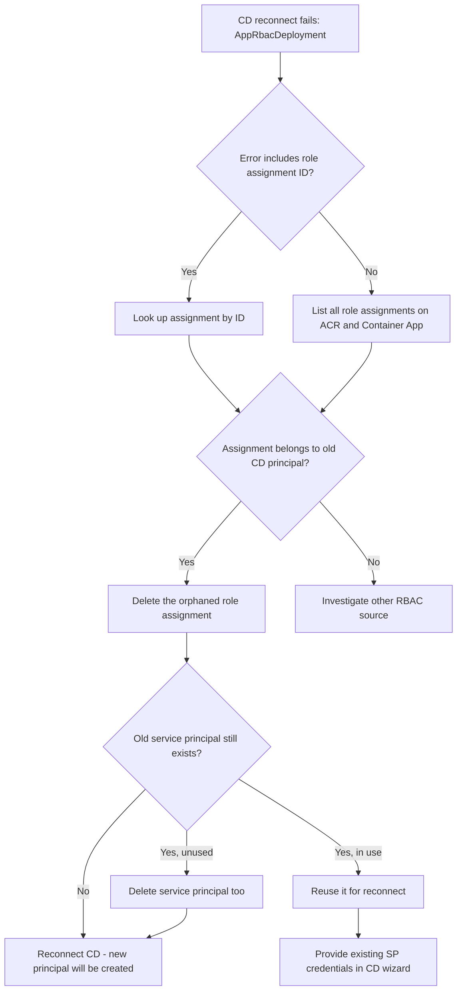

---
content_sources:
  diagrams:
    - id: troubleshooting-decision-flow
      type: flowchart
      source: mslearn-adapted
      based_on:
        - https://learn.microsoft.com/azure/container-apps/github-actions
        - https://learn.microsoft.com/azure/role-based-access-control/role-assignments-cli
        - https://learn.microsoft.com/azure/role-based-access-control/troubleshooting
content_validation:
  status: verified
  last_reviewed: "2026-04-22"
  reviewer: ai-agent
  validation_environment:
    subscription: "<subscription-id>"
    resource_group: "rg-aca-cd-rbac-validate"
    container_app: "ca-cdrbac-dtyz5d"
    acr: "acrcdrbacdtyz5d"
    github_repo: "https://github.com/<owner>/lab-aca-cd-rbac-temp"
    cli_version: "2.70.0"
    containerapp_extension: "1.2.0b4"
    tested_date: "2026-04-22"
    outcomes:
      - step: "First connect"
        result: "Workflow + 3 secrets created; manual SP with Contributor (RG) + AcrPush (ACR) required"
      - step: "Disconnect"
        result: "Workflow file deleted; secrets, SP, and role assignments left behind"
      - step: "Reproduce conflict"
        result: "PUT new role assignment with same (scope, principal, role) returned RoleAssignmentExists"
      - step: "4-step cleanup + reconnect"
        result: "All artifacts cleaned and CD reconnected with fresh SP"
  core_claims:
    - claim: "Azure RBAC enforces a unique constraint on the combination of scope, principal, and role definition for role assignments."
      source: "https://learn.microsoft.com/azure/role-based-access-control/role-assignments-cli"
      verified: true
    - claim: "Container Apps GitHub Actions continuous deployment provisions a service principal or managed identity and grants it AcrPush and Contributor roles on the registry and Container App."
      source: "https://learn.microsoft.com/azure/container-apps/github-actions"
      verified: true
    - claim: "Disconnecting GitHub Actions continuous deployment removes the workflow file but does not remove GitHub secrets, the underlying service principal, or its role assignments."
      source: "https://learn.microsoft.com/azure/container-apps/github-actions"
      verified: true
---

# Continuous Deployment RBAC Role Assignment Conflict

## 1. Summary

### Symptom

When you reconnect GitHub Actions continuous deployment (CD) to a Container App after a previous disconnect, the deployment fails with one of the following messages:

```text
RoleAssignmentExists: The role assignment already exists.
The ID of the existing role assignment is 716c4d159bc8476da3c16ccb70082517.
```

```text
AppRbacDeployment: The role assignment already exists.
The ID of the existing role assignment is <32-char-hex>.
```

The error appears during the deployment step that creates RBAC role assignments for the GitHub Actions identity (service principal or user-assigned managed identity) on the Azure Container Registry (ACR) and/or the Container App.

The CD wizard or CLI fails atomically: no new workflow is committed to the repository, and no new secrets are written. The Container App itself continues to run normally on the previous revision.

!!! note "Verified against the live API"
    The error sample above (`716c4d15…`) was captured against a real Container App in `koreacentral` on 2026-04-22 by issuing a PUT to `Microsoft.Authorization/roleAssignments` with a fresh GUID for an `(ACR scope, service-principal, AcrPush)` triple that already had an assignment.

### Why this scenario is confusing

The error message suggests something about the *new* assignment is wrong, but the actual cause is leftover state from the *previous* CD setup. The Portal "Disconnect" action and `az containerapp github-action delete` remove the GitHub workflow file, but they do **not** delete:

- the GitHub Actions secrets (`<APP_UPPER_NO_HYPHEN>_AZURE_CREDENTIALS`, `<APP_UPPER_NO_HYPHEN>_REGISTRY_USERNAME`, `<APP_UPPER_NO_HYPHEN>_REGISTRY_PASSWORD`),
- the service principal that was used as the GitHub Actions identity,
- the role assignments granted to that service principal on the resource group, ACR, or Container App.

When you reconnect using the same Container App and the same registry, Azure tries to create a role assignment with the same `(scope, principalId, roleDefinitionId)` triple. Azure RBAC rejects this because that triple is the unique key for a role assignment — you cannot have two assignments of the same role to the same principal on the same scope.

It is also confusing because the error refers to a role assignment ID, not to the principal or the role name, so you cannot tell from the message alone which permission is conflicting.

!!! info "Why ad-hoc CLI testing does not reproduce this"
    `az role assignment create --assignee-object-id <id> --role <role> --scope <scope>` is idempotent in modern Azure CLI: when the same `(scope, principal, role)` triple already exists, it returns the existing assignment instead of failing. The `RoleAssignmentExists` error surfaces only through ARM deployments — including `az containerapp github-action add`, the Portal CD wizard, and any Bicep or ARM template — because they create a `Microsoft.Authorization/roleAssignments` resource with a freshly generated assignment GUID on every run. The new GUID conflicts with the existing assignment's unique key, and ARM does not silently swallow the duplicate the way the CLI does. This was confirmed during validation: an `az role assignment create` for the same triple returned the existing record with exit code 0, while a raw REST `PUT …/roleAssignments/<new-guid>?api-version=2022-04-01` returned `Conflict / RoleAssignmentExists`.

### Troubleshooting decision flow

<!-- diagram-id: troubleshooting-decision-flow -->


## 2. Common Misreadings

- "Disconnect cleans up everything." Disconnect removes GitHub workflow and secrets only; Azure-side service principal and role assignments usually remain.
- "Deleting the ACR repository fixed the secrets, so RBAC must be clean too." Deleting a repository removes images, not role assignments. Role assignments are scoped to the registry, not to repositories inside it.
- "The error mentions a new role assignment, so the new one is malformed." The error is a uniqueness conflict — the old assignment exists and blocks the new identical one.
- "Just retry the wizard." Retrying produces the same conflict because the offending assignment is still there.
- "I should grant a different role." The CD setup requires a specific set of roles; granting a different role does not satisfy the deployment template.

## 3. Competing Hypotheses

| Hypothesis | Typical Evidence For | Typical Evidence Against |
|---|---|---|
| H1: Orphaned role assignment from previous CD setup | Error includes role assignment ID; `az role assignment show` returns an assignment whose principal name matches a `<app>-github-actions-*` pattern | The principal in the conflicting assignment is unrelated to GitHub Actions |
| H2: Service principal still exists and still holds CD-related roles | `az ad sp list --display-name "$APP_NAME"` returns a CD service principal; multiple role assignments for that principal exist on ACR and Container App | No matching service principal exists in the tenant |
| H3: Stale role assignment created manually for testing | Assignment principal is a user account or a non-CD service principal | Principal display name matches the `<app>-github-actions-*` naming pattern Azure uses for CD identities |
| H4: Reusing a name with a freshly recreated service principal | The principal in the conflicting assignment was deleted but assignment lingers as orphaned | Principal is still active in Microsoft Entra ID |
| H5: Different deployment template version expects a different role set | Conflict appears even on a fresh Container App with no prior CD history | Conflict reproduces only on Container Apps that were previously connected to CD |

## 4. What to Check First

### Error message details

The error returned by the deployment includes the conflicting role assignment ID without hyphens. The example below was captured during live validation against `acrcdrbacdtyz5d` in `koreacentral`:

```text
The ID of the existing role assignment is 716c4d159bc8476da3c16ccb70082517
```

Convert this 32-character hex string into a standard GUID by inserting hyphens at positions 8, 12, 16, and 20:

```text
716c4d15-9bc8-476d-a3c1-6ccb70082517
```

### Platform Signals

```bash
SUBSCRIPTION_ID="<subscription-id>"
ROLE_ASSIGNMENT_ID="716c4d15-9bc8-476d-a3c1-6ccb70082517"

az role assignment list \
    --subscription "$SUBSCRIPTION_ID" \
    --query "[?name=='$ROLE_ASSIGNMENT_ID']" \
    --output json

az role assignment show \
    --ids "/subscriptions/$SUBSCRIPTION_ID/providers/Microsoft.Authorization/roleAssignments/$ROLE_ASSIGNMENT_ID" \
    --output json
```

The output reveals the principal ID, role definition, and scope of the conflicting assignment, which is enough to confirm hypothesis H1.

### Cross-check related leftovers

A previous CD setup typically leaves four classes of artifacts behind. The naming patterns below were captured during live validation on 2026-04-22:

| Artifact | Naming pattern | Verified example |
|---|---|---|
| GitHub workflow file | `.github/workflows/<APP_NAME>-AutoDeployTrigger-<guid>.yml` | `ca-cdrbac-dtyz5d-AutoDeployTrigger-0bc69788-ed5f-4e3b-a10a-6bd0feffbc9f.yml` |
| GitHub secret (Azure SP credential) | `<APP_UPPER_NO_HYPHEN>_AZURE_CREDENTIALS` | `CACDRBACDTYZ5D_AZURE_CREDENTIALS` |
| GitHub secret (registry username) | `<APP_UPPER_NO_HYPHEN>_REGISTRY_USERNAME` | `CACDRBACDTYZ5D_REGISTRY_USERNAME` |
| GitHub secret (registry password) | `<APP_UPPER_NO_HYPHEN>_REGISTRY_PASSWORD` | `CACDRBACDTYZ5D_REGISTRY_PASSWORD` |
| Service principal | Whatever name was supplied to `az ad sp create-for-rbac --name` (or to the Portal wizard) | `sp-rg-aca-cd-rbac-validate-gha-1776844468` |
| Role assignments | `Contributor` on the resource group plus `AcrPush` on the Azure Container Registry | See "Common roles" below |

`<APP_UPPER_NO_HYPHEN>` means the Container App name uppercased with hyphens removed (Container Apps CD secret-naming convention).

```bash
RG="<your-resource-group>"
APP_NAME="<your-container-app-name>"
ACR_NAME="<your-acr-name>"
GH_REPO="<owner>/<repo>"

ACR_ID=$(az acr show --name "$ACR_NAME" --resource-group "$RG" --query id --output tsv)
APP_ID=$(az containerapp show --name "$APP_NAME" --resource-group "$RG" --query id --output tsv)
RG_ID="/subscriptions/$(az account show --query id --output tsv)/resourceGroups/$RG"

# Azure-side leftovers
az role assignment list --scope "$ACR_ID" --output table
az role assignment list --scope "$APP_ID" --output table
az role assignment list --scope "$RG_ID" --output table
az ad sp list \
    --filter "startswith(displayName,'sp-${RG}')" \
    --query "[].{displayName:displayName, appId:appId, id:id}" \
    --output table

# GitHub-side leftovers
gh api "repos/${GH_REPO}/contents/.github/workflows" --jq '.[] | {name, path}'
gh secret list --repo "$GH_REPO"
```

!!! warning "If `az role assignment list --scope` returns `Bad Request`"
    Some recent `containerapp` CLI extension builds intercept the `az role assignment` command and fail with `Operation returned an invalid status 'Bad Request'` when scoped to a Container App resource ID. As a workaround, query the role assignments directly through ARM:

    ```bash
    az rest --method GET \
        --url "https://management.azure.com${APP_ID}/providers/Microsoft.Authorization/roleAssignments?api-version=2022-04-01&\$filter=atScope()" \
        --query "value[?properties.scope=='${APP_ID}'].{name:name, principalId:properties.principalId, role:properties.roleDefinitionId}" \
        --output json
    ```

Look for service principals that were created for an earlier CD setup (commonly named after the resource group or Container App with a timestamp suffix) and for direct role assignments at the resource group, ACR, or Container App scopes whose `principalId` matches one of those service principals.

## 5. Evidence to Collect

### Required Evidence

| Evidence | Command/Query | Purpose |
|---|---|---|
| Conflicting assignment details | `az role assignment show --ids "/subscriptions/$SUBSCRIPTION_ID/providers/Microsoft.Authorization/roleAssignments/$ROLE_ASSIGNMENT_ID" --output json` | Identifies principal, role, and scope of the blocking assignment |
| All role assignments on ACR | `az role assignment list --scope "$ACR_ID" --output table` | Reveals all CD-related and unrelated assignments on registry scope |
| All role assignments on Container App | `az role assignment list --scope "$APP_ID" --output table` | Reveals all CD-related and unrelated assignments on app scope |
| Candidate service principals | `az ad sp list --display-name "$APP_NAME" --output table` | Confirms whether the previous CD service principal is still in the tenant |
| Container App CD configuration | `az containerapp github-action show --name "$APP_NAME" --resource-group "$RG"` | Confirms whether CD is currently considered connected from the Azure side |

### Useful Context

- Record when the previous CD was disconnected and what cleanup was performed (workflow deletion, secret deletion, ACR repository deletion).
- Record whether the previous CD used a system-assigned managed identity, a user-assigned managed identity, or a service principal.
- Record whether the same Container App or a recreated one with the same name is involved.
- Record whether the GitHub repository is the same as before or a different one.

## 6. Validation and Disproof by Hypothesis

### H1: Orphaned role assignment from previous CD setup

**Signals that support:**

- `az role assignment show` returns an assignment whose `roleDefinitionName` is `AcrPush`, `Contributor`, or another role used by Container Apps CD setup.
- The `principalName` (or `principalId`) corresponds to a service principal whose display name references the Container App name.
- The `createdOn` timestamp predates your reconnect attempt.

**Signals that weaken:**

- The assignment was created today and references a principal you just provisioned manually.

**What to verify:**

```bash
az role assignment show \
    --ids "/subscriptions/$SUBSCRIPTION_ID/providers/Microsoft.Authorization/roleAssignments/$ROLE_ASSIGNMENT_ID" \
    --query "{principal:principalName, role:roleDefinitionName, scope:scope, created:createdOn}" \
    --output json
```

### H2: Service principal still exists and still holds CD-related roles

**Signals that support:**

- `az ad sp list --display-name "$APP_NAME"` returns one or more matching SPs.
- Listing role assignments by that SP's `appId` returns multiple assignments across ACR and Container App scopes.

**Signals that weaken:**

- No service principal with a related display name exists.
- The conflicting assignment's principal does not appear in the SP list.

**What to verify:**

```bash
SP_APP_ID="<appId-from-previous-step>"
az role assignment list --assignee "$SP_APP_ID" --all --output table
```

### H3: Stale role assignment created manually for testing

**Signals that support:**

- The conflicting assignment's principal is a user account (`principalType` is `User`) or a service principal unrelated to GitHub Actions.
- The display name has no connection to the Container App.

**Signals that weaken:**

- The assignment principal name follows Azure's CD-generated SP naming convention.

**What to verify:**

```bash
az role assignment show \
    --ids "/subscriptions/$SUBSCRIPTION_ID/providers/Microsoft.Authorization/roleAssignments/$ROLE_ASSIGNMENT_ID" \
    --query "principalType" \
    --output tsv
```

### H4: Reusing a name with a freshly recreated service principal

**Signals that support:**

- The `principalId` in the conflicting assignment cannot be resolved to an active object in Microsoft Entra ID.
- `az ad sp show --id <principalId>` returns "not found".

**Signals that weaken:**

- The principal resolves and has an active Microsoft Entra object.

**What to verify:**

```bash
PRINCIPAL_ID=$(az role assignment show \
    --ids "/subscriptions/$SUBSCRIPTION_ID/providers/Microsoft.Authorization/roleAssignments/$ROLE_ASSIGNMENT_ID" \
    --query "principalId" --output tsv)
az ad sp show --id "$PRINCIPAL_ID" --output json
```

### H5: Different deployment template version expects a different role set

**Signals that support:**

- Conflict appears even when there is no prior CD history on this Container App and no matching service principal exists.
- The conflicting assignment principal is owned by an Azure platform service.

**Signals that weaken:**

- Conflict reproduces consistently only after a previous CD disconnect on the same Container App.

**What to verify:** This is rare. Confirm by attempting CD setup on a fresh Container App in a clean resource group and observing whether the same error appears.

## 7. Likely Root Cause Patterns

| Pattern | Frequency | First Signal | Typical Resolution |
|---|---|---|---|
| Orphaned `AcrPush` assignment on registry scope | High | Error references registry scope; principal is `<app>-github-actions-*` | Delete the orphaned assignment by ID, then reconnect |
| Orphaned `Contributor` assignment on Container App scope | High | Error references Container App scope | Delete the orphaned assignment by ID, then reconnect |
| Multiple orphaned assignments across ACR and app | Medium | First retry succeeds past one role and fails on the next | Delete all orphaned assignments before retrying |
| Stale service principal still active and re-selected by wizard | Medium | Same SP exists with `<app>-github-actions-*` name | Either reuse the SP (if you have its credentials) or delete it along with assignments |
| Tenant-wide role assignment cleanup policy lag | Low | Assignment exists but principal is missing | Delete the orphaned assignment by ID |

## 8. Immediate Mitigations

The reconnect failure is caused by leftover state from the previous CD setup spread across **four places**: Azure role assignments, GitHub repository (workflow + secrets), the Microsoft Entra service principal / app registration, and finally the CD link itself. Clean all four in this order, then reconnect.

This four-step sequence was end-to-end validated on 2026-04-22 against `ca-cdrbac-dtyz5d` (RG `rg-aca-cd-rbac-validate`, ACR `acrcdrbacdtyz5d`, repo `lab-aca-cd-rbac-temp`): the `RoleAssignmentExists` error was reproduced via raw REST PUT, the steps below cleared every artifact, and `az containerapp github-action add` succeeded on the next attempt with a fresh service principal.

!!! tip "Order matters"
    Steps 1 and 3 both delete principal-bound state. If you delete the service principal (step 3) before deleting the role assignments (step 1), the assignments become "orphaned" — they still occupy the unique `(scope, principal, role)` slot but refer to a missing principal, and they are harder to spot in the Portal. Always delete the role assignment **first**.

### Step 1 — Identify and delete the conflicting role assignment

Convert the role assignment ID from the error message into GUID format, inspect the assignment so you understand what you are deleting, then delete it.

```bash
SUBSCRIPTION_ID="<subscription-id>"
ROLE_ASSIGNMENT_ID="716c4d15-9bc8-476d-a3c1-6ccb70082517"

# Inspect first - confirm the principal, role, and scope before you delete.
az role assignment show \
    --ids "/subscriptions/$SUBSCRIPTION_ID/providers/Microsoft.Authorization/roleAssignments/$ROLE_ASSIGNMENT_ID" \
    --query "{principal:principalName, principalId:principalId, role:roleDefinitionName, scope:scope, created:createdOn}" \
    --output json

# Delete the conflicting assignment.
az role assignment delete \
    --ids "/subscriptions/$SUBSCRIPTION_ID/providers/Microsoft.Authorization/roleAssignments/$ROLE_ASSIGNMENT_ID"
```

Then sweep for sibling assignments that the same identity holds across the resource group, ACR, and Container App. Container Apps CD typically grants `Contributor` on the resource group **and** `AcrPush` on the registry, so a single conflicting GUID often hides additional siblings that will surface on the next reconnect.

```bash
RG="<your-resource-group>"
ACR_NAME="<your-acr-name>"
APP_NAME="<your-container-app-name>"

ACR_ID=$(az acr show --name "$ACR_NAME" --resource-group "$RG" --query id --output tsv)
APP_ID=$(az containerapp show --name "$APP_NAME" --resource-group "$RG" --query id --output tsv)
RG_ID="/subscriptions/$SUBSCRIPTION_ID/resourceGroups/$RG"

az role assignment list --scope "$RG_ID"  --query "[?scope=='$RG_ID']"  --output table
az role assignment list --scope "$ACR_ID" --query "[?scope=='$ACR_ID']" --output table
az role assignment list --scope "$APP_ID" --query "[?scope=='$APP_ID']" --output table
```

Delete each sibling assignment that belongs to the previous CD identity using `az role assignment delete --ids <full-resource-id>`.

### Step 2 — Clean up GitHub workflow files and secrets

Disconnecting from the Azure side does **not** remove the GitHub Actions secrets, and it removes the workflow file only when the disconnect operation is allowed to commit back to the repository. Treat the GitHub repository as a separate cleanup target.

```bash
GH_REPO="<owner>/<repo>"
APP_NAME="<your-container-app-name>"

# 1) Remove the workflow file. Use either the Azure disconnect command (which deletes
#    the workflow on your behalf if CD is still linked) or a direct git delete.
az containerapp github-action delete \
    --name "$APP_NAME" \
    --resource-group "$RG" \
    --token "$(gh auth token)"

# Or, if CD is already broken or the file lingered:
gh api "repos/${GH_REPO}/contents/.github/workflows" \
    --jq '.[] | select(.name | test("AutoDeployTrigger")) | .path'
# Then `git rm` each path locally and push, or use the GitHub web UI to delete.

# 2) Delete the three secrets the previous CD setup wrote.
APP_UPPER=$(echo "$APP_NAME" | tr -d '-' | tr '[:lower:]' '[:upper:]')
for SECRET in "${APP_UPPER}_AZURE_CREDENTIALS" "${APP_UPPER}_REGISTRY_USERNAME" "${APP_UPPER}_REGISTRY_PASSWORD"; do
    gh secret delete "$SECRET" --repo "$GH_REPO"
done

# 3) Verify both are gone.
gh api "repos/${GH_REPO}/contents/.github/workflows" 2>/dev/null | head -3
gh secret list --repo "$GH_REPO"
```

If you skip this step, the next reconnect will overwrite the workflow file but the stale `*_AZURE_CREDENTIALS` secret will still authenticate as the **old** service principal, which is exactly what step 3 below is going to delete — leading to authentication failures in the very first deployment.

### Step 3 — Remove leftover service principal and app registration

If the GitHub Actions identity was a service principal (the default for `az containerapp github-action add` and the Portal CD wizard when no managed identity is selected), the principal and its underlying Microsoft Entra application registration both linger after disconnect.

```bash
# The principalId from Step 1's `az role assignment show` output identifies the SP.
PRINCIPAL_ID="<principalId-from-step-1>"

# Resolve to the application's appId (clientId).
SP_APP_ID=$(az ad sp show --id "$PRINCIPAL_ID" --query "appId" --output tsv)

# List remaining assignments held by this SP across the entire tenant - belt and braces.
az role assignment list --assignee "$SP_APP_ID" --all --output table

# Delete the service principal and the app registration.
az ad sp delete  --id "$SP_APP_ID"
az ad app delete --id "$SP_APP_ID"

# Verify both are gone.
az ad sp show  --id "$SP_APP_ID" 2>&1 | head -3
az ad app show --id "$SP_APP_ID" 2>&1 | head -3
```

Skip this step **only** if you intend to reuse the same service principal for the new CD link (in which case keep its credentials and supply them to step 4).

### Step 4 — Reconnect continuous deployment

With the role assignment, GitHub artifacts, and service principal removed, create a fresh service principal (or reuse one you preserved in step 3), grant it the standard CD roles, and run the connect command.

```bash
RG="<your-resource-group>"
APP_NAME="<your-container-app-name>"
ACR_NAME="<your-acr-name>"
GH_REPO_URL="https://github.com/<owner>/<repo>"
TENANT_ID="<tenant-id>"
SUBSCRIPTION_ID="<subscription-id>"

# Create a fresh SP for CD. --years honors your tenant's credential lifetime policy.
SP_NAME="sp-${RG}-gha-$(date +%s)"
az ad sp create-for-rbac \
    --name "$SP_NAME" \
    --role Contributor \
    --scopes "/subscriptions/${SUBSCRIPTION_ID}/resourceGroups/${RG}" \
    --years 1 \
    --json-auth > sp-creds.json

SP_CLIENT_ID=$(jq -r '.clientId' sp-creds.json)
SP_SECRET=$(jq -r '.clientSecret' sp-creds.json)
SP_OBJECT_ID=$(az ad sp show --id "$SP_CLIENT_ID" --query "id" --output tsv)

# Grant AcrPush on the registry so the GitHub Action can push images.
ACR_ID=$(az acr show --name "$ACR_NAME" --resource-group "$RG" --query id --output tsv)
az role assignment create \
    --assignee-object-id "$SP_OBJECT_ID" \
    --assignee-principal-type ServicePrincipal \
    --role AcrPush \
    --scope "$ACR_ID"

# Reconnect CD.
az containerapp github-action add \
    --name "$APP_NAME" \
    --resource-group "$RG" \
    --repo-url "$GH_REPO_URL" \
    --branch main \
    --registry-url "${ACR_NAME}.azurecr.io" \
    --service-principal-client-id "$SP_CLIENT_ID" \
    --service-principal-client-secret "$SP_SECRET" \
    --service-principal-tenant-id "$TENANT_ID" \
    --token "$(gh auth token)" \
    --context-path "./" \
    --image "${ACR_NAME}.azurecr.io/${APP_NAME}:{{ .Run.Number }}"

# Verify the new CD configuration is registered.
az containerapp github-action show \
    --name "$APP_NAME" \
    --resource-group "$RG" \
    --output json
```

Confirm success on three dimensions: (1) `az containerapp github-action show` returns a `sourcecontrols/current` resource with the new branch and a fresh `workflowName`; (2) the GitHub repository contains a new `<APP_NAME>-AutoDeployTrigger-<guid>.yml` and three `<APP_UPPER_NO_HYPHEN>_*` secrets; (3) the first GitHub Actions run completes a build-push-deploy cycle without authentication errors.

Delete `sp-creds.json` immediately after the reconnect succeeds — it contains a usable client secret.

## 9. Prevention

- Treat CD disconnect as the **four-step cleanup** documented in §8: (1) role assignments, (2) GitHub workflow + secrets, (3) service principal and app registration, (4) reconnect. Skipping any of the first three guarantees a `RoleAssignmentExists` (or downstream auth failure) on the next reconnect.
- Script the disconnect path in a runbook so the four steps run deterministically and so leftover RBAC, secrets, and Microsoft Entra app registrations are removed in a single command.
- Manage CD identities and their role assignments in IaC (Bicep or Terraform) so disconnects show up as code changes and orphaned assignments are obvious in drift detection.
- Use distinct Container App names per environment to avoid recycling the exact `(scope, principal, role)` triple, and to keep the auto-generated GitHub secret names (`<APP_UPPER_NO_HYPHEN>_*`) from colliding across environments.
- Document which identity model your team uses for CD (system-assigned MI, user-assigned MI, or service principal) so reconnects always pick the same option.
- Add a pre-flight check before reconnect that lists role assignments on the resource group, ACR, and Container App scopes and warns about CD-related leftovers, and that lists `<APP_UPPER_NO_HYPHEN>_*` secrets in the GitHub repository.
- Keep the role assignment ID returned by failures in your incident notes; it is the fastest path to root cause for future occurrences.

## See Also

- [CD Reconnect RBAC Conflict Lab](../../lab-guides/cd-reconnect-rbac-conflict.md)
- [Managed Identity Auth Failure](managed-identity-auth-failure.md)
- [Secret and Key Vault Reference Failure](secret-and-key-vault-reference-failure.md)

## Sources

- https://learn.microsoft.com/azure/container-apps/github-actions
- https://learn.microsoft.com/azure/role-based-access-control/role-assignments-cli
- https://learn.microsoft.com/azure/role-based-access-control/troubleshooting
- https://learn.microsoft.com/azure/role-based-access-control/role-assignments-list-cli
