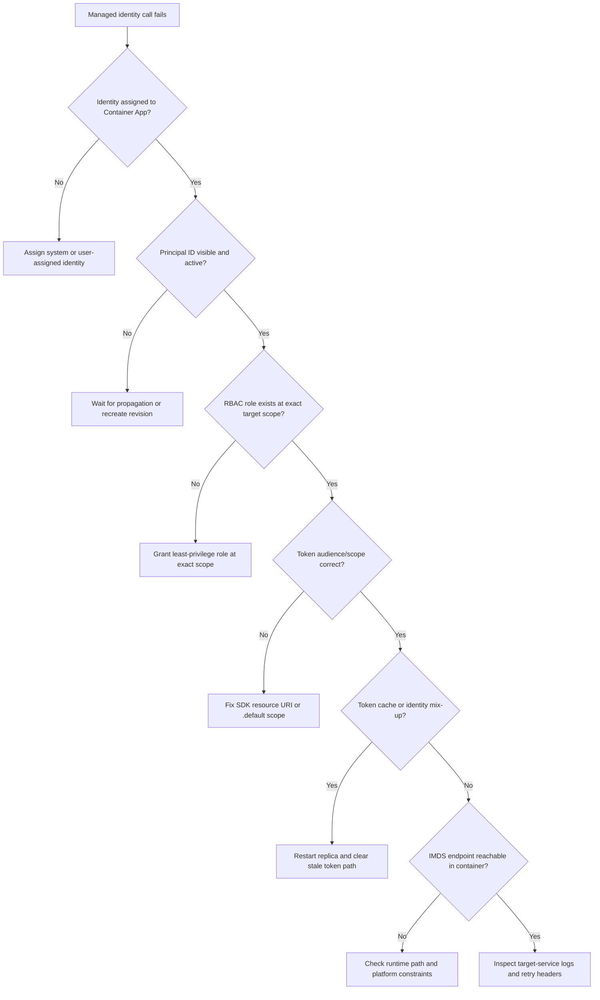

---
hide:
  - toc
content_sources:
  diagrams:
    - id: troubleshooting-decision-flow
      type: flowchart
      source: mslearn-adapted
      based_on:
        - https://learn.microsoft.com/azure/container-apps/managed-identity
        - https://learn.microsoft.com/azure/role-based-access-control/role-assignments-steps
        - https://learn.microsoft.com/azure/key-vault/general/authentication
---

# Managed Identity Auth Failure

## 1. Summary

### Symptom

Your Container App starts normally but fails when it tries to access an Azure resource using managed identity. The failure usually appears as 401/403 responses, `CredentialUnavailable` errors, or service-specific authorization failures from Key Vault, Storage, Service Bus, Cosmos DB, or Microsoft Graph-style endpoints.

The app often works with developer credentials locally but fails only inside Azure Container Apps runtime. That contrast is the key clue: the container is healthy, but the managed identity path is broken somewhere between identity assignment, token acquisition, token audience, and target-resource authorization.

### Why this scenario is confusing

This issue is easy to misread because several independent layers can produce almost the same symptom. A missing identity, a wrong role scope, a wrong audience, a stale token, or an unreachable identity endpoint can all look like “auth failed.”

It is also common for the app to fail only for one dependency while everything else looks fine. That makes the problem feel random, when in practice the failure usually maps to one specific layer in the identity chain.

### Troubleshooting decision flow

<!-- diagram-id: troubleshooting-decision-flow -->


## 2. Common Misreadings

- “Identity is assigned, so permissions must be fine.” Assignment and authorization are separate checks.
- “A token was returned, so identity is working.” The token may be for the wrong audience or wrong identity.
- “403 means the service is down.” A 403 usually means the service saw you and rejected the request.
- “It worked locally, so Azure is broken.” Local developer auth and managed identity are different credential paths.
- “One role at subscription scope fixes everything.” Some services need exact resource scope and least privilege.

## 3. Competing Hypotheses

| Hypothesis | Typical Evidence For | Typical Evidence Against |
|---|---|---|
| H1: Identity not assigned | `az containerapp show` has empty `identity`, missing `principalId`, or no user-assigned identity reference | `principalId` exists and the app can request a token |
| H2: RBAC role missing or wrong scope | 403 from target resource, role assigned only at subscription or sibling scope, recent change still propagating | Correct role exists at exact target scope and propagation time has passed |
| H3: Wrong token audience/scope | Token acquired, but target rejects with auth error; SDK uses incorrect resource URI or `.default` scope | Resource URI matches service endpoint and token works in a known-good sample |
| H4: Token caching issues | Error appears after identity swap, role change, revision deployment, or long runtime; restart temporarily fixes it | Fresh replica still fails with same token path and same identity |
| H5: IMDS endpoint unreachable | `CredentialUnavailable`, timeout, or connection errors before token issuance | Another replica or fresh restart can retrieve tokens successfully |

## 4. What to Check First

### Metrics

- Count authorization failures and dependency failures over the last 15–60 minutes.
- Look for a spike after deploy, identity change, or RBAC change.
- Check whether failures cluster on one replica or one revision.

### Logs

```kusto
let AppName = "ca-myapp";
ContainerAppConsoleLogs_CL
| where ContainerAppName_s == AppName
| where Log_s has_any ("ManagedIdentityCredential", "CredentialUnavailable", "401", "403", "Forbidden", "token", "unauthorized")
| project TimeGenerated, RevisionName_s, ReplicaName_s, Log_s
| order by TimeGenerated desc
```

```kusto
let AppName = "ca-myapp";
ContainerAppConsoleLogs_CL
| where ContainerAppName_s == AppName
| where Log_s has_any ("vault.azure.net", "storage.azure.com", "servicebus.azure.net", "graph.microsoft.com")
| project TimeGenerated, RevisionName_s, ReplicaName_s, Log_s
| order by TimeGenerated desc
```

### Platform Signals

```bash
az containerapp show --name "$APP_NAME" --resource-group "$RG" --query "identity" --output json
az containerapp show --name "$APP_NAME" --resource-group "$RG" --query "properties.template.identity" --output json
az role assignment list --assignee "$(az containerapp show --name "$APP_NAME" --resource-group "$RG" --query identity.principalId --output tsv)" --all --output table
```

## 5. Evidence to Collect

### Required Evidence

| Evidence | Command/Query | Purpose |
|---|---|---|
| App identity configuration | `az containerapp show --name "$APP_NAME" --resource-group "$RG" --query identity --output json` | Confirms whether system or user-assigned identity exists |
| Principal ID | `az containerapp show --name "$APP_NAME" --resource-group "$RG" --query identity.principalId --output tsv` | Lets you trace RBAC assignments for the workload identity |
| Role assignments | `az role assignment list --assignee "$PRINCIPAL_ID" --all --output table` | Shows whether the role exists and where it is scoped |
| Runtime logs | `az containerapp logs show --name "$APP_NAME" --resource-group "$RG" --type console` | Captures token and authorization failures from the app |
| Target-service logs | KQL in Log Analytics | Confirms whether the target service saw the request and denied it |

### Useful Context

- Record whether the app uses a system-assigned identity, a user-assigned identity, or both.
- Record the exact Azure resource being called and the expected audience URI.
- Record when the identity or role assignment changed; propagation delay matters.
- Record whether the failure is revision-wide or only affects one replica.
- Record whether local developer credentials succeed with the same code path.

```bash
PRINCIPAL_ID="$(az containerapp show --name "$APP_NAME" --resource-group "$RG" --query identity.principalId --output tsv)"
az role assignment list --assignee "$PRINCIPAL_ID" --all --output json
az containerapp exec --name "$APP_NAME" --resource-group "$RG" --command 'python -c "from azure.identity import ManagedIdentityCredential; token = ManagedIdentityCredential().get_token(\"https://vault.azure.net/.default\"); print(token.expires_on)"'
```

## 6. Validation and Disproof by Hypothesis

### H1: Identity not assigned

**Signals that support:**

- `identity` is empty or missing in `az containerapp show`.
- `principalId` is absent.
- The app throws `CredentialUnavailable` before any token is minted.

**Signals that weaken:**

- `principalId` exists and the container can return an access token.
- The failure only happens against one dependency, not all managed identity calls.

**What to verify:**

```bash
az containerapp show --name "$APP_NAME" --resource-group "$RG" --query "identity" --output json
az containerapp show --name "$APP_NAME" --resource-group "$RG" --query "identity.principalId" --output tsv
```

If the app is supposed to use a user-assigned identity, confirm the identity resource is attached to the app and selected by the SDK.

### H2: RBAC role missing or wrong scope

**Signals that support:**

- Target returns 403 after token acquisition.
- Role exists, but only at subscription scope or sibling resource-group scope.
- The role assignment was created recently and may still be propagating.

**Signals that weaken:**

- The exact required role exists at the exact resource scope.
- The same principal can access the resource from another container or test client.

**What to verify:**

```bash
PRINCIPAL_ID="$(az containerapp show --name "$APP_NAME" --resource-group "$RG" --query identity.principalId --output tsv)"
az role assignment list --assignee "$PRINCIPAL_ID" --scope "/subscriptions/<subscription-id>/resourceGroups/$RG/providers/Microsoft.KeyVault/vaults/$KV_NAME" --output table
az role assignment list --assignee "$PRINCIPAL_ID" --scope "/subscriptions/<subscription-id>/resourceGroups/$RG" --output table
```

Check whether the service expects a data-plane role, not a management-plane role. Key Vault, Storage, and Service Bus often require service-specific data roles.

### H3: Wrong token audience/scope

**Signals that support:**

- SDK requests a token successfully, but the dependency rejects it.
- The code uses the wrong resource URI or uses an ARM audience for a data-plane API.
- The issue appears only for one service, not all managed identity access.

**Signals that weaken:**

- The same code works with a known-good service-specific sample.
- The token audience matches the service endpoint exactly.

**What to verify:**

```bash
az containerapp exec --name "$APP_NAME" --resource-group "$RG" --command 'python -c "from azure.identity import ManagedIdentityCredential; token = ManagedIdentityCredential().get_token(\"https://vault.azure.net/.default\"); print(token.token[:20] + \"...\")"'
```

Use service-specific audiences such as `https://vault.azure.net/.default`, `https://storage.azure.com/.default`, or the documented resource URI for the target service.

### H4: Token caching issues

**Signals that support:**

- Failure began after an identity swap, revision deployment, or role change.
- Restarting the replica or forcing a new revision temporarily fixes the problem.
- Only one replica fails while others succeed.

**Signals that weaken:**

- Every new replica fails the same way.
- The token fetch fails even on a fresh restart.

**What to verify:**

```bash
az containerapp revision list --name "$APP_NAME" --resource-group "$RG" --output table
az containerapp replica list --name "$APP_NAME" --resource-group "$RG" --revision "$REVISION_NAME" --output table
```

If you are using a user-assigned identity, confirm the app is not caching a token from a stale identity selection or stale environment variable.

### H5: IMDS endpoint unreachable

**Signals that support:**

- `CredentialUnavailable`, timeout, or connection errors occur before any token is returned.
- The container cannot reach the managed identity endpoint path.
- The issue affects all managed identity requests inside the container.

**Signals that weaken:**

- A token is acquired and only the downstream authorization fails.
- The same revision works in another replica or after a restart.

**What to verify:**

```bash
az containerapp exec --name "$APP_NAME" --resource-group "$RG" --command 'sh -c "python - <<\"PY\"\nfrom azure.identity import ManagedIdentityCredential\ntry:\n    token = ManagedIdentityCredential().get_token(\"https://management.azure.com/.default\")\n    print(token.expires_on)\nexcept Exception as exc:\n    print(type(exc).__name__, exc)\nPY"'
```

If this fails before token issuance, inspect container runtime constraints, network path, or platform-level identity availability for the revision.

## 7. Likely Root Cause Patterns

| Pattern | Frequency | First Signal | Typical Resolution |
|---|---|---|---|
| Identity missing from the app | High | `identity` object empty | Enable system-assigned or attach user-assigned identity |
| Role assigned at wrong scope | High | 403 plus RBAC exists elsewhere | Reassign at exact resource scope and wait for propagation |
| Wrong audience in SDK config | Medium | Token acquired, target rejects | Change resource URI or `.default` scope to service-specific value |
| Stale token or stale replica | Medium | Fixes after restart | Recycle replica or deploy fresh revision |
| IMDS/token endpoint unavailable | Low | `CredentialUnavailable` or timeout | Validate runtime path and platform constraints |

## 8. Immediate Mitigations

1. Verify the app identity exists and is the identity your code expects.

    ```bash
    az containerapp show --name "$APP_NAME" --resource-group "$RG" --query identity --output json
    ```

2. Grant the minimal required role at the exact resource scope.

    ```bash
    az role assignment create \
        --assignee "$PRINCIPAL_ID" \
        --role "Key Vault Secrets User" \
        --scope "/subscriptions/<subscription-id>/resourceGroups/$RG/providers/Microsoft.KeyVault/vaults/$KV_NAME"
    ```

3. Restart the replica or deploy a new revision to clear stale token state.

    ```bash
    az containerapp revision restart --name "$APP_NAME" --resource-group "$RG" --revision "$REVISION_NAME"
    ```

4. Confirm the SDK requests the correct token audience for the target service.

    ```python
    from azure.identity import ManagedIdentityCredential

    credential = ManagedIdentityCredential()
    token = credential.get_token("https://vault.azure.net/.default")
    print(token.expires_on)
    ```

5. Re-test from inside the container and confirm the dependency response changes from 401/403 to 2xx.

    ```bash
    az containerapp exec --name "$APP_NAME" --resource-group "$RG" --command 'curl -i https://$TARGET_HOST/health'
    ```

6. If the app uses multiple identities, explicitly select the intended user-assigned identity in code and configuration.

    ```python
    from azure.identity import ManagedIdentityCredential

    credential = ManagedIdentityCredential(client_id="<client-id>")
    ```

## 9. Prevention

- Manage identity assignment with IaC so identity drift is visible in code review.
- Manage RBAC with IaC and keep role scope as narrow as the dependency allows.
- Document the required audience URI for each Azure service used by the app.
- Add a deployment smoke test that acquires a token and calls each dependency.
- Alert on new 401/403 bursts from managed-identity-backed dependencies.
- Keep a runbook entry for propagation delays after RBAC changes.
- Prefer one identity per workload unless you have a clear reason to multiplex identities.
- Re-test after revision changes, identity changes, and role assignment changes.

## See Also

- [Secret and Key Vault Reference Failure](secret-and-key-vault-reference-failure.md)
- [Service-to-Service Connectivity Failure](../ingress-and-networking/service-to-service-connectivity-failure.md)
- [Managed Identity Token Errors KQL](../../kql/identity-and-secrets/managed-identity-token-errors.md)

## Sources

- https://learn.microsoft.com/azure/container-apps/managed-identity
- https://learn.microsoft.com/azure/role-based-access-control/role-assignments-steps
- https://learn.microsoft.com/azure/key-vault/general/authentication
