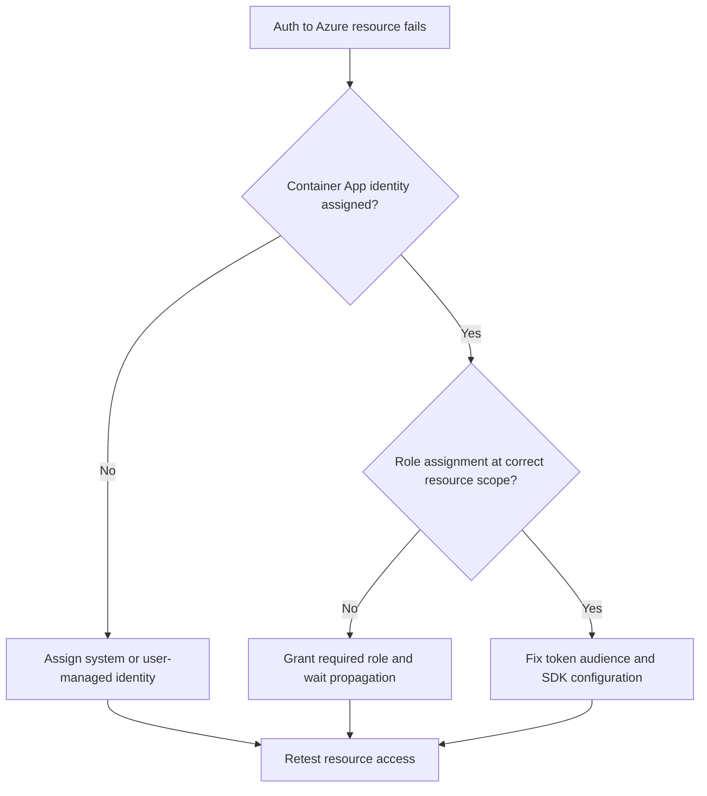

# Managed Identity Auth Failure

Use this playbook when your app can run but fails to authenticate or authorize to Azure resources using managed identity.

## Symptoms

- 401/403 from Key Vault, Storage, Service Bus, or other Azure services.
- Logs include `ManagedIdentityCredential`, `CredentialUnavailable`, or `Forbidden`.
- Calls succeed locally with developer credentials but fail in ACA runtime.

## Common Misreadings

!!! warning "Common Misreadings"
    - Misreading: "Identity is assigned, so permissions are fine." Assignment and RBAC scope are separate checks.
    - Misreading: "Token retrieval failed means service outage." Wrong audience/scope is a frequent root cause.

## Competing Hypotheses

| Hypothesis | Evidence For | Evidence Against |
|---|---|---|
| Identity not assigned | `identity` object empty, no principalId | principalId present and token acquired |
| RBAC missing or wrong scope | 403 from target resource, no role assignment at scope | Correct role exists and propagation complete |
| Wrong token audience | Token acquired but target rejects | Correct scope (`https://.../.default`) used |

## What to Check First

### Metrics

- Authorization failure count and dependency failure ratio.

### Logs

```kusto
let AppName = "ca-myapp";
ContainerAppConsoleLogs_CL
| where ContainerAppName_s == AppName
| where Log_s has_any ("ManagedIdentityCredential", "401", "403", "token", "Forbidden")
| project TimeGenerated, RevisionName_s, ReplicaName_s, Log_s
| order by TimeGenerated desc
```

### Platform Signals

```bash
az containerapp show --name "$APP_NAME" --resource-group "$RG" --query "identity" --output json
az role assignment list --assignee "$(az containerapp show --name "$APP_NAME" --resource-group "$RG" --query identity.principalId --output tsv)" --output table
```

## Evidence Collection

```bash
az containerapp exec --name "$APP_NAME" --resource-group "$RG" --command "python -c 'from azure.identity import ManagedIdentityCredential; token = ManagedIdentityCredential().get_token("https://vault.azure.net/.default"); print(token.expires_on)'"
az role assignment list --scope "/subscriptions/<subscription-id>/resourceGroups/$RG" --assignee "$(az containerapp show --name "$APP_NAME" --resource-group "$RG" --query identity.principalId --output tsv)" --output table
az containerapp logs show --name "$APP_NAME" --resource-group "$RG" --type console
```

Observed runtime baseline while investigating auth failures:

```text
Name               Active    TrafficWeight    Replicas    HealthState    RunningState
-----------------  --------  ---------------  ----------  -------------  ------------
ca-myapp--0000001  True      100              1           Healthy        Running
```

## Decision Flow



## Resolution Steps

1. Enable managed identity for the Container App.
2. Grant least-privilege role at correct scope (resource, resource group, or subscription).
3. Use correct audience/scope in token requests.
4. Re-test in container context and verify 2xx from dependency.

## Prevention

- Manage identity and RBAC with IaC.
- Add post-deploy permission checks per dependency.
- Document required roles per service.

## See Also

- [Secret and Key Vault Reference Failure](secret-and-key-vault-reference-failure.md)
- [Service-to-Service Connectivity Failure](../ingress-and-networking/service-to-service-connectivity-failure.md)
- [Managed Identity Token Errors KQL](../../kql/identity-and-secrets/managed-identity-token-errors.md)
