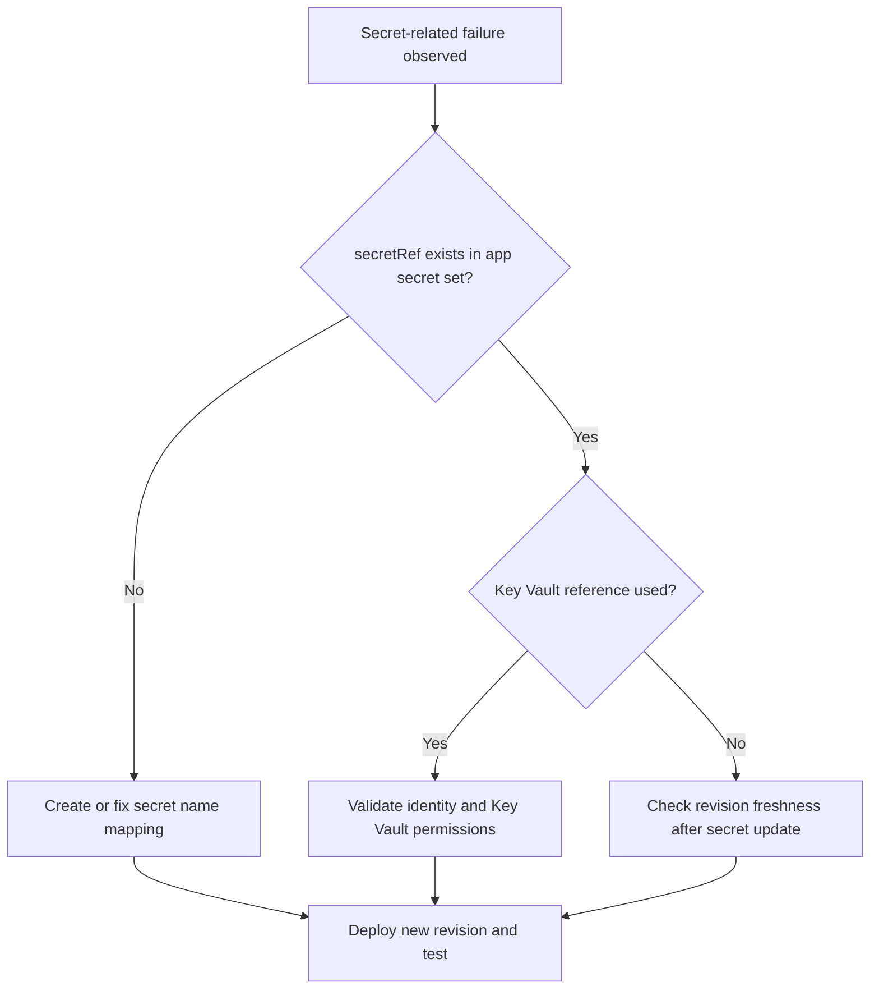

---
hide:
  - toc
---

# Secret and Key Vault Reference Failure

## 1. Summary

### Symptom

Revisions fail or apps crash because secrets are missing, stale, or inaccessible through Key Vault references. Common symptoms include secret resolution errors during revision startup, missing configuration values in application logs, authentication failures, and secret updates that do not appear in running revision behavior.

### Why this scenario is confusing

Secret failures span configuration mapping, revision lifecycle behavior, and Key Vault authorization. A successful `secret set` operation does not mean the running revision is already using the new value, and a valid managed identity does not mean that Key Vault access rights are correct.

### Troubleshooting decision flow



## 2. Common Misreadings

- "Secret set command succeeded, so app uses it immediately." Secret updates require a new revision or restart path.
- "Key Vault reference means no RBAC checks." Managed identity still needs Key Vault access rights.

## 3. Competing Hypotheses

| Hypothesis | Typical Evidence For | Typical Evidence Against |
|---|---|---|
| Missing secret or wrong `secretRef` | Provisioning logs mention unresolved secret | `secret list` contains exact referenced name |
| Key Vault access denied | 403 from Key Vault and identity token success | Vault access works with same identity |
| Stale revision after secret change | Behavior unchanged until new revision deploy | New revision already active with updated value |

## 4. What to Check First

### Metrics

- Deployment failure count and configuration error trend.

### Logs

```kusto
let AppName = "ca-myapp";
ContainerAppSystemLogs_CL
| where ContainerAppName_s == AppName
| where Log_s has_any ("secret", "KeyVault", "vault", "reference", "denied")
| project TimeGenerated, RevisionName_s, Reason_s, Log_s
| order by TimeGenerated desc
```

### Platform Signals

```bash
az containerapp secret list --name "$APP_NAME" --resource-group "$RG"
az containerapp show --name "$APP_NAME" --resource-group "$RG" --query "properties.template.containers[0].env" --output json
az containerapp show --name "$APP_NAME" --resource-group "$RG" --query "identity" --output json
```

## 5. Evidence to Collect

### Required Evidence

| Evidence | Command/Query | Purpose |
|---|---|---|
| Secret inventory | `az containerapp secret list --name "$APP_NAME" --resource-group "$RG"` | Verify that each referenced secret exists |
| Environment mapping | `az containerapp show --name "$APP_NAME" --resource-group "$RG" --query "properties.template.containers[0].env" --output json` | Confirm `secretRef` names and env mapping |
| Identity configuration | `az containerapp show --name "$APP_NAME" --resource-group "$RG" --query "identity" --output json` | Verify managed identity is present |
| Key Vault secret state | `az keyvault secret show --vault-name "my-kv" --name "my-secret" --query "attributes.enabled" --output tsv` | Confirm the referenced secret is enabled |
| Vault access scope | `az role assignment list --scope "$(az keyvault show --name "my-kv" --resource-group "$RG" --query id --output tsv)" --assignee "$(az containerapp show --name "$APP_NAME" --resource-group "$RG" --query identity.principalId --output tsv)" --output table` | Verify the app identity has access |
| Revision freshness | `az containerapp revision list --name "$APP_NAME" --resource-group "$RG" --output table` | Confirm whether a new revision is active after secret change |
| Secret-related system logs | KQL on `ContainerAppSystemLogs_CL` | Identify unresolved secret and Key Vault errors |

### Useful Context

- Whether the app uses direct secrets or Key Vault references.
- Whether the secret was recently rotated or renamed.
- Whether the app is using the expected revision after the secret change.

Observed provisioning baseline:

```text
$ az containerapp show --name "$APP_NAME" --resource-group "$RG" --query provisioningState
"Succeeded"
```

## 6. Validation and Disproof by Hypothesis

### H1: Missing secret or wrong `secretRef`

**Signals that support:**

- Provisioning logs mention unresolved secret.
- `secretRef` names in environment configuration do not match the app secret set.
- `az containerapp secret list --name "$APP_NAME" --resource-group "$RG"` does not contain the exact referenced name.

**Signals that weaken:**

- `secret list` contains the exact referenced name.
- Environment mapping shows the expected `secretRef` values.

**What to verify:**

```bash
az containerapp secret list --name "$APP_NAME" --resource-group "$RG"
az containerapp show --name "$APP_NAME" --resource-group "$RG" --query "properties.template.containers[0].env" --output json
```

**Disproof logic:**

If every `secretRef` exactly matches a defined secret and system logs do not report unresolved secret errors, this hypothesis is weakened.

### H2: Key Vault access denied

**Signals that support:**

- 403 from Key Vault and identity token success.
- Managed identity exists, but vault access does not work.
- System logs include `KeyVault`, `vault`, `reference`, or `denied` messages.

**Signals that weaken:**

- Vault access works with the same identity.
- Role assignment output confirms expected access scope.
- The referenced secret is enabled and accessible.

**What to verify:**

```bash
az containerapp show --name "$APP_NAME" --resource-group "$RG" --query "identity" --output json
az keyvault secret show --vault-name "my-kv" --name "my-secret" --query "attributes.enabled" --output tsv
az role assignment list --scope "$(az keyvault show --name "my-kv" --resource-group "$RG" --query id --output tsv)" --assignee "$(az containerapp show --name "$APP_NAME" --resource-group "$RG" --query identity.principalId --output tsv)" --output table
```

```kusto
let AppName = "ca-myapp";
ContainerAppSystemLogs_CL
| where ContainerAppName_s == AppName
| where Log_s has_any ("secret", "KeyVault", "vault", "reference", "denied")
| project TimeGenerated, RevisionName_s, Reason_s, Log_s
| order by TimeGenerated desc
```

**Disproof logic:**

If the same identity can access the vault, the secret is enabled, and role assignment output matches expectations without 403 evidence, access denial becomes less likely.

### H3: Stale revision after secret change

**Signals that support:**

- Behavior remains unchanged until a new revision deploys.
- Secret updates do not appear in running revision behavior.
- Revision list shows that the expected new revision is not active.

**Signals that weaken:**

- New revision already active with updated value.
- Current behavior matches the new secret value.

**What to verify:**

```bash
az containerapp revision list --name "$APP_NAME" --resource-group "$RG" --output table
```

**Disproof logic:**

If a new revision is already active and behavior reflects the updated value, stale revision state is not the primary cause.

## 7. Likely Root Cause Patterns

| Pattern | Frequency | First Signal | Typical Resolution |
|---|---|---|---|
| `secretRef` name mismatch | Common | Unresolved secret in provisioning logs | Fix secret name mapping |
| Missing Key Vault permissions | Common | 403 or denied messages | Grant the app identity the required Key Vault access |
| Secret rotated without revision refresh | Common | Old behavior persists after secret change | Deploy a new revision or restart path |

## 8. Immediate Mitigations

1. Ensure all `secretRef` values map to existing secrets.
2. For Key Vault references, confirm managed identity and vault RBAC/policy access.
3. Rotate or set secret values and deploy a new revision.
4. Validate app behavior with expected config value present.

## 9. Prevention

- Standardize secret naming and reference patterns.
- Add secret existence checks in deployment pipelines.
- Schedule regular Key Vault permission audits.

## See Also

- [Managed Identity Auth Failure](managed-identity-auth-failure.md)
- [Revision Provisioning Failure](../startup-and-provisioning/revision-provisioning-failure.md)
- [Secret Reference Failures KQL](../../kql/identity-and-secrets/secret-reference-failures.md)

## Sources

- [Manage secrets in Azure Container Apps](https://learn.microsoft.com/azure/container-apps/manage-secrets)
- [Use managed identity to authenticate to Azure Key Vault from Azure Container Apps](https://learn.microsoft.com/azure/container-apps/manage-secrets#reference-secret-from-key-vault)
- [Managed identities in Azure Container Apps](https://learn.microsoft.com/azure/container-apps/managed-identity)
