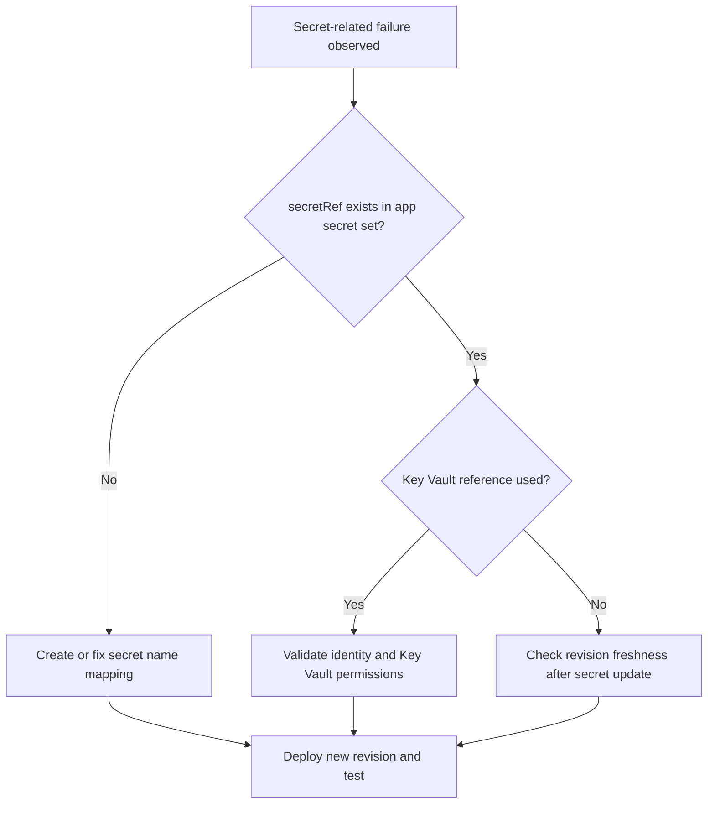

---
content_sources:
  diagrams:
    - id: troubleshooting-decision-flow
      type: flowchart
      source: mslearn-adapted
      based_on:
        - https://learn.microsoft.com/en-us/azure/container-apps/manage-secrets
        - https://learn.microsoft.com/en-us/azure/container-apps/manage-secrets#reference-secret-from-key-vault
        - https://learn.microsoft.com/en-us/azure/container-apps/managed-identity
content_validation:
  status: verified
  last_reviewed: '2026-04-12'
  reviewer: ai-agent
  core_claims:
    - claim: Azure Container Apps supports both system-assigned and user-assigned managed identities.
      source: https://learn.microsoft.com/en-us/azure/container-apps/managed-identity
      verified: true
    - claim: Each revision in Azure Container Apps is an immutable snapshot of a container app version.
      source: https://learn.microsoft.com/en-us/azure/container-apps/revisions
      verified: true
    - claim: When user-defined routes force Container Apps egress through Azure Firewall, the firewall policy must allow the documented Entra authority endpoints used on this path, including login.microsoftonline.com and login.microsoft.com, so managed identity token acquisition and OIDC discovery can complete.
      source: https://learn.microsoft.com/en-us/azure/container-apps/firewall-integration
      verified: true
---
# Secret and Key Vault Reference Failure

## 1. Summary

### Symptom

Revisions fail or apps crash because secrets are missing, stale, or inaccessible through Key Vault references. Common symptoms include secret resolution errors during revision startup, missing configuration values in application logs, authentication failures, and secret updates that do not appear in running revision behavior.

### Why this scenario is confusing

Secret failures span configuration mapping, revision lifecycle behavior, and Key Vault authorization. A successful `secret set` operation does not mean the running revision is already using the new value, and a valid managed identity does not mean that Key Vault access rights are correct.

### Troubleshooting decision flow

<!-- diagram-id: troubleshooting-decision-flow -->


## 2. Common Misreadings

- "Secret set command succeeded, so app uses it immediately." Secret updates require a new revision or restart path.
- "Key Vault reference means no RBAC checks." Managed identity still needs Key Vault access rights.

## 3. Competing Hypotheses

| Hypothesis | Typical Evidence For | Typical Evidence Against |
|---|---|---|
| Missing secret or wrong `secretRef` | Provisioning logs mention unresolved secret | `secret list` contains exact referenced name |
| Key Vault access denied | 403 from Key Vault and identity token success | Vault access works with same identity |
| Stale revision after secret change | Behavior unchanged until new revision deploy | New revision already active with updated value |
| Managed identity OIDC discovery blocked by egress control (UDR → Azure Firewall) | `az containerapp secret set --identity ... --key-vault-url ...` fails with `Unable to get value using Managed identity` and `Get https://login.microsoftonline.com/<tenant>/.well-known/openid-configuration: EOF` (or the same error on `login.microsoft.com` — the OIDC discovery client picks one Entra authority host at runtime); firewall `Deny` row for **either** `login.microsoftonline.com` **or** `login.microsoft.com` from the workload subnet source IP inside the failure window; MI and RBAC both correct | Direct probes from the workload path to **both** `login.microsoftonline.com` **and** `login.microsoft.com` succeed (a single-host probe is not sufficient because the client may pick the other host); no firewall on the workload path; OR firewall Application Rule permitting **both** Entra authority FQDNs from the workload subnet is present |

## 4. What to Check First

### Metrics

- Deployment failure count and configuration error trend.

### Logs

```kusto
let AppName = "ca-myapp";
ContainerAppSystemLogs_CL
| where ContainerAppName_s == AppName
| where Log_s has_any ("secret", "KeyVault", "vault", "reference", "denied")
| project TimeGenerated, RevisionName_s, Reason_s, Log_s
| order by TimeGenerated desc
```

### Platform Signals

```bash
az containerapp secret list --name "$APP_NAME" --resource-group "$RG"
az containerapp show --name "$APP_NAME" --resource-group "$RG" --query "properties.template.containers[0].env" --output json
az containerapp show --name "$APP_NAME" --resource-group "$RG" --query "identity" --output json
```

## 5. Evidence to Collect

### Required Evidence

| Evidence | Command/Query | Purpose |
|---|---|---|
| Secret inventory | `az containerapp secret list --name "$APP_NAME" --resource-group "$RG"` | Verify that each referenced secret exists |
| Environment mapping | `az containerapp show --name "$APP_NAME" --resource-group "$RG" --query "properties.template.containers[0].env" --output json` | Confirm `secretRef` names and env mapping |
| Identity configuration | `az containerapp show --name "$APP_NAME" --resource-group "$RG" --query "identity" --output json` | Verify managed identity is present |
| Key Vault secret state | `az keyvault secret show --vault-name "my-kv" --name "my-secret" --query "attributes.enabled" --output tsv` | Confirm the referenced secret is enabled |
| Vault access scope | `az role assignment list --scope "$(az keyvault show --name "my-kv" --resource-group "$RG" --query id --output tsv)" --assignee "$(az containerapp show --name "$APP_NAME" --resource-group "$RG" --query identity.principalId --output tsv)" --output table` | Verify the app identity has access |
| Revision freshness | `az containerapp revision list --name "$APP_NAME" --resource-group "$RG" --output table` | Confirm whether a new revision is active after secret change |
| Secret-related system logs | KQL on `ContainerAppSystemLogs_CL` | Identify unresolved secret and Key Vault errors |

### Useful Context

- Whether the app uses direct secrets or Key Vault references.
- Whether the secret was recently rotated or renamed.
- Whether the app is using the expected revision after the secret change.

Observed provisioning baseline:

```text
$ az containerapp show --name "$APP_NAME" --resource-group "$RG" --query provisioningState
"Succeeded"
```

| Command | Why it is used |
|---|---|
| `az containerapp show --name ...` | Reads the Container App configuration so the documented setting can be verified. |

## 6. Validation and Disproof by Hypothesis

### H1: Missing secret or wrong `secretRef`

**Signals that support:**

- Provisioning logs mention unresolved secret.
- `secretRef` names in environment configuration do not match the app secret set.
- `az containerapp secret list --name "$APP_NAME" --resource-group "$RG"` does not contain the exact referenced name.

**Signals that weaken:**

- `secret list` contains the exact referenced name.
- Environment mapping shows the expected `secretRef` values.

**What to verify:**

```bash
az containerapp secret list --name "$APP_NAME" --resource-group "$RG"
az containerapp show --name "$APP_NAME" --resource-group "$RG" --query "properties.template.containers[0].env" --output json
```

| Command | Why it is used |
|---|---|
| `az containerapp secret list ...` | Manages Container Apps secrets without exposing secret values in plain configuration. |

**Disproof logic:**

If every `secretRef` exactly matches a defined secret and system logs do not report unresolved secret errors, this hypothesis is weakened.

### H2: Key Vault access denied

**Signals that support:**

- 403 from Key Vault and identity token success.
- Managed identity exists, but vault access does not work.
- System logs include `KeyVault`, `vault`, `reference`, or `denied` messages.

**Signals that weaken:**

- Vault access works with the same identity.
- Role assignment output confirms expected access scope.
- The referenced secret is enabled and accessible.

**What to verify:**

```bash
az containerapp show --name "$APP_NAME" --resource-group "$RG" --query "identity" --output json
az keyvault secret show --vault-name "my-kv" --name "my-secret" --query "attributes.enabled" --output tsv
az role assignment list --scope "$(az keyvault show --name "my-kv" --resource-group "$RG" --query id --output tsv)" --assignee "$(az containerapp show --name "$APP_NAME" --resource-group "$RG" --query identity.principalId --output tsv)" --output table
```

| Command | Why it is used |
|---|---|
| `az containerapp show --name ...` | Reads the Container App configuration so the documented setting can be verified. |

```kusto
let AppName = "ca-myapp";
ContainerAppSystemLogs_CL
| where ContainerAppName_s == AppName
| where Log_s has_any ("secret", "KeyVault", "vault", "reference", "denied")
| project TimeGenerated, RevisionName_s, Reason_s, Log_s
| order by TimeGenerated desc
```

**Disproof logic:**

If the same identity can access the vault, the secret is enabled, and role assignment output matches expectations without 403 evidence, access denial becomes less likely.

### H3: Stale revision after secret change

**Signals that support:**

- Behavior remains unchanged until a new revision deploys.
- Secret updates do not appear in running revision behavior.
- Revision list shows that the expected new revision is not active.

**Signals that weaken:**

- New revision already active with updated value.
- Current behavior matches the new secret value.

**What to verify:**

| Command | Why it is used |
|---|---|
| `az containerapp revision list ...` | Lists all revisions for the Container App so you can confirm whether a new revision became active after the secret change; if the same old revision is still `Active`, the running workload has not observed the updated secret yet. |

```bash
az containerapp revision list --name "$APP_NAME" --resource-group "$RG" --output table
```

**Disproof logic:**

If a new revision is already active and behavior reflects the updated value, stale revision state is not the primary cause.

### H4: Managed Identity OIDC Discovery Blocked by Egress Control (UDR → Azure Firewall)

**Signals that support:**

- `az containerapp secret set --identity system --key-vault-url ...` (or `--identity <user-assigned-id>`) fails with exit code non-zero.
- `stderr` contains the marker phrases `Failed to update secrets` and `Unable to get value using Managed identity`.
- `stderr` includes the substring `.well-known/openid-configuration:` on **either** `login.microsoftonline.com` **or** `login.microsoft.com` (the OIDC discovery client picks one host at runtime), followed by a transport-level error (`EOF`, `connection reset`, `TLS handshake failure`, or timeout) rather than an HTTP status code from Microsoft Entra ID.
- The Container Apps environment uses workload-profile networking with a `0.0.0.0/0 → Azure Firewall private IP` UDR on the workload subnet.
- Azure Firewall policy does not carry an Application Rule that permits `login.microsoftonline.com` and `login.microsoft.com` from the workload subnet source range.
- Azure Firewall application-rule log carries a `Deny` action row for **either** `login.microsoftonline.com` **or** `login.microsoft.com` (whichever host the OIDC discovery client happened to try) from a source IP inside the workload subnet, timestamped inside the failure window.
- The managed identity is correctly assigned to the Container App (`principalId` present) and holds `Key Vault Secrets User` at the target Key Vault scope; the Key Vault firewall / private endpoint allows the caller's outbound path.
- The failure is **only** visible in the control-plane secret-set output. `latestReadyRevisionName` does not change, ingress continues to return HTTP 200, and the app remains `Healthy/Running` (silence gate).

**Signals that weaken:**

- Direct probes from the same egress path to **both** `https://login.microsoftonline.com/<tenant>/.well-known/openid-configuration` **and** `https://login.microsoft.com/<tenant>/.well-known/openid-configuration` succeed and return discovery JSON. Probing only one host is not sufficient to weaken H4 because the OIDC discovery client may pick either host at runtime — a firewall rule that permits only one Entra authority FQDN will silently drop discovery calls that pick the other, so the weakening evidence must confirm both hosts are reachable.
- No firewall or NVA is on the workload subnet egress path (for example, a Consumption-only environment without UDR, or a workload-profile environment with default internet-bound egress).
- The firewall policy already contains an Application Rule that permits the Entra authority FQDNs from the workload subnet, and the firewall log shows an `Allow` row for the same destination in the failure window.
- The failure signature is an HTTP 401 or 403 from Microsoft Entra ID or from Key Vault rather than a transport-level `EOF` on the OIDC discovery URL. HTTP status codes point to H2 (Key Vault access denied) or a token audience / SDK config issue, not to a network path drop.

**What to verify:**

```bash
# 1. Confirm the failure surface (marker strings in stderr)
az containerapp secret set --name "$APP_NAME" --resource-group "$RG" \
    --secrets "kvref-diag=keyvaultref:https://<vault>.vault.azure.net/secrets/<name>,identityref:system" \
    2> /tmp/secret-set-stderr.txt || true
grep -E "Failed to update secrets|Unable to get value using Managed identity|openid-configuration" /tmp/secret-set-stderr.txt

# 2. Confirm the workload subnet routes 0.0.0.0/0 through Azure Firewall
INFRA_SUBNET_ID="$(az containerapp env show --name "$ACA_ENV_NAME" --resource-group "$RG" \
    --query "properties.vnetConfiguration.infrastructureSubnetId" --output tsv)"
ROUTE_TABLE_ID="$(az network vnet subnet show --ids "$INFRA_SUBNET_ID" \
    --query "routeTable.id" --output tsv)"
if [ -n "$ROUTE_TABLE_ID" ]; then
    az network route-table route list --route-table-name "$(basename "$ROUTE_TABLE_ID")" \
        --resource-group "$RG" --output table
fi

# 3. Confirm the firewall policy Application Rules for the Entra authority FQDNs
az network firewall policy rule-collection-group collection list \
    --policy-name "$FIREWALL_POLICY_NAME" \
    --resource-group "$RG" \
    --rule-collection-group-name "$FIREWALL_POLICY_RCG_NAME" \
    --query "[?ruleCollectionType=='FirewallPolicyFilterRuleCollection'].{name:name, rules:rules[?ruleType=='ApplicationRule'].{name:name, targetFqdns:targetFqdns}}" \
    --output json

# 4. Confirm the MI, RBAC, and Key Vault network path are all healthy
#    (rules out the non-H4 hypotheses: missing identity, missing role, or
#     Key Vault firewall blocking the caller). If any of these three
#     surfaces are broken, the failure is not H4.
APP_MI_PRINCIPAL_ID="$(az containerapp show --name "$APP_NAME" --resource-group "$RG" \
    --query "identity.principalId" --output tsv)"
echo "Managed identity principalId: $APP_MI_PRINCIPAL_ID"
KEY_VAULT_ID="$(az keyvault show --name "$KEY_VAULT_NAME" --resource-group "$RG" \
    --query "id" --output tsv)"
az role assignment list --assignee "$APP_MI_PRINCIPAL_ID" --scope "$KEY_VAULT_ID" \
    --query "[].{roleDefinitionName:roleDefinitionName, scope:scope}" --output table
az keyvault show --name "$KEY_VAULT_NAME" --resource-group "$RG" \
    --query "{networkAcls:properties.networkAcls, publicNetworkAccess:properties.publicNetworkAccess}" \
    --output json
```

| Command | Why it is used |
|---|---|
| `az containerapp secret set ...` | Reproduces the failure surface so `stderr` marker strings can be captured verbatim. |
| `az containerapp env show ...` | Reads the environment's infrastructure subnet ID so route table attachment can be inspected. |
| `az network vnet subnet show ...` | Retrieves the route table ID attached to the workload subnet. |
| `az network route-table route list ...` | Lists the effective routes so a `0.0.0.0/0 → VirtualAppliance` next-hop to the firewall private IP can be confirmed. |
| `az network firewall policy rule-collection-group collection list ...` | Lists the Application Rules in the firewall policy so the Entra authority FQDNs (`login.microsoftonline.com`, `login.microsoft.com`) can be verified as present or absent. |
| `az containerapp show --query identity.principalId` | Confirms the app has a managed identity assigned. If empty, the failure is not H4 — it is an identity-not-assigned problem. |
| `az role assignment list --assignee ... --scope $KEY_VAULT_ID` | Confirms the identity holds `Key Vault Secrets User` (or equivalent) at the target vault scope. If absent, the failure is not H4 — it is an RBAC gap (H2). |
| `az keyvault show --query properties.networkAcls` | Confirms the Key Vault's own network ACL and `publicNetworkAccess` posture. If the vault blocks the caller's outbound path, the failure signature is typically an HTTP 403 from Key Vault, not a transport-level `EOF` on the OIDC discovery URL — this points elsewhere, not to H4. |

```kusto
// Firewall log for Entra authority FQDN during the failure window (schema-tolerant, host-tolerant)
let AcaSubnet = "10.90.0.0/23"; // workload subnet CIDR
let EntraFqdns = dynamic(["login.microsoftonline.com", "login.microsoft.com"]);
let StartTime = todatetime("<failure window start ISO8601>");
let EndTime   = todatetime("<failure window end ISO8601>");
union isfuzzy=true
    (AZFWApplicationRule
        | where TimeGenerated between (StartTime .. EndTime)
        | where Fqdn has_any (EntraFqdns)
        | where ipv4_is_in_range(SourceIp, AcaSubnet)
        | project TimeGenerated, Action, Fqdn, SourceIp, Policy, RuleCollection, Rule),
    (AzureDiagnostics
        | where TimeGenerated between (StartTime .. EndTime)
        | where Category == "AzureFirewallApplicationRule"
        | where msg_s has_any (EntraFqdns)
        | extend Action = extract(@"Action: (\w+)", 1, msg_s)
        | extend SourceIp = extract(@"from (\d+\.\d+\.\d+\.\d+):", 1, msg_s)
        | extend Fqdn = extract(@"Url: https?://([^/]+)", 1, msg_s)
        | where ipv4_is_in_range(SourceIp, AcaSubnet)
        | project TimeGenerated, Action, Fqdn, SourceIp, msg_s)
| order by TimeGenerated asc
```

Both `login.microsoftonline.com` and `login.microsoft.com` are documented Entra authority endpoints; the OIDC discovery client may use either host, and matching only one silently misses drops on the other.

**Disproof logic:**

The following observations weaken H4:

- The firewall log shows an `Allow` row for **either** `login.microsoftonline.com` **or** `login.microsoft.com` from the workload subnet source IP during the failure window, AND the failure persists — the network path is not the controlling variable.
- The workload subnet has no UDR forcing egress through Azure Firewall (no `0.0.0.0/0 → VirtualAppliance` next-hop) — there is no firewall on the path.
- Direct probes from the same egress path to **both** `https://login.microsoftonline.com/<tenant>/.well-known/openid-configuration` **and** `https://login.microsoft.com/<tenant>/.well-known/openid-configuration` (for example via `az containerapp exec` running `curl` against both hosts) succeed and return discovery JSON. Probing a single Entra authority host is not sufficient to disprove H4: the OIDC discovery client picks one host at runtime, so a firewall rule that permits only one FQDN will silently drop discovery requests that happen to pick the other, and a one-host probe cannot distinguish that condition from a fully-open path.
- The failure signature is an HTTP 401 or 403 from Microsoft Entra ID or from Key Vault rather than a transport-level `EOF` on the OIDC discovery URL. HTTP status codes point to H2 (Key Vault RBAC) or a token audience / SDK config issue, not to a network path drop.

**`No matching row` is not disproof on its own.** The absence of any `Allow` or `Deny` row for the Entra authority FQDNs in the query result can also mean: firewall diagnostic logging is not enabled, diagnostics are configured to a different Log Analytics workspace, the query window is outside the ingestion latency window (ingestion typically takes 60 seconds or more), the source IP filter (`ipv4_is_in_range(SourceIp, AcaSubnet)`) does not match the actual egress subnet CIDR, or the query is targeting the wrong tenant's diagnostics table. Before treating an empty result as a signal, confirm at least one diagnostic setting routes the `AzureFirewallApplicationRule` log category to the queried Log Analytics workspace, confirm whether the workspace uses **resource-specific tables** (which surface rows in the `AZFWApplicationRule` table) or **Azure diagnostics mode** (which surface rows in the `AzureDiagnostics` table with `Category == "AzureFirewallApplicationRule"`) or both, and confirm the query window extends at least five minutes past the failure timestamp.

### H4 Variants: When Base H4 KQL Returns Zero Rows

The base H4 hypothesis assumes a specific topology: hub-spoke networking + `0.0.0.0/0` UDR forcing egress through Azure Firewall Basic/Standard + missing Application Rule + AzFW diagnostic settings enabled + `Deny` row visible in `AZFWApplicationRule`. The reproducer lab reproduces this exact scenario end-to-end.

However, the same failure surface (`Unable to get value using Managed identity` + `.well-known/openid-configuration: EOF` on either Entra authority FQDN) can result from six other topology variants where the base H4 KQL query returns zero rows. Before treating an empty KQL result as evidence against H4, work through the preflight and variants table below.

**Preflight** (must pass before treating zero rows as disproof):

- At least one diagnostic setting on the Firewall resource routes the `AzureFirewallApplicationRule` log category to the queried Log Analytics workspace — verify with `az monitor diagnostic-settings list --resource $FIREWALL_ID`. `AzureFirewallApplicationRule` is the log-category name; the actual destination table depends on the diagnostic setting's delivery mode (resource-specific mode produces rows in the `AZFWApplicationRule` table; Azure diagnostics mode produces rows in the `AzureDiagnostics` table with `Category == "AzureFirewallApplicationRule"`). Query the mode the diagnostic setting actually uses.
- The Log Analytics workspace queried matches the workspace configured in the Firewall's diagnostic settings target.
- The query window (`StartTime`, `EndTime`) extends at least five minutes past the failure timestamp to account for ingestion latency.
- The `ipv4_is_in_range(SourceIp, AcaSubnet)` filter uses the actual workload subnet CIDR — verify with `az containerapp env show --query "properties.vnetConfiguration.infrastructureSubnetId"` and inspect the corresponding subnet's `addressPrefix`.
- The query targets the correct tenant and subscription context.

If preflight passes and the query still returns zero rows for the failure window, the failure is likely a topology variant. Work through the table in the rule-out order at the bottom.

| Variant | Topology delta from H4a | Why AzFW log is silent | Detection command / query | Fix (summary) |
|---|---|---|---|---|
| **H4a (base — this lab reproduces)** | Baseline: Hub-spoke + UDR + AzFW Basic/Standard + missing Application Rule + diagnostic logging enabled | Not silent — Deny row IS visible | Base H4 KQL returns `Deny` row for the Entra authority FQDN from workload subnet source IP | Add or restore an Application Rule permitting both `login.microsoftonline.com` and `login.microsoft.com` from the workload subnet (see [Section 8](#8-immediate-mitigations) Step 5) |
| **H4b (logging gap)** | H4a topology, but AzFW diagnostic settings disabled at the Firewall resource | Firewall is dropping the packet but not emitting logs | `az monitor diagnostic-settings list --resource $FIREWALL_ID --query "[?logs[?category=='AzureFirewallApplicationRule' && enabled]]"` returns empty array | Enable `AzureFirewallApplicationRule` and `AzureFirewallNetworkRule` categories in the Firewall's diagnostic settings, then reproduce the failure and re-run the base H4 KQL |
| **H4c (NSG deny)** | Workload subnet NSG blocks outbound 443/tcp to Microsoft Entra ID destinations before AzFW inspection | NSG denies happen before AzFW; AzFW never sees the packet | Enumerate NSG rules on the workload subnet: `az network vnet subnet show --ids $ACA_INFRA_SUBNET_ID --query "networkSecurityGroup.id" -o tsv` to locate the NSG, then `az network nsg rule list --nsg-name $NSG_NAME --resource-group $NSG_RG` and look for outbound rules that deny 443/tcp to the `AzureActiveDirectory` service tag, to Microsoft-published Entra IP ranges, or to `Internet`. If NSG flow logs are enabled on the workload subnet, inspect the actual exported flow-log data in the target storage account or via Traffic Analytics in Log Analytics — `az network watcher flow-log show` only returns the flow-log *configuration*, not the flow records themselves | Add an outbound NSG rule permitting 443/tcp to the `AzureActiveDirectory` service tag (the documented Container Apps outbound dependency for managed identity token acquisition — see [Egress Control — Required Outbound Dependencies](../../../platform/networking/egress-control.md#required-outbound-dependencies)), then re-verify |
| **H4d (Virtual WAN + Routing Intent)** | Virtual WAN Hub + Azure Firewall + Routing Intent policy (`InternetTraffic + PrivateTraffic → AzFW`) instead of hub-spoke + UDR | Traffic path differs from hub-spoke UDR model. Routing Intent may route outbound through an unexpected next-hop (a different regional hub, or a bypass path), or the effective route table may not have converged after a recent policy edit. AzFW may never receive the packet if the effective route does not target it. | `az network vhub get-effective-routes --resource-type HubVirtualNetworkConnection --resource-id $ACA_VNET_CONNECTION_ID --name $VHUB_NAME --resource-group $VWAN_RG` — verify next-hop for `0.0.0.0/0` targets the expected AzFW private IP. `--resource-type` accepts `RouteTable`, `ExpressRouteConnection`, `HubVirtualNetworkConnection`, `VpnConnection`, or `P2SConnection` (not `Subnet`); use the VNet-connection resource ID of the ACA infrastructure VNet's connection to this hub. Also: `az network vhub routing-intent show --vhub $VHUB_NAME --name defaultRoutingIntent --resource-group $VWAN_RG` — verify Routing Intent policy is enabled and targets AzFW for `InternetTraffic`. | Verify the Routing Intent policy targets the correct AzFW resource; if the policy was recently edited, wait for the policy provisioning state to reach `Succeeded` and re-check effective routes (route propagation across regional hubs is not instantaneous); temporarily disable Routing Intent to isolate the variable; escalate to Azure Support for Virtual WAN-scope routing behavior investigation |
| **H4e (custom DNS override for Entra authority)** | A custom or private DNS configuration overrides the public authority record for `login.microsoftonline.com` or `login.microsoft.com` — via a custom DNS server on the VNet, a conditional forwarder pointing to an on-premises resolver, a split-horizon private DNS zone, or an incorrect A record — and resolves the Entra authority host to an IP that does not route (a private RFC1918 address, a stale public IP, or a black-hole address). Microsoft does not publish a `privatelink.microsoftonline.com` Private Endpoint DNS zone for the Entra authority; the H4e trigger is always a *custom* override, not a supported private-link zone. | TCP connection times out at DNS resolution or at TCP handshake; nothing reaches the firewall | `az containerapp exec --name $APP_NAME --resource-group $RG --command "nslookup login.microsoftonline.com"` returns an unexpected address (RFC1918 private IP or a non-Microsoft public IP); OR `az network vnet show --ids $ACA_INFRA_VNET_ID --query "dhcpOptions.dnsServers"` shows custom DNS server IPs (any DNS server other than Azure-provided `168.63.129.16`); OR `az network private-dns zone list --resource-group $RG` shows a zone containing `login.microsoftonline.com` or `login.microsoft.com` A records linked to the workload VNet | Remove the overriding A record; configure conditional forwarders on the custom DNS resolver so Entra authority hosts resolve against Azure public DNS; unlink the custom private DNS zone from the workload VNet; or switch DHCP options back to Azure-provided DNS |
| **H4f (3rd-party NVA)** | A vendor NVA (PaloAlto Panorama, Checkpoint, Fortinet FortiGate, or similar) is in the workload egress path instead of (or in addition to) Azure Firewall | AzFW logs are empty because the traffic is dropped at the NVA before reaching AzFW; only the NVA's own diagnostic tooling shows the block | `az network vhub get-effective-routes` shows the next-hop IP is an IP inside a subnet hosting the NVA rather than the AzFW private IP; OR customer confirms 3rd-party NVA is deployed in path | Configure the NVA's outbound policy to permit HTTPS to `login.microsoftonline.com` and `login.microsoft.com`; NVA-specific troubleshooting is out of Azure Support scope — engage the NVA vendor |
| **H4g (TLS inspection with untrusted intermediary cert)** | AzFW Premium or 3rd-party NVA performs TLS inspection on outbound HTTPS to the Entra authority, and the intercepting device presents a certificate chain the caller does not trust | The block is at the TLS handshake layer, not at the domain layer. AzFW logs may still show an `AZFWApplicationRule` row for the Entra authority FQDN but with signals of a TLS handshake failure rather than a plain `Deny`. | Query AzFW logs without the `Action == "Deny"` filter and look for TLS/certificate/handshake signals in the row payload for the Entra authority FQDN. Corroborate from the workload subnet: `az containerapp exec --name $APP_NAME --resource-group $RG --command "openssl s_client -connect login.microsoftonline.com:443 -servername login.microsoftonline.com -showcerts"` from a replica shows the certificate chain the caller actually receives — an unexpected intermediary CA in the chain (a corporate TLS inspection CA rather than a public Microsoft-issued chain) indicates the customer's egress path is intercepting TLS. Note: this client-side probe verifies the *network path* is being intercepted; the failing caller in this playbook is the **ACA-managed control-plane worker** (the component that services `az containerapp secret set`), not the workload container, so the workload's own certificate trust store is not the failing component. | **Primary fix:** exempt the Entra authority FQDNs (`login.microsoftonline.com` and `login.microsoft.com`) from TLS inspection at the intercepting device (AzFW Premium TLS-inspection policy exclusion, or the equivalent bypass on a 3rd-party NVA). The `az containerapp secret set` failure is emitted by the ACA-managed control-plane worker on the platform's OIDC discovery call — deploying a corporate root CA into the customer's *workload* container image does not affect that path, because the control-plane worker is not the customer's container. Only disabling or bypassing TLS inspection for the outbound HTTPS flow to the Entra authority resolves the control-plane failure. |

| Command | Why it is used |
|---|---|
| `az monitor diagnostic-settings list --resource $FIREWALL_ID` | Lists diagnostic settings on the Firewall resource so you can confirm whether the `AzureFirewallApplicationRule` and `AzureFirewallNetworkRule` log categories are enabled and where they are routed. If the `AzureFirewallApplicationRule` category is not enabled on any diagnostic setting for this Firewall, both the `AZFWApplicationRule` and the `AzureDiagnostics` tables in the target Log Analytics workspace will be empty even when the firewall is actively dropping packets (H4b). Note also which delivery mode each diagnostic setting uses: resource-specific mode populates the `AZFWApplicationRule` table, Azure diagnostics mode populates the `AzureDiagnostics` table with `Category == "AzureFirewallApplicationRule"`; query the mode the diagnostic setting actually uses. |
| `az network vhub get-effective-routes --resource-type HubVirtualNetworkConnection --resource-id $ACA_VNET_CONNECTION_ID --name $VHUB_NAME --resource-group $VWAN_RG` | Retrieves the effective route table from the Virtual WAN Hub's perspective for the ACA infrastructure VNet's hub connection, so the actual next-hop for `0.0.0.0/0` can be confirmed. The `--resource-type` argument accepts `RouteTable`, `ExpressRouteConnection`, `HubVirtualNetworkConnection`, `VpnConnection`, or `P2SConnection` — pass the VNet-connection resource ID (not a subnet ID). In H4d, this may reveal the traffic is routed to an unexpected hub or bypass path rather than to the expected AzFW private IP. |
| `az network vhub routing-intent show --vhub $VHUB_NAME --name defaultRoutingIntent --resource-group $VWAN_RG` | Reads the Routing Intent policy on the Virtual WAN Hub so the `InternetTraffic` and `PrivateTraffic` next-hop targets can be verified. If Routing Intent is enabled but the policy does not target the expected AzFW, or if the effective route table has not converged after a recent policy edit, egress may bypass firewall inspection entirely (H4d). |
| `az containerapp exec --name $APP_NAME --resource-group $RG --command "nslookup login.microsoftonline.com"` | Executes `nslookup` from inside a running replica to resolve the Entra authority host from the same DNS view the managed identity client uses. If the returned address is an RFC1918 private IP, a Private DNS zone is overriding the public authority record and the OIDC discovery TCP connection will time out before reaching the firewall (H4e). |
| `az network private-dns zone list --resource-group $RG` | Enumerates Private DNS zones in the resource group so any zone containing an override A record for the Entra authority (`login.microsoftonline.com` or `login.microsoft.com`) linked to the workload VNet can be identified. Note: Microsoft does not publish a `privatelink.microsoftonline.com` Private Endpoint DNS zone for the Entra authority; the H4e trigger is a *custom* private DNS override (a split-horizon zone, a corporate DNS zone, or a manually-created zone with the Entra authority FQDN as an A record), not a supported private-link zone. |
| `az network nsg rule list --nsg-name $NSG_NAME --resource-group $NSG_RG` (after `az network vnet subnet show --ids $ACA_INFRA_SUBNET_ID --query "networkSecurityGroup.id" -o tsv` to locate the NSG) | Enumerates the outbound rules on the NSG attached to the ACA workload subnet. If an outbound rule denies 443/tcp to the `AzureActiveDirectory` service tag, to Microsoft-published Entra IP ranges, or to `Internet` with higher priority than any Allow rule, the NSG drops the OIDC discovery packet before it reaches AzFW inspection and the base H4 KQL returns zero rows (H4c). `az network watcher flow-log show` only returns the flow-log *configuration* for a given NSG; if flow logs are enabled and you need to see the actual Deny records, query the exported flow-log data in the target storage account or use Traffic Analytics in the linked Log Analytics workspace. |
| `openssl s_client -connect login.microsoftonline.com:443 -servername login.microsoftonline.com -showcerts` (run via `az containerapp exec`) | Establishes a raw TLS connection to the Entra authority from inside a workload replica and prints the full certificate chain the caller receives on that network path. If the leaf certificate is issued by an unexpected intermediary (a corporate TLS inspection CA rather than a public Microsoft-issued chain), the outbound HTTPS flow to the Entra authority is being intercepted for TLS inspection on this network path (H4g). This is a *network-path* diagnostic: the failing caller in this playbook is the ACA-managed control-plane worker, not the workload container's MI client, so the workload's own certificate trust store is not the failing component — the diagnostic value here is confirming the intercepting device is on the path, not that the workload's trust store is missing a CA. |

**Rule-out order** (cheapest verification first):

1. **H4a** — base H4 KQL. If Deny row present → confirmed, apply Section 8 Step 5 mitigation.
2. **H4b** — one CLI call to check diagnostic settings. If diagnostic categories are disabled, enable them and re-reproduce.
3. **H4e** — one `az containerapp exec` call for `nslookup`. Fast to rule out DNS override.
4. **H4c** — NSG flow log inspection. Requires flow logs enabled on the workload subnet (may need to be enabled ahead of investigation).
5. **H4d** — multiple `az network vhub` calls plus understanding of Virtual WAN topology. Requires the customer environment to have Virtual WAN deployed.
6. **H4g** — TLS inspection scan. Requires understanding of the AzFW Premium or NVA TLS inspection configuration.
7. **H4f** — NVA vendor-specific tooling. Escalate to the NVA vendor.

**Customer scenario mapping**:

- **"Virtual WAN Hub + Firewall + Routing Intent" + "customer reports no firewall block logs"** → most commonly **H4d combined with H4b**, and in customer environments that layer additional egress controls, potentially also **H4g** (Premium TLS inspection on the Entra authority) or **H4e** (custom DNS override on the workload VNet). Verify Routing Intent policy state, Firewall diagnostic settings, TLS-inspection policy scope, and workload-VNet DNS configuration in parallel. If Routing Intent effective routes look correct AND diagnostic settings are enabled AND KQL still returns zero rows for the failure window, treat the empty result as pointing to a route-convergence gap or an interception path rather than a missing Application Rule — re-check effective routes after the policy's provisioning state reaches `Succeeded`, and inspect TLS-inspection exclusions and the workload VNet's `dhcpOptions.dnsServers` before concluding the network path is not the controlling variable.
- **"3rd-party NVA in path" + "no AzFW logs"** → **H4f**. Engage the NVA vendor with the failure timestamp and destination FQDN list.
- **"AzFW logs show TLS handshake errors on Entra authority FQDN"** → **H4g**. Exempt the Entra authority FQDNs (`login.microsoftonline.com` and `login.microsoft.com`) from TLS inspection at the intercepting device. Do not attempt to fix this by installing a corporate root CA into the customer workload image — the failing caller is the ACA-managed control-plane worker, not the customer's container, and the workload image's trust store does not gate that path.
- **"OIDC discovery succeeds sometimes, fails sometimes"** → intermittent behavior — verify the OIDC discovery client host selection (either `login.microsoftonline.com` or `login.microsoft.com`) and confirm the firewall rule permits both FQDNs. This is the base H4a case with a partial rule, not a topology variant.

Follow-up reproducer labs for H4b–H4g are tracked in [issue #307](https://github.com/yeongseon/azure-container-apps-practical-guide/issues/307).

For a fully reproducible end-to-end proof of this hypothesis — including an offline verifier that re-validates the reader-generated H0 → H1 → H2 cohort against 17 gates and enumerates the 8 documented explicit drops (`stderr wording`, `log ingestion latency`, `retry cadence`, `component identity`, `response body shape`, `token caching`, `SKU generality`, `region generality`) — see the [ACA Secret Key Vault Reference — Managed Identity Network Path Lab](../../lab-guides/aca-secret-kv-ref-mi-network-path.md).

## 7. Likely Root Cause Patterns

| Pattern | Frequency | First Signal | Typical Resolution |
|---|---|---|---|
| `secretRef` name mismatch | Common | Unresolved secret in provisioning logs | Fix secret name mapping |
| Missing Key Vault permissions | Common | 403 or denied messages | Grant the app identity the required Key Vault access |
| Secret rotated without revision refresh | Common | Old behavior persists after secret change | Deploy a new revision or restart path |
| MI OIDC discovery blocked by egress control (UDR → Azure Firewall) | Occasional | `Unable to get value using Managed identity` with a transport-level error (`EOF`, connection reset) on `login.microsoftonline.com/<tenant>/.well-known/openid-configuration` (or `login.microsoft.com` — the OIDC discovery client picks one host at runtime); firewall `Deny` row for **either** Entra authority FQDN from the workload subnet source IP | Add or restore an Azure Firewall Application Rule permitting both `login.microsoftonline.com` and `login.microsoft.com` from the workload subnet |
| MI OIDC discovery blocked, non-Application-Rule variant (Virtual WAN Routing Intent, NSG deny, 3rd-party NVA, TLS inspection, Private DNS override, or AzFW diagnostic logging disabled) | Occasional | Base H4 KQL returns zero rows in the failure window despite the `Unable to get value using Managed identity` + OIDC EOF symptom; preflight checks pass; customer topology deviates from hub-spoke + UDR + AzFW Basic/Standard | Work through the [H4 Variants table](#h4-variants-when-base-h4-kql-returns-zero-rows) in rule-out order (H4b diagnostic logging → H4e Private DNS → H4c NSG → H4d Virtual WAN + Routing Intent → H4g TLS inspection → H4f 3rd-party NVA); apply the variant-specific fix from that table |

## 8. Immediate Mitigations

1. Ensure all `secretRef` values map to existing secrets.
2. For Key Vault references, confirm managed identity and vault RBAC/policy access.
3. Rotate or set secret values and deploy a new revision.
4. Validate app behavior with expected config value present.
5. If the workload subnet routes egress through Azure Firewall (or another NVA), verify the firewall policy contains an Application Rule permitting outbound HTTPS to **both** `login.microsoftonline.com` and `login.microsoft.com` from the workload subnet, and confirm the firewall log shows an `Allow` row for **either** Entra authority FQDN in the failure window. If the rule is missing, add or restore it:

    | Command | Why it is used |
    |---|---|
    | `az network firewall policy rule-collection-group collection add-filter-collection ...` | Adds an `ApplicationRule` collection to the existing firewall policy rule-collection group that permits outbound HTTPS to **both** `login.microsoftonline.com` and `login.microsoft.com` from the workload subnet CIDR. Both FQDNs are listed because the managed-identity OIDC discovery client picks one Entra authority host at runtime; a rule that names only one FQDN will silently drop discovery attempts that happen to pick the other host. |

    ```bash
    az network firewall policy rule-collection-group collection add-filter-collection \
        --resource-group "$RG" \
        --policy-name "$FIREWALL_POLICY_NAME" \
        --rule-collection-group-name "$FIREWALL_POLICY_RCG_NAME" \
        --name "aca-entra-authority-allow" \
        --collection-priority 200 \
        --action Allow \
        --rule-type ApplicationRule \
        --rule-name "allow-entra-authority" \
        --source-addresses "$ACA_WORKLOAD_SUBNET_CIDR" \
        --protocols Https=443 \
        --target-fqdns "login.microsoftonline.com" "login.microsoft.com"
    ```

6. If Step 5 confirms the firewall Application Rule for both Entra authority FQDNs is already present AND the base H4 KQL returns zero rows in the failure window, work through the [H4 Variants table](#h4-variants-when-base-h4-kql-returns-zero-rows) in rule-out order. Cheapest verification first: check AzFW diagnostic settings enabled at the Firewall resource (H4b, one CLI call), then verify DNS resolution of the Entra authority hosts from the workload path (H4e, one `az containerapp exec` call for `nslookup` plus a check of the workload VNet's `dhcpOptions.dnsServers`), then inspect the outbound NSG rules on the workload subnet for a Deny on 443/tcp to `AzureActiveDirectory` or Entra IP ranges (H4c), then verify Virtual WAN Hub Routing Intent and effective routes if the customer environment uses Virtual WAN (H4d), then verify whether outbound TLS to the Entra authority is being intercepted by running `openssl s_client` from a workload replica and inspecting the returned certificate chain (H4g — if intercepted, exempt the Entra authority FQDNs from TLS inspection at the intercepting device rather than modifying the workload image), and finally 3rd-party NVA policy if the customer environment has a vendor NVA in path (H4f). The customer scenario "Virtual WAN Hub + Firewall + Routing Intent + no firewall block logs" typically resolves as H4d combined with H4b — verify Routing Intent state and Firewall diagnostic settings in parallel, and if effective routes look correct but the base H4 KQL is still empty, re-check the effective routes after the routing policy's provisioning state reaches `Succeeded` before concluding the route topology is not the controlling variable.

## 9. Prevention

- Standardize secret naming and reference patterns.
- Add secret existence checks in deployment pipelines.
- Schedule regular Key Vault permission audits.

## See Also

- [Managed Identity Auth Failure](managed-identity-auth-failure.md)
- [Revision Provisioning Failure](../startup-and-provisioning/revision-provisioning-failure.md)
- [Secret Reference Failures KQL](../../kql/identity-and-secrets/secret-reference-failures.md)
- [ACA Secret Key Vault Reference — Managed Identity Network Path Lab](../../lab-guides/aca-secret-kv-ref-mi-network-path.md)
- [Egress Control — Required Outbound Dependencies](../../../platform/networking/egress-control.md#required-outbound-dependencies)

## Sources

- [Manage secrets in Azure Container Apps](https://learn.microsoft.com/en-us/azure/container-apps/manage-secrets)
- [Use managed identity to authenticate to Azure Key Vault from Azure Container Apps](https://learn.microsoft.com/en-us/azure/container-apps/manage-secrets#reference-secret-from-key-vault)
- [Managed identities in Azure Container Apps](https://learn.microsoft.com/en-us/azure/container-apps/managed-identity)
- [User-defined routes with Azure Container Apps](https://learn.microsoft.com/en-us/azure/container-apps/user-defined-routes)
- [Configure a firewall in Azure Container Apps environments](https://learn.microsoft.com/en-us/azure/container-apps/firewall-integration)
