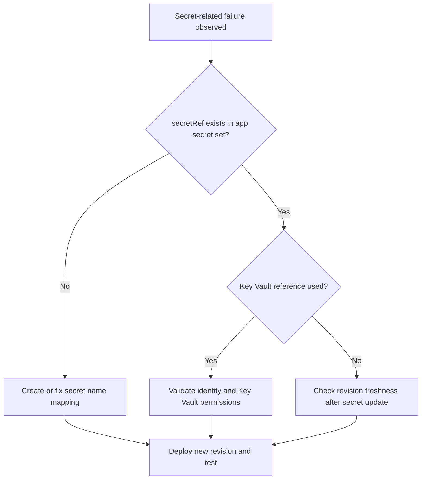

# Secret and Key Vault Reference Failure

Use this playbook when revisions fail or apps crash because secrets are missing, stale, or inaccessible through Key Vault references.

## Symptoms

- Revision fails soon after deployment with secret resolution errors.
- Application logs show missing configuration values or authentication failures.
- Secret updates do not appear in running revision behavior.

## Common Misreadings

!!! warning "Common Misreadings"
    - Misreading: "Secret set command succeeded, so app uses it immediately." Secret updates require a new revision or restart path.
    - Misreading: "Key Vault reference means no RBAC checks." Managed identity still needs Key Vault access rights.

## Competing Hypotheses

| Hypothesis | Evidence For | Evidence Against |
|---|---|---|
| Missing secret or wrong `secretRef` | Provisioning logs mention unresolved secret | `secret list` contains exact referenced name |
| Key Vault access denied | 403 from Key Vault and identity token success | Vault access works with same identity |
| Stale revision after secret change | Behavior unchanged until new revision deploy | New revision already active with updated value |

## What to Check First

### Metrics

- Deployment failure count and configuration error trend.

### Logs

```kusto
let AppName = "my-container-app";
ContainerAppSystemLogs_CL
| where ContainerAppName_s == AppName
| where Log_s has_any ("secret", "KeyVault", "vault", "reference", "denied")
| project TimeGenerated, RevisionName_s, Reason_s, Log_s
| order by TimeGenerated desc
```

### Platform Signals

```bash
az containerapp secret list --name "$APP_NAME" --resource-group "$RG"
az containerapp show --name "$APP_NAME" --resource-group "$RG" --query "properties.template.containers[0].env" --output json
az containerapp show --name "$APP_NAME" --resource-group "$RG" --query "identity" --output json
```

## Evidence Collection

```bash
az keyvault secret show --vault-name "my-kv" --name "my-secret" --query "attributes.enabled" --output tsv
az role assignment list --scope "$(az keyvault show --name "my-kv" --resource-group "$RG" --query id --output tsv)" --assignee "$(az containerapp show --name "$APP_NAME" --resource-group "$RG" --query identity.principalId --output tsv)" --output table
az containerapp revision list --name "$APP_NAME" --resource-group "$RG" --output table
```

## Decision Flow



## Resolution Steps

1. Ensure all `secretRef` values map to existing secrets.
2. For Key Vault references, confirm managed identity and vault RBAC/policy access.
3. Rotate or set secret values and deploy a new revision.
4. Validate app behavior with expected config value present.

## Prevention

- Standardize secret naming and reference patterns.
- Add secret existence checks in deployment pipelines.
- Schedule regular Key Vault permission audits.

## See Also

- [Managed Identity Auth Failure](managed-identity-auth-failure.md)
- [Revision Provisioning Failure](../startup-and-provisioning/revision-provisioning-failure.md)
- [Secret Reference Failures KQL](../../kql/identity-and-secrets/secret-reference-failures.md)
