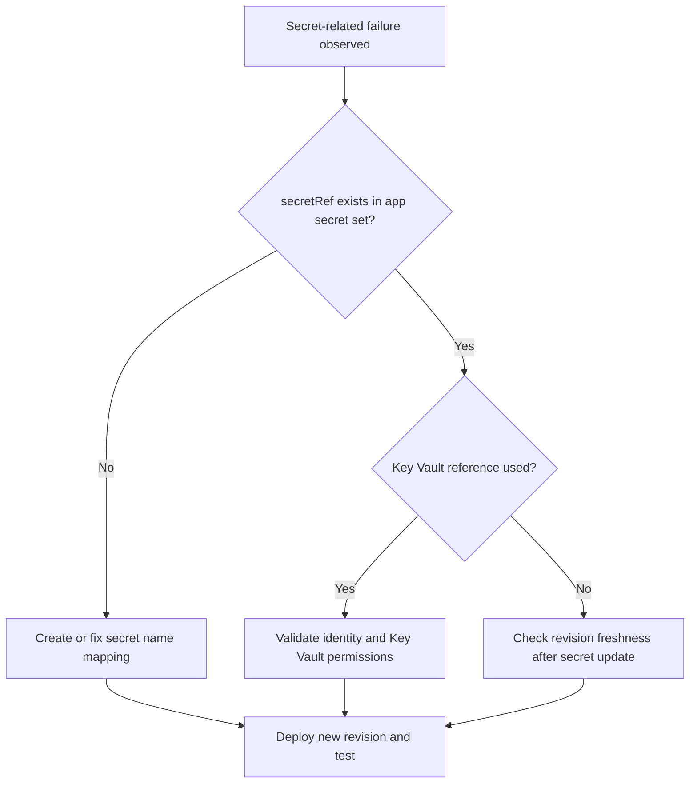

---
content_sources:
  diagrams:
    - id: troubleshooting-decision-flow
      type: flowchart
      source: mslearn-adapted
      based_on:
        - https://learn.microsoft.com/en-us/azure/container-apps/manage-secrets
        - https://learn.microsoft.com/en-us/azure/container-apps/manage-secrets#reference-secret-from-key-vault
        - https://learn.microsoft.com/en-us/azure/container-apps/managed-identity
content_validation:
  status: verified
  last_reviewed: '2026-04-12'
  reviewer: ai-agent
  core_claims:
    - claim: Azure Container Apps supports both system-assigned and user-assigned managed identities.
      source: https://learn.microsoft.com/en-us/azure/container-apps/managed-identity
      verified: true
    - claim: Each revision in Azure Container Apps is an immutable snapshot of a container app version.
      source: https://learn.microsoft.com/en-us/azure/container-apps/revisions
      verified: true
    - claim: When user-defined routes force Container Apps egress through Azure Firewall, the firewall policy must allow the documented Entra authority endpoints used on this path, including login.microsoftonline.com and login.microsoft.com, so managed identity token acquisition and OIDC discovery can complete.
      source: https://learn.microsoft.com/en-us/azure/container-apps/firewall-integration
      verified: true
---
# Secret and Key Vault Reference Failure

## 1. Summary

### Symptom

Revisions fail or apps crash because secrets are missing, stale, or inaccessible through Key Vault references. Common symptoms include secret resolution errors during revision startup, missing configuration values in application logs, authentication failures, and secret updates that do not appear in running revision behavior.

### Why this scenario is confusing

Secret failures span configuration mapping, revision lifecycle behavior, and Key Vault authorization. A successful `secret set` operation does not mean the running revision is already using the new value, and a valid managed identity does not mean that Key Vault access rights are correct.

### Troubleshooting decision flow

<!-- diagram-id: troubleshooting-decision-flow -->


## 2. Common Misreadings

- "Secret set command succeeded, so app uses it immediately." Secret updates require a new revision or restart path.
- "Key Vault reference means no RBAC checks." Managed identity still needs Key Vault access rights.

## 3. Competing Hypotheses

| Hypothesis | Typical Evidence For | Typical Evidence Against |
|---|---|---|
| Missing secret or wrong `secretRef` | Provisioning logs mention unresolved secret | `secret list` contains exact referenced name |
| Key Vault access denied | 403 from Key Vault and identity token success | Vault access works with same identity |
| Stale revision after secret change | Behavior unchanged until new revision deploy | New revision already active with updated value |
| Managed identity OIDC discovery blocked by egress control (UDR → Azure Firewall) | `az containerapp secret set --identity ... --key-vault-url ...` fails with `Unable to get value using Managed identity` and `Get https://login.microsoftonline.com/<tenant>/.well-known/openid-configuration: EOF` (or the same error on `login.microsoft.com` — the OIDC discovery client picks one Entra authority host at runtime); firewall `Deny` row for **either** `login.microsoftonline.com` **or** `login.microsoft.com` from the workload subnet source IP inside the failure window; MI and RBAC both correct | Direct probes from the workload path to **both** `login.microsoftonline.com` **and** `login.microsoft.com` succeed (a single-host probe is not sufficient because the client may pick the other host); no firewall on the workload path; OR firewall Application Rule permitting **both** Entra authority FQDNs from the workload subnet is present |

## 4. What to Check First

### Metrics

- Deployment failure count and configuration error trend.

### Logs

```kusto
let AppName = "ca-myapp";
ContainerAppSystemLogs_CL
| where ContainerAppName_s == AppName
| where Log_s has_any ("secret", "KeyVault", "vault", "reference", "denied")
| project TimeGenerated, RevisionName_s, Reason_s, Log_s
| order by TimeGenerated desc
```

### Platform Signals

```bash
az containerapp secret list --name "$APP_NAME" --resource-group "$RG"
az containerapp show --name "$APP_NAME" --resource-group "$RG" --query "properties.template.containers[0].env" --output json
az containerapp show --name "$APP_NAME" --resource-group "$RG" --query "identity" --output json
```

## 5. Evidence to Collect

### Required Evidence

| Evidence | Command/Query | Purpose |
|---|---|---|
| Secret inventory | `az containerapp secret list --name "$APP_NAME" --resource-group "$RG"` | Verify that each referenced secret exists |
| Environment mapping | `az containerapp show --name "$APP_NAME" --resource-group "$RG" --query "properties.template.containers[0].env" --output json` | Confirm `secretRef` names and env mapping |
| Identity configuration | `az containerapp show --name "$APP_NAME" --resource-group "$RG" --query "identity" --output json` | Verify managed identity is present |
| Key Vault secret state | `az keyvault secret show --vault-name "my-kv" --name "my-secret" --query "attributes.enabled" --output tsv` | Confirm the referenced secret is enabled |
| Vault access scope | `az role assignment list --scope "$(az keyvault show --name "my-kv" --resource-group "$RG" --query id --output tsv)" --assignee "$(az containerapp show --name "$APP_NAME" --resource-group "$RG" --query identity.principalId --output tsv)" --output table` | Verify the app identity has access |
| Revision freshness | `az containerapp revision list --name "$APP_NAME" --resource-group "$RG" --output table` | Confirm whether a new revision is active after secret change |
| Secret-related system logs | KQL on `ContainerAppSystemLogs_CL` | Identify unresolved secret and Key Vault errors |

### Useful Context

- Whether the app uses direct secrets or Key Vault references.
- Whether the secret was recently rotated or renamed.
- Whether the app is using the expected revision after the secret change.

Observed provisioning baseline:

```text
$ az containerapp show --name "$APP_NAME" --resource-group "$RG" --query provisioningState
"Succeeded"
```

| Command | Why it is used |
|---|---|
| `az containerapp show --name ...` | Reads the Container App configuration so the documented setting can be verified. |

## 6. Validation and Disproof by Hypothesis

### H1: Missing secret or wrong `secretRef`

**Signals that support:**

- Provisioning logs mention unresolved secret.
- `secretRef` names in environment configuration do not match the app secret set.
- `az containerapp secret list --name "$APP_NAME" --resource-group "$RG"` does not contain the exact referenced name.

**Signals that weaken:**

- `secret list` contains the exact referenced name.
- Environment mapping shows the expected `secretRef` values.

**What to verify:**

```bash
az containerapp secret list --name "$APP_NAME" --resource-group "$RG"
az containerapp show --name "$APP_NAME" --resource-group "$RG" --query "properties.template.containers[0].env" --output json
```

| Command | Why it is used |
|---|---|
| `az containerapp secret list ...` | Manages Container Apps secrets without exposing secret values in plain configuration. |

**Disproof logic:**

If every `secretRef` exactly matches a defined secret and system logs do not report unresolved secret errors, this hypothesis is weakened.

### H2: Key Vault access denied

**Signals that support:**

- 403 from Key Vault and identity token success.
- Managed identity exists, but vault access does not work.
- System logs include `KeyVault`, `vault`, `reference`, or `denied` messages.

**Signals that weaken:**

- Vault access works with the same identity.
- Role assignment output confirms expected access scope.
- The referenced secret is enabled and accessible.

**What to verify:**

```bash
az containerapp show --name "$APP_NAME" --resource-group "$RG" --query "identity" --output json
az keyvault secret show --vault-name "my-kv" --name "my-secret" --query "attributes.enabled" --output tsv
az role assignment list --scope "$(az keyvault show --name "my-kv" --resource-group "$RG" --query id --output tsv)" --assignee "$(az containerapp show --name "$APP_NAME" --resource-group "$RG" --query identity.principalId --output tsv)" --output table
```

| Command | Why it is used |
|---|---|
| `az containerapp show --name ...` | Reads the Container App configuration so the documented setting can be verified. |

```kusto
let AppName = "ca-myapp";
ContainerAppSystemLogs_CL
| where ContainerAppName_s == AppName
| where Log_s has_any ("secret", "KeyVault", "vault", "reference", "denied")
| project TimeGenerated, RevisionName_s, Reason_s, Log_s
| order by TimeGenerated desc
```

**Disproof logic:**

If the same identity can access the vault, the secret is enabled, and role assignment output matches expectations without 403 evidence, access denial becomes less likely.

### H3: Stale revision after secret change

**Signals that support:**

- Behavior remains unchanged until a new revision deploys.
- Secret updates do not appear in running revision behavior.
- Revision list shows that the expected new revision is not active.

**Signals that weaken:**

- New revision already active with updated value.
- Current behavior matches the new secret value.

**What to verify:**

```bash
az containerapp revision list --name "$APP_NAME" --resource-group "$RG" --output table
```

**Disproof logic:**

If a new revision is already active and behavior reflects the updated value, stale revision state is not the primary cause.

### H4: Managed Identity OIDC Discovery Blocked by Egress Control (UDR → Azure Firewall)

**Signals that support:**

- `az containerapp secret set --identity system --key-vault-url ...` (or `--identity <user-assigned-id>`) fails with exit code non-zero.
- `stderr` contains the marker phrases `Failed to update secrets` and `Unable to get value using Managed identity`.
- `stderr` includes the substring `.well-known/openid-configuration:` on **either** `login.microsoftonline.com` **or** `login.microsoft.com` (the OIDC discovery client picks one host at runtime), followed by a transport-level error (`EOF`, `connection reset`, `TLS handshake failure`, or timeout) rather than an HTTP status code from Microsoft Entra ID.
- The Container Apps environment uses workload-profile networking with a `0.0.0.0/0 → Azure Firewall private IP` UDR on the workload subnet.
- Azure Firewall policy does not carry an Application Rule that permits `login.microsoftonline.com` and `login.microsoft.com` from the workload subnet source range.
- Azure Firewall application-rule log carries a `Deny` action row for **either** `login.microsoftonline.com` **or** `login.microsoft.com` (whichever host the OIDC discovery client happened to try) from a source IP inside the workload subnet, timestamped inside the failure window.
- The managed identity is correctly assigned to the Container App (`principalId` present) and holds `Key Vault Secrets User` at the target Key Vault scope; the Key Vault firewall / private endpoint allows the caller's outbound path.
- The failure is **only** visible in the control-plane secret-set output. `latestReadyRevisionName` does not change, ingress continues to return HTTP 200, and the app remains `Healthy/Running` (silence gate).

**Signals that weaken:**

- Direct probes from the same egress path to **both** `https://login.microsoftonline.com/<tenant>/.well-known/openid-configuration` **and** `https://login.microsoft.com/<tenant>/.well-known/openid-configuration` succeed and return discovery JSON. Probing only one host is not sufficient to weaken H4 because the OIDC discovery client may pick either host at runtime — a firewall rule that permits only one Entra authority FQDN will silently drop discovery calls that pick the other, so the weakening evidence must confirm both hosts are reachable.
- No firewall or NVA is on the workload subnet egress path (for example, a Consumption-only environment without UDR, or a workload-profile environment with default internet-bound egress).
- The firewall policy already contains an Application Rule that permits the Entra authority FQDNs from the workload subnet, and the firewall log shows an `Allow` row for the same destination in the failure window.
- The failure signature is an HTTP 401 or 403 from Microsoft Entra ID or from Key Vault rather than a transport-level `EOF` on the OIDC discovery URL. HTTP status codes point to H2 (Key Vault access denied) or a token audience / SDK config issue, not to a network path drop.

**What to verify:**

```bash
# 1. Confirm the failure surface (marker strings in stderr)
az containerapp secret set --name "$APP_NAME" --resource-group "$RG" \
    --secrets "kvref-diag=keyvaultref:https://<vault>.vault.azure.net/secrets/<name>,identityref:system" \
    2> /tmp/secret-set-stderr.txt || true
grep -E "Failed to update secrets|Unable to get value using Managed identity|openid-configuration" /tmp/secret-set-stderr.txt

# 2. Confirm the workload subnet routes 0.0.0.0/0 through Azure Firewall
INFRA_SUBNET_ID="$(az containerapp env show --name "$ACA_ENV_NAME" --resource-group "$RG" \
    --query "properties.vnetConfiguration.infrastructureSubnetId" --output tsv)"
ROUTE_TABLE_ID="$(az network vnet subnet show --ids "$INFRA_SUBNET_ID" \
    --query "routeTable.id" --output tsv)"
if [ -n "$ROUTE_TABLE_ID" ]; then
    az network route-table route list --route-table-name "$(basename "$ROUTE_TABLE_ID")" \
        --resource-group "$RG" --output table
fi

# 3. Confirm the firewall policy Application Rules for the Entra authority FQDNs
az network firewall policy rule-collection-group collection list \
    --policy-name "$FIREWALL_POLICY_NAME" \
    --resource-group "$RG" \
    --rule-collection-group-name "$FIREWALL_POLICY_RCG_NAME" \
    --query "[?ruleCollectionType=='FirewallPolicyFilterRuleCollection'].{name:name, rules:rules[?ruleType=='ApplicationRule'].{name:name, targetFqdns:targetFqdns}}" \
    --output json

# 4. Confirm the MI, RBAC, and Key Vault network path are all healthy
#    (rules out the non-H4 hypotheses: missing identity, missing role, or
#     Key Vault firewall blocking the caller). If any of these three
#     surfaces are broken, the failure is not H4.
APP_MI_PRINCIPAL_ID="$(az containerapp show --name "$APP_NAME" --resource-group "$RG" \
    --query "identity.principalId" --output tsv)"
echo "Managed identity principalId: $APP_MI_PRINCIPAL_ID"
KEY_VAULT_ID="$(az keyvault show --name "$KEY_VAULT_NAME" --resource-group "$RG" \
    --query "id" --output tsv)"
az role assignment list --assignee "$APP_MI_PRINCIPAL_ID" --scope "$KEY_VAULT_ID" \
    --query "[].{roleDefinitionName:roleDefinitionName, scope:scope}" --output table
az keyvault show --name "$KEY_VAULT_NAME" --resource-group "$RG" \
    --query "{networkAcls:properties.networkAcls, publicNetworkAccess:properties.publicNetworkAccess}" \
    --output json
```

| Command | Why it is used |
|---|---|
| `az containerapp secret set ...` | Reproduces the failure surface so `stderr` marker strings can be captured verbatim. |
| `az containerapp env show ...` | Reads the environment's infrastructure subnet ID so route table attachment can be inspected. |
| `az network vnet subnet show ...` | Retrieves the route table ID attached to the workload subnet. |
| `az network route-table route list ...` | Lists the effective routes so a `0.0.0.0/0 → VirtualAppliance` next-hop to the firewall private IP can be confirmed. |
| `az network firewall policy rule-collection-group collection list ...` | Lists the Application Rules in the firewall policy so the Entra authority FQDNs (`login.microsoftonline.com`, `login.microsoft.com`) can be verified as present or absent. |
| `az containerapp show --query identity.principalId` | Confirms the app has a managed identity assigned. If empty, the failure is not H4 — it is an identity-not-assigned problem. |
| `az role assignment list --assignee ... --scope $KEY_VAULT_ID` | Confirms the identity holds `Key Vault Secrets User` (or equivalent) at the target vault scope. If absent, the failure is not H4 — it is an RBAC gap (H2). |
| `az keyvault show --query properties.networkAcls` | Confirms the Key Vault's own network ACL and `publicNetworkAccess` posture. If the vault blocks the caller's outbound path, the failure signature is typically an HTTP 403 from Key Vault, not a transport-level `EOF` on the OIDC discovery URL — this points elsewhere, not to H4. |

```kusto
// Firewall log for Entra authority FQDN during the failure window (schema-tolerant, host-tolerant)
let AcaSubnet = "10.90.0.0/23"; // workload subnet CIDR
let EntraFqdns = dynamic(["login.microsoftonline.com", "login.microsoft.com"]);
let StartTime = todatetime("<failure window start ISO8601>");
let EndTime   = todatetime("<failure window end ISO8601>");
union isfuzzy=true
    (AZFWApplicationRule
        | where TimeGenerated between (StartTime .. EndTime)
        | where Fqdn has_any (EntraFqdns)
        | where ipv4_is_in_range(SourceIp, AcaSubnet)
        | project TimeGenerated, Action, Fqdn, SourceIp, Policy, RuleCollection, Rule),
    (AzureDiagnostics
        | where TimeGenerated between (StartTime .. EndTime)
        | where Category == "AzureFirewallApplicationRule"
        | where msg_s has_any (EntraFqdns)
        | extend Action = extract(@"Action: (\w+)", 1, msg_s)
        | extend SourceIp = extract(@"from (\d+\.\d+\.\d+\.\d+):", 1, msg_s)
        | extend Fqdn = extract(@"Url: https?://([^/]+)", 1, msg_s)
        | where ipv4_is_in_range(SourceIp, AcaSubnet)
        | project TimeGenerated, Action, Fqdn, SourceIp, msg_s)
| order by TimeGenerated asc
```

Both `login.microsoftonline.com` and `login.microsoft.com` are documented Entra authority endpoints; the OIDC discovery client may use either host, and matching only one silently misses drops on the other.

**Disproof logic:**

The following observations weaken H4:

- The firewall log shows an `Allow` row for **either** `login.microsoftonline.com` **or** `login.microsoft.com` from the workload subnet source IP during the failure window, AND the failure persists — the network path is not the controlling variable.
- The workload subnet has no UDR forcing egress through Azure Firewall (no `0.0.0.0/0 → VirtualAppliance` next-hop) — there is no firewall on the path.
- Direct probes from the same egress path to **both** `https://login.microsoftonline.com/<tenant>/.well-known/openid-configuration` **and** `https://login.microsoft.com/<tenant>/.well-known/openid-configuration` (for example via `az containerapp exec` running `curl` against both hosts) succeed and return discovery JSON. Probing a single Entra authority host is not sufficient to disprove H4: the OIDC discovery client picks one host at runtime, so a firewall rule that permits only one FQDN will silently drop discovery requests that happen to pick the other, and a one-host probe cannot distinguish that condition from a fully-open path.
- The failure signature is an HTTP 401 or 403 from Microsoft Entra ID or from Key Vault rather than a transport-level `EOF` on the OIDC discovery URL. HTTP status codes point to H2 (Key Vault RBAC) or a token audience / SDK config issue, not to a network path drop.

**`No matching row` is not disproof on its own.** The absence of any `Allow` or `Deny` row for the Entra authority FQDNs in the query result can also mean: firewall diagnostic logging is not enabled, diagnostics are configured to a different Log Analytics workspace, the query window is outside the ingestion latency window (ingestion typically takes 60 seconds or more), the source IP filter (`ipv4_is_in_range(SourceIp, AcaSubnet)`) does not match the actual egress subnet CIDR, or the query is targeting the wrong tenant's diagnostics table. Before treating an empty result as a signal, confirm firewall diagnostics are enabled for both `AZFWApplicationRule` (structured schema) and `AzureDiagnostics` (legacy schema) and that the query window extends at least five minutes past the failure timestamp.

For a fully reproducible end-to-end proof of this hypothesis — including an offline verifier that re-validates the reader-generated H0 → H1 → H2 cohort against 17 gates and enumerates the 8 documented explicit drops (`stderr wording`, `log ingestion latency`, `retry cadence`, `component identity`, `response body shape`, `token caching`, `SKU generality`, `region generality`) — see the [ACA Secret Key Vault Reference — Managed Identity Network Path Lab](../../lab-guides/aca-secret-kv-ref-mi-network-path.md).

## 7. Likely Root Cause Patterns

| Pattern | Frequency | First Signal | Typical Resolution |
|---|---|---|---|
| `secretRef` name mismatch | Common | Unresolved secret in provisioning logs | Fix secret name mapping |
| Missing Key Vault permissions | Common | 403 or denied messages | Grant the app identity the required Key Vault access |
| Secret rotated without revision refresh | Common | Old behavior persists after secret change | Deploy a new revision or restart path |
| MI OIDC discovery blocked by egress control (UDR → Azure Firewall) | Occasional | `Unable to get value using Managed identity` with a transport-level error (`EOF`, connection reset) on `login.microsoftonline.com/<tenant>/.well-known/openid-configuration` (or `login.microsoft.com` — the OIDC discovery client picks one host at runtime); firewall `Deny` row for **either** Entra authority FQDN from the workload subnet source IP | Add or restore an Azure Firewall Application Rule permitting both `login.microsoftonline.com` and `login.microsoft.com` from the workload subnet |

## 8. Immediate Mitigations

1. Ensure all `secretRef` values map to existing secrets.
2. For Key Vault references, confirm managed identity and vault RBAC/policy access.
3. Rotate or set secret values and deploy a new revision.
4. Validate app behavior with expected config value present.
5. If the workload subnet routes egress through Azure Firewall (or another NVA), verify the firewall policy contains an Application Rule permitting outbound HTTPS to **both** `login.microsoftonline.com` and `login.microsoft.com` from the workload subnet, and confirm the firewall log shows an `Allow` row for **either** Entra authority FQDN in the failure window. If the rule is missing, add or restore it:

    ```bash
    az network firewall policy rule-collection-group collection add-filter-collection \
        --resource-group "$RG" \
        --policy-name "$FIREWALL_POLICY_NAME" \
        --rule-collection-group-name "$FIREWALL_POLICY_RCG_NAME" \
        --name "aca-entra-authority-allow" \
        --collection-priority 200 \
        --action Allow \
        --rule-type ApplicationRule \
        --rule-name "allow-entra-authority" \
        --source-addresses "$ACA_WORKLOAD_SUBNET_CIDR" \
        --protocols Https=443 \
        --target-fqdns "login.microsoftonline.com" "login.microsoft.com"
    ```

## 9. Prevention

- Standardize secret naming and reference patterns.
- Add secret existence checks in deployment pipelines.
- Schedule regular Key Vault permission audits.

## See Also

- [Managed Identity Auth Failure](managed-identity-auth-failure.md)
- [Revision Provisioning Failure](../startup-and-provisioning/revision-provisioning-failure.md)
- [Secret Reference Failures KQL](../../kql/identity-and-secrets/secret-reference-failures.md)
- [ACA Secret Key Vault Reference — Managed Identity Network Path Lab](../../lab-guides/aca-secret-kv-ref-mi-network-path.md)
- [Egress Control — Required Outbound Dependencies](../../../platform/networking/egress-control.md#required-outbound-dependencies)

## Sources

- [Manage secrets in Azure Container Apps](https://learn.microsoft.com/en-us/azure/container-apps/manage-secrets)
- [Use managed identity to authenticate to Azure Key Vault from Azure Container Apps](https://learn.microsoft.com/en-us/azure/container-apps/manage-secrets#reference-secret-from-key-vault)
- [Managed identities in Azure Container Apps](https://learn.microsoft.com/en-us/azure/container-apps/managed-identity)
- [User-defined routes with Azure Container Apps](https://learn.microsoft.com/en-us/azure/container-apps/user-defined-routes)
- [Configure a firewall in Azure Container Apps environments](https://learn.microsoft.com/en-us/azure/container-apps/firewall-integration)
