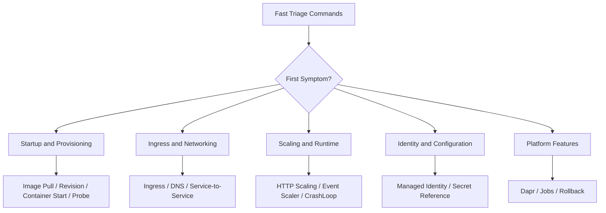

---
content_sources:
  - type: mslearn-adapted
    url: https://learn.microsoft.com/en-us/azure/container-apps/troubleshooting
  - type: mslearn-adapted
    url: https://learn.microsoft.com/en-us/azure/container-apps/overview
content_validation:
  status: pending_review
  last_reviewed: 2026-04-29
  reviewer: agent
  core_claims:
    - claim: "Azure Container Apps provides built-in troubleshooting tools including log streaming and console access."
      source: https://learn.microsoft.com/en-us/azure/container-apps/troubleshooting
      verified: true
    - claim: "Container Apps revisions are immutable snapshots that enable traffic splitting and rollback."
      source: https://learn.microsoft.com/en-us/azure/container-apps/revisions
      verified: true
diagrams:
  - id: ca-myapp-0000001-true-100-1-healthy-running
    type: flowchart
    source: mslearn-adapted
    based_on:
      - https://learn.microsoft.com/en-us/azure/container-apps/troubleshooting
      - https://learn.microsoft.com/en-us/azure/container-apps/overview
---

# Troubleshooting

## Fast Triage Commands

```bash
RG="rg-myapp"
APP_NAME="ca-myapp"

az containerapp show --name "$APP_NAME" --resource-group "$RG" --query properties.provisioningState
az containerapp revision list --name "$APP_NAME" --resource-group "$RG"
az containerapp logs show --name "$APP_NAME" --resource-group "$RG" --type system
az containerapp logs show --name "$APP_NAME" --resource-group "$RG" --type console --follow
```

Use `APP_NAME="ca-myapp"` for the examples below. Real observed healthy outputs:

```text
$ az containerapp show --name "$APP_NAME" --resource-group "$RG" --query properties.provisioningState
"Succeeded"

$ az containerapp revision list --name "$APP_NAME" --resource-group "$RG" --output table
Name               Active    TrafficWeight    Replicas    HealthState    RunningState
-----------------  --------  ---------------  ----------  -------------  ------------
ca-myapp--0000001  True      100              1           Healthy        Running
```

<!-- diagram-id: ca-myapp-0000001-true-100-1-healthy-running -->


## Common Errors

| Error message / symptom | Likely cause | Fix |
| --- | --- | --- |
| `ImagePullBackOff`, `unauthorized: authentication required` | ACR auth/identity not configured | Grant `AcrPull` to Container App managed identity and verify `--registry-server` |
| `CrashLoopBackOff` | App exits on startup | Check console logs, missing package/env var, verify startup command |
| `ModuleNotFoundError: <module>` | Dependency missing from image | Add package to `requirements.txt`, rebuild image, redeploy |
| `Address already in use` or bind failure | Port mismatch | Ensure container listens on `0.0.0.0:8000` and ACA `--target-port 8000` |
| Health probe failures | Probe path/port invalid or app slow to start | Align probe port/path with app endpoint; increase startup tolerance |
| 502/504 from ingress | No healthy replica, startup timeout, app not listening | Validate revision health, startup logs, and target port |
| URL not reachable | Ingress set to internal | Set `--ingress external` or test from inside VNet/environment |
| Secret value appears unchanged | Secret updates create new revision | Restart/deploy new revision after `az containerapp secret set` |

## Playbook Categories

Use the category that best matches your first confirmed symptom.

### Startup and Provisioning

- [Image Pull Failure](startup-and-provisioning/image-pull-failure.md)
- [Revision Provisioning Failure](startup-and-provisioning/revision-provisioning-failure.md)
- [Container Start Failure](startup-and-provisioning/container-start-failure.md)
- [Probe Failure and Slow Start](startup-and-provisioning/probe-failure-and-slow-start.md)

### Ingress and Networking

- [mTLS Failures](mtls-failures.md)
- [Ingress Not Reachable](ingress-and-networking/ingress-not-reachable.md)
- [Internal DNS and Private Endpoint Failure](ingress-and-networking/internal-dns-and-private-endpoint-failure.md)
- [Service-to-Service Connectivity Failure](ingress-and-networking/service-to-service-connectivity-failure.md)

### Scaling and Runtime

- [HTTP Scaling Not Triggering](scaling-and-runtime/http-scaling-not-triggering.md)
- [Event Scaler Mismatch](scaling-and-runtime/event-scaler-mismatch.md)
- [CrashLoop OOM and Resource Pressure](scaling-and-runtime/crashloop-oom-and-resource-pressure.md)

### Identity and Configuration

- [Managed Identity Auth Failure](identity-and-configuration/managed-identity-auth-failure.md)
- [Secret and Key Vault Reference Failure](identity-and-configuration/secret-and-key-vault-reference-failure.md)
- [Continuous Deployment RBAC Role Assignment Conflict](identity-and-configuration/cd-rbac-role-assignment-conflict.md)

### Platform Features

- [Dapr Sidecar or Component Failure](platform-features/dapr-sidecar-or-component-failure.md)
- [Container App Job Execution Failure](platform-features/container-app-job-execution-failure.md)
- [Bad Revision Rollout and Rollback](platform-features/bad-revision-rollout-and-rollback.md)
- [Scheduled Job Missed Execution](platform-features/scheduled-job-missed.md)
- [Event-Triggered Job Storm](platform-features/event-job-storm.md)
- [Dapr State Store Config Failure](platform-features/dapr-state-store-failure.md)
- [Dapr Pub/Sub Config Failure](platform-features/dapr-pubsub-failure.md)
- [EasyAuth Entra ID Config Failure](platform-features/easyauth-entra-id-failure.md)
- [Multi-Region Failover Failure](platform-features/multi-region-failover.md)

### Networking Advanced

- [Subnet CIDR Exhaustion](networking-advanced/subnet-cidr-exhaustion.md)
- [UDR and NSG Egress Blocked](networking-advanced/udr-nsg-egress-blocked.md)
- [Private Endpoint DNS Failure](networking-advanced/private-endpoint-dns-failure.md)
- [Egress IP Change](networking-advanced/egress-ip-change.md)
- [Custom Domain TLS Renewal](networking-advanced/custom-domain-tls-renewal.md)
- [WebSocket and gRPC Ingress](networking-advanced/websocket-grpc-ingress.md)
- [Session Affinity Failure](networking-advanced/session-affinity-failure.md)

### Storage and Volumes

- [Azure Files Mount Failure](storage-and-volumes/azure-files-mount-failure.md)
- [EmptyDir Disk Full](storage-and-volumes/emptydir-disk-full.md)
- [Volume Permission Denied](storage-and-volumes/volume-permission-denied.md)

### Observability

- [Log Analytics Ingestion Gap](observability/log-analytics-ingestion-gap.md)
- [App Insights Connection String Missing](observability/appinsights-connection-string-missing.md)
- [Diagnostic Settings Missing](observability/diagnostic-settings-missing.md)

### Deployment and CI/CD

- [GitHub Actions OIDC Failure](deployment-and-cicd/github-actions-oidc-failure.md)
- [Bicep Deployment Timeout](deployment-and-cicd/bicep-deployment-timeout.md)
- [Revision History Limit](deployment-and-cicd/revision-history-limit.md)

### Cost and Quota

- [Subscription Quota Exceeded](cost-and-quota/subscription-quota-exceeded.md)
- [Workload Profile Mismatch](cost-and-quota/workload-profile-mismatch.md)
- [Min Replicas Cost Surprise](cost-and-quota/min-replicas-cost-surprise.md)

### Startup and Provisioning (extended)

- [Docker Hub Rate Limit](startup-and-provisioning/docker-hub-rate-limit.md)
- [Image Size Startup Delay](startup-and-provisioning/image-size-startup-delay.md)
- [Multi-Arch Image Mismatch](startup-and-provisioning/multi-arch-image-mismatch.md)

### Scaling and Runtime (extended)

- [CPU Throttling](scaling-and-runtime/cpu-throttling.md)
- [Memory Leak OOMKilled](scaling-and-runtime/memory-leak-oomkilled.md)
- [Replica Load Imbalance](scaling-and-runtime/replica-load-imbalance.md)

## How to Use This Hub

1. Run the fast triage commands to identify the first concrete failure signal.
2. Open the matching playbook and work through hypotheses and evidence collection.
3. Use [KQL Queries](../kql/index.md) for timeline and correlation.
4. If multiple signals conflict, use the [Detector Map](../methodology/detector-map.md).

## See Also

- [First 10 Minutes: Quick Triage Checklist](../first-10-minutes/index.md)
- [Troubleshooting Methodology](../methodology/index.md)
- [Detector Map](../methodology/detector-map.md)

## Sources

- [Azure Container Apps troubleshooting overview](https://learn.microsoft.com/en-us/azure/container-apps/troubleshooting)
- [Azure Container Apps overview](https://learn.microsoft.com/en-us/azure/container-apps/overview)
- [Azure Container Apps revisions](https://learn.microsoft.com/en-us/azure/container-apps/revisions)
