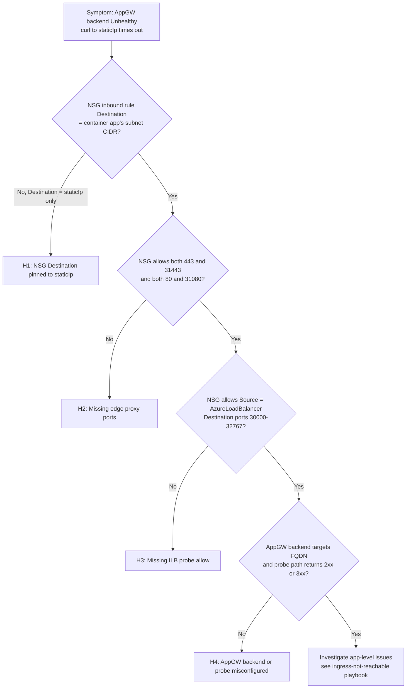

# AppGW to Internal ACA: NSG Destination Pinned to staticIp Fails

## 1. Summary

### Symptom

Azure Application Gateway is fronting an internal Container Apps environment. The Application Gateway backend health blade shows the container app backend as `Unhealthy`. From clients, requests through Application Gateway return 502 Bad Gateway. `curl` from a VM inside the Application Gateway subnet to `https://<staticIp>:443` also times out or is reset, even though the Container Apps environment itself is provisioned successfully and the container app has running, healthy replicas.

The Container Apps subnet has an inbound NSG rule that logically looks correct: Source = Application Gateway subnet, Destination = the environment `staticIp`, Destination port = `443`. That rule is exactly the failure mode this playbook diagnoses.

### Why this scenario is confusing

The environment `staticIp` is the on-wire packet destination that Application Gateway ends up sending traffic to (after resolving the container app FQDN through the linked Private DNS Zone — Application Gateway's backend pool targets the FQDN, not `staticIp` directly), and it is the address written into the Private DNS Zone A record. It looks like the natural Destination value for an NSG rule that should "allow AppGW to reach the environment." However, NSGs behind a load-balanced pool do not evaluate destination against the load balancer frontend — they evaluate against the destination NIC. The `staticIp` is the frontend IP of the environment's internal load balancer, and the packet is only that address on the wire briefly; the NSG on the container app subnet sees the destination address of the selected edge-proxy backend NIC, which is inside the container app's subnet CIDR — not `staticIp`.

Also confusing: the edge proxy listens on `31443` (HTTPS) and `31080` (HTTP) behind the ILB. Missing `31443` (or `31080`) on the subnet NSG causes the Application Gateway to container app HTTPS (or HTTP) path to fail consistently, because the subnet NSG does not allow the documented backend edge-proxy ports that the ILB actually forwards traffic to inside the subnet. The failure is not intermittent — it is a consistent block against every packet that lands on the edge-proxy NIC on `31443`/`31080`. See the [Application Gateway integration concept page](../../../platform/networking/application-gateway-integration.md) for the underlying platform behavior.

### Troubleshooting decision flow

<!-- diagram-id: appgw-nsg-decision-flow -->


## 2. Common Misreadings

- "The NSG Destination should be `staticIp` because that is what Application Gateway sends traffic to." NSG rules on a load-balanced subnet evaluate against the destination NIC, not the load balancer frontend. Documented behavior for any workload behind an Azure load balancer.
- "The Container Apps environment is internal, so the NSG only needs to allow the Application Gateway subnet on port 443." Port 443 by itself is insufficient in a workload profiles environment because the edge proxy behind the ILB listens on `31443` (and `31080` for HTTP).
- "The environment is provisioned and my container app is Healthy — the network path must be fine." Environment provisioning and container app health do not exercise the Application Gateway path. Application Gateway probes hit the same NSG that a public client would.
- "This rule worked on our old Consumption-only environment, so it should work on workload profiles too." The Microsoft Learn NSG table lists `staticIp` as an acceptable Destination for the Consumption-only environment type, but for workload profiles the Destination column shows only the container app's subnet. Migrations that reuse the old NSG hit exactly this class of failure.
- "The environment ILB frontend `staticIp` is inside the container app's subnet CIDR, so a Destination of `staticIp` is a subset of the correct Destination." Even when the CIDRs overlap on paper, the NIC that ultimately receives the packet has a different address in the same subnet — not `staticIp`.

## 3. Competing Hypotheses

| Hypothesis | Typical Evidence For | Typical Evidence Against |
|---|---|---|
| **H1: NSG Destination pinned to `staticIp`** | Inbound rule shows Destination = `staticIp` or a `/32`; `curl` from AppGW subnet to `https://<staticIp>` times out; changing Destination to the container app's subnet CIDR fixes the issue | Rule already scoped to the container app's subnet CIDR |
| **H2: Missing edge proxy ports (`31443`, `31080`)** | Inbound rule allows `443` but not `31443`; AppGW health probe reports Unhealthy consistently while the container app itself has running healthy replicas; backend transitions to Healthy immediately after `31443` (and `31080` for HTTP) is added to the rule's Destination ports | Rule already includes `443, 31443` (and `80, 31080` for HTTP) |
| **H3: Effective NSG blocks the `AzureLoadBalancer` probe path on `30000-32767`** | Every backend is marked Unhealthy by the environment ILB itself, independent of Application Gateway; the container app subnet NSG has a higher-priority custom Deny rule that shadows the default `AllowAzureLoadBalancerInBound` rule (priority 65001), or there is no explicit low-priority allow rule and a custom Deny blocks the probe path | An inbound Allow with Source = `AzureLoadBalancer`, Destination = the container app's subnet CIDR, Destination ports `30000-32767` exists at a lower priority than any custom Deny, AND no custom Deny rule matches the `AzureLoadBalancer` source or the `30000-32767` port range at a higher priority |
| **H4: AppGW backend or health probe misconfigured** | AppGW backend targets an IP address rather than the container app FQDN; `Pick host name from backend target` is unchecked; edge proxy returns 404 with `Container App does not exist`; health probe uses default `/` with 200-399 match on an app that returns non-2xx on `/` | AppGW backend targets FQDN, probe uses a real path that returns 2xx or 3xx, and `Pick host name from backend target` is enabled |

## 4. What to Check First

### Metrics

- Application Gateway backend health status (Portal → Application Gateway → Backend health): backend pool should be `Healthy`.
- Application Gateway `HealthyHostCount` and `UnhealthyHostCount` (metric): `UnhealthyHostCount` should be 0.
- Container app request count and 5xx: expect 0 requests reaching the app when H1-H3 are the cause, because packets are dropped before the container.

### Logs

Container app system logs will typically show **nothing** for H1, H2, and H3 because packets never reach the edge proxy or are dropped at the destination NIC. This absence is itself evidence:

```kusto
let AppName = "ca-myapp";
ContainerAppSystemLogs_CL
| where ContainerAppName_s == AppName
| where TimeGenerated > ago(1h)
| where Log_s has_any ("ingress", "502", "503", "504", "connection refused", "timeout", "upstream", "gateway")
| project TimeGenerated, RevisionName_s, Reason_s, Log_s
| order by TimeGenerated desc
```

For H4, container app system logs and console logs may show requests arriving with the wrong Host header or a 404 from the edge proxy.

If NSG flow logs are enabled on the container app subnet NSG, they are the single most decisive signal for H1-H3. Filter flow logs for `denied` entries with source in the Application Gateway subnet or source = `AzureLoadBalancer`.

### Platform Signals

```bash
# Get the environment staticIp and container app subnet ID.
STATIC_IP=$(az containerapp env show \
  --name "$ACA_ENV_NAME" \
  --resource-group "$RG" \
  --query "properties.staticIp" \
  --output tsv)

ACA_SUBNET_ID=$(az containerapp env show \
  --name "$ACA_ENV_NAME" \
  --resource-group "$RG" \
  --query "properties.vnetConfiguration.infrastructureSubnetId" \
  --output tsv)

echo "staticIp:            $STATIC_IP"
echo "Container app subnet: $ACA_SUBNET_ID"

# List inbound NSG rules on the container app subnet's NSG.
az network nsg rule list \
  --resource-group "$RG" \
  --nsg-name "$ACA_SUBNET_NSG_NAME" \
  --query "[?direction=='Inbound'].{name:name,priority:priority,access:access,src:sourceAddressPrefix,srcs:sourceAddressPrefixes,dst:destinationAddressPrefix,dsts:destinationAddressPrefixes,ports:destinationPortRanges}" \
  --output table
```

| Command | Why it is used |
|---|---|
| `az containerapp env show ... --query "properties.staticIp"` | Retrieves the environment ingress IP so it can be compared against the NSG Destination values. |
| `az containerapp env show ... --query "properties.vnetConfiguration.infrastructureSubnetId"` | Retrieves the container app's subnet resource ID so its CIDR can be verified against the NSG Destination values. |
| `az network nsg rule list ...` | Lists inbound NSG rules on the container app subnet's NSG so Source, Destination, and Destination ports can be compared against the workload-profile NSG table. |

## 5. Evidence to Collect

### Required Evidence

| Evidence | Command / Query | Purpose |
|---|---|---|
| Environment `staticIp` | `az containerapp env show ... --query "properties.staticIp"` | Confirms the value that must NOT be the NSG Destination on a workload profiles environment. |
| Container app subnet CIDR | `az network vnet subnet show ... --query "addressPrefix"` (or `addressPrefixes`) | Confirms the value that MUST be the NSG Destination. |
| Container app subnet NSG rules (inbound) | `az network nsg rule list ... --query "[?direction=='Inbound']"` | Verifies Source, Destination, and Destination ports for the AppGW rule and the AzureLoadBalancer rule. |
| Application Gateway backend health | Portal → Application Gateway → Backend health, or `az network application-gateway show-backend-health` | Confirms whether the backend is Unhealthy and captures the probe error message. |
| Application Gateway backend pool target | `az network application-gateway address-pool show ...` | Confirms whether the backend targets an FQDN or an IP address. |
| Application Gateway backend HTTP setting | `az network application-gateway http-settings show ...` | Confirms `pickHostNameFromBackendAddress`, protocol, port, and probe binding. |
| Application Gateway probe | `az network application-gateway probe show ...` | Confirms probe protocol, path, host, and match conditions. |
| Container app system logs (last hour) | KQL on `ContainerAppSystemLogs_CL` | Absence of ingress errors during the probe window is itself evidence for H1-H3. |
| NSG flow logs (if enabled) | Portal → NSG → NSG flow logs | Decisive signal for H1-H3: shows denied packets with Source = AppGW subnet or Source = AzureLoadBalancer. |

### Useful Context

- Environment type: workload profiles vs Consumption-only. The Destination rules differ.
- Whether the environment was migrated from Consumption-only; migrated NSGs often retain the `staticIp` Destination.
- Application Gateway SKU (Standard_v2 vs WAF_v2). Behavior of the NSG diagnosis is identical; probe defaults are identical.
- Whether Application Gateway Private Link is in use. Adds an extra layer but does not change the destination-NIC NSG behavior.
- Any Azure Firewall or route table (UDR) on the Application Gateway subnet's outbound path. UDR-driven blackholing surfaces the same "connection times out" symptom but is a separate playbook — see [UDR and NSG Egress Blocked](../networking-advanced/udr-nsg-egress-blocked.md).

## 6. Validation and Disproof by Hypothesis

### H1: NSG Destination pinned to `staticIp`

**Signals that support:**

- Inbound rule on the container app subnet's NSG has Destination = `staticIp` (as an IP address) or a `/32` CIDR matching `staticIp`.
- `curl --verbose --connect-timeout 10 "https://<staticIp>:443/"` from a VM in the Application Gateway subnet times out or is reset.
- After changing Destination to the container app's subnet CIDR, the same `curl` succeeds and Application Gateway backend health flips to Healthy.

**Signals that weaken:**

- The rule already uses the container app's subnet CIDR (or a service tag such as `VirtualNetwork`) as Destination.
- `curl` from the Application Gateway subnet reaches the edge proxy (TLS handshake completes), which rules out a subnet-level block.

**What to verify:**

```bash
# List inbound rules and focus on the AppGW-facing one.
az network nsg rule list \
  --resource-group "$RG" \
  --nsg-name "$ACA_SUBNET_NSG_NAME" \
  --query "[?direction=='Inbound' && access=='Allow'].{name:name,priority:priority,src:sourceAddressPrefix,srcs:sourceAddressPrefixes,dst:destinationAddressPrefix,dsts:destinationAddressPrefixes,ports:destinationPortRanges}" \
  --output table
```

| Command | Why it is used |
|---|---|
| `az network nsg rule list ...` | Reads the inbound NSG rules on the container app subnet's NSG so the Destination column can be compared against the workload-profile NSG table. |

Expected values in a working configuration for the AppGW-facing rule: Source = Application Gateway subnet CIDR, Destination = the container app's subnet CIDR, Destination ports = `443, 31443` (add `80, 31080` if HTTP is used). Any rule where Destination is set to `staticIp` (a single IP address) is by-design broken on workload profiles environments.

### H2: Missing edge proxy ports (`31443`, `31080`)

**Signals that support:**

- The AppGW-facing inbound rule allows only `443` (and possibly `80`), with no `31443` or `31080`.
- Application Gateway health probe reports Unhealthy consistently while the container app itself is running with healthy replicas.
- Adding `31443` (and `31080` for HTTP) to the rule's Destination ports transitions the Application Gateway backend from Unhealthy to Healthy on the next probe interval.

**Signals that weaken:**

- The rule's Destination ports list already contains `443, 31443` (and `80, 31080` if HTTP is used).

**What to verify:**

```bash
az network nsg rule show \
  --resource-group "$RG" \
  --nsg-name "$ACA_SUBNET_NSG_NAME" \
  --name "$APPGW_TO_ACA_RULE_NAME" \
  --query "{name:name,protocol:protocol,src:sourceAddressPrefix,srcs:sourceAddressPrefixes,dst:destinationAddressPrefix,dsts:destinationAddressPrefixes,ports:destinationPortRanges}" \
  --output json
```

| Command | Why it is used |
|---|---|
| `az network nsg rule show ...` | Reads a single NSG rule so the exact Destination port list can be inspected against the required set (`443, 31443` for HTTPS; `80, 31080` for HTTP). |

Compare `destinationPortRanges` against the required set. If `31443` is missing on an HTTPS-serving app, this hypothesis is the cause.

### H3: Effective NSG blocks the `AzureLoadBalancer` probe path on `30000-32767`

**Signals that support:**

- The container app subnet NSG has a higher-priority custom Deny rule that shadows the default `AllowAzureLoadBalancerInBound` rule (priority 65001) — for example, a Deny rule at priority 100-500 that matches `AzureLoadBalancer` source or the `30000-32767` port range on the container app subnet.
- Application Gateway backend is Unhealthy even after H1 and H2 are addressed.
- Every container app in the environment shows probe-failure symptoms simultaneously, not just the one behind Application Gateway.

**Signals that weaken:**

- An inbound Allow rule exists with Source = `AzureLoadBalancer`, Destination = the container app's subnet CIDR, Destination ports = `30000-32767`, at a priority lower than any custom Deny rule.
- No custom Deny rule on the container app subnet's NSG matches the `AzureLoadBalancer` source or the `30000-32767` port range at any priority.

**What to verify:**

```bash
# List all inbound rules sorted by priority so the effective evaluation order is visible.
az network nsg rule list \
  --resource-group "$RG" \
  --nsg-name "$ACA_SUBNET_NSG_NAME" \
  --query "sort_by([?direction=='Inbound'], &priority)[].{prio:priority,name:name,access:access,src:sourceAddressPrefix,srcs:sourceAddressPrefixes,dst:destinationAddressPrefix,dsts:destinationAddressPrefixes,ports:destinationPortRanges}" \
  --output table
```

| Command | Why it is used |
|---|---|
| `az network nsg rule list ... sort_by(..., &priority)` | Lists inbound NSG rules sorted by priority so you can see whether any custom Deny rule matches `AzureLoadBalancer` source or the `30000-32767` port range at a higher priority than the default `AllowAzureLoadBalancerInBound` rule (priority 65001) or any explicit low-priority Allow rule. |

Expected in a properly locked-down workload profiles NSG: an explicit Allow rule with Source = `AzureLoadBalancer` service tag, Destination = the container app's subnet CIDR, Destination ports = `30000-32767`, at a priority lower than any custom Deny rule (typically 200-500). If no explicit rule exists, verify the default `AllowAzureLoadBalancerInBound` rule (priority 65001) is not shadowed by any higher-priority custom Deny — sort the rules by priority and look for any Deny that matches `AzureLoadBalancer` source or the `30000-32767` destination port range.

### H4: AppGW backend or health probe misconfigured

**Signals that support:**

- AppGW backend pool contains an IP address (typically `staticIp`) rather than the container app FQDN.
- AppGW HTTP setting has `Pick host name from backend target` disabled, or the probe overrides the Host header with something the edge proxy does not recognize.
- Edge proxy returns a `404` with a body containing `Container App does not exist` or similar.
- AppGW probe uses the default path `/` with `200-399` match, and the app returns non-2xx on `/`.
- H1, H2, and H3 have all been ruled out, yet the backend is still Unhealthy.

**Signals that weaken:**

- Backend pool target is the container app FQDN.
- HTTP setting has `Pick host name from backend target` enabled.
- Probe uses a real health path (for example `/healthz`) that the app confirms returns 200.

**What to verify:**

```bash
# Backend pool target.
az network application-gateway address-pool show \
  --gateway-name "$APPGW_NAME" \
  --resource-group "$RG" \
  --name "$APPGW_BACKEND_POOL_NAME" \
  --query "{name:name,fqdns:backendAddresses[].fqdn,ips:backendAddresses[].ipAddress}" \
  --output json

# HTTP setting: verify pickHostNameFromBackendAddress and probe binding.
az network application-gateway http-settings show \
  --gateway-name "$APPGW_NAME" \
  --resource-group "$RG" \
  --name "$APPGW_HTTP_SETTING_NAME" \
  --query "{name:name,protocol:protocol,port:port,pickHost:pickHostNameFromBackendAddress,probe:probe.id}" \
  --output json

# Probe: verify path, protocol, host, and match conditions.
az network application-gateway probe show \
  --gateway-name "$APPGW_NAME" \
  --resource-group "$RG" \
  --name "$APPGW_PROBE_NAME" \
  --query "{name:name,protocol:protocol,host:host,pickHost:pickHostNameFromBackendHttpSettings,path:path,match:match}" \
  --output json

# Backend health with details.
az network application-gateway show-backend-health \
  --name "$APPGW_NAME" \
  --resource-group "$RG" \
  --output json
```

| Command | Why it is used |
|---|---|
| `az network application-gateway address-pool show ...` | Confirms whether the backend targets an FQDN (required for the container app FQDN to be resolved to `staticIp` and for SNI to work) or an IP address. |
| `az network application-gateway http-settings show ...` | Confirms `pickHostNameFromBackendAddress`, backend protocol, and backend port. Wrong Host header causes the edge proxy to return 404. |
| `az network application-gateway probe show ...` | Confirms probe path, protocol, host, and match conditions. The default probe path `/` with `200-399` match fails silently on any app that returns 401, 403, 404, or 5xx on `/`. |
| `az network application-gateway show-backend-health ...` | Captures the exact backend health status and any probe error message emitted by Application Gateway. |

## 7. Likely Root Cause Patterns

| Pattern | Frequency | First Signal | Typical Resolution |
|---|---|---|---|
| Destination pinned to `staticIp` | Very common (especially after Consumption-only migration or copy-paste from unrelated tutorials) | AppGW backend Unhealthy; NSG rule shows Destination = `staticIp` or `/32` | Change Destination to the container app's subnet CIDR |
| Missing `31443` (HTTPS) or `31080` (HTTP) | Common | AppGW backend Unhealthy consistently while the container app itself has running healthy replicas; adding `31443` (and `31080` for HTTP) to the NSG rule transitions the backend to Healthy on the next probe interval | Add `31443` (and `31080` if HTTP is used) to the Destination ports list |
| Custom Deny rule shadows the default `AllowAzureLoadBalancerInBound` (priority 65001), or effective NSG blocks `AzureLoadBalancer` → `30000-32767` | Occasional | Every app in the environment shows probe failures | Add explicit inbound Allow rule Source = `AzureLoadBalancer`, Destination = container app subnet, ports = `30000-32767`, at a priority lower than any custom Deny (typically 200-500) |
| AppGW backend targets IP not FQDN | Common in early prototypes | Edge proxy returns 404 with `Container App does not exist` | Target the container app FQDN in the backend pool; enable `Pick host name from backend target` |
| AppGW probe default `/` on an app returning non-2xx | Common | Backend Unhealthy immediately after deployment, even when app is fully healthy | Configure a custom probe path (for example `/healthz`) with an accurate `Match` block |
| Private DNS Zone not linked to AppGW's VNet | Occasional | Application Gateway fails to resolve the container app FQDN, or resolves it to a public IP | Create a VNet link on the Private DNS Zone for the VNet that hosts Application Gateway |

## 8. Immediate Mitigations

1. **If NSG Destination is `staticIp` (H1):** rewrite the rule to use the container app's subnet CIDR.

    ```bash
    # Example values — replace with your subnets.
    APPGW_SUBNET_CIDR="10.0.1.0/24"
    ACA_SUBNET_CIDR="10.0.2.0/23"

    az network nsg rule update \
      --resource-group "$RG" \
      --nsg-name "$ACA_SUBNET_NSG_NAME" \
      --name "$APPGW_TO_ACA_RULE_NAME" \
      --source-address-prefixes "$APPGW_SUBNET_CIDR" \
      --destination-address-prefixes "$ACA_SUBNET_CIDR" \
      --destination-port-ranges "443" "31443"
    ```

    | Command | Why it is used |
    |---|---|
    | `az network nsg rule update ...` | Rewrites the AppGW-facing inbound rule so the Destination is the container app's subnet CIDR (which is what NSGs behind an ILB actually evaluate against) instead of `staticIp`. |

2. **If port `31443` (HTTPS) or `31080` (HTTP) is missing (H2):** add the edge-proxy ports.

    ```bash
    az network nsg rule update \
      --resource-group "$RG" \
      --nsg-name "$ACA_SUBNET_NSG_NAME" \
      --name "$APPGW_TO_ACA_RULE_NAME" \
      --destination-port-ranges "443" "31443"
    ```

    | Command | Why it is used |
    |---|---|
    | `az network nsg rule update ...` | Adds the edge-proxy port `31443` alongside `443`. If the app uses HTTP, add `80` and `31080` on the same rule (or a sibling rule). |

3. **If the effective `AzureLoadBalancer` probe path is blocked (H3), either because a restrictive custom Deny rule shadows the default `AllowAzureLoadBalancerInBound` rule (priority 65001) or because you want an explicit low-priority Allow for auditability:** add or restore the explicit rule.

    ```bash
    ACA_SUBNET_CIDR="10.0.2.0/23"

    az network nsg rule create \
      --name "allow-azure-lb-probes-to-aca" \
      --nsg-name "$ACA_SUBNET_NSG_NAME" \
      --resource-group "$RG" \
      --priority 210 \
      --direction Inbound \
      --access Allow \
      --protocol Tcp \
      --source-address-prefixes "AzureLoadBalancer" \
      --source-port-ranges "*" \
      --destination-address-prefixes "$ACA_SUBNET_CIDR" \
      --destination-port-ranges "30000-32767"
    ```

    | Command | Why it is used |
    |---|---|
    | `az network nsg rule create ... allow-azure-lb-probes-to-aca` | Guarantees the environment's internal load balancer can probe edge-proxy backends. Azure NSG has a default `AllowAzureLoadBalancerInBound` rule at priority 65001; adding this explicit rule at a low priority (200-500) prevents higher-priority custom Deny rules from shadowing the probe path. |

4. **If AppGW backend or probe is misconfigured (H4):** switch the backend to the container app FQDN and enable Host-header pick-up.

    ```bash
    # Target the container app FQDN in the backend pool.
    APP_FQDN=$(az containerapp show \
      --name "$APP_NAME" \
      --resource-group "$RG" \
      --query "properties.configuration.ingress.fqdn" \
      --output tsv)

    az network application-gateway address-pool update \
      --gateway-name "$APPGW_NAME" \
      --resource-group "$RG" \
      --name "$APPGW_BACKEND_POOL_NAME" \
      --servers "$APP_FQDN"

    # Enable Pick host name from backend target on the HTTP setting.
    az network application-gateway http-settings update \
      --gateway-name "$APPGW_NAME" \
      --resource-group "$RG" \
      --name "$APPGW_HTTP_SETTING_NAME" \
      --host-name-from-backend-pool true

    # Point the probe at a real health path and match 200-399.
    az network application-gateway probe update \
      --gateway-name "$APPGW_NAME" \
      --resource-group "$RG" \
      --name "$APPGW_PROBE_NAME" \
      --path "/healthz" \
      --match-status-codes "200-399"
    ```

    | Command | Why it is used |
    |---|---|
    | `az containerapp show ... --query ingress.fqdn` | Reads the container app FQDN so it can be used as the backend pool target. |
    | `az network application-gateway address-pool update ... --servers` | Switches the backend pool target to the container app FQDN so Application Gateway resolves through the linked Private DNS Zone. |
    | `az network application-gateway http-settings update ... --host-name-from-backend-pool true` | Ensures the Host header sent to the edge proxy matches the container app FQDN, which the edge proxy uses to route to the correct app. |
    | `az network application-gateway probe update ...` | Points the probe at a health path the app actually returns 200 on, and sets a permissive match range. |

## 9. Prevention

- Encode the NSG rules in infrastructure-as-code (Bicep or Terraform) and reference the container app's subnet CIDR as the Destination — never `staticIp`. Store the rule definitions next to the environment definition so they cannot drift independently.
- Include `31443` (HTTPS) and, if HTTP is used, `31080` alongside `443` and `80` in the Destination ports list of the client-IP inbound rule.
- In every workload profiles environment NSG template that includes custom Deny rules, include an explicit `AzureLoadBalancer`-source inbound Allow rule on `30000-32767` at a lower priority (200-500) than any custom Deny. This makes the probe allow path independent of the default `AllowAzureLoadBalancerInBound` rule (priority 65001) and prevents accidental shadowing.
- On the Application Gateway side, always target the container app FQDN in the backend pool (not `staticIp`) and enable `Pick host name from backend target` on the HTTP setting.
- Always configure a custom probe with an explicit health path and an explicit match range. The default probe (path `/`, match `200-399`) hides failure modes.
- After any environment migration from Consumption-only to workload profiles, review every inbound rule on the container app subnet's NSG and confirm no rule has Destination = `staticIp`.
- Include an Application Gateway backend-health check as a post-deployment gate in the release pipeline, so a broken NSG or probe is caught before the app is announced.

## See Also

- [Application Gateway Integration with an Internal Container Apps Environment](../../../platform/networking/application-gateway-integration.md)
- [Ingress Not Reachable](ingress-not-reachable.md)
- [Internal DNS and Private Endpoint Failure](internal-dns-and-private-endpoint-failure.md)
- [Service-to-Service Connectivity Failure](service-to-service-connectivity-failure.md)
- [UDR and NSG Egress Blocked](../networking-advanced/udr-nsg-egress-blocked.md)
- [Private Endpoint DNS Failure](../networking-advanced/private-endpoint-dns-failure.md)
- [On-Premises DNS to Internal ACA](../../../operations/deployment/internal-ingress-on-prem-dns.md)
- [Networking Best Practices](../../../best-practices/networking.md)
- [Ingress Error Analysis KQL](../../kql/ingress-and-networking/ingress-error-analysis.md)
- [DNS and Connectivity Failures KQL](../../kql/ingress-and-networking/dns-and-connectivity-failures.md)

## Sources

- [Securing a Virtual Network in Azure Container Apps (workload profiles) (Microsoft Learn)](https://learn.microsoft.com/en-us/azure/container-apps/firewall-integration?tabs=workload-profiles)
- [Protect Azure Container Apps with Application Gateway and Web Application Firewall (WAF) (Microsoft Learn)](https://learn.microsoft.com/en-us/azure/container-apps/waf-app-gateway)
- [Provide an internal environment for Azure Container Apps (Microsoft Learn)](https://learn.microsoft.com/en-us/azure/container-apps/vnet-custom-internal)
- [Networking in Azure Container Apps environment (Microsoft Learn)](https://learn.microsoft.com/en-us/azure/container-apps/networking)
- [Network security groups (Microsoft Learn)](https://learn.microsoft.com/en-us/azure/virtual-network/network-security-groups-overview)
- [Application Gateway backend health monitoring (Microsoft Learn)](https://learn.microsoft.com/en-us/azure/application-gateway/application-gateway-backend-health-troubleshooting)
- [Application Gateway health probes overview (Microsoft Learn)](https://learn.microsoft.com/en-us/azure/application-gateway/application-gateway-probe-overview)
