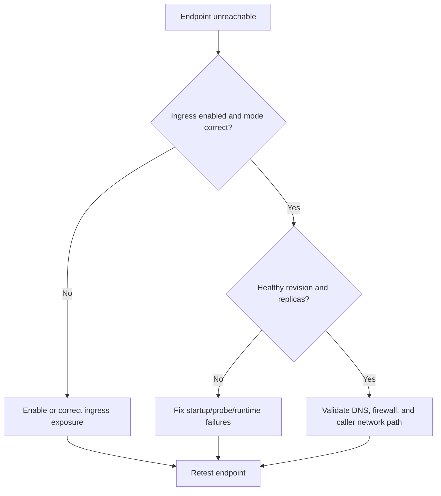

# Ingress Not Reachable

Use this playbook when your app appears deployed but the external or internal endpoint cannot be reached reliably.

## Symptoms

- FQDN returns timeout, 502, or 504.
- DNS resolves, but requests fail intermittently.
- Revision is present, yet no successful end-user requests.

## Common Misreadings

!!! warning "Common Misreadings"
    - Misreading: "DNS is broken." Many reachability issues are unhealthy replicas or wrong target port.
    - Misreading: "Ingress external means always public." NSGs, firewalls, and private environment routing still apply.

## Competing Hypotheses

| Hypothesis | Evidence For | Evidence Against |
|---|---|---|
| Ingress mode mismatch | `external=false` but tested from internet | Internal caller succeeds from same VNet |
| Target port mismatch | 502 with healthy ingress config, app not listening on target | App and target port aligned and health is green |
| No healthy backend replicas | Ingress up, revisions degraded | Multiple healthy replicas serving internal requests |

## What to Check First

### Metrics

- Request count with 5xx spikes and low success ratio.

### Logs

```kusto
let AppName = "my-container-app";
ContainerAppSystemLogs_CL
| where ContainerAppName_s == AppName
| where Log_s has_any ("ingress", "502", "504", "connection refused", "timeout")
| project TimeGenerated, RevisionName_s, Log_s
| order by TimeGenerated desc
```

### Platform Signals

```bash
az containerapp show --name "$APP_NAME" --resource-group "$RG" --query "properties.configuration.ingress" --output json
az containerapp revision list --name "$APP_NAME" --resource-group "$RG" --query "[].{name:name,active:properties.active,health:properties.healthState}" --output table
```

## Evidence Collection

```bash
az containerapp show --name "$APP_NAME" --resource-group "$RG" --query "properties.configuration.ingress.fqdn" --output tsv
az containerapp logs show --name "$APP_NAME" --resource-group "$RG" --type system
az containerapp logs show --name "$APP_NAME" --resource-group "$RG" --type console
```

## Decision Flow



## Resolution Steps

1. Set ingress to match exposure model (`external` vs internal-only).
2. Align `targetPort` with app listening port.
3. Restore healthy replicas before retesting endpoint.
4. Validate DNS and network path from actual client network.

## Prevention

- Include endpoint smoke tests in release pipeline.
- Track expected ingress mode and FQDN in runbooks.
- Alert on sustained 5xx increase and zero healthy replicas.

## See Also

- [Container Start Failure](../startup-and-provisioning/container-start-failure.md)
- [Service-to-Service Connectivity Failure](service-to-service-connectivity-failure.md)
- [Ingress Error Analysis KQL](../../kql/ingress-and-networking/ingress-error-analysis.md)
