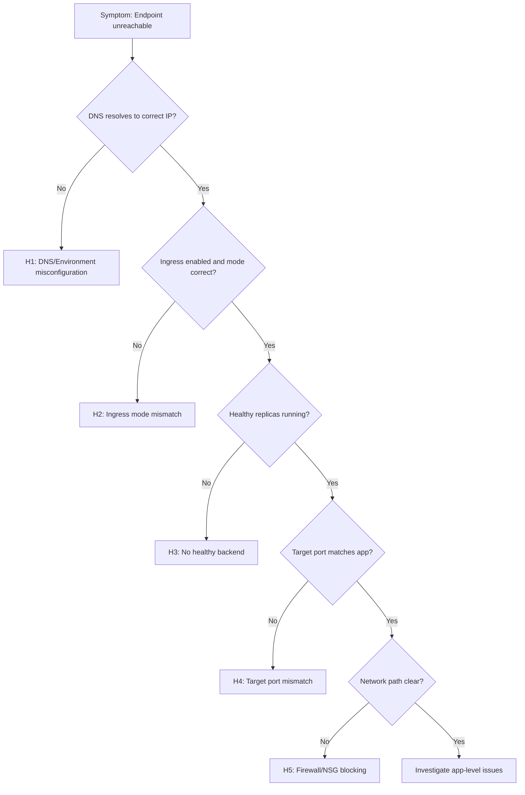

---
hide:
  - toc
content_sources:
  diagrams:
    - id: troubleshooting-decision-flow
      type: flowchart
      source: mslearn-adapted
      based_on:
        - https://learn.microsoft.com/azure/container-apps/ingress-overview
        - https://learn.microsoft.com/azure/container-apps/troubleshooting
        - https://learn.microsoft.com/azure/container-apps/health-probes
---

# Ingress Not Reachable

## 1. Summary

### Symptom

HTTP requests to your Container App's FQDN fail with timeout, 502 Bad Gateway, or 504 Gateway Timeout errors. DNS may resolve correctly, but the application is not serving traffic. Errors can be intermittent or sustained.

### Why this scenario is confusing

Ingress failures have many possible causes spanning DNS, networking, revision health, and probe configuration. A working revision doesn't guarantee reachability—ingress mode, target port, and backend health all contribute to the final outcome.

### Troubleshooting decision flow

<!-- diagram-id: troubleshooting-decision-flow -->


## 2. Common Misreadings

- "DNS is broken" — Many reachability issues are actually unhealthy replicas or wrong target port, not DNS.
- "Ingress external means always public" — NSGs, firewalls, and private environment routing still apply.
- "The revision is running, so ingress should work" — Revision running ≠ healthy replicas passing probes.
- "502 means platform issue" — Often indicates backend unhealthy or probe failures, not platform bugs.
- "It works from my machine" — Different network paths (VNet, internet, private endpoint) have different reachability.

## 3. Competing Hypotheses

| Hypothesis | Typical Evidence For | Typical Evidence Against |
|---|---|---|
| **H1: DNS/Environment misconfiguration** | NXDOMAIN, wrong IP resolved, environment domain mismatch | DNS resolves to correct environment IP |
| **H2: Ingress mode mismatch** | `external=false` but tested from internet, or vice versa | Internal caller succeeds from same VNet |
| **H3: No healthy backend replicas** | `HealthState=Unhealthy`, 0 running replicas, probe failures | Multiple healthy replicas serving requests |
| **H4: Target port mismatch** | 502 with app logs showing no incoming requests, app listening on different port | App and target port aligned, health probes pass |
| **H5: Firewall/NSG blocking** | Timeout from specific networks, works from others | Same behavior from all network locations |

## 4. What to Check First

### Metrics

- Request count with 5xx spikes and low success ratio
- Replica count over time (should be > 0)
- Ingress latency percentiles (P50, P95, P99)

### Logs

```kusto
let AppName = "ca-myapp";
ContainerAppSystemLogs_CL
| where ContainerAppName_s == AppName
| where TimeGenerated > ago(1h)
| where Log_s has_any ("ingress", "502", "503", "504", "connection refused", "timeout", "upstream", "gateway")
| project TimeGenerated, RevisionName_s, Reason_s, Log_s
| order by TimeGenerated desc
```

### Platform Signals

```bash
# Check ingress configuration
az containerapp show --name "$APP_NAME" --resource-group "$RG" \
  --query "properties.configuration.ingress" --output json

# Check revision health and traffic weights
az containerapp revision list --name "$APP_NAME" --resource-group "$RG" \
  --query "[].{name:name,active:properties.active,replicas:properties.replicas,health:properties.healthState,traffic:properties.trafficWeight}" \
  --output table

# Check replica status
az containerapp replica list --name "$APP_NAME" --resource-group "$RG" --output table
```

## 5. Evidence to Collect

### Required Evidence

| Evidence | Command/Query | Purpose |
|---|---|---|
| Ingress config | `az containerapp show ... --query ingress` | Verify mode, port, transport |
| Revision list | `az containerapp revision list` | Check health state and traffic weights |
| Replica list | `az containerapp replica list` | Confirm running replicas exist |
| System logs | KQL on `ContainerAppSystemLogs_CL` | Find ingress/probe errors |
| DNS resolution | `nslookup <fqdn>` or `dig <fqdn>` | Verify DNS resolves correctly |

### Useful Context

- Environment networking mode (VNet-integrated or consumption-only)
- Custom domain configuration (if applicable)
- Recent deployment or configuration changes
- Network path of the caller (internet, VNet, private endpoint)

## 6. Validation and Disproof by Hypothesis

### H1: DNS/Environment misconfiguration

**Signals that support:**

- `nslookup` returns NXDOMAIN or unexpected IP
- Environment default domain doesn't match expected pattern
- Custom domain verification incomplete

**Signals that weaken:**

- DNS resolves to correct environment IP
- Same FQDN works from other clients

**What to verify:**

```bash
# Check DNS resolution
nslookup $(az containerapp show --name "$APP_NAME" --resource-group "$RG" \
  --query "properties.configuration.ingress.fqdn" --output tsv)

# Check environment domain
az containerapp env show --name "$ENVIRONMENT_NAME" --resource-group "$RG" \
  --query "properties.defaultDomain" --output tsv
```

### H2: Ingress mode mismatch

**Signals that support:**

- `external: false` but testing from public internet
- Works from VNet but not from internet (or vice versa)
- 404 or timeout only from specific network locations

**Signals that weaken:**

- Ingress mode matches test scenario
- Same error from both internal and external callers

**What to verify:**

```bash
# Check ingress external setting
az containerapp show --name "$APP_NAME" --resource-group "$RG" \
  --query "properties.configuration.ingress.external" --output tsv

# Expected: true for public access, false for VNet-only
```

### H3: No healthy backend replicas

**Signals that support:**

- `HealthState: Unhealthy` or `Degraded` in revision list
- Replica count is 0 or replicas show `Terminated` status
- System logs show `ProbeFailed`, `ContainerTerminated`, `CrashLoopBackOff`
- 502/503 errors with backend probe failure messages

**Signals that weaken:**

- Multiple `Healthy` replicas in `Running` state
- Successful responses intermixed with failures

**What to verify:**

```bash
# Check revision health
az containerapp revision list --name "$APP_NAME" --resource-group "$RG" \
  --query "[?properties.active].{name:name,health:properties.healthState,replicas:properties.replicas}" \
  --output table

# Check replica status
az containerapp replica list --name "$APP_NAME" --resource-group "$RG" --output table
```

KQL for probe failures:

```kusto
let AppName = "ca-myapp";
ContainerAppSystemLogs_CL
| where ContainerAppName_s == AppName
| where TimeGenerated > ago(1h)
| where Reason_s in ("ProbeFailed", "ContainerTerminated", "Unhealthy")
| summarize count() by Reason_s, RevisionName_s
| order by count_ desc
```

### H4: Target port mismatch

**Signals that support:**

- 502 errors but no incoming requests in app console logs
- App configured to listen on port 3000 but `targetPort: 8000`
- Probe failures with "connection refused"

**Signals that weaken:**

- App console logs show incoming requests
- Target port matches `EXPOSE` in Dockerfile and app bind

**What to verify:**

```bash
# Check target port
az containerapp show --name "$APP_NAME" --resource-group "$RG" \
  --query "properties.configuration.ingress.targetPort" --output tsv

# Check app's actual listening port (from container config or Dockerfile)
az containerapp show --name "$APP_NAME" --resource-group "$RG" \
  --query "properties.template.containers[0].env[?name=='PORT' || name=='CONTAINER_APP_PORT']" \
  --output table
```

### H5: Firewall/NSG blocking

**Signals that support:**

- Timeout from specific source networks only
- Works from Azure Cloud Shell but not corporate network
- VNet has NSG rules blocking inbound 443/80

**Signals that weaken:**

- Same behavior from all network locations
- NSG logs show traffic allowed

**What to verify:**

```bash
# For VNet-integrated environments, check NSG rules
az network nsg rule list --resource-group "$RG" --nsg-name "$NSG_NAME" --output table

# Test from different network locations
curl --verbose --connect-timeout 10 "https://${APP_FQDN}/health"
```

## 7. Likely Root Cause Patterns

| Pattern | Frequency | First Signal | Typical Resolution |
|---|---|---|---|
| Probe failure cascade | Very common | System logs: `ProbeFailed` | Fix probe config or app startup |
| Target port mismatch | Common | 502 + no app traffic | Align targetPort with app |
| Ingress disabled | Common | 404 or connection refused | Enable ingress |
| Revision not activated | Occasional | 0 traffic weight | Set traffic weight > 0 |
| VNet routing issues | Occasional | Timeout from VNet only | Check UDR and private DNS |

## 8. Immediate Mitigations

1. **If no healthy replicas:** Roll back to previous healthy revision
   ```bash
   az containerapp ingress traffic set --name "$APP_NAME" --resource-group "$RG" \
     --revision-weight "<previous-healthy-revision>=100"
   ```

2. **If target port mismatch:** Update ingress target port
   ```bash
   az containerapp ingress update --name "$APP_NAME" --resource-group "$RG" \
     --target-port 8000
   ```

3. **If probe too aggressive:** Relax probe settings temporarily
   ```bash
   az containerapp update --name "$APP_NAME" --resource-group "$RG" \
     --set-env-vars "PROBE_INITIAL_DELAY=30"
   ```

4. **If ingress disabled:** Enable ingress
   ```bash
   az containerapp ingress enable --name "$APP_NAME" --resource-group "$RG" \
     --type external --target-port 8000 --transport http
   ```

## 9. Prevention

- Include endpoint smoke tests in release pipeline
- Alert on sustained 5xx increase and zero healthy replicas
- Validate ingress config in IaC templates before deployment
- Use health check endpoints that verify actual app readiness
- Document expected ingress mode and FQDN in runbooks

## See Also

- [Container Start Failure](../startup-and-provisioning/container-start-failure.md)
- [Probe Failure and Slow Start](../startup-and-provisioning/probe-failure-and-slow-start.md)
- [Service-to-Service Connectivity Failure](service-to-service-connectivity-failure.md)
- [Ingress Error Analysis KQL](../../kql/ingress-and-networking/ingress-error-analysis.md)
- [HTTP Query Pack](../../kql/http/index.md)
- [Ingress Target Port Mismatch Lab](../../lab-guides/ingress-target-port-mismatch.md)

## Sources

- [Ingress in Azure Container Apps](https://learn.microsoft.com/azure/container-apps/ingress-overview)
- [Troubleshoot Azure Container Apps](https://learn.microsoft.com/azure/container-apps/troubleshooting)
- [Health probes in Azure Container Apps](https://learn.microsoft.com/azure/container-apps/health-probes)
