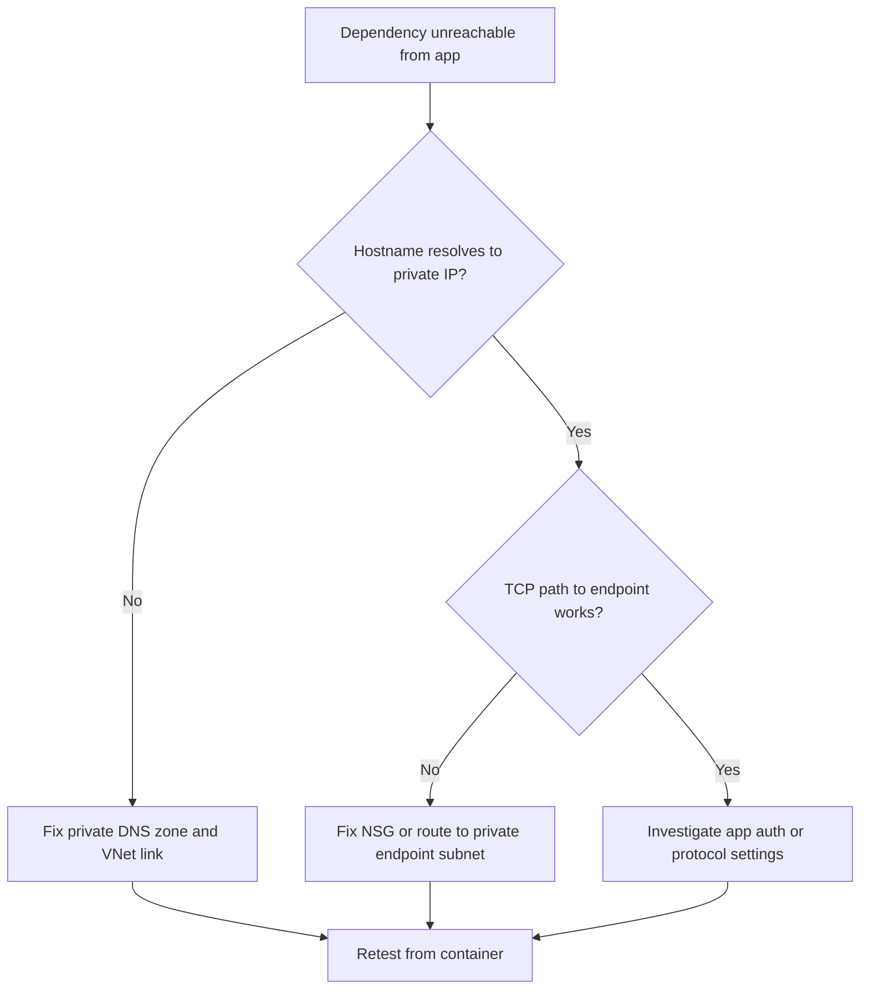

# Internal DNS and Private Endpoint Failure

This playbook handles cases where apps cannot resolve or reach private endpoints from within the Container Apps environment.

## Symptoms

- Outbound calls fail with `Name or service not known`, `Temporary failure in name resolution`, or timeout.
- App can run but fails on dependencies hosted behind private endpoints.
- Failures correlate with VNet, DNS forwarder, or private DNS changes.

## Common Misreadings

!!! warning "Common Misreadings"
    - Misreading: "Dependency service is down." Service may be healthy while DNS path is broken.
    - Misreading: "It worked once, so DNS is fine." Cached lookups can hide intermittent forwarding issues.

## Competing Hypotheses

| Hypothesis | Evidence For | Evidence Against |
|---|---|---|
| Missing private DNS zone link | Hostname resolves publicly or not at all | Correct private IP resolution from container |
| DNS forwarder misconfiguration | Random NXDOMAIN/timeout for private zones | Stable resolution across replicas |
| NSG/UDR blocks DNS or endpoint path | DNS lookup or TCP checks timeout | Network flow logs show allowed path |

## What to Check First

### Metrics

- Dependency timeout metrics and error-rate increase after network changes.

### Logs

```kusto
let AppName = "ca-myapp";
ContainerAppConsoleLogs_CL
| where ContainerAppName_s == AppName
| where Log_s has_any ("name resolution", "NXDOMAIN", "timeout", "Temporary failure")
| project TimeGenerated, RevisionName_s, ReplicaName_s, Log_s
| order by TimeGenerated desc
```

### Platform Signals

```bash
az containerapp env show --name "$ENVIRONMENT_NAME" --resource-group "$RG" --query "properties.vnetConfiguration" --output json
az network private-dns link vnet list --resource-group "$RG" --zone-name "privatelink.azurecr.io" --output table
```

## Evidence Collection

```bash
az containerapp exec --name "$APP_NAME" --resource-group "$RG" --command "python -c 'import socket; print(socket.getaddrinfo("myregistry.azurecr.io", 443))'"
az network private-endpoint list --resource-group "$RG" --output table
az network private-dns zone list --resource-group "$RG" --output table
```

Observed healthy app-side baseline before isolating DNS path:

```json
[
  {
    "name": "ca-myapp--0000001-646779b4c5-bhc2v",
    "properties": {
      "containers": [{ "name": "ca-myapp", "ready": true, "restartCount": 0, "runningState": "Running" }],
      "runningState": "Running"
    }
  }
]
```

## Decision Flow



## Resolution Steps

1. Link required private DNS zones to the Container Apps VNet.
2. Validate DNS forwarder rules for Azure private zones.
3. Confirm NSG/UDR allow DNS and endpoint traffic.
4. Re-run dependency lookup and connectivity checks from container.

## Prevention

- Maintain a DNS dependency inventory per environment.
- Add synthetic DNS and dependency probes.
- Review network policy changes with dependency owners.

## See Also

- [Service-to-Service Connectivity Failure](service-to-service-connectivity-failure.md)
- [Managed Identity Auth Failure](../identity-and-configuration/managed-identity-auth-failure.md)
- [DNS and Connectivity Failures KQL](../../kql/ingress-and-networking/dns-and-connectivity-failures.md)
