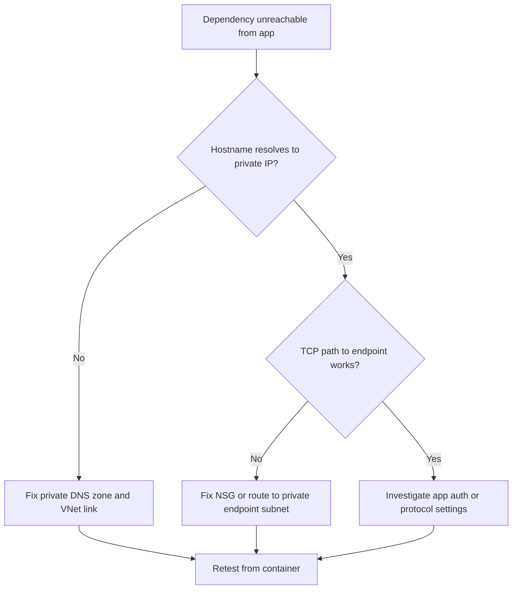

---
hide:
  - toc
content_sources:
  diagrams:
    - id: troubleshooting-decision-flow
      type: flowchart
      source: mslearn-adapted
      based_on:
        - https://learn.microsoft.com/azure/container-apps/environment-custom-dns
        - https://learn.microsoft.com/azure/container-apps/private-endpoints-with-dns
        - https://learn.microsoft.com/azure/container-apps/troubleshooting
---

# Internal DNS and Private Endpoint Failure

## 1. Summary

### Symptom

- Outbound calls fail with `Name or service not known`, `Temporary failure in name resolution`, or timeout.
- App can run but fails on dependencies hosted behind private endpoints.
- Failures correlate with VNet, DNS forwarder, or private DNS changes.

### Why this scenario is confusing

The dependency service may be healthy while the resolution path is broken somewhere between the Container Apps environment, private DNS zone linkage, and the private endpoint network path. Cached results can also make the issue appear intermittent rather than deterministic.

### Troubleshooting decision flow

<!-- diagram-id: troubleshooting-decision-flow -->


## 2. Common Misreadings

- "Dependency service is down." Service may be healthy while DNS path is broken.
- "It worked once, so DNS is fine." Cached lookups can hide intermittent forwarding issues.

## 3. Competing Hypotheses

| Hypothesis | Typical Evidence For | Typical Evidence Against |
|---|---|---|
| **H1: Missing private DNS zone link** | Hostname resolves publicly or not at all | Correct private IP resolution from container |
| **H2: DNS forwarder misconfiguration** | Random NXDOMAIN/timeout for private zones | Stable resolution across replicas |
| **H3: NSG or UDR blocks DNS or endpoint path** | DNS lookup or TCP checks timeout | Network flow logs show allowed path |

## 4. What to Check First

### Metrics

- Dependency timeout metrics and error-rate increase after network changes.

### Logs

```kusto
let AppName = "ca-myapp";
ContainerAppConsoleLogs_CL
| where ContainerAppName_s == AppName
| where Log_s has_any ("name resolution", "NXDOMAIN", "timeout", "Temporary failure")
| project TimeGenerated, RevisionName_s, ReplicaName_s, Log_s
| order by TimeGenerated desc
```

### Platform Signals

```bash
az containerapp env show --name "$ENVIRONMENT_NAME" --resource-group "$RG" --query "properties.vnetConfiguration" --output json
az network private-dns link vnet list --resource-group "$RG" --zone-name "privatelink.azurecr.io" --output table
```

## 5. Evidence to Collect

### Required Evidence

| Evidence | Command/Query | Purpose |
|---|---|---|
| Environment VNet config | `az containerapp env show --name "$ENVIRONMENT_NAME" --resource-group "$RG" --query "properties.vnetConfiguration" --output json` | Confirm the environment network context |
| Private DNS VNet links | `az network private-dns link vnet list --resource-group "$RG" --zone-name "privatelink.azurecr.io" --output table` | Check whether required private DNS zones are linked |
| In-container resolution test | `az containerapp exec --name "$APP_NAME" --resource-group "$RG" --command "python -c 'import socket; print(socket.getaddrinfo(\"myregistry.azurecr.io\", 443))'"` | Observe actual name resolution from the running app context |
| Private endpoint inventory | `az network private-endpoint list --resource-group "$RG" --output table` | Confirm the dependency exposes private endpoints |
| Private DNS zone inventory | `az network private-dns zone list --resource-group "$RG" --output table` | Confirm expected private DNS zones exist |
| DNS failure KQL | KQL on `ContainerAppConsoleLogs_CL` | Correlate resolution failures with revisions and replicas |

### Useful Context

- Which dependency is behind the private endpoint
- Expected private DNS zone names and link targets
- Whether a custom DNS forwarder is in the path
- Recent VNet, DNS, or private endpoint changes

Observed healthy app-side baseline before isolating DNS path:

```json
[
  {
    "name": "ca-myapp--0000001-646779b4c5-bhc2v",
    "properties": {
      "containers": [{ "name": "ca-myapp", "ready": true, "restartCount": 0, "runningState": "Running" }],
      "runningState": "Running"
    }
  }
]
```

## 6. Validation and Disproof by Hypothesis

### H1: Missing private DNS zone link

**Signals that support:**

- Hostname resolves publicly or not at all.
- Required private DNS zone is missing or not linked to the VNet.
- App failures started after private DNS changes.

**Signals that weaken:**

- Correct private IP resolution from container.
- Private DNS zone links are present and healthy.
- The same dependency resolves privately across replicas.

**What to verify:**

```bash
az network private-dns link vnet list --resource-group "$RG" --zone-name "privatelink.azurecr.io" --output table
az network private-dns zone list --resource-group "$RG" --output table
az containerapp exec --name "$APP_NAME" --resource-group "$RG" --command "python -c 'import socket; print(socket.getaddrinfo(\"myregistry.azurecr.io\", 443))'"
```

**Disproof logic:** If the container consistently resolves the hostname to the correct private IP and required DNS zone links exist, the missing-link hypothesis is disproved.

### H2: DNS forwarder misconfiguration

**Signals that support:**

- Random NXDOMAIN or timeout for private zones.
- Failures appear intermittent rather than permanent.
- Forwarding path changed recently.

**Signals that weaken:**

- Stable resolution across replicas.
- No custom forwarder is in the path.
- Resolution consistently fails in the same way because the private zone is absent.

**What to verify:**

```bash
az containerapp env show --name "$ENVIRONMENT_NAME" --resource-group "$RG" --query "properties.vnetConfiguration" --output json
az containerapp exec --name "$APP_NAME" --resource-group "$RG" --command "python -c 'import socket; print(socket.getaddrinfo(\"myregistry.azurecr.io\", 443))'"
```

```kusto
let AppName = "ca-myapp";
ContainerAppConsoleLogs_CL
| where ContainerAppName_s == AppName
| where Log_s has_any ("name resolution", "NXDOMAIN", "timeout", "Temporary failure")
| project TimeGenerated, RevisionName_s, ReplicaName_s, Log_s
| order by TimeGenerated desc
```

**Disproof logic:** If failures are stable and deterministic with missing private zone evidence, focus on zone linkage rather than the DNS forwarder.

### H3: NSG or UDR blocks DNS or endpoint path

**Signals that support:**

- DNS lookup or TCP checks timeout.
- Route or security policy changed with the incident.
- Private endpoint exists, but traffic cannot reach it.

**Signals that weaken:**

- Network flow logs show allowed path.
- Hostname resolves and the endpoint path works from the same container context.
- Errors are application auth failures instead of lookup or timeout problems.

**What to verify:**

```bash
az containerapp env show --name "$ENVIRONMENT_NAME" --resource-group "$RG" --query "properties.vnetConfiguration" --output json
az network private-endpoint list --resource-group "$RG" --output table
az containerapp exec --name "$APP_NAME" --resource-group "$RG" --command "python -c 'import socket; print(socket.getaddrinfo(\"myregistry.azurecr.io\", 443))'"
```

**Disproof logic:** If the container resolves the target and the private endpoint path is reachable, the main issue is no longer NSG or UDR blocking.

## 7. Likely Root Cause Patterns

| Pattern | Frequency | First Signal | Typical Resolution |
|---|---|---|---|
| Missing private DNS zone link | Very common | Hostname resolves publicly or not at all | Link required private DNS zones to the VNet |
| Broken DNS forwarding path | Common | Intermittent NXDOMAIN or timeout | Fix DNS forwarder rules |
| NSG or route block to private endpoint | Common | Lookup or endpoint path times out | Repair NSG or UDR configuration |
| Private endpoint inventory drift | Occasional | DNS zone exists but endpoint missing | Recreate or fix private endpoint |
| Cached lookup hides real issue | Occasional | Intermittent behavior after DNS change | Flush or retest from fresh container context |

## 8. Immediate Mitigations

1. Link required private DNS zones to the Container Apps VNet.
2. Validate DNS forwarder rules for Azure private zones.
3. Confirm NSG/UDR allow DNS and endpoint traffic.
4. Re-run dependency lookup and connectivity checks from container.

## 9. Prevention

- Maintain a DNS dependency inventory per environment.
- Add synthetic DNS and dependency probes.
- Review network policy changes with dependency owners.

## See Also

- [Service-to-Service Connectivity Failure](service-to-service-connectivity-failure.md)
- [Managed Identity Auth Failure](../identity-and-configuration/managed-identity-auth-failure.md)
- [DNS and Connectivity Failures KQL](../../kql/ingress-and-networking/dns-and-connectivity-failures.md)

## Sources

- [Container Apps environment custom DNS](https://learn.microsoft.com/azure/container-apps/environment-custom-dns)
- [Private endpoints in Azure Container Apps environments](https://learn.microsoft.com/azure/container-apps/private-endpoints-with-dns)
- [Troubleshoot Azure Container Apps](https://learn.microsoft.com/azure/container-apps/troubleshooting)
