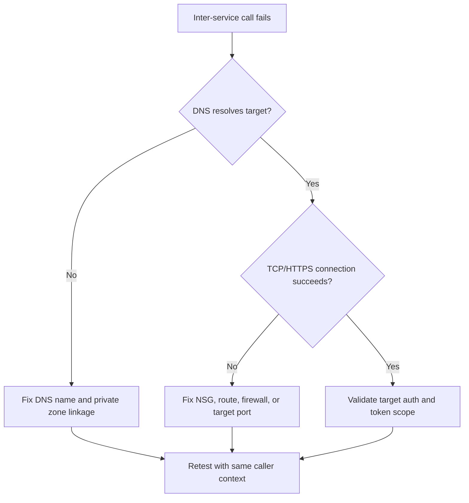

# Service-to-Service Connectivity Failure

Use this playbook when one Container App cannot call another service (Container App, API, database, or internal endpoint).

## Symptoms

- Upstream service returns timeout, `connection refused`, or TLS errors.
- Calls fail only inside the environment, not from local machine.
- Dapr invocation or direct URL call fails between apps.

## Common Misreadings

!!! warning "Common Misreadings"
    - Misreading: "Caller app is unhealthy." Caller may be healthy while downstream path is blocked.
    - Misreading: "Ingress is enough." Internal service communication also depends on DNS, identity, and egress policy.

## Competing Hypotheses

| Hypothesis | Evidence For | Evidence Against |
|---|---|---|
| Wrong downstream hostname/port | Immediate `connection refused` or lookup failure | Correct endpoint and successful same-path test |
| Egress network policy blocks | Timeouts from all replicas, policy change timestamp aligns | Connectivity works from same subnet/identity |
| Downstream auth mismatch | 401/403 from target service | Network-level failure occurs before auth |

## What to Check First

### Metrics

- Error rate on caller endpoint and dependency duration increase.

### Logs

```kusto
let AppName = "my-container-app";
ContainerAppConsoleLogs_CL
| where ContainerAppName_s == AppName
| where Log_s has_any ("connection refused", "timeout", "TLS", "503", "upstream")
| project TimeGenerated, RevisionName_s, ReplicaName_s, Log_s
| order by TimeGenerated desc
```

### Platform Signals

```bash
az containerapp show --name "$APP_NAME" --resource-group "$RG" --query "properties.configuration.ingress" --output json
az containerapp env show --name "$ENVIRONMENT_NAME" --resource-group "$RG" --query "properties.vnetConfiguration" --output json
```

## Evidence Collection

```bash
az containerapp exec --name "$APP_NAME" --resource-group "$RG" --command "python -c 'import socket; print(socket.gethostbyname("target-service.internal"))'"
az containerapp exec --name "$APP_NAME" --resource-group "$RG" --command "python -c 'import urllib.request; print(urllib.request.urlopen("https://target-service/health", timeout=5).status)'"
az containerapp logs show --name "$APP_NAME" --resource-group "$RG" --type console
```

## Decision Flow



## Resolution Steps

1. Correct downstream hostname and expected port/protocol.
2. Validate DNS resolution and network path from caller container.
3. Ensure ingress/internal endpoints match intended service boundary.
4. If network is healthy, fix authentication/authorization at target service.

## Prevention

- Publish dependency contracts (URL, port, auth mode).
- Add canary dependency checks per service.
- Alert on upstream timeout and connection-refused spikes.

## See Also

- [Internal DNS and Private Endpoint Failure](internal-dns-and-private-endpoint-failure.md)
- [Managed Identity Auth Failure](../identity-and-configuration/managed-identity-auth-failure.md)
- [DNS and Connectivity Failures KQL](../../kql/ingress-and-networking/dns-and-connectivity-failures.md)
