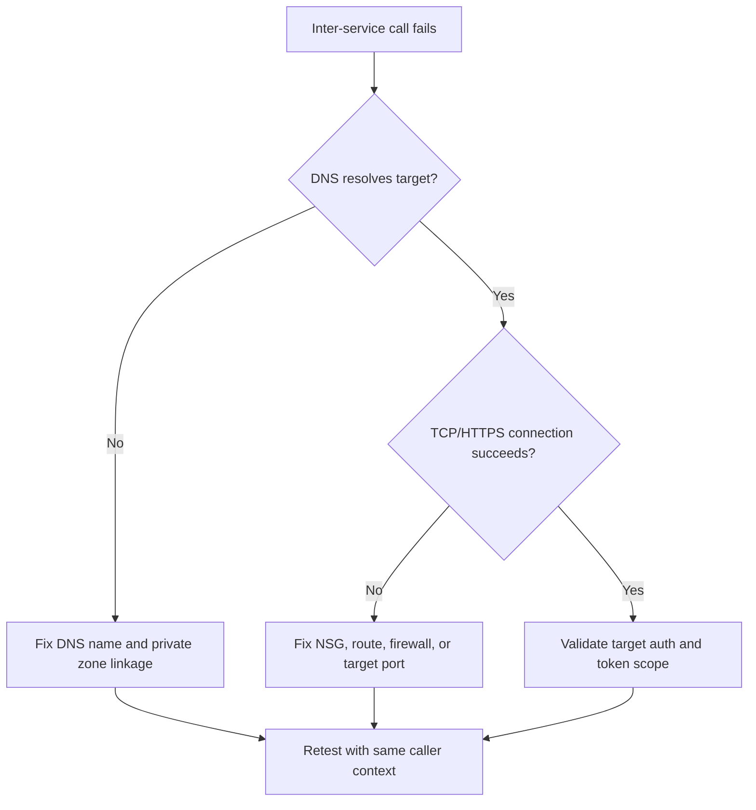

---
hide:
  - toc
content_sources:
  diagrams:
    - id: troubleshooting-decision-flow
      type: flowchart
      source: mslearn-adapted
      based_on:
        - https://learn.microsoft.com/azure/container-apps/ingress-overview
        - https://learn.microsoft.com/azure/container-apps/environment-custom-dns
        - https://learn.microsoft.com/azure/container-apps/troubleshooting
---

# Service-to-Service Connectivity Failure

## 1. Summary

### Symptom

- Upstream service returns timeout, `connection refused`, or TLS errors.
- Calls fail only inside the environment, not from local machine.
- Dapr invocation or direct URL call fails between apps.

### Why this scenario is confusing

The caller app can be healthy while every downstream call still fails. Ingress settings alone do not guarantee internal service communication because name resolution, VNet path, target port, TLS expectations, and downstream auth all affect the outcome.

### Troubleshooting decision flow

<!-- diagram-id: troubleshooting-decision-flow -->


## 2. Common Misreadings

- "Caller app is unhealthy." Caller may be healthy while downstream path is blocked.
- "Ingress is enough." Internal service communication also depends on DNS, identity, and egress policy.

## 3. Competing Hypotheses

| Hypothesis | Typical Evidence For | Typical Evidence Against |
|---|---|---|
| **H1: Wrong downstream hostname or port** | Immediate `connection refused` or lookup failure | Correct endpoint and successful same-path test |
| **H2: Egress network policy blocks traffic** | Timeouts from all replicas, policy change timestamp aligns | Connectivity works from same subnet/identity |
| **H3: Downstream auth mismatch** | 401/403 from target service | Network-level failure occurs before auth |

## 4. What to Check First

### Metrics

- Error rate on caller endpoint and dependency duration increase.

### Logs

```kusto
let AppName = "ca-myapp";
ContainerAppConsoleLogs_CL
| where ContainerAppName_s == AppName
| where Log_s has_any ("connection refused", "timeout", "TLS", "503", "upstream")
| project TimeGenerated, RevisionName_s, ReplicaName_s, Log_s
| order by TimeGenerated desc
```

### Platform Signals

```bash
az containerapp show --name "$APP_NAME" --resource-group "$RG" --query "properties.configuration.ingress" --output json
az containerapp env show --name "$ENVIRONMENT_NAME" --resource-group "$RG" --query "properties.vnetConfiguration" --output json
```

## 5. Evidence to Collect

### Required Evidence

| Evidence | Command/Query | Purpose |
|---|---|---|
| Caller ingress config | `az containerapp show --name "$APP_NAME" --resource-group "$RG" --query "properties.configuration.ingress" --output json` | Confirm intended service boundary and endpoint exposure |
| Environment VNet config | `az containerapp env show --name "$ENVIRONMENT_NAME" --resource-group "$RG" --query "properties.vnetConfiguration" --output json` | Check network attachment and routing context |
| In-container DNS test | `az containerapp exec --name "$APP_NAME" --resource-group "$RG" --command "python -c 'import socket; print(socket.gethostbyname(\"target-service.internal\"))'"` | Verify the caller resolves the target |
| In-container HTTPS test | `az containerapp exec --name "$APP_NAME" --resource-group "$RG" --command "python -c 'import urllib.request; print(urllib.request.urlopen(\"https://target-service/health\", timeout=5).status)'"` | Verify application-layer connectivity from the caller context |
| Console logs | `az containerapp logs show --name "$APP_NAME" --resource-group "$RG" --type console` | Capture caller-side network, TLS, and auth errors |
| Connectivity KQL | KQL on `ContainerAppConsoleLogs_CL` | Correlate failures across replicas and revisions |

### Useful Context

- Whether the target is another Container App, API, database, or internal endpoint
- Expected hostname, port, and protocol
- Whether the call uses direct URL or Dapr invocation
- Recent network policy, DNS, or auth changes

Observed healthy revision baseline:

```text
Name               Active    TrafficWeight    Replicas    HealthState    RunningState
-----------------  --------  ---------------  ----------  -------------  ------------
ca-myapp--0000001  True      100              1           Healthy        Running
```

## 6. Validation and Disproof by Hypothesis

### H1: Wrong downstream hostname or port

**Signals that support:**

- Immediate `connection refused` or lookup failure.
- The configured endpoint differs from the real target service boundary.
- DNS or URL tests fail before any auth logic is exercised.

**Signals that weaken:**

- Correct endpoint and successful same-path test.
- DNS resolves and TCP/HTTPS succeeds from inside the caller container.
- Failures occur only after reaching the target service.

**What to verify:**

```bash
az containerapp exec --name "$APP_NAME" --resource-group "$RG" --command "python -c 'import socket; print(socket.gethostbyname(\"target-service.internal\"))'"
az containerapp exec --name "$APP_NAME" --resource-group "$RG" --command "python -c 'import urllib.request; print(urllib.request.urlopen(\"https://target-service/health\", timeout=5).status)'"
az containerapp show --name "$APP_NAME" --resource-group "$RG" --query "properties.configuration.ingress" --output json
```

**Disproof logic:** If the target hostname resolves and the HTTPS check succeeds from the same caller context, the endpoint definition is not the primary issue.

### H2: Egress network policy blocks traffic

**Signals that support:**

- Timeouts from all replicas.
- Policy change timestamp aligns with the outage.
- Environment VNet configuration points to a path affected by NSG, route, or firewall changes.

**Signals that weaken:**

- Connectivity works from the same subnet or identity.
- DNS and HTTPS tests succeed from at least one replica using the same route.
- Failures return 401/403 instead of timing out.

**What to verify:**

```bash
az containerapp env show --name "$ENVIRONMENT_NAME" --resource-group "$RG" --query "properties.vnetConfiguration" --output json
az containerapp exec --name "$APP_NAME" --resource-group "$RG" --command "python -c 'import urllib.request; print(urllib.request.urlopen(\"https://target-service/health\", timeout=5).status)'"
az containerapp logs show --name "$APP_NAME" --resource-group "$RG" --type console
```

```kusto
let AppName = "ca-myapp";
ContainerAppConsoleLogs_CL
| where ContainerAppName_s == AppName
| where Log_s has_any ("connection refused", "timeout", "TLS", "503", "upstream")
| project TimeGenerated, RevisionName_s, ReplicaName_s, Log_s
| order by TimeGenerated desc
```

**Disproof logic:** If the same path succeeds from the caller container and errors surface only as application authorization failures, network policy is not the main cause.

### H3: Downstream auth mismatch

**Signals that support:**

- 401/403 from target service.
- Network path is healthy but downstream identity or token scope is wrong.
- Dapr invocation or direct URL call reaches the service but is rejected.

**Signals that weaken:**

- Network-level failure occurs before auth.
- DNS lookup or HTTPS connection cannot complete.
- The same credentials succeed against the same target path.

**What to verify:**

```bash
az containerapp exec --name "$APP_NAME" --resource-group "$RG" --command "python -c 'import urllib.request; print(urllib.request.urlopen(\"https://target-service/health\", timeout=5).status)'"
az containerapp logs show --name "$APP_NAME" --resource-group "$RG" --type console
```

**Disproof logic:** If the caller never reaches the target service and only times out or fails DNS resolution, fix connectivity first; auth mismatch is not yet validated.

## 7. Likely Root Cause Patterns

| Pattern | Frequency | First Signal | Typical Resolution |
|---|---|---|---|
| Wrong internal hostname or port | Common | Immediate lookup failure or `connection refused` | Correct the endpoint and retest from container |
| Blocked egress path | Common | Timeouts across replicas | Fix NSG, route, firewall, or target port |
| Downstream auth rejection | Common | 401/403 after connection succeeds | Align token scope or auth mode |
| TLS expectation mismatch | Occasional | TLS error from caller logs | Align protocol and certificates |
| Ingress boundary misunderstanding | Occasional | Public path works, internal path fails | Match endpoint usage to service boundary |

## 8. Immediate Mitigations

1. Correct downstream hostname and expected port/protocol.
2. Validate DNS resolution and network path from caller container.
3. Ensure ingress/internal endpoints match intended service boundary.
4. If network is healthy, fix authentication/authorization at target service.

## 9. Prevention

- Publish dependency contracts (URL, port, auth mode).
- Add canary dependency checks per service.
- Alert on upstream timeout and connection-refused spikes.

## See Also

- [Internal DNS and Private Endpoint Failure](internal-dns-and-private-endpoint-failure.md)
- [Managed Identity Auth Failure](../identity-and-configuration/managed-identity-auth-failure.md)
- [DNS and Connectivity Failures KQL](../../kql/ingress-and-networking/dns-and-connectivity-failures.md)

## Sources

- [Ingress overview in Azure Container Apps](https://learn.microsoft.com/azure/container-apps/ingress-overview)
- [Container Apps environment custom DNS](https://learn.microsoft.com/azure/container-apps/environment-custom-dns)
- [Troubleshoot Azure Container Apps](https://learn.microsoft.com/azure/container-apps/troubleshooting)
