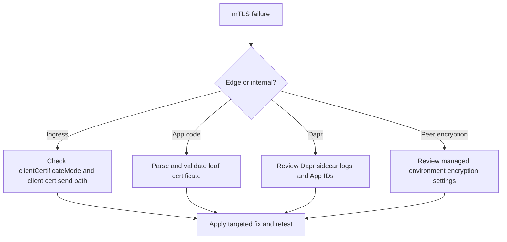

---
content_sources:
diagrams:
  - id: aca-mtls-troubleshooting-flow
    type: flowchart
    source: mslearn-adapted
    based_on:
      - https://learn.microsoft.com/en-us/azure/container-apps/client-certificate-authorization
      - https://learn.microsoft.com/en-us/azure/container-apps/ingress-overview
      - https://learn.microsoft.com/en-us/azure/container-apps/ingress-environment-configuration
      - https://learn.microsoft.com/en-us/azure/container-apps/connect-apps
content_validation:
  status: verified
  last_reviewed: "2026-04-25"
  reviewer: ai-agent
  core_claims:
    - claim: "Ingress forwards the client certificate in X-Forwarded-Client-Cert when clientCertificateMode is set to require or accept."
      source: "https://learn.microsoft.com/en-us/azure/container-apps/ingress-overview"
      verified: true
    - claim: "Azure Container Apps supports peer-to-peer TLS encryption within the environment."
      source: "https://learn.microsoft.com/en-us/azure/container-apps/ingress-environment-configuration"
      verified: true
    - claim: "Dapr service invocation in Azure Container Apps includes built-in mutual TLS."
      source: "https://learn.microsoft.com/en-us/azure/container-apps/connect-apps"
      verified: true
---

# mTLS Failures

## Symptom

- The app never sees `X-Forwarded-Client-Cert`.
- Ingress returns `403` when `clientCertificateMode=require`.
- App code reports certificate parsing or chain validation failures.
- Dapr sidecar logs show mTLS handshake or invocation failures.
- Traffic inside the environment appears unencrypted after peer encryption was expected.

<!-- diagram-id: aca-mtls-troubleshooting-flow -->


## Possible Causes

- `clientCertificateMode` is `ignore`, so ingress never forwards the header.
- The client does not actually send a certificate during the TLS handshake.
- App code parses the entire XFCC header instead of the leaf `Cert=` segment.
- The Dapr caller uses the wrong App ID or bypasses the sidecar.
- Environment peer encryption was never enabled or was enabled in a different environment than expected.

## Diagnosis Steps

### 1. Missing `X-Forwarded-Client-Cert` header at the app

Check ingress mode first:

```bash
az containerapp show \
  --name "$APP_NAME" \
  --resource-group "$RG" \
  --query "properties.configuration.ingress.clientCertificateMode" \
  --output tsv
```

If the value is `ignore`, the absence of the header is expected.

### 2. `403` from ingress with `clientCertificateMode=require`

Test the endpoint with and without a client certificate:

```bash
curl --include "https://${FQDN}/cert-info"

curl --include \
  --cert "./client.pem" \
  --key "./client.key" \
  "https://${FQDN}/cert-info"
```

If only the second call succeeds, ingress enforcement is working and the first caller simply lacked a certificate.

### 3. Chain validation or parsing failure in app code

Look for these anti-patterns:

- Parsing the whole header instead of `Cert=`.
- Treating escaped newlines as literal text.
- Comparing the wrong thumbprint algorithm.
- Validating only CN when your policy actually depends on issuer or SAN.

### 4. Dapr sidecar mTLS handshake issues

Check Dapr configuration and app identity:

```bash
az containerapp show \
  --name "$APP_NAME" \
  --resource-group "$RG" \
  --query "properties.configuration.dapr" \
  --output json

az containerapp logs show \
  --name "$APP_NAME" \
  --resource-group "$RG" \
  --type system
```

Confirm that:

- Dapr is enabled on both caller and callee.
- The caller uses the correct Dapr App ID.
- The app is calling `localhost:3500` and not bypassing the sidecar by accident.

### 5. Environment-internal traffic still looks unencrypted

Review the managed environment:

```bash
az containerapp env show \
  --name "$ENVIRONMENT_NAME" \
  --resource-group "$RG" \
  --query "properties.peerTrafficConfiguration" \
  --output json
```

If the property is empty or encryption is disabled, peer encryption was never turned on for that environment.

## Resolution

- Set `clientCertificateMode` to `require` or `accept` when the app needs XFCC.
- Ensure testing clients provide both `--cert` and `--key`.
- Parse only the leaf `Cert=` element from `X-Forwarded-Client-Cert`.
- Correct Dapr App IDs and force all Dapr traffic through the sidecar endpoint.
- Enable `peerTrafficConfiguration.encryption.enabled` on the managed environment when direct internal traffic must be encrypted.

## Prevention

- Keep ingress mode, certificate policy, and route ownership documented together.
- Add a `/cert-info` or equivalent diagnostics endpoint in lower environments.
- Monitor Dapr system logs during rollout of new App IDs or sidecar config.
- Validate managed environment encryption settings as part of environment provisioning.

## See Also

- [Ingress Client Certificates](../../platform/security/ingress-client-certificates.md)
- [mTLS Architecture in Azure Container Apps](../../platform/security/mtls.md)
- [Service-to-Service Connectivity Failure](ingress-and-networking/service-to-service-connectivity-failure.md)

## Sources

- [Configure client certificate authentication in Azure Container Apps (Microsoft Learn)](https://learn.microsoft.com/en-us/azure/container-apps/client-certificate-authorization)
- [Ingress overview in Azure Container Apps (Microsoft Learn)](https://learn.microsoft.com/en-us/azure/container-apps/ingress-overview)
- [Ingress environment configuration in Azure Container Apps (Microsoft Learn)](https://learn.microsoft.com/en-us/azure/container-apps/ingress-environment-configuration)
- [Communicate between container apps in Azure Container Apps (Microsoft Learn)](https://learn.microsoft.com/en-us/azure/container-apps/connect-apps)
