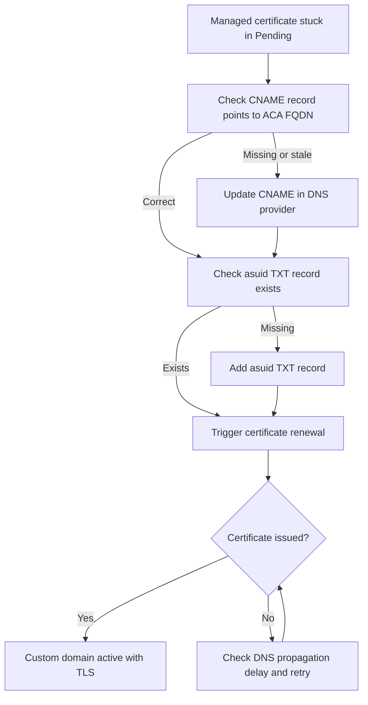

---
content_sources:
  references:
    - type: mslearn-adapted
      url: https://learn.microsoft.com/en-us/azure/container-apps/custom-domains-managed-certificates
  diagrams:
    - id: custom-domain-tls-renewal-flow
      type: flowchart
      source: self-generated
      justification: Troubleshooting flow synthesized from MSLearn ACA networking and storage documentation
content_validation:
  status: verified
  last_reviewed: '2026-07-18'
  reviewer: ai-agent
  core_claims:
    - claim: Azure Container Apps managed certificates are automatically renewed without action from you as long as the app continues to meet the documented requirements.
      source: https://learn.microsoft.com/en-us/azure/container-apps/custom-domains-managed-certificates
      verified: true
    - claim: Managed certificates require the container app to be publicly accessible from the DigiCert IP addresses.
      source: https://learn.microsoft.com/en-us/azure/container-apps/custom-domains-managed-certificates
      verified: true
---
# Custom Domain TLS Renewal

<!-- diagram-id: custom-domain-tls-renewal-flow -->


## Symptom

- A custom hostname stays in `Pending`, HTTPS serves the wrong certificate, or certificate issuance/renewal does not complete.
- The hostname itself may resolve, but managed certificate validation never moves to a healthy bound state.
- Incidents often begin after DNS record cleanup, registrar migration, or a stale verification record.

Typical evidence:

- [Observed] Hostname binding exists, but certificate status does not progress as expected.
- [Observed] The `asuid` TXT record or CNAME/A record is missing, stale, or mismatched.
- [Correlated] Failure begins after DNS changes rather than app image or revision changes.

## Possible Causes

| Cause | Why it breaks |
|---|---|
| Missing or stale `asuid` TXT record | Domain ownership validation fails. |
| Missing or incorrect CNAME/A record | The hostname no longer meets managed certificate requirements. |
| App is not publicly accessible from the DigiCert IP addresses | Managed certificate issuance and renewal requirements are not met. |
| CAA or registrar-side policy blocks issuance | Validation reaches DNS, but certificate issuance still cannot proceed. |

## Diagnosis Steps

1. List current hostname bindings.
2. Retrieve the app verification ID used for the `asuid` record.
3. Confirm whether the app still meets the managed-certificate accessibility requirements before pursuing renewal remediation.

```bash
az containerapp hostname list \
  --name "$APP_NAME" \
  --resource-group "$RG" \
  --output table

az containerapp show \
  --name "$APP_NAME" \
  --resource-group "$RG" \
  --query "properties.customDomainVerificationId" \
  --output tsv

az containerapp env show \
  --name "$ACA_ENV_NAME" \
  --resource-group "$RG" \
  --query "properties.vnetConfiguration.internal" \
  --output tsv
```

| Command | Why it is used |
|---|---|
| `az containerapp hostname list ...` | Shows the current hostname binding state on the app. |
| `az containerapp show ... --query "properties.customDomainVerificationId"` | Retrieves the exact verification value required for the `asuid` TXT record. |
| `az containerapp env show ... --query "properties.vnetConfiguration.internal"` | Confirms whether the environment is internal-only and therefore ineligible for managed certificates. |

Interpretation:

- [Observed] If the app is not publicly accessible from the DigiCert IP addresses, the documented managed-certificate requirements are not met.
- [Observed] If the verification ID does not match the DNS TXT value, validation failure is expected.
- [Strongly Suggested] If DNS was recently changed and the issue is limited to one hostname, treat stale DNS as the primary suspect.

## Resolution

1. Restore the required DNS records for the hostname.
2. Re-run hostname add or bind after DNS is correct and propagated.
3. If the hostname cannot meet the managed-certificate requirements, use a customer-managed certificate instead of managed issuance.

```bash
az containerapp hostname add \
  --name "$APP_NAME" \
  --resource-group "$RG" \
  --hostname "app.example.com"

az containerapp hostname bind \
  --name "$APP_NAME" \
  --resource-group "$RG" \
  --hostname "app.example.com" \
  --environment "$ACA_ENV_NAME" \
  --validation-method CNAME
```

| Command | Why it is used |
|---|---|
| `az containerapp hostname add ...` | Re-registers the hostname on the app after DNS prerequisites are corrected. |
| `az containerapp hostname bind ...` | Re-triggers managed certificate validation and binding for the corrected hostname. |

## Prevention

- Keep the `asuid` TXT record and canonical DNS target under change control.
- Monitor hostname bindings after registrar or DNS-zone changes.
- Use managed certificates only for supported external scenarios.
- Document when a hostname must use customer-managed TLS instead of managed renewal.

## See Also

- [Custom Domain TLS Renewal Lab](../../lab-guides/custom-domain-tls-renewal.md)
- [Custom Domains and Certificates](../../../language-guides/python/recipes/custom-domains.md)
- [Managed Certificates](../../../operations/custom-domains/managed-certificates.md)
- [Bring Your Own Certificates](../../../operations/custom-domains/byo-certificates.md)

## Sources

- [Custom domains and managed certificates in Azure Container Apps](https://learn.microsoft.com/en-us/azure/container-apps/custom-domains-managed-certificates)
- [Bring your own certificates to Azure Container Apps](https://learn.microsoft.com/en-us/azure/container-apps/custom-domains-certificates)
