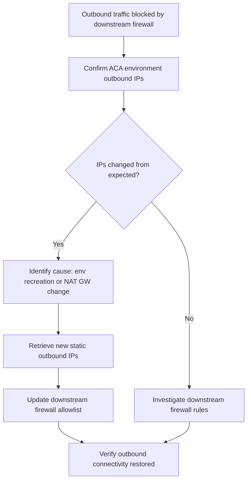

---
content_sources:
  - type: mslearn-adapted
    url: https://learn.microsoft.com/en-us/azure/container-apps/networking
content_validation:
  status: pending_review
  last_reviewed: 2026-04-29
  reviewer: agent
  core_claims:
    - claim: "Using a NAT Gateway or other outbound proxy for outbound traffic from a Container Apps environment is supported only in a workload profiles environment."
      source: https://learn.microsoft.com/en-us/azure/container-apps/networking
      verified: false
    - claim: "Workload profiles environments support user-defined routes and egress through NAT Gateway."
      source: https://learn.microsoft.com/en-us/azure/container-apps/networking
      verified: false
diagrams:
  - id: egress-ip-change-flow
    type: flowchart
    source: self-generated
    justification: "Troubleshooting flow synthesized from MSLearn ACA networking and storage documentation"

---

# Egress IP Change

<!-- diagram-id: egress-ip-change-flow -->


## Symptom

- A downstream firewall or partner allow-list starts rejecting traffic after environment recreation, subnet migration, or egress-path changes.
- The application remains healthy, but outbound calls fail with `403`, timeout, or connection reset from the remote side.
- The remote team reports a new source IP even though the application code did not change.

Common indicators:

- [Observed] Rejections begin immediately after environment recreation or network cutover.
- [Observed] Public egress observed from a running replica differs from the previously allow-listed address.
- [Inferred] The app relied on platform-default outbound identity instead of a dedicated egress design.

## Possible Causes

| Cause | Why it breaks |
|---|---|
| Environment recreated without updating downstream allow-lists | The remote system still trusts the previous source IP. |
| NAT Gateway was never attached | Outbound identity is not governed by a customer-managed static egress design. |
| Route or subnet changed | Traffic now leaves through a different egress path. |
| Firewall policy updated out of sequence | The new path is valid, but the downstream side still trusts the old source. |

## Diagnosis Steps

1. Measure the current public egress observed from a running replica.
2. Inspect the subnet for NAT Gateway and route table associations.
3. Compare the measured IP with the downstream allow-list currently in use.

```bash
az containerapp exec \
  --name "$APP_NAME" \
  --resource-group "$RG" \
  --command "sh -c 'curl --silent https://api.ipify.org && printf \"\\n\"'"

az network vnet subnet show \
  --name "snet-aca" \
  --vnet-name "vnet-myapp" \
  --resource-group "$RG" \
  --query "{natGateway:natGateway.id, routeTable:routeTable.id, addressPrefix:addressPrefix}" \
  --output json
```

| Command | Why it is used |
|---|---|
| `az containerapp exec ... curl https://api.ipify.org` | Measures the public source IP from the application path that the downstream dependency actually sees. |
| `az network vnet subnet show ...` | Confirms whether a NAT Gateway or route-table-controlled egress path exists on the environment subnet. |

Interpretation:

- [Observed] If the measured IP changed and the dependency allow-list did not, the outage is explained.
- [Observed] If the subnet has no NAT Gateway, expect egress identity to follow the current network design rather than a documented customer-owned static contract.
- [Strongly Suggested] If only partner-protected destinations fail while general internet calls succeed, allow-list drift is the highest-probability root cause.

## Resolution

1. Update the downstream allow-list to include the currently observed egress IP or the NAT Gateway public IP.
2. If a stable outbound identity is required, attach a NAT Gateway to the environment subnet in a workload profiles environment.
3. Re-test the dependency from the running replica after the allow-list or NAT change.

```bash
az network nat gateway create \
  --name "nat-aca" \
  --resource-group "$RG" \
  --location "$LOCATION" \
  --public-ip-addresses "pip-aca-egress"

az network vnet subnet update \
  --name "snet-aca" \
  --vnet-name "vnet-myapp" \
  --resource-group "$RG" \
  --nat-gateway "nat-aca"
```

| Command | Why it is used |
|---|---|
| `az network nat gateway create ...` | Creates a customer-managed egress component for stable outbound identity. |
| `az network vnet subnet update ... --nat-gateway` | Associates the NAT Gateway with the Container Apps subnet so outbound traffic uses the intended static path. |

## Prevention

- Do not treat observed default outbound IPs as a permanent contract.
- Use NAT Gateway when partner allow-lists require stable egress identity.
- Include downstream allow-list updates in every environment recreation or network migration runbook.
- Capture pre-cutover and post-cutover egress measurements from the running app path.

## See Also

- [Egress IP Change Lab](../../lab-guides/egress-ip-change.md)
- [Egress Control](../../../platform/networking/egress-control.md)
- [Networking in Azure Container Apps](../../../platform/networking/index.md)
- [UDR and NSG Egress Blocked](udr-nsg-egress-blocked.md)

## Sources

- [Networking in Azure Container Apps environment](https://learn.microsoft.com/en-us/azure/container-apps/networking)
- [User-defined routes in Azure Container Apps](https://learn.microsoft.com/en-us/azure/container-apps/user-defined-routes)
