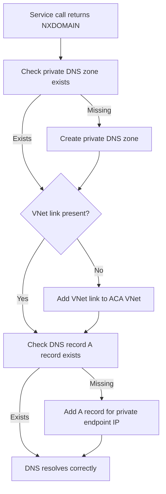

---
content_sources:
  - type: mslearn-adapted
    url: https://learn.microsoft.com/en-us/azure/private-link/private-endpoint-dns
content_validation:
  status: pending_review
  last_reviewed: 2026-04-29
  reviewer: agent
  core_claims:
    - claim: "Private endpoint connectivity depends on correct private DNS zone configuration for the target service."
      source: https://learn.microsoft.com/en-us/azure/private-link/private-endpoint-dns
      verified: false
    - claim: "Using an existing virtual network allows Azure Container Apps to access resources behind private endpoints in the virtual network."
      source: https://learn.microsoft.com/en-us/azure/container-apps/networking
      verified: false
diagrams:
  - id: private-endpoint-dns-failure-flow
    type: flowchart
    source: self-generated
    justification: "Troubleshooting flow synthesized from MSLearn ACA networking and storage documentation"

---

# Private Endpoint DNS Failure

<!-- diagram-id: private-endpoint-dns-failure-flow -->


## Symptom

- Container Apps can reach public internet targets, but a dependency behind a private endpoint fails with `NXDOMAIN`, `Name or service not known`, or timeout.
- A private endpoint exists, yet the app still resolves the public FQDN or nothing at all.
- The failure often appears right after a private endpoint or custom DNS rollout.

Typical evidence:

- [Observed] `<account>.blob.core.windows.net` or `<registry>.azurecr.io` does not resolve to a private IP from the app context.
- [Observed] A private DNS zone exists, but the Container Apps VNet is not linked.
- [Correlated] The incident starts after DNS zone, VNet link, or DNS forwarder changes.

## Possible Causes

| Cause | Why it breaks |
|---|---|
| Private DNS zone missing | The public name never resolves to the private endpoint IP. |
| VNet link missing | The zone exists, but the Container Apps subnet cannot use it. |
| Private endpoint DNS records are stale or incomplete | The hostname resolves, but to the wrong target. |
| Custom DNS server does not forward private zones correctly | Resolution fails even though Azure-side objects exist. |

## Diagnosis Steps

1. Inventory the private endpoint and the related private DNS zones.
2. Confirm the Container Apps VNet is linked to the right zone.
3. Test name resolution from the running app context.

```bash
az network private-endpoint show \
  --name "pe-storage" \
  --resource-group "$RG" \
  --output json

az network private-dns link vnet list \
  --resource-group "$RG" \
  --zone-name "privatelink.blob.core.windows.net" \
  --output table

az containerapp exec \
  --name "$APP_NAME" \
  --resource-group "$RG" \
  --command "python -c 'import socket; print(socket.getaddrinfo(\"mystorage.blob.core.windows.net\", 443))'"
```

| Command | Why it is used |
|---|---|
| `az network private-endpoint show ...` | Confirms the dependency really has a private endpoint and exposes its NIC and connection metadata. |
| `az network private-dns link vnet list ...` | Shows whether the Container Apps VNet is linked to the required private DNS zone. |
| `az containerapp exec ...` | Tests the actual runtime resolution path instead of assuming workstation DNS matches app DNS. |

Diagnostic interpretation:

- [Observed] Public IP resolution or no resolution at all points to DNS, not the target service.
- [Observed] Correct private IP resolution with continued timeouts shifts suspicion to NSG or route path.
- [Strongly Suggested] If one private service fails and another private service works, compare their zone names and link scopes first.

## Resolution

1. Create or correct the service-specific private DNS zone.
2. Link the zone to the Container Apps VNet.
3. Ensure the expected A records exist for the private endpoint.
4. If custom DNS is in use, forward the relevant `privatelink` zones correctly.

```bash
az network private-dns zone create \
  --resource-group "$RG" \
  --name "privatelink.blob.core.windows.net"

az network private-dns link vnet create \
  --resource-group "$RG" \
  --zone-name "privatelink.blob.core.windows.net" \
  --name "link-aca-vnet" \
  --virtual-network "/subscriptions/<subscription-id>/resourceGroups/$RG/providers/Microsoft.Network/virtualNetworks/vnet-myapp" \
  --registration-enabled false
```

| Command | Why it is used |
|---|---|
| `az network private-dns zone create ...` | Creates the service-specific private DNS zone required for private endpoint resolution. |
| `az network private-dns link vnet create ...` | Makes that zone resolvable from the Container Apps VNet. |

## Prevention

- Treat private endpoint creation and DNS zone linkage as one deployment unit.
- Validate private name resolution from the same VNet path as the app.
- Document required `privatelink` zones for every private dependency.
- Re-test DNS whenever hub-spoke links, custom resolvers, or private endpoint records change.

## See Also

- [Private Endpoint DNS Failure Lab](../../lab-guides/private-endpoint-dns-failure.md)
- [Private Endpoints](../../../platform/networking/private-endpoints.md)
- [Internal DNS and Private Endpoint Failure](../ingress-and-networking/internal-dns-and-private-endpoint-failure.md)
- [Deployment Networking Operations](../../../operations/deployment/networking.md)

## Sources

- [Azure private endpoint DNS configuration](https://learn.microsoft.com/en-us/azure/private-link/private-endpoint-dns)
- [Networking in Azure Container Apps environment](https://learn.microsoft.com/en-us/azure/container-apps/networking)
- [What is Azure Private DNS?](https://learn.microsoft.com/en-us/azure/dns/private-dns-overview)
