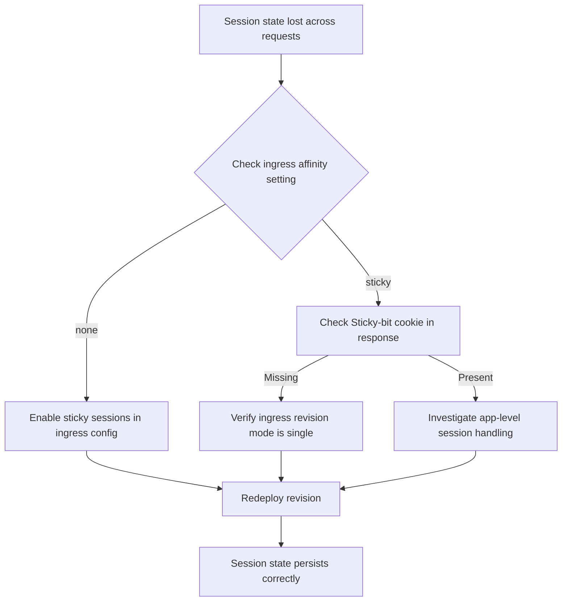

---
content_sources:
  - type: mslearn-adapted
    url: https://learn.microsoft.com/en-us/azure/container-apps/sticky-sessions
content_validation:
  status: pending_review
  last_reviewed: 2026-04-29
  reviewer: agent
  core_claims:
    - claim: "Azure Container Apps supports session affinity with `affinity: sticky` or `affinity: none`."
      source: https://learn.microsoft.com/en-us/azure/container-apps/sticky-sessions
      verified: false
    - claim: "Session affinity is cookie-based for HTTP ingress."
      source: https://learn.microsoft.com/en-us/azure/container-apps/sticky-sessions
      verified: false
diagrams:
  - id: session-affinity-failure-flow
    type: flowchart
    source: self-generated
    justification: "Troubleshooting flow synthesized from MSLearn ACA networking and storage documentation"

---

# Session Affinity Failure

<!-- diagram-id: session-affinity-failure-flow -->


## Symptom

- Users lose sign-in context, cart state, or in-memory workflow state between requests.
- The issue appears only after scaling above one replica or during traffic split tests.
- Repeated requests from the same client alternate between different replica identifiers.

Typical evidence:

- [Observed] The app stores state in memory instead of a shared store.
- [Observed] Repeated calls from one browser or client hit different replicas.
- [Correlated] Complaints start when autoscaling or multi-revision routing begins.

## Possible Causes

| Cause | Why it breaks |
|---|---|
| Ingress affinity is `none` | Requests are distributed across replicas as designed. |
| App depends on in-memory state | Load balancing exposes the state-sharing flaw. |
| Canary or multi-revision rollout increases distribution | More possible backends magnify the state-loss symptom. |
| Sticky sessions expected on a non-main HTTP port | The traffic path does not support built-in affinity features. |

## Diagnosis Steps

1. Inspect ingress configuration for sticky sessions.
2. Confirm multiple replicas are active.
3. Send repeated requests from a single client and compare replica IDs, cookies, or app-level session counters.

```bash
az containerapp show \
  --name "$APP_NAME" \
  --resource-group "$RG" \
  --query "properties.configuration.ingress" \
  --output json

az containerapp replica list \
  --name "$APP_NAME" \
  --resource-group "$RG" \
  --output table
```

| Command | Why it is used |
|---|---|
| `az containerapp show ... --query "properties.configuration.ingress"` | Confirms whether session affinity is enabled or disabled on HTTP ingress. |
| `az containerapp replica list ...` | Verifies that multiple replicas exist to reproduce the state-loss symptom. |

Interpretation:

- [Observed] If only one replica exists, stickiness cannot explain the issue.
- [Observed] If multiple replicas exist and the same client alternates backends, affinity is disabled or ineffective for the chosen port.
- [Strongly Suggested] If enabling sticky sessions immediately stabilizes the user flow, the app still has an in-memory state dependency.

## Resolution

1. Enable sticky sessions for the affected HTTP ingress if short-term continuity is required.
2. Move session state into a shared system such as Redis, a database, or another shared backing store.
3. Re-test with at least two replicas and the same client cookie path.

```yaml
properties:
  configuration:
    ingress:
      external: true
      targetPort: 8080
      stickySessions:
        affinity: sticky
```

```bash
az containerapp update \
  --name "$APP_NAME" \
  --resource-group "$RG" \
  --yaml "session-affinity-enabled.yaml"
```

| Command | Why it is used |
|---|---|
| `az containerapp update ... --yaml "session-affinity-enabled.yaml"` | Applies sticky-session configuration as a fast mitigation while the application is made stateless. |

## Prevention

- Design HTTP apps to be stateless by default.
- Use sticky sessions only as an explicit compatibility choice.
- Test scale-out with real browser or client cookie behavior before release.
- Document when traffic split, scale-out, or reconnect patterns can expose in-memory state assumptions.

## See Also

- [Session Affinity Failure Lab](../../lab-guides/session-affinity-failure.md)
- [WebSocket and gRPC Ingress](websocket-grpc-ingress.md)
- [Ingress in Azure Container Apps](../../../platform/networking/ingress.md)
- [Networking Best Practices](../../../best-practices/networking.md)

## Sources

- [Session affinity in Azure Container Apps](https://learn.microsoft.com/en-us/azure/container-apps/sticky-sessions)
- [Ingress in Azure Container Apps](https://learn.microsoft.com/en-us/azure/container-apps/ingress-overview)
