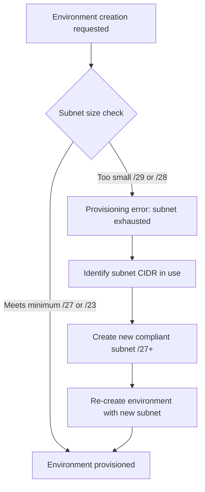

---
content_sources:
  - type: mslearn-adapted
    url: https://learn.microsoft.com/en-us/azure/container-apps/networking
content_validation:
  status: pending_review
  last_reviewed: 2026-04-29
  reviewer: agent
  core_claims:
    - claim: "Workload profiles environments require a minimum subnet size of /27 and Consumption-only environments require a minimum subnet size of /23."
      source: https://learn.microsoft.com/en-us/azure/container-apps/networking
      verified: false
    - claim: "A custom virtual network deployment requires a subnet dedicated exclusively to the Container Apps environment."
      source: https://learn.microsoft.com/en-us/azure/container-apps/vnet-custom
      verified: false
diagrams:
  - id: subnet-cidr-exhaustion-flow
    type: flowchart
    source: self-generated
    justification: "Troubleshooting flow synthesized from MSLearn ACA networking and storage documentation"

---

# Subnet CIDR Exhaustion

<!-- diagram-id: subnet-cidr-exhaustion-flow -->


## Symptom

- Managed environment creation fails when the target subnet is too small.
- Scale-out or zero-downtime rollout stalls after the environment already exists because the subnet has no headroom for new replicas or nodes.
- Operators typically see deployment errors immediately after choosing a `/29`, reusing a shared subnet, or packing too many revisions into a small address range.

Typical scenario markers:

- [Observed] The environment subnet is smaller than the Microsoft Learn minimum for the selected environment type.
- [Observed] New revisions stay unhealthy while older revisions still occupy IPs.
- [Inferred] The platform is healthy, but IP capacity is the bottleneck.

## Possible Causes

| Cause | Why it breaks |
|---|---|
| Subnet smaller than the documented minimum | Container Apps rejects unsupported subnet sizes during environment deployment. |
| Dedicated subnet reused for unrelated resources | Available IPs are consumed by resources that should not share the environment subnet. |
| No rollout headroom | Revision overlap temporarily doubles IP demand during zero-downtime deployment. |
| Growth exceeded original plan | Replica count or workload profile node count outgrew the original subnet design. |

## Diagnosis Steps

1. Confirm the subnet prefix and whether the subnet is dedicated to the environment.
2. Confirm the environment type and current VNet configuration.
3. Compare the prefix against the documented minimum and current replica growth expectations.

```bash
az network vnet subnet show \
  --name "snet-aca" \
  --vnet-name "vnet-myapp" \
  --resource-group "$RG" \
  --query "{addressPrefix:addressPrefix, delegations:delegations[].serviceName, routeTable:routeTable.id, networkSecurityGroup:networkSecurityGroup.id}" \
  --output json

az containerapp env show \
  --name "$CONTAINER_ENV" \
  --resource-group "$RG" \
  --query "{vnetConfiguration:properties.vnetConfiguration, staticIp:properties.staticIp}" \
  --output json
```

| Command | Why it is used |
|---|---|
| `az network vnet subnet show ...` | Verifies the actual subnet size, attached delegation, and whether extra network objects were attached to the same subnet. |
| `az containerapp env show ...` | Confirms the environment is using the intended VNet-integrated subnet and helps scope the affected environment. |

Interpretation guidance:

- [Observed] If the subnet is `/29`, `/28`, or another value below the documented minimum, the CIDR itself is the primary fault.
- [Observed] If the subnet meets the minimum but rollouts fail only during revision overlap, the issue is headroom rather than raw minimum compliance.
- [Correlated] If failures started right after adding more apps or raising max replicas, growth likely exhausted the subnet.

## Resolution

1. Create a new, larger subnet that is dedicated only to the Container Apps environment.
2. Use `/27` or larger for workload profiles environments, and `/23` or larger for consumption-only environments.
3. Recreate or migrate the environment onto the larger subnet; do not try to force production growth into an undersized shared subnet.
4. Re-run the deployment or rollout after the new subnet is in place.

```bash
az network vnet subnet create \
  --name "snet-aca-large" \
  --vnet-name "vnet-myapp" \
  --resource-group "$RG" \
  --address-prefixes "10.10.0.0/27" \
  --delegations "Microsoft.App/environments"

az containerapp env create \
  --name "$CONTAINER_ENV" \
  --resource-group "$RG" \
  --location "$LOCATION" \
  --infrastructure-subnet-resource-id "/subscriptions/<subscription-id>/resourceGroups/$RG/providers/Microsoft.Network/virtualNetworks/vnet-myapp/subnets/snet-aca-large"
```

| Command | Why it is used |
|---|---|
| `az network vnet subnet create ...` | Creates a right-sized dedicated subnet for the environment. |
| `az containerapp env create ...` | Recreates the environment against the corrected subnet instead of continuing with an unsupported network design. |

## Prevention

- Size for growth, not only for day-one deployment.
- Reserve rollout headroom for overlapping revisions.
- Keep the environment subnet dedicated to Container Apps only.
- Review subnet capacity whenever max replicas, workload profiles, or team onboarding increases.

## See Also

- [Subnet CIDR Exhaustion Lab](../../lab-guides/subnet-cidr-exhaustion.md)
- [Networking and CIDR](../../../platform/environments/networking-and-cidr.md)
- [VNet Integration](../../../platform/networking/vnet-integration.md)
- [Environment Design](../../../best-practices/environment-design.md)

## Sources

- [Networking in Azure Container Apps environment](https://learn.microsoft.com/en-us/azure/container-apps/networking)
- [Integrate a virtual network with an Azure Container Apps environment](https://learn.microsoft.com/en-us/azure/container-apps/vnet-custom)
- [Create a Container Apps environment with the Azure CLI](https://learn.microsoft.com/en-us/azure/container-apps/workload-profiles-manage-cli)
