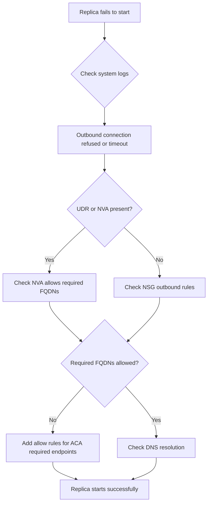

---
content_sources:
  - type: mslearn-adapted
    url: https://learn.microsoft.com/en-us/azure/container-apps/user-defined-routes
content_validation:
  status: pending_review
  last_reviewed: 2026-04-29
  reviewer: agent
  core_claims:
    - claim: "Workload profiles environments support user-defined routes and egress through NAT Gateway."
      source: https://learn.microsoft.com/en-us/azure/container-apps/networking
      verified: false
    - claim: "Restrictive egress for Container Apps must continue to allow required Microsoft dependencies such as registry, identity, and monitoring endpoints."
      source: https://learn.microsoft.com/en-us/azure/container-apps/firewall-integration
      verified: false
diagrams:
  - id: udr-nsg-egress-blocked-flow
    type: flowchart
    source: self-generated
    justification: "Troubleshooting flow synthesized from MSLearn ACA networking and storage documentation"

---

# UDR and NSG Egress Blocked

<!-- diagram-id: udr-nsg-egress-blocked-flow -->


## Symptom

- Replicas fail to start, remain unhealthy, or cycle after a new route table, firewall, or NSG change.
- Image pull, managed identity token acquisition, telemetry, or outbound dependency calls time out.
- Operators often notice the failure immediately after forced tunneling or a deny-all outbound rule is introduced.

Common log and platform patterns:

- [Observed] Replica startup fails even though the app image and configuration did not change.
- [Observed] External dependencies such as `mcr.microsoft.com`, ACR, or Microsoft Entra endpoints are unreachable.
- [Correlated] Incident start time matches a UDR, firewall, or NSG rollout.

## Possible Causes

| Cause | Why it breaks |
|---|---|
| Default route sends all egress to a firewall without required allow rules | Container Apps platform dependencies cannot be reached. |
| NSG blocks `AzureLoadBalancer` or platform traffic | Health probes or internal platform paths fail. |
| Firewall or NVA allow-list is incomplete | Registry, identity, or monitoring flows are denied. |
| UDR design applied to the wrong environment type or wrong subnet | Expected routing behavior is absent or inconsistent. |

## Diagnosis Steps

1. Inspect the environment VNet configuration.
2. Inspect the route table and subnet association.
3. Inspect NSG rules for both inbound health probes and outbound dependency traffic.

```bash
az containerapp env show \
  --name "$CONTAINER_ENV" \
  --resource-group "$RG" \
  --query "properties.vnetConfiguration" \
  --output json

az network route-table route list \
  --route-table-name "rt-aca" \
  --resource-group "$RG" \
  --output table

az network nsg rule list \
  --nsg-name "nsg-aca" \
  --resource-group "$RG" \
  --output table
```

| Command | Why it is used |
|---|---|
| `az containerapp env show ...` | Confirms the environment is on the expected subnet and helps validate whether custom VNet networking is in scope. |
| `az network route-table route list ...` | Shows whether a `0.0.0.0/0` route or another custom route is forcing traffic through a firewall or NVA. |
| `az network nsg rule list ...` | Reveals outbound deny rules and missing inbound health-probe allows. |

Validate against these minimum checks:

- [Observed] A forced-tunnel route with no matching firewall allows strongly supports the hypothesis.
- [Observed] Missing `AzureLoadBalancer` inbound allowance supports health-probe failure.
- [Strongly Suggested] If multiple apps fail at once after a networking change, treat the network path as the primary suspect before blaming application code.

## Resolution

1. Allow required outbound dependencies for image pull, Microsoft Entra token acquisition, and monitoring.
2. Allow inbound `AzureLoadBalancer` health probes and required Container Apps infrastructure traffic on the environment subnet.
3. Retest with one canary app before broad rollout.

```bash
az network nsg rule create \
  --name "allow-azure-load-balancer" \
  --nsg-name "nsg-aca" \
  --resource-group "$RG" \
  --priority 100 \
  --direction Inbound \
  --access Allow \
  --protocol Tcp \
  --source-address-prefixes "AzureLoadBalancer" \
  --source-port-ranges "*" \
  --destination-address-prefixes "*" \
  --destination-port-ranges "30000-32767"

az network nsg rule create \
  --name "allow-aca-outbound" \
  --nsg-name "nsg-aca" \
  --resource-group "$RG" \
  --priority 110 \
  --direction Outbound \
  --access Allow \
  --protocol Tcp \
  --source-address-prefixes "*" \
  --source-port-ranges "*" \
  --destination-address-prefixes "AzureActiveDirectory" "AzureMonitor" "MicrosoftContainerRegistry" \
  --destination-port-ranges "443"
```

| Command | Why it is used |
|---|---|
| `az network nsg rule create ... allow-azure-load-balancer` | Restores inbound probe reachability so healthy replicas can be recognized. |
| `az network nsg rule create ... allow-aca-outbound` | Restores core outbound platform dependencies commonly broken by restrictive egress controls. |

If a firewall or NVA is in the path, mirror the same dependency categories there and include required FQDNs such as `mcr.microsoft.com`, `login.microsoftonline.com`, and your ACR login server.

## Prevention

- Design UDR, NSG, firewall, and registry rules as one change set.
- Validate forced tunneling with a canary app before production rollout.
- Keep a documented dependency allow-list for image pull, identity, telemetry, and private endpoints.
- Reconfirm route and NSG posture whenever the environment subnet or firewall policy changes.

## See Also

- [UDR and NSG Egress Blocked Lab](../../lab-guides/udr-nsg-egress-blocked.md)
- [Egress Control](../../../platform/networking/egress-control.md)
- [Networking in Azure Container Apps](../../../platform/networking/index.md)
- [Deployment Networking Operations](../../../operations/deployment/networking.md)

## Sources

- [User-defined routes in Azure Container Apps](https://learn.microsoft.com/en-us/azure/container-apps/user-defined-routes)
- [Networking in Azure Container Apps environment](https://learn.microsoft.com/en-us/azure/container-apps/networking)
- [Use Azure Firewall with Azure Container Apps](https://learn.microsoft.com/en-us/azure/container-apps/firewall-integration)
