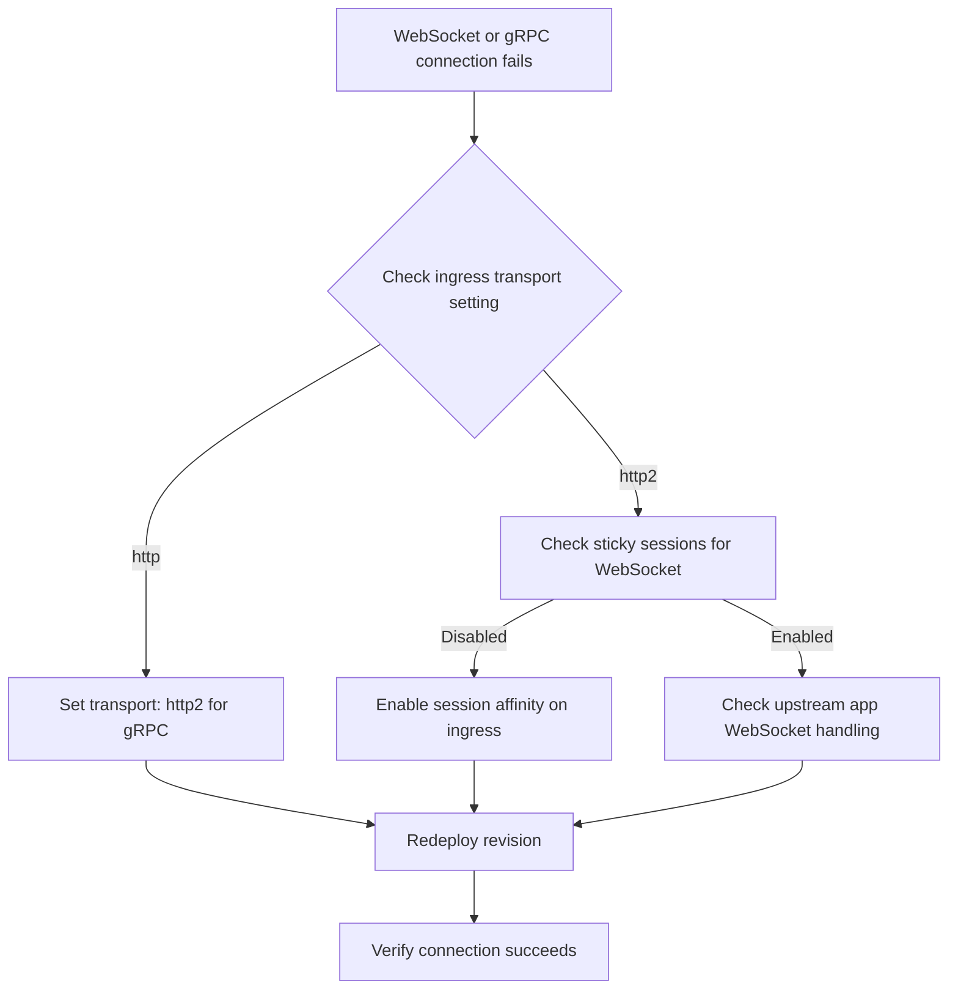

---
content_sources:
  - type: mslearn-adapted
    url: https://learn.microsoft.com/en-us/azure/container-apps/ingress-overview
content_validation:
  status: pending_review
  last_reviewed: 2026-04-29
  reviewer: agent
  core_claims:
    - claim: "Azure Container Apps supports ingress transport values auto, http, http2, and tcp."
      source: https://learn.microsoft.com/en-us/azure/container-apps/ingress-overview
      verified: false
    - claim: "Built-in HTTP features such as session affinity are supported on the main HTTP ingress port, not on extra TCP ports used as additional port mappings."
      source: https://learn.microsoft.com/en-us/azure/container-apps/ingress-overview
      verified: false
diagrams:
  - id: websocket-grpc-ingress-flow
    type: flowchart
    source: self-generated
    justification: "Troubleshooting flow synthesized from MSLearn ACA networking and storage documentation"

---

# WebSocket and gRPC Ingress

<!-- diagram-id: websocket-grpc-ingress-flow -->


## Symptom

- WebSocket clients connect but reconnect to a different replica and lose in-memory state.
- gRPC clients fail negotiation or fall back incorrectly when ingress transport is not configured for HTTP/2.
- Teams often report intermittent stream resets even though ordinary HTTP requests still work.

Typical evidence:

- [Observed] Browser or client errors mention upgrade, stream reset, or protocol mismatch.
- [Observed] Ingress configuration shows `transport` left at `auto` or `http` for a gRPC workload.
- [Correlated] Failures become visible only when multiple replicas are active or reconnects occur.

## Possible Causes

| Cause | Why it breaks |
|---|---|
| gRPC app not using `http2` transport | End-to-end HTTP/2 expectations are not explicit. |
| Stateful WebSocket workflow depends on replica stickiness | Reconnects land on a different replica and lose in-memory state. |
| HTTP workload placed on an extra TCP port | Built-in HTTP features such as session affinity are unavailable there. |
| Workload design assumes connection-local state survives failover | Platform routing behaves correctly, but the app is not resilient to replica changes. |

## Diagnosis Steps

1. Inspect current ingress configuration.
2. Confirm whether the workload uses the main HTTP ingress port or an extra TCP port.
3. Reproduce with more than one replica to determine whether the issue is transport-related or affinity-related.

```bash
az containerapp show \
  --name "$APP_NAME" \
  --resource-group "$RG" \
  --query "properties.configuration.ingress" \
  --output json

az containerapp replica list \
  --name "$APP_NAME" \
  --resource-group "$RG" \
  --output table
```

| Command | Why it is used |
|---|---|
| `az containerapp show ... --query "properties.configuration.ingress"` | Reveals the active ingress transport, target port, and whether sticky session settings exist. |
| `az containerapp replica list ...` | Confirms whether more than one replica is available to expose reconnect and distribution behavior. |

Interpretation:

- [Observed] gRPC plus `transport: http` is a direct configuration mismatch.
- [Observed] WebSocket reconnect failures that appear only with multiple replicas suggest lost state rather than basic reachability failure.
- [Strongly Suggested] If the app uses an extra TCP port for HTTP semantics, move that traffic back to the main ingress port before debugging higher layers.

## Resolution

1. Use `transport: http2` for gRPC workloads.
2. Keep browser-oriented HTTP features, including session affinity, on the main ingress port.
3. Enable sticky sessions only when the WebSocket workflow still depends on in-memory replica state.
4. Prefer making streaming workloads stateless or externally stateful over relying on affinity indefinitely.

```yaml
properties:
  configuration:
    ingress:
      external: true
      targetPort: 8080
      transport: http2
      stickySessions:
        affinity: sticky
```

```bash
az containerapp update \
  --name "$APP_NAME" \
  --resource-group "$RG" \
  --yaml "websocket-grpc-ingress-fixed.yaml"
```

| Command | Why it is used |
|---|---|
| `az containerapp update ... --yaml "websocket-grpc-ingress-fixed.yaml"` | Applies the corrected ingress transport and sticky-session settings in one revision-safe update. |

## Prevention

- Declare ingress transport explicitly for every gRPC app.
- Keep WebSocket and gRPC state outside the replica when possible.
- Treat sticky sessions as a tactical compatibility aid, not a primary architecture pattern.
- Test reconnect behavior with two or more replicas before production rollout.

## See Also

- [WebSocket and gRPC Ingress Lab](../../lab-guides/websocket-grpc-ingress.md)
- [Ingress in Azure Container Apps](../../../platform/networking/ingress.md)
- [Session Affinity Failure](session-affinity-failure.md)
- [Networking Best Practices](../../../best-practices/networking.md)

## Sources

- [Ingress in Azure Container Apps](https://learn.microsoft.com/en-us/azure/container-apps/ingress-overview)
- [Session affinity in Azure Container Apps](https://learn.microsoft.com/en-us/azure/container-apps/sticky-sessions)
