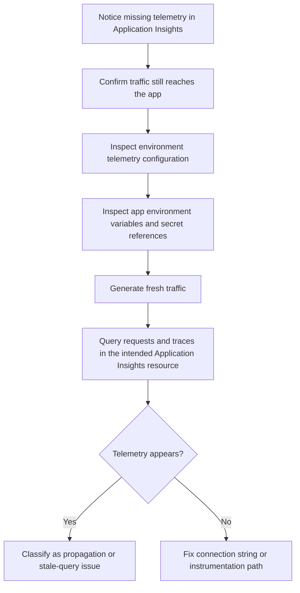

---
content_sources:
  documents:
    - type: mslearn-adapted
      url: https://learn.microsoft.com/en-us/azure/container-apps/opentelemetry-agents
    - type: mslearn-adapted
      url: https://learn.microsoft.com/en-us/azure/azure-monitor/app/connection-strings
diagrams:
  - id: appinsights-connection-string-missing-flow
    type: flowchart
    source: mslearn-adapted
    based_on:
      - https://learn.microsoft.com/en-us/azure/container-apps/opentelemetry-agents
      - https://learn.microsoft.com/en-us/azure/container-apps/observability
content_validation:
  status: pending_review
  last_reviewed: 2026-04-29
  reviewer: agent
  core_claims:
    - claim: "Azure Container Apps can send OpenTelemetry data to Application Insights when telemetry destinations are configured."
      source: https://learn.microsoft.com/en-us/azure/container-apps/opentelemetry-agents
      verified: false
    - claim: "Application Insights uses connection strings to associate telemetry with a specific resource."
      source: https://learn.microsoft.com/en-us/azure/azure-monitor/app/connection-strings
      verified: false
---

# Application Insights Connection String Missing

Use this playbook when traffic reaches the app but expected traces, requests, or logs do not appear in Application Insights.

## Symptom

- The app responds successfully, but `requests`, `traces`, or `exceptions` stay empty in Application Insights.
- Operators expect telemetry because the environment or app was recently configured for Application Insights.
- A deployment changed environment variables or secrets and telemetry stopped without affecting the primary request path.

## Possible Causes

- No valid Application Insights connection string is configured for the telemetry path being used.
- The environment telemetry destination exists, but the app itself is not instrumented to emit the signal you expect.
- The app uses a secret reference or environment variable name that no longer resolves correctly.
- Operators are checking the wrong Application Insights resource.
- Telemetry was enabled at the environment level, but no new traffic was generated after the change.

## Diagnosis Steps

<!-- diagram-id: appinsights-connection-string-missing-flow -->


1. Confirm the environment telemetry configuration.

   ```bash
   az containerapp env telemetry app-insights show \
       --name "$CONTAINER_ENV" \
       --resource-group "$RG" \
       --output json
   ```

2. Inspect the container app environment variable definitions and secret references.

   ```bash
   az containerapp show \
       --name "$APP_NAME" \
       --resource-group "$RG" \
       --query "properties.template.containers[0].env[].{name:name,secretRef:secretRef}" \
       --output json
   ```

3. Verify that you are querying the intended Application Insights component.

   ```bash
   az monitor app-insights component show \
       --app "$APPINSIGHTS_NAME" \
       --resource-group "$RG" \
       --query "{appId:appId,name:name,location:location}" \
       --output json
   ```

4. Generate fresh traffic after configuration changes.

   ```bash
   curl --silent --show-error "$APP_URL"
   ```

5. Query recent request and trace volume.

   ```kusto
   requests
   | where timestamp > ago(30m)
   | summarize requestCount=count() by cloud_RoleName
   | order by requestCount desc
   ```

   ```kusto
   traces
   | where timestamp > ago(30m)
   | summarize traceCount=count() by cloud_RoleName
   | order by traceCount desc
   ```

6. If you prefer a CLI verification path, run the Application Insights query directly.

   ```bash
   az monitor app-insights query \
       --app "$APPINSIGHTS_NAME" \
       --resource-group "$RG" \
       --analytics-query "requests | where timestamp > ago(30m) | summarize count() by cloud_RoleName" \
       --output table
   ```

| Command | Why it is used |
|---|---|
| `az containerapp env telemetry app-insights show --name "$CONTAINER_ENV" --resource-group "$RG" --output json` | Shows whether the environment has Application Insights telemetry configured at all. |
| `az containerapp show --name "$APP_NAME" --resource-group "$RG" --query "properties.template.containers[0].env[].{name:name,secretRef:secretRef}" --output json` | Confirms whether the app references the expected telemetry variable or secret without dumping raw environment variable values. |
| `az monitor app-insights component show --app "$APPINSIGHTS_NAME" --resource-group "$RG" --query "{appId:appId,name:name,location:location}" --output json` | Confirms that the operator is inspecting the intended Application Insights resource without printing the full connection string. |
| `curl --silent --show-error "$APP_URL"` | Creates fresh traffic so telemetry queries are based on new evidence rather than stale assumptions. |
| `az monitor app-insights query --app "$APPINSIGHTS_NAME" --resource-group "$RG" ...` | Tests telemetry presence directly from the CLI and avoids portal scope confusion. |

## Resolution

1. Configure the correct connection string on the telemetry path you actually use.

   ```bash
   az containerapp env telemetry app-insights set \
       --name "$CONTAINER_ENV" \
       --resource-group "$RG" \
       --connection-string "$APPLICATIONINSIGHTS_CONNECTION_STRING" \
       --enable-open-telemetry-traces true \
       --enable-open-telemetry-logs true
   ```

2. If the application uses the Application Insights SDK directly, restore the `APPLICATIONINSIGHTS_CONNECTION_STRING` environment variable or its referenced secret in the app definition.
3. Generate fresh requests after the change and re-query `requests` and `traces` over the last 15 to 30 minutes.
4. If telemetry still does not appear, treat the issue as an instrumentation-path problem rather than only a missing connection string problem.

| Command | Why it is used |
|---|---|
| `az containerapp env telemetry app-insights set --name "$CONTAINER_ENV" --resource-group "$RG" --connection-string "$APPLICATIONINSIGHTS_CONNECTION_STRING" --enable-open-telemetry-traces true --enable-open-telemetry-logs true` | Restores environment-level Application Insights telemetry routing for OpenTelemetry-based scenarios. |

## Prevention

- Store the connection string in a secret-backed workflow instead of hard-coding it in ad hoc commands.
- After each deployment, validate both the configuration state and the presence of fresh telemetry.
- Document whether the workload depends on environment-level OpenTelemetry, SDK-based instrumentation, or both.
- Keep one saved query for `requests` and one for `traces` so missing telemetry is detected early.
- Avoid sharing raw CLI output that could include literal environment variable values or telemetry configuration details.

## See Also

- [Application Insights Connection String Missing Lab](../../lab-guides/appinsights-connection-string-missing.md)
- [Observability Tracing Lab](../../lab-guides/observability-tracing.md)
- [Diagnostic Settings Missing](diagnostic-settings-missing.md)
- [Log Analytics Ingestion Gap](log-analytics-ingestion-gap.md)

## Sources

- [Collect and read OpenTelemetry data in Azure Container Apps](https://learn.microsoft.com/en-us/azure/container-apps/opentelemetry-agents)
- [Observability in Azure Container Apps](https://learn.microsoft.com/en-us/azure/container-apps/observability)
- [Connection strings in Application Insights](https://learn.microsoft.com/en-us/azure/azure-monitor/app/connection-strings)
