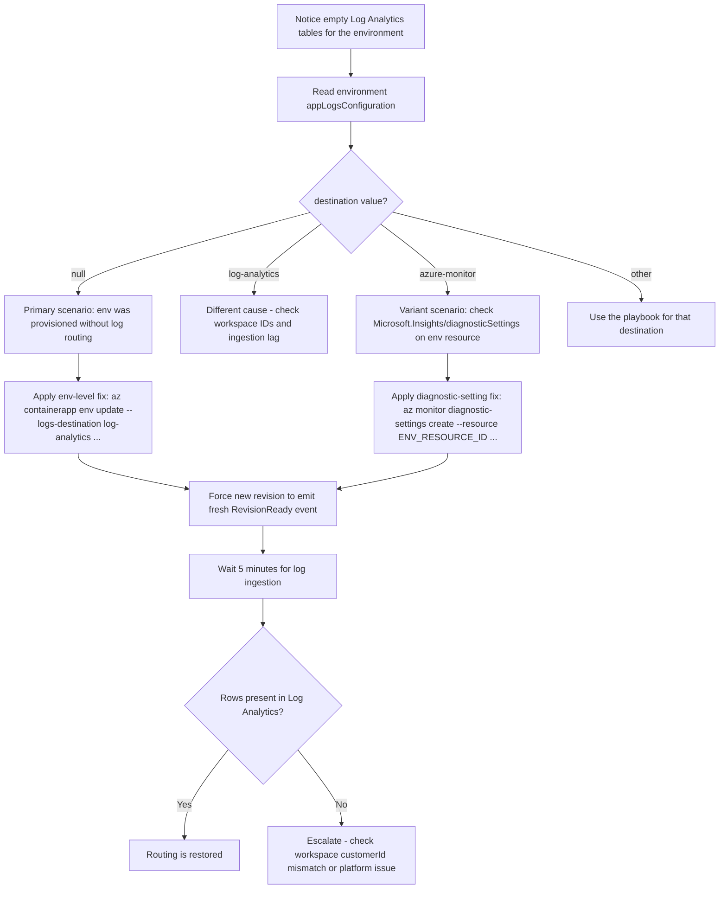

---
content_sources:
  references:
    - type: mslearn-adapted
      url: https://learn.microsoft.com/en-us/azure/container-apps/log-options
    - type: mslearn-adapted
      url: https://learn.microsoft.com/en-us/azure/container-apps/log-monitoring?tabs=bash
  diagrams:
    - id: diagnostic-settings-missing-flow
      type: flowchart
      source: mslearn-adapted
      based_on:
        - https://learn.microsoft.com/en-us/azure/container-apps/log-options
        - https://learn.microsoft.com/en-us/azure/container-apps/log-monitoring?tabs=bash
content_validation:
  status: verified
  last_reviewed: '2026-07-18'
  reviewer: ai-agent
  core_claims:
    - claim: Azure Container Apps lets you configure logging options at the environment level, and when Azure Monitor is the logs destination you can configure diagnostic settings at both the environment level and the container app level.
      source: https://learn.microsoft.com/en-us/azure/container-apps/log-options
      verified: true
    - claim: When you use Log Analytics for log monitoring, the Container Apps environment includes a Log Analytics workspace that stores system and application log data from all container apps running in the environment.
      source: https://learn.microsoft.com/en-us/azure/container-apps/log-monitoring?tabs=bash
      verified: true
---
# Diagnostic Settings Missing

Use this playbook when no `ContainerAppConsoleLogs_CL` or `ContainerAppSystemLogs_CL` rows appear in Log Analytics for any app in a Container Apps environment, and the environment was provisioned via IaC (Bicep, ARM, or Terraform) or via a Portal flow that did not configure the log destination. The primary scenario is an environment whose `properties.appLogsConfiguration` was omitted at provisioning time and now reads `destination: null` on the live resource. In that state, environment-level log routing to Log Analytics is missing for every app in the environment. A variant scenario where the environment is configured for `destination: azure-monitor` but the downstream `Microsoft.Insights/diagnosticSettings` resource was never created is covered at the end.

## Symptom

- `az containerapp env show --query "properties.appLogsConfiguration"` returns `{"destination": null, "logAnalyticsConfiguration": null}` on the environment that should be writing to Log Analytics.
- KQL queries against `ContainerAppConsoleLogs_CL` and `ContainerAppSystemLogs_CL` return `BadArgumentError: SEM0100 'where' operator: Failed to resolve table` — the tables never materialized in the workspace because no log data has ever been written to them.
- A newly created environment or a newly created app inside an existing environment shows no logs after traffic, restarts, or `RevisionReady` events, and the silence is uniform across every app in the environment (not isolated to one app).
- The Log Analytics workspace exists and is otherwise healthy (other resources in the same workspace continue to ingest), but no Container Apps tables appear in the workspace schema.

## Possible Causes

- The Bicep, ARM, or Terraform module that creates the environment omitted the `appLogsConfiguration` property entirely, so the live environment lands at `destination: null`.
- A subsequent `az deployment group create` reverted a live fix back to `destination: null` because the IaC declaration was never updated to match the manually-applied fix.
- The environment was created via Portal but the operator skipped the log destination step in the creation wizard.
- The environment is configured for `destination: azure-monitor` but the downstream `Microsoft.Insights/diagnosticSettings` resource was never created on the environment resource (variant scenario — see the dedicated section below).
- The environment is configured for a different destination entirely (`azure-blob-storage`, no destination, etc.) and the team expected Log Analytics ingestion by default.

## Diagnosis Steps

<!-- diagram-id: diagnostic-settings-missing-flow -->


1. Read the environment's `appLogsConfiguration` — this is the single most important check.

    ```bash
    az containerapp env show \
        --subscription "$SUBSCRIPTION_ID" \
        --resource-group "$RG" \
        --name "$ACA_ENV_NAME" \
        --query "properties.appLogsConfiguration" \
        --output json
    ```

    | Command | Why it is used |
    |---|---|
    | `az containerapp env show --query "properties.appLogsConfiguration" --output json` | Returns the full log destination configuration in one call. The shape of the response tells you which branch of the playbook to follow: `{"destination": null, ...}` is the primary scenario; `{"destination": "azure-monitor", ...}` is the variant scenario; `{"destination": "log-analytics", "logAnalyticsConfiguration": {"customerId": "..."}}` means the destination is configured and the silence is caused by something else (workspace IDs, ingestion lag, or a per-app issue). |

2. If `destination` is `null`, you are in the primary scenario. Capture the workspace resource ID and customer ID you will need for the fix.

    ```bash
    az monitor log-analytics workspace show \
        --subscription "$SUBSCRIPTION_ID" \
        --resource-group "$RG" \
        --workspace-name "$WORKSPACE_NAME" \
        --query "{id:id, customerId:customerId}" \
        --output json
    ```

    | Command | Why it is used |
    |---|---|
    | `az monitor log-analytics workspace show --query "{id:id, customerId:customerId}" --output json` | Returns both the ARM resource ID (used by `az monitor diagnostic-settings` for the variant scenario) and the workspace customer ID (used by `az containerapp env update --logs-workspace-id` for the primary scenario). |

3. If `destination` is `azure-monitor`, you are in the variant scenario. List diagnostic settings on the environment resource.

    ```bash
    ENV_RESOURCE_ID=$(az containerapp env show \
        --subscription "$SUBSCRIPTION_ID" \
        --resource-group "$RG" \
        --name "$ACA_ENV_NAME" \
        --query "id" \
        --output tsv)
    az monitor diagnostic-settings list \
        --resource "$ENV_RESOURCE_ID" \
        --output json
    ```

    | Command | Why it is used |
    |---|---|
    | `az containerapp env show --query "id" --output tsv` | Returns the ARM resource ID of the managed environment so it can be passed to `az monitor diagnostic-settings`. |
    | `az monitor diagnostic-settings list --resource "$ENV_RESOURCE_ID" --output json` | Lists every diagnostic setting attached to the environment resource. An empty array confirms the variant scenario: the destination is `azure-monitor` but no downstream routing exists. |

4. Confirm the silence is workspace-wide by running the canonical KQL on both tables.

    ```kusto
    let AppName = "ca-myapp";
    ContainerAppConsoleLogs_CL
    | where ContainerAppName_s == AppName
    | where TimeGenerated > ago(30m)
    | project TimeGenerated, RevisionName_s, Log_s
    | order by TimeGenerated desc
    ```

    ```kusto
    let AppName = "ca-myapp";
    ContainerAppSystemLogs_CL
    | where ContainerAppName_s == AppName
    | where TimeGenerated > ago(30m)
    | project TimeGenerated, RevisionName_s, Reason_s, Log_s
    | order by TimeGenerated desc
    ```

    A `BadArgumentError: SEM0100 'where' operator: Failed to resolve table` response on both queries is the strongest signal that the tables never materialized in this workspace, which is consistent with the primary scenario where the environment never had a log destination configured. A "0 rows" response on tables that exist means a different cause (workspace mismatch, app filter mismatch, ingestion lag).

## Resolution

### Primary scenario — environment with `destination: null`

1. Update the environment to set the Log Analytics destination. The shared key is required and must be passed at command-time; do not persist it.

    ```bash
    WORKSPACE_CUSTOMER_ID=$(az monitor log-analytics workspace show \
        --subscription "$SUBSCRIPTION_ID" \
        --resource-group "$RG" \
        --workspace-name "$WORKSPACE_NAME" \
        --query "customerId" \
        --output tsv)
    WORKSPACE_SHARED_KEY=$(az monitor log-analytics workspace get-shared-keys \
        --subscription "$SUBSCRIPTION_ID" \
        --resource-group "$RG" \
        --workspace-name "$WORKSPACE_NAME" \
        --query "primarySharedKey" \
        --output tsv)
    az containerapp env update \
        --subscription "$SUBSCRIPTION_ID" \
        --resource-group "$RG" \
        --name "$ACA_ENV_NAME" \
        --logs-destination log-analytics \
        --logs-workspace-id "$WORKSPACE_CUSTOMER_ID" \
        --logs-workspace-key "$WORKSPACE_SHARED_KEY"
    unset WORKSPACE_SHARED_KEY
    ```

    | Command | Why it is used |
    |---|---|
    | `az monitor log-analytics workspace show --query "customerId" --output tsv` | Returns the workspace customer ID (a GUID), which is the value `az containerapp env update --logs-workspace-id` expects. This is NOT the workspace ARM resource ID. |
    | `az monitor log-analytics workspace get-shared-keys --query "primarySharedKey" --output tsv` | Returns the workspace shared key. This is a secret — read it into a shell variable at command-time and `unset` it immediately after `az containerapp env update`. Never commit it to evidence files or paste it into chat. |
    | `az containerapp env update --logs-destination log-analytics --logs-workspace-id <customerId> --logs-workspace-key <sharedKey>` | Sets the environment-level `appLogsConfiguration` to `{"destination": "log-analytics", "logAnalyticsConfiguration": {"customerId": "..."}}` on the live resource. This is the fix that restores ingestion for every app in the environment. |

2. Force a new revision so the platform emits a fresh `RevisionReady` event after the destination was set.

    ```bash
    NONCE="$(date -u +%Y%m%dT%H%M%SZ)"
    az containerapp update \
        --subscription "$SUBSCRIPTION_ID" \
        --resource-group "$RG" \
        --name "$APP_NAME" \
        --set-env-vars "FIXAPPLIED=$NONCE"
    ```

    | Command | Why it is used |
    |---|---|
    | `az containerapp update --set-env-vars FIXAPPLIED=<nonce>` | Adds (or updates) an environment variable on the Container App. Any env var change invalidates the previous revision template hash and creates a new revision under `activeRevisionsMode: Single`. This is the cheapest way to guarantee the platform emits a fresh `RevisionReady` event into `ContainerAppSystemLogs_CL` AFTER the environment was updated, so you have an unambiguous post-fix signal to query. |

3. Wait 5 minutes for ingestion, then re-run the KQL from step 4 of Diagnosis. Both `ContainerAppConsoleLogs_CL` and `ContainerAppSystemLogs_CL` should now return rows. A row count of `0` on either table after the wait window means escalate: re-check the workspace customer ID, re-check that the new revision actually entered the `Running` state, and confirm the workspace is in the same tenant as the environment.

4. Update the IaC that originally provisioned this environment (Bicep / ARM / Terraform) to include `appLogsConfiguration`. If you skip this step, the next `az deployment group create` will revert the live fix back to `destination: null`.

### Variant scenario — environment with `destination: azure-monitor` and no diagnostic setting

If the environment is configured for `azure-monitor` routing, the environment itself does not write to Log Analytics — the downstream `Microsoft.Insights/diagnosticSettings` resource is what forwards events from Azure Monitor to a workspace. If that resource is missing, no logs arrive.

1. Create the diagnostic setting on the environment resource.

    ```bash
    az monitor diagnostic-settings create \
        --subscription "$SUBSCRIPTION_ID" \
        --name "aca-observability" \
        --resource "$ENV_RESOURCE_ID" \
        --workspace "$WORKSPACE_RESOURCE_ID" \
        --logs '[{"category":"ContainerAppConsoleLogs","enabled":true},{"category":"ContainerAppSystemLogs","enabled":true}]' \
        --metrics '[{"category":"AllMetrics","enabled":true}]'
    ```

    | Command | Why it is used |
    |---|---|
    | `az monitor diagnostic-settings create --name "aca-observability" --resource "$ENV_RESOURCE_ID" --workspace "$WORKSPACE_RESOURCE_ID" --logs ... --metrics ...` | Creates the diagnostic setting on the environment ARM resource that forwards `ContainerAppConsoleLogs`, `ContainerAppSystemLogs`, and metrics from Azure Monitor to the target Log Analytics workspace. `--workspace` expects the full ARM resource ID of the workspace, not the customer ID. |

2. Generate a fresh request or revision event so a new signal is produced AFTER the diagnostic setting was created. Use the same `FIXAPPLIED=<nonce>` env-var update pattern as the primary scenario.

3. Wait 5 minutes for ingestion, then re-run the KQL. Rows should now arrive.

## Prevention

- Always declare `appLogsConfiguration` in the IaC that creates the Container Apps environment. The Bicep snippet below is the minimum that prevents the primary scenario:

    ```bicep
    resource env 'Microsoft.App/managedEnvironments@2023-05-01' = {
      name: envName
      location: location
      properties: {
        appLogsConfiguration: {
          destination: 'log-analytics'
          logAnalyticsConfiguration: {
            customerId: workspace.properties.customerId
            sharedKey: workspace.listKeys().primarySharedKey
          }
        }
      }
    }
    ```

- After every new environment creation, run `az containerapp env show --query "properties.appLogsConfiguration"` as a smoke test. The expected response is `{"destination": "log-analytics", ...}` or `{"destination": "azure-monitor", ...}` — never `{"destination": null}`.
- After every new environment creation, run the canonical KQL on both `*_CL` tables within 5-10 minutes of first traffic. If either table returns `Failed to resolve table`, the environment was provisioned without a log destination.
- Keep the workspace customer ID and the workspace ARM resource ID in deployment outputs so post-deployment validation is a one-liner.
- Document at the team level that the environment log destination must be configured correctly before environment-wide console and system log ingestion can work.

## See Also

- [Diagnostic Settings Missing Lab](../../lab-guides/diagnostic-settings-missing.md)
- [Log Analytics Ingestion Gap](log-analytics-ingestion-gap.md)
- [Observability Tracing Lab](../../lab-guides/observability-tracing.md)
- [CrashLoop OOM and Resource Pressure](../scaling-and-runtime/crashloop-oom-and-resource-pressure.md)

## Sources

- [Log storage and monitoring options in Azure Container Apps](https://learn.microsoft.com/en-us/azure/container-apps/log-options)
- [Monitor logs in Azure Container Apps with Log Analytics](https://learn.microsoft.com/en-us/azure/container-apps/log-monitoring?tabs=bash)
- [ContainerAppConsoleLogs table reference](https://learn.microsoft.com/en-us/azure/azure-monitor/reference/tables/containerappconsolelogs)
