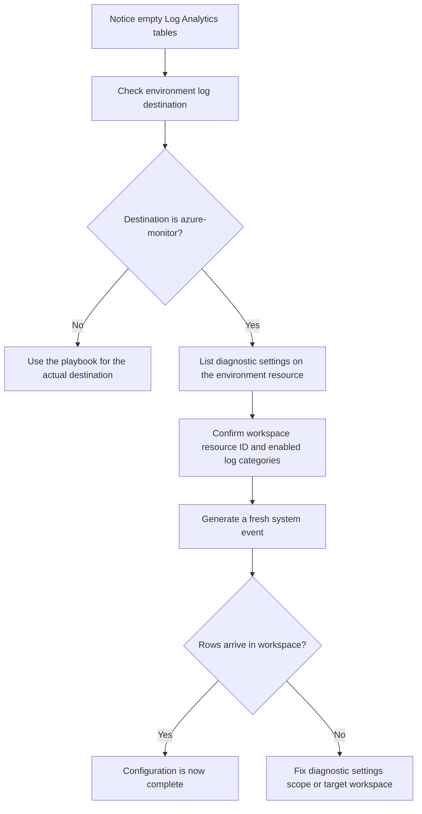

---
content_sources:
  documents:
    - type: mslearn-adapted
      url: https://learn.microsoft.com/en-us/azure/container-apps/log-options
    - type: mslearn-adapted
      url: https://learn.microsoft.com/en-us/azure/container-apps/log-monitoring?tabs=bash
diagrams:
  - id: diagnostic-settings-missing-flow
    type: flowchart
    source: mslearn-adapted
    based_on:
      - https://learn.microsoft.com/en-us/azure/container-apps/log-options
      - https://learn.microsoft.com/en-us/azure/container-apps/log-monitoring?tabs=bash
content_validation:
  status: pending_review
  last_reviewed: 2026-04-29
  reviewer: agent
  core_claims:
    - claim: "When Azure Container Apps uses Azure Monitor as the log destination, diagnostic settings complete the routing to downstream destinations such as Log Analytics."
      source: https://learn.microsoft.com/en-us/azure/container-apps/log-options
      verified: false
    - claim: "Azure Container Apps logs can be queried in Log Analytics after the destination and monitoring configuration are set correctly."
      source: https://learn.microsoft.com/en-us/azure/container-apps/log-monitoring?tabs=bash
      verified: false
---

# Diagnostic Settings Missing

Use this playbook when the environment is configured for Azure Monitor log routing, but no container app logs arrive in the target Log Analytics workspace.

## Symptom

- The environment log destination is `azure-monitor`, but Log Analytics queries return no `ContainerAppConsoleLogs_CL` or `ContainerAppSystemLogs_CL` rows.
- Teams expected Azure Monitor routing to be enough by itself, but downstream workspace ingestion never starts.
- A new environment or app was created successfully and still shows no logs after traffic or restart activity.

## Possible Causes

- No diagnostic setting exists on the Container Apps environment resource.
- The diagnostic setting exists, but the wrong categories were enabled.
- Logs are routed to a different workspace than the operator expects.
- Diagnostic settings were added only after the incident and no fresh signal was produced afterward.
- The environment is actually configured for a different log destination.

## Diagnosis Steps

<!-- diagram-id: diagnostic-settings-missing-flow -->


1. Verify the environment log destination.

   ```bash
   az containerapp env show \
       --name "$CONTAINER_ENV" \
       --resource-group "$RG" \
       --query "properties.appLogsConfiguration.destination" \
       --output tsv
   ```

2. Capture the environment and workspace resource IDs you will use for diagnostic-setting checks.

   ```bash
   az containerapp env show \
       --name "$CONTAINER_ENV" \
       --resource-group "$RG" \
       --query "id" \
       --output tsv
   ```

3. List diagnostic settings on the environment resource.

   ```bash
   az monitor diagnostic-settings list \
       --resource "$ENV_RESOURCE_ID" \
       --output json
   ```

4. Query for recent rows after traffic or a restart event.

   ```kusto
   let AppName = "ca-myapp";
   ContainerAppConsoleLogs_CL
   | where ContainerAppName_s == AppName
   | where TimeGenerated > ago(30m)
   | project TimeGenerated, RevisionName_s, Log_s
   | order by TimeGenerated desc
   ```

   ```kusto
   let AppName = "ca-myapp";
   ContainerAppSystemLogs_CL
   | where ContainerAppName_s == AppName
   | where TimeGenerated > ago(30m)
   | project TimeGenerated, RevisionName_s, Reason_s, Log_s
   | order by TimeGenerated desc
   ```

| Command | Why it is used |
|---|---|
| `az containerapp env show --name "$CONTAINER_ENV" --resource-group "$RG" --query "properties.appLogsConfiguration.destination" --output tsv` | Confirms that Azure Monitor routing is actually in use before you troubleshoot diagnostic settings. |
| `az containerapp env show --name "$CONTAINER_ENV" --resource-group "$RG" --query "id" --output tsv` | Retrieves the environment resource ID for scope comparison. |
| `az monitor diagnostic-settings list --resource "$ENV_RESOURCE_ID" --output json` | Shows whether the environment resource has the log-routing diagnostic setting required for Azure Monitor destinations. |

## Resolution

1. Create or correct the diagnostic setting on the scope your team uses for collection.

   ```bash
   az monitor diagnostic-settings create \
       --name "aca-observability" \
       --resource "$ENV_RESOURCE_ID" \
       --workspace "$WORKSPACE_RESOURCE_ID" \
       --logs '[{"category":"ContainerAppConsoleLogs","enabled":true},{"category":"ContainerAppSystemLogs","enabled":true}]' \
       --metrics '[{"category":"AllMetrics","enabled":true}]'
   ```

2. Generate a fresh request or revision event after creating the setting, then query the workspace again.
3. If you also collect app-level metrics, keep that as a separate metric-only diagnostic setting rather than mixing it with environment log routing.
4. Record that environment scope owns log routing so the next incident does not become a scope-discovery exercise.

| Command | Why it is used |
|---|---|
| `az monitor diagnostic-settings create --name "aca-observability" --resource "$ENV_RESOURCE_ID" --workspace "$WORKSPACE_RESOURCE_ID" --logs ... --metrics ...` | Creates the environment-level Azure Monitor routing rule that forwards Container Apps logs and metrics to the target Log Analytics workspace. |

## Prevention

- Document that environment scope owns log-routing diagnostic settings when `azure-monitor` is the destination.
- Keep the workspace resource ID in deployment outputs or operational notes.
- Validate `ContainerAppConsoleLogs` and `ContainerAppSystemLogs` immediately after new environment creation.
- Add a post-deployment smoke test that checks for fresh rows in the workspace within an agreed delay window.

## See Also

- [Diagnostic Settings Missing Lab](../../lab-guides/diagnostic-settings-missing.md)
- [Log Analytics Ingestion Gap](log-analytics-ingestion-gap.md)
- [Observability Tracing Lab](../../lab-guides/observability-tracing.md)
- [CrashLoop OOM and Resource Pressure](../scaling-and-runtime/crashloop-oom-and-resource-pressure.md)

## Sources

- [Log storage and monitoring options in Azure Container Apps](https://learn.microsoft.com/en-us/azure/container-apps/log-options)
- [Monitor logs in Azure Container Apps with Log Analytics](https://learn.microsoft.com/en-us/azure/container-apps/log-monitoring?tabs=bash)
- [ContainerAppConsoleLogs table reference](https://learn.microsoft.com/en-us/azure/azure-monitor/reference/tables/containerappconsolelogs)
