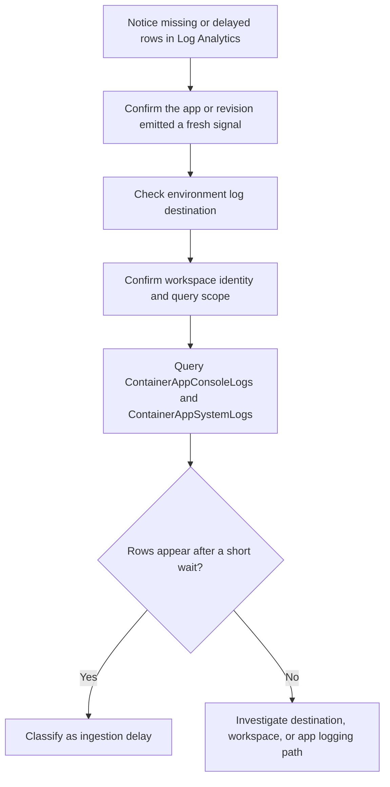

---
content_sources:
  documents:
    - type: mslearn-adapted
      url: https://learn.microsoft.com/en-us/azure/container-apps/log-monitoring?tabs=bash
    - type: mslearn-adapted
      url: https://learn.microsoft.com/en-us/azure/azure-monitor/reference/tables/containerappconsolelogs
diagrams:
  - id: log-analytics-ingestion-gap-flow
    type: flowchart
    source: mslearn-adapted
    based_on:
      - https://learn.microsoft.com/en-us/azure/container-apps/log-monitoring?tabs=bash
      - https://learn.microsoft.com/en-us/azure/container-apps/observability
content_validation:
  status: pending_review
  last_reviewed: 2026-04-29
  reviewer: agent
  core_claims:
    - claim: "Azure Container Apps can send console and system logs to Log Analytics for query-based troubleshooting."
      source: https://learn.microsoft.com/en-us/azure/container-apps/log-monitoring?tabs=bash
      verified: false
    - claim: "Container app console logs are stored in the ContainerAppConsoleLogs table in Azure Monitor Logs."
      source: https://learn.microsoft.com/en-us/azure/azure-monitor/reference/tables/containerappconsolelogs
      verified: false
---

# Log Analytics Ingestion Gap

Use this playbook when Azure Container Apps is healthy enough to emit logs, but the expected entries are delayed or absent in Log Analytics queries.

## Symptom

- `az containerapp logs show` or the portal log stream shows recent activity, but Log Analytics queries return no rows.
- Console or system logs appear several minutes later than operators expect.
- A recent configuration change makes it unclear whether the problem is ingestion delay, wrong destination, or a broken query.

## Possible Causes

- The environment log destination is not configured for Log Analytics.
- The query is scoped to the wrong workspace or wrong time range.
- The app emits logs, but ingestion is still within the expected short delay window.
- The workload writes little or nothing to stdout or stderr, so the table stays sparse.
- Operators are checking the wrong table for the signal they need.

## Diagnosis Steps

<!-- diagram-id: log-analytics-ingestion-gap-flow -->


1. Confirm that a fresh signal exists before you conclude ingestion failed.

   ```bash
   az containerapp logs show \
       --name "$APP_NAME" \
       --resource-group "$RG" \
       --type system \
       --tail 30
   ```

2. Verify that the environment is configured to send logs to Log Analytics.

   ```bash
   az containerapp env show \
       --name "$CONTAINER_ENV" \
       --resource-group "$RG" \
       --query "properties.appLogsConfiguration.destination" \
       --output tsv
   ```

3. Confirm that you are querying the intended workspace.

   ```bash
   az monitor log-analytics workspace show \
       --resource-group "$RG" \
       --workspace-name "$WORKSPACE_NAME" \
       --query "{customerId:customerId,id:id}" \
       --output json
   ```

4. Identify your workspace schema type, then query the correct table names.

    !!! note "Native tables vs custom (_CL) tables"
        Azure Container Apps can write to **native tables** (`ContainerAppConsoleLogs`, `ContainerAppSystemLogs`) or **custom logs tables** (`ContainerAppConsoleLogs_CL`, `ContainerAppSystemLogs_CL`) depending on the workspace's ingestion configuration. Check which tables exist in your workspace before running queries.

    **Native tables (newer workspaces):**

    ```kusto
    let AppName = "ca-myapp";
    ContainerAppConsoleLogs
    | where ContainerAppName == AppName
    | where TimeGenerated > ago(30m)
    | project TimeGenerated, RevisionName, ContainerName, Log, LogLevel
    | order by TimeGenerated desc
    ```

    ```kusto
    let AppName = "ca-myapp";
    ContainerAppSystemLogs
    | where ContainerAppName == AppName
    | where TimeGenerated > ago(30m)
    | project TimeGenerated, RevisionName, ReplicaName, Reason, Log
    | order by TimeGenerated desc
    ```

    **Custom logs tables (_CL, older workspaces):**

    ```kusto
    let AppName = "ca-myapp";
    ContainerAppConsoleLogs_CL
    | where ContainerAppName_s == AppName
    | where TimeGenerated > ago(30m)
    | project TimeGenerated, RevisionName_s, ContainerName_s, Log_s, LogLevel_s
    | order by TimeGenerated desc
    ```

    ```kusto
    let AppName = "ca-myapp";
    ContainerAppSystemLogs_CL
    | where ContainerAppName_s == AppName
    | where TimeGenerated > ago(30m)
    | project TimeGenerated, RevisionName_s, ReplicaName_s, Reason_s, Log_s
    | order by TimeGenerated desc
    ```

5. If the tables are still empty, run the same query from the CLI to remove portal scope confusion.

   ```bash
   az monitor log-analytics query \
       --workspace "$WORKSPACE_CUSTOMER_ID" \
       --analytics-query "ContainerAppConsoleLogs_CL | where ContainerAppName_s == '$APP_NAME' | where TimeGenerated > ago(30m) | project TimeGenerated, RevisionName_s, ContainerName_s, Log_s | take 20" \
       --output table
   ```

| Command | Why it is used |
|---|---|
| `az containerapp logs show --name "$APP_NAME" --resource-group "$RG" --type system --tail 30` | Confirms that the platform recently emitted a signal before you blame ingestion. |
| `az containerapp env show --name "$CONTAINER_ENV" --resource-group "$RG" --query "properties.appLogsConfiguration.destination" --output tsv` | Verifies whether the environment is configured for Log Analytics. |
| `az monitor log-analytics workspace show --resource-group "$RG" --workspace-name "$WORKSPACE_NAME" --query "{customerId:customerId,id:id}" --output json` | Confirms the exact workspace identity used for queries and routing checks. |
| `az monitor log-analytics query --workspace "$WORKSPACE_CUSTOMER_ID" ...` | Removes portal blade scope issues and tests the query directly against the workspace. |

## Resolution

1. If the environment destination is not `log-analytics`, correct the logging destination before continuing.
2. If the destination is correct, wait a few minutes and rerun both system and console queries before declaring an outage.
3. If system logs arrive but console logs do not, validate that the app actually writes to stdout or stderr.
4. If both tables remain empty, verify that the selected workspace is the same one attached to the Container Apps environment.
5. If logs recently started flowing after a short delay, document the measured ingestion gap so future incidents are not misclassified.

## Prevention

- Standardize workspace naming and capture the workspace resource ID in the runbook used by operators.
- Keep a saved KQL query for `ContainerAppConsoleLogs_CL` and `ContainerAppSystemLogs_CL` with the correct app filter.
- Alert on missing log volume only after a grace period that accounts for normal ingestion delay.
- Include a known-good signal, such as revision start events, in observability validation after each environment change.

## See Also

- [Log Analytics Ingestion Gap Lab](../../lab-guides/log-analytics-ingestion-gap.md)
- [Diagnostic Settings Missing](diagnostic-settings-missing.md)
- [Observability Tracing Lab](../../lab-guides/observability-tracing.md)
- [CrashLoop OOM and Resource Pressure](../scaling-and-runtime/crashloop-oom-and-resource-pressure.md)

## Sources

- [Monitor logs in Azure Container Apps with Log Analytics](https://learn.microsoft.com/en-us/azure/container-apps/log-monitoring?tabs=bash)
- [Observability in Azure Container Apps](https://learn.microsoft.com/en-us/azure/container-apps/observability)
- [ContainerAppConsoleLogs table reference](https://learn.microsoft.com/en-us/azure/azure-monitor/reference/tables/containerappconsolelogs)
