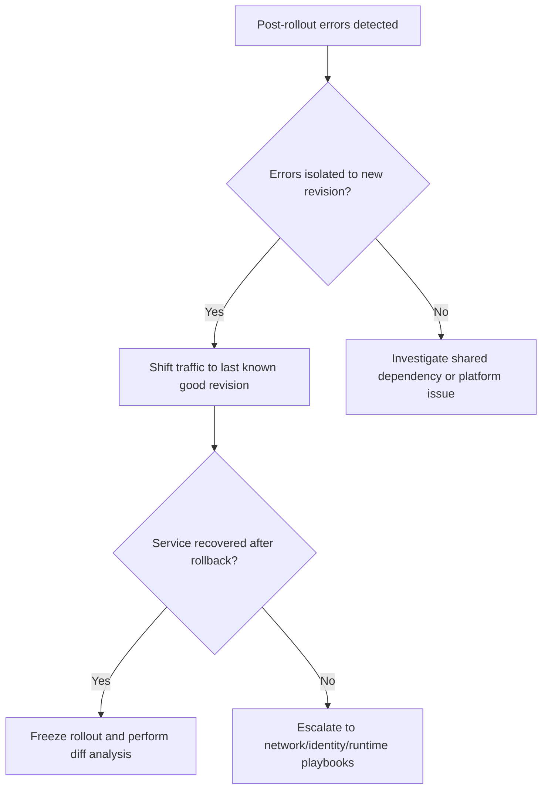

# Bad Revision Rollout and Rollback

Use this playbook when a new revision causes user-impacting regressions and you need a fast, evidence-based rollback.

## Symptoms

- Error rate spikes immediately after traffic shifts to new revision.
- New revision healthy on startup, but business flows fail.
- Partial traffic split causes intermittent failures.

## Common Misreadings

!!! warning "Common Misreadings"
    - Misreading: "Health is green, so rollout is good." Health probes may not reflect real business success.
    - Misreading: "Roll back everything." Controlled rollback to last known good revision is usually sufficient.

## Competing Hypotheses

| Hypothesis | Evidence For | Evidence Against |
|---|---|---|
| Code/config regression in new revision | Failures correlate exactly with traffic shift | Same errors existed before rollout |
| Secret or dependency drift between revisions | Old revision succeeds with same traffic | Both revisions fail similarly |
| Incomplete canary analysis | Errors only in subset of requests/routes | Full health and business checks passed pre-rollout |

## What to Check First

### Metrics

- Error rate by revision and request latency after traffic movement.

### Logs

```kusto
let AppName = "ca-myapp";
ContainerAppConsoleLogs_CL
| where ContainerAppName_s == AppName
| where Log_s has_any ("error", "exception", "timeout", "failed")
| summarize errors=count() by RevisionName_s, bin(TimeGenerated, 5m)
| order by TimeGenerated desc
```

### Platform Signals

```bash
az containerapp revision list --name "$APP_NAME" --resource-group "$RG" --query "[].{name:name,active:properties.active,traffic:properties.trafficWeight,health:properties.healthState}" --output table
az containerapp show --name "$APP_NAME" --resource-group "$RG" --query "properties.configuration.ingress.traffic" --output json
```

## Evidence Collection

```bash
az containerapp ingress traffic set --name "$APP_NAME" --resource-group "$RG" --revision-weight "<stable-revision>=100"
az containerapp revision list --name "$APP_NAME" --resource-group "$RG" --output table
az containerapp logs show --name "$APP_NAME" --resource-group "$RG" --type console
```

Observed revision status output used during rollback decisions:

```text
Name               Active    TrafficWeight    Replicas    HealthState    RunningState
-----------------  --------  ---------------  ----------  -------------  ------------
ca-myapp--0000001  True      100              1           Healthy        Running
```

## Decision Flow



## Resolution Steps

1. Compare error trends by revision and confirm regression scope.
2. Shift traffic to stable revision and verify recovery.
3. Diff image, env, secret refs, and scale settings between revisions.
4. Fix regression and run controlled canary before full rollout.

## Prevention

- Use gradual traffic shifting with rollback guardrails.
- Define release gates on business metrics, not only health probes.
- Keep automated revision comparison artifacts in CI/CD.

## See Also

- [Revision Provisioning Failure](../startup-and-provisioning/revision-provisioning-failure.md)
- [Container Start Failure](../startup-and-provisioning/container-start-failure.md)
- [Errors by Revision KQL](../../kql/correlation/errors-by-revision.md)
